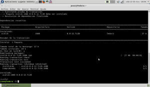
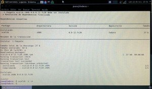
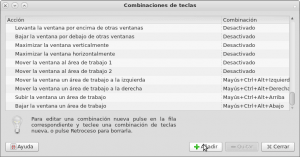
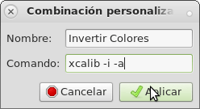
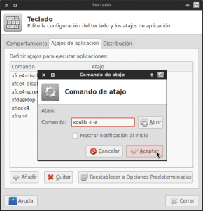
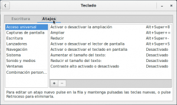
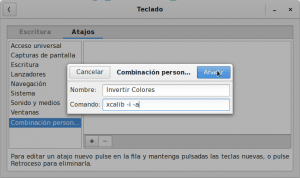
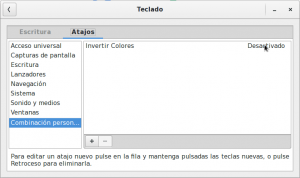
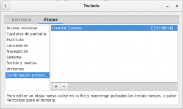

Hace ya meses publiqué un par de artículos en el que hablaba de como intentar mejorar el confort visual en el caso que tengamos que pasar muchas horas delante de la pantalla de un ordenador.<!--more-->

En el pasado vimos como [incorporar un modo de lectura al navegador a nuestro navegador Web](). De esta manera podíamos elegir fácilmente sacar contenido superfluo de lo que estamos leyendo en el navegador, Seleccionar el tamaño de letra y seleccionar los colores en pantalla.

Más tarde también vimos como instalar, configurar y usar el software Redshift para [proteger nuestros ojos cuando pasamos largas horas delante del ordenador]().

Siguiendo con la misma tónica en este artículo explicaré **como podemos invertir los colores de nuestra pantalla en Linux y de esta forma obtener la misma funcionalidad que equipan todas las tabletas y teléfonos** equipados con un sistema operativo Android o iOS.

Para poder invertir los colores de una forma fácil lo primero que tenemos que hacer es instalar una pequeña aplicación llamada [xcalib](http://xcalib.sourceforge.net/ "sourceforge xcalib").

###### Nota: También se pueden invertir los colores de la pantalla con el gestor de ventanas [Compiz](http://www.compiz.org/ "Web desarrolladores de Compiz"). Es posible que en un futuro muestre como realizarlo con Compiz, pero por ahora no me parece la mejor opción ya que muchas de las distro Linux no usan Compiz y no me parece lógico que alguien use un gestor de ventanas simplemente para poder invertir los colores de la pantalla. Aparte de estas 2 opciones también quise probar xrandr-invert-colors, pero para mi fue imposible compilar la aplicación ya que me daba un error. Quien quiera probar de compilar está aplicación le dejo el siguiente [link](https://github.com/zoltanp/xrandr-invert-colors "Código fuente de xrandr-invert-colors") para que lo pueda intentar.

## INFORMACIÓN SOBRE XCALIB

Xcalib es una utilidad con licencia GPL usada para calibrar monitores de ordenador. Concretamente la utilidad principal de xcalib es cargar el perfil ICC de nuestro monitor al servidor de las X (Xorg). El perfil ICC se trata de un archivo binario que contiene datos referentes a los atributos de color que mostrará nuestro monitor.

Aparte de la utilidad que acabamos de citar en este caso usaremos xcalib para invertir completamente los colores de nuestra pantalla.

## UTILIDAD DE INVERTIR LOS COLORES DE LA PANTALLA

**Las utilidades** que puede tener el hecho **de invertir los colores de la pantalla** no **son** muchas, pero las pocas utilidades que puede tener son útiles en mi caso. Dos de las utilidades que podemos dar a la inversión de los colores en la pantalla del ordenador son las siguientes:

1. Si estamos trabajando en condiciones de baja de iluminación ambiental, es probable que el reflejo de la pantalla nos ocasione deslumbramiento y molestias visuales en el caso que estemos usando un tema de escritorio claro. En este caso siempre podemos invertir los colores puntualmente **para evitar problemas de deslumbramiento y las típicas molestias visuales** que se producen cuando trabajamos en entornos con poca iluminación.
2. En el caso de trabajar con nuestro ordenador portátil (laptop) en el exterior, es posible que sea sea difícil **visualizar la pantalla de nuestro ordenador a pleno sol**. Una posible solución a este problema seria invertir los colores de la pantalla para poder visualizar mejor la pantalla.

## INSTALACIÓN DE XCALIB PARA INVERTIR LOS COLORES DEL MONITOR

Afortunadamente el paquete xcalib está presente en los repositorios de prácticamente la totalidad de distribuciones Linux. Por lo tanto **las instrucciones a seguir para instalar xcalib son las siguientes**:

### Instalación de xcalib en Fedora

La instalación de xcalib en Fedora es sumamente rápida y sencilla. Tan solo tienen que **abrir una terminal y teclear el siguiente comando**:

> ```
> sudo yum install xcalib
> ```

**Presionan** ****Enter**** y en cuestión de muy pocos segundos el paquete xcalib estará instalado.

### Instalación de xcalib en Debian o distribuciones derivadas de Debian

Al igual que en el caso anterior únicamente tenemos que **abrir una terminal y teclear el siguiente comando**:

> ```
> sudo apt-get install xcalib
> ```

**Presionan **Enter**** y en cuestión de muy pocos segundos el paquete xcalib estará instalado.

## INVERTIR LOS COLORES DE LA PANTALLA O MONITOR

Una vez tenemos instalado el paquete xcalib podemos fácilmente invertir los colores de nuestra pantalla. En la siguiente captura de pantalla podemos ver el estado inicial o estándar de colores de mi ordenador:

[](images/estado-inicial.png)

Si nuestro objetivo es invertir los colores, tan solo tenemos que **abrir una terminal y teclear el siguiente comando:**

> ```
> xcalib -i -a
> ```

###### Nota: Para ver el significado del parámetro que acabamos de utilizar pueden abrir una terminal y teclear el comando man xcalib.

Al **presionar** ****Enter**** obtendremos el resultado que se muestra en la siguiente fotografía:

[](images/Colores-invertidos.jpg)

Como se puede observar los colores se han invertido completamente y por lo tanto ya hemos conseguido el objetivo que nos habíamos propuesto.

## REVERTIR LOS CAMBIOS Y VOLVER A TENER LOS COLORES ORIGINALES

En el caso que ya no nos interese tener invertidos los colores de nuestra pantalla, tan solo tenemos que **abrir una terminal y volver a teclear exactamente el mismo comando que habíamos usado para invertir los colores:**

> ```
> xcalib -i -a
> ```

## AUTOMATIZAR EL PROCESO DE INVERSIÓN DE COLORES

Obviamente si cada vez que queremos invertir o revertir los colores de nuestra pantalla tenemos que abrir una terminal y teclear comandos, podemos afirmar que este proceso no es cómodo.

**Para conseguir que el proceso de invertir y revertir colores sea mucho más cómodo, en este apartado explicaré como podemos invertir y revertir los colores presionando la combinación de teclas que nosotros seleccionemos**. De este modo el proceso de invertir y revertir colores es inmediato, cómodo y sencillo de realizar.

###### Nota: El proceso que se detalla a continuación depende del entorno de escritorio que estamos usando. En este post detallaré el procedimiento para Mate, Xfce y Gnome Shell. Quien use otro entorno de escritorio encontrará como realizar fácilmente el proceso en Google.

### En el caso de utilizar el escritorio Mate

Para configurar un atajo de teclado, los usuarios de Mate tienen **acceder al menú** ****Sistema**** de su panel superior. Seguidamente tienen que **ir a los submenús** ****preferencias****, ****system****, **y finalmente** ****Combinación de teclas****.

Seguidamente aparecerá una ventana en la que tendremos que configurar las acciones a realizar mediante una combinación de teclas. Tal y como se puede ver en la captura de pantalla tenemos que **presionar el botón** ****Añadir****:

[](images/Añadir-combinación-de-teclas.png)

Aparecerá otra ventana. Tal y como se puede ver en la captura de pantalla, **introducimos el nombre de la acción y el comando que queremos que se ejecute** cuando presionemos la combinación de teclas que seleccionaremos a posteriori. Finalmente **presionamos encima del botón** ****Aplicar****.

[](images/nombre-y-comando.png)

###### Nota: El nombre de la acción es Invertir colores. El comando como hemos visto anteriormente es ****xcalib -i -a****

**Nos vamos a buscar la acción que hemos creado**, y tal y como se puede ver en la captura de pantalla, **nos ponemos encima de la palabra** ****Desactivado**** **y presionamos una vez el botón izquierdo del mouse**.

[](images/asignar-tecla-ejecucion-accion.png)

Desaparecerá desactivado y aparecerá la frase ****combinación nueva****. Entonces nosotros **presionamos la combinación de teclas con la que queremos invertir los colores que en mi caso** se ****ctrl+alt+n****. Después de esto **presionamos el botón** ****Cerrar**** y el proceso ha finalizado. Ahora cuando presionemos la tecla ****ctrl+alt+n**** se invertirán los colores. Para revertir el proceso tan solo tendremos que volver a presionar la combinación de teclas ****ctrl+alt+n****

### En el caso de utilizar el escritorio XFCE

Para configurar un atajo de teclado **tenemos que acceder al menú de XFCE del panel.**  Una vez estamos **dentro del menú nos vamos** ****Configuración****, **y seguidamente a** ****Teclado****. Después de esto aparecerá la siguiente ventana:

[](images/acceso-atajos-xfce.png)

Tal y como se puede ver en la captura de pantalla **presionamos encima de la pestaña** ****Atajos de Aplicación****. Seguidamente **Presionamos el botón** ****Añadir****. Después de presionar añadir aparecerá la siguiente ventana:

[](images/Introducir-comando.png)

Tal y como puede verse en la captura de pantalla, tenemos que **introducir el comando que queremos que se ejecute cuando presionaremos la combinación de teclas** que seleccionaremos posteriormente. **En este caso el comando a introducir es** ****xcalib -i -a****.

**Presionamos el botón** ****Aceptar****. Después de presionar el botón Aceptar aparecerá la siguiente pantalla:

[](images/Asignación-rápida-de-teclas.png)

Ahora tan solo tenemos que **presionar la combinación de teclas que queremos que apliquen el comando** ****xcalib -i -a****. Por lo tanto **en mi caso presiono** ****ctrl+alt+n****.

A estas alturas el proceso ha finalizado. Ahora cuando presionemos la tecla ****ctrl+alt+n**** se invertirán los colores. Para revertir el proceso tan solo tendremos que volver a presionar la combinación de teclas ****ctrl+alt+n****

### En el caso de usar Gnome Shell

El proceso para añadir atajos de teclado en Gnome Shell es prácticamente idéntico al del escritorio Mate.

Lo primero que tenemos que realizar en Gnome Shell es acceder al panel de configuración de gnome Shell. Para ello **abren una terminal y teclean el siguiente comando**:

> ```
> gnome-control-center
> ```

**Presionan **Enter**** y se abrirá una ventana en la que figuran los diferentes campos de configuración de Gnome Shell. **Buscan y clican en el ratón encima de la opción** ****Teclado****. Seguidamente aparecerá la ventana en la que tendremos que configurar los Atajos de Teclado. Tal y como se puede ver en la captura de pantalla **clicamos encima de la pestaña** ****Atajos****.

[](images/Acceder-a-la-pestaña-de-atajos.png)

Seguidamente tenemos que **presionar encima del botón** ****+**** para inicar el proceso de creación del atajo de teclado. Una vez presionado el botón aparecerá otra ventana:

[](images/Nombre-y-comando-del-atajo.png)

Tal y como se puede ver en la captura de pantalla, **introducimos el nombre de la acción y el comando que queremos que se ejecute cuando presionemos la combinación de teclas que seleccionaremo**s a posteriori. Finalmente **presionamos encima del botón** ****Añadir****.

Nos vamos a **buscar la acción que hemos creado**, y tal y como se puede ver en la captura de pantalla, **nos ponemos encima de la palabra** ****Desactivado**** **y presionamos una vez el botón izquierdo del mouse**.

[](images/Seleccionar-combinación-de-teclas.png)

Desaparecerá desactivado y **aparecerá la frase** ****Acelerador nuevo****. Entonces nosotros **presionamos la combinación de teclas con la que queremos invertir los colores que en mi caso es** ****ctrl+alt+n****

[](images/proceso-finalizado.png)

Después de estos pasos el proceso ha finalizado. Ahora cuando presionemos la tecla ****ctrl+alt+n**** se invertirán los colores. Para revertir el proceso tan solo tendremos que volver a presionar la combinación de teclas ****ctrl+alt+n****

## LIMITACIONES DE XCALIB

Xcalib funciona a la perfección para invertir los colores de la pantalla. No obstante e**sta solución solo es válida para usuarios que usen su ordenador con un solo monitor**. Los usuarios que usen varios monitores únicamente podrán invertir los colores en uno de sus monitores.

**Xcalib en teoría tiene las herramientas para poder invertir los colores en ambos monitores**. Usando el siguiente comando deberíamos ser capaces de invertir los colores en el monitor que nosotros seleccionemos:

> ```
> xcalib -s 1 -i -a
> ```

El significado del comando es el siguiente:

**\-i:** Esta opción es la que indica que se quieren invertir los colores

**\-a:** La opción alter lo que hace es indicar que se apliquen los cambios a nuestro monitor.

**\-s 1:** Este opción indica el monitor en el que queremos que se apliquen los cambios. Por lo tanto si ponemos -s 0 la inversión se aplicará al monitor 0, mientras que si usamos -s 1 se aplicarán al segundo monitor.

No obstante, los usuarios que usen 2 monitores verán que este comando no funciona. Además si acceden a la terminal y usan el siguiente comando:

> ```
> xrandr
> ```

Verán que **aunque estén usando 2 monitores** solo les aparecerá un monitor “screen 0”. El segundo monitor que debería ser “screen 1” no aparecerá por ningún sitio. Por lo tanto esto quiere decir que el servidor gráfico **Xorg solo detecta 1 de los 2 monitores**. De este modo cuando indicamos a xcalib que invierta el color del segundo monitor se produce el error ya que para Xorg no existe este segundo monitor.

**Imagino que la solución a este problema es editar el fichero de configuración de Xorg para que el servidor gráfico Xorg reconozca que tenemos 2 monitores**. En el momento que reconozca los 2 monitores los colores se invertirán en ambas pantallas. **No he probado si esta es la solución ya que en mi caso no uso 2 monitores. Quien tenga 2 monitores puede probar si esta es la solución siguiente los pasos que se detallan en este** [link](http://www.jesusda.com/docs/howtos/dualhead/ "Configurar 2 monitores en xorg").

###### Nota: Me gustaría poner un link de alguien que aplique la solución propuesta y haga funcionar xcalib en los 2 monitores. Pero verán que si buscan por Internet no hay nadie que haya publicado al respecto.
