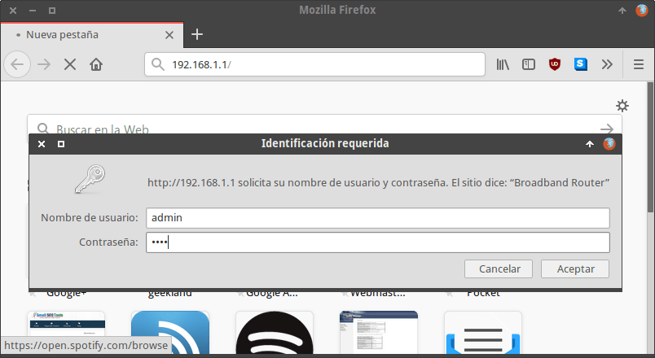
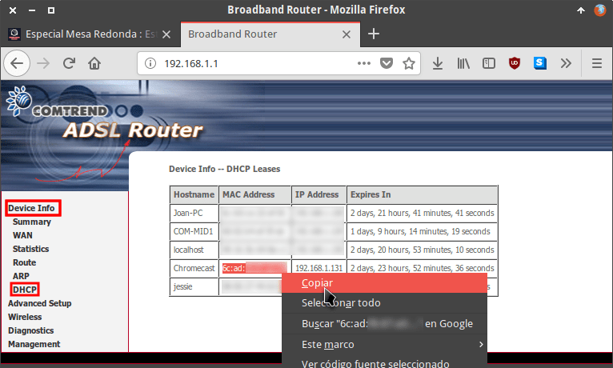
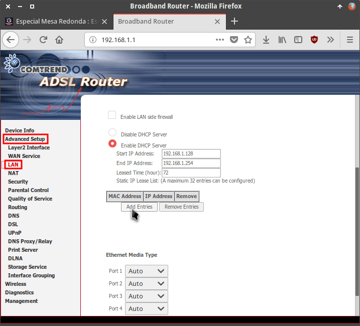
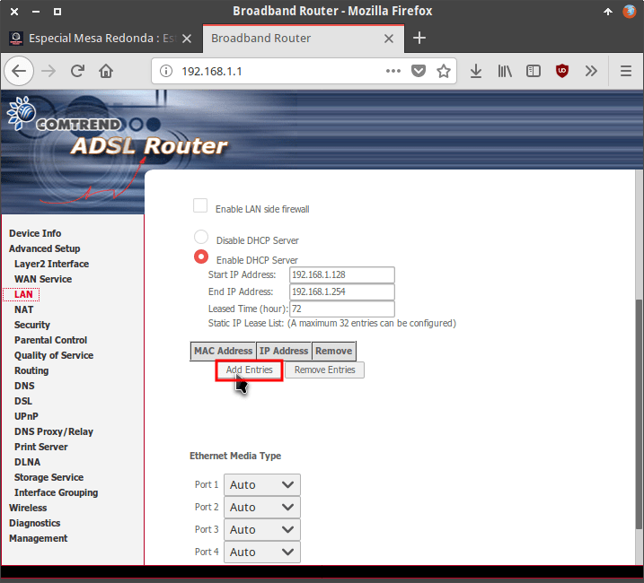
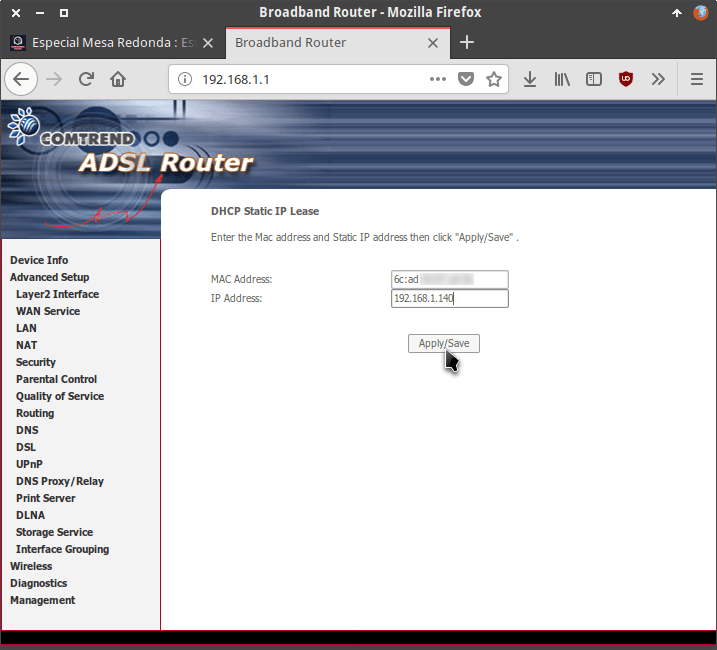
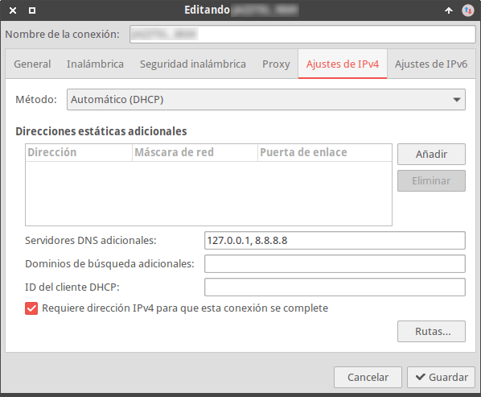
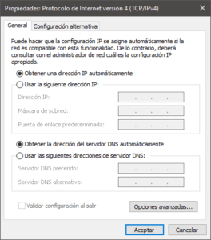
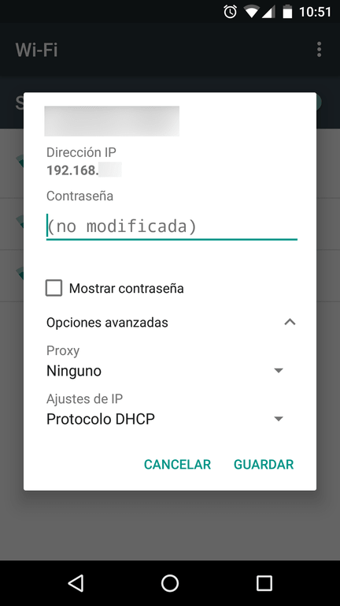
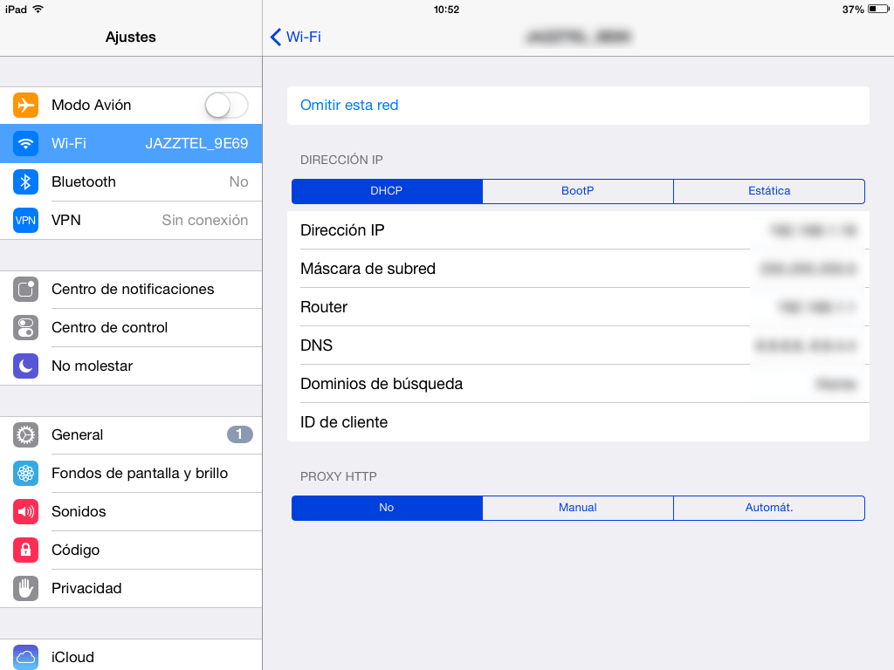

La gran mayoría de routers de hoy en día traen incorporado un servidor DHCP que podemos usar para asignar una IP fija a los dispositivos que se conectan a nuestra red. Para activar el servidor DHCP y asignar una IP Fija a nuestros dispositivos a través del router tenemos que realizar los siguientes pasos.<!--more-->

###### Nota: Los pasos que veréis a continuación han sido realizados en un router Comtrend AR-5315u. El procedimiento en otros router puede ser ligeramente diferente al que mostraremos a continuación.

## ASIGNAR UNA IP FIJA A NUESTROS DISPOSITIVOS A TRAVÉS DEL SERVIDOR DHCP DEL ROUTER

A continuación veremos los pasos a realizar para activar y configurar el servidor DHCP de nuestro router para poder asignar una IP Fija a la totalidad de nuestros dispositivos.

### Acceder a la configuración de nuestro router

Inicialmente accedemos a la configuración de nuestro router. Para ello procedemos del siguiente modo:

1. Abrimos nuestro navegador web preferido.
2. Tecleamos la puerta de entrada de nuestro router, que en mi caso es 192.168.1.1, y presionamos Enter.
3. A continuación introducimos nuestro nombre de usuario y contraseña y presionamos el **Aceptar**.

Acto seguido accederemos al menú de configuración de nuestro Router.

### Averiguar la Mac Address del dispositivo al que queremos asignar una IP Fija

El segundo paso consiste en averiguar la Mac Address del dispositivo al que queremos asignar una IP Fija. Existen muchas formas de averiguar la Mac Address de un dispositivo, pero en este caso lo haremos directamente desde el Router.

Por lo tanto nos dirigimos al menú de nuestro router y clicamos en la opción **Device Info**. Cuando se despliegue el submenú clicamos en la opción **DHCP**. Allí podrán ver la totalidad de equipos y Mac Address que se han conectado a nuestra red durante las últimas 72 horas.

En mi caso quiero que mi Chromecast siempre tenga la misma IP. Por lo tanto, tal y como se puede ver en la captura de pantalla, copiaré la Mac Address de mi Chromecast.

Una vez conozco la Mac Address de mi Chromecast procederé a activar y configurar el servidor DHCP de mi router.

### Activar el servidor DHCP del router

Dentro del menú de configuración de nuestro router clicamos en el apartado **Advanced Setup** y cuando se despliegue el submenú clicamos encima de la opción **LAN**.

A continuación tienen que activar la opción **Enable DCHP Server**. A partir de estos momentos el servidor DHCP de nuestro router estará activado.

Una vez activado servidor no tienen que realizar nada más. No obstante si quieren pueden modificar la configuración servidor DHCP. En mi caso tengo la siguiente configuración:

- **Start IP Address:** 192.168.1.128
- **End IP Address:** 192.168.1.254
- **Leased Time (hours):** 72

Por lo tanto:

1. Mi servidor DHCP no asignará IP más bajas que la 192.168.1.128.
2. Tampoco asignará IP más altas que la 192.168.1.254.
3. Finalmente nuestra tabla DHCP mantendrá fijada una determinada IP a una determinada Mac Address durante 72 horas. 72 horas es un valor adecuado siempre y cuando se trate de una red doméstica en la que no hay mucha rotación de equipos. En el caso que que sea el Router de un bar en el que durante un día se conectan muchas personas es recomendable bajar este valor a 1. De esta forma evitaremos quedarnos sin IP.

### Configurar el servidor DHCP del router

El último de los pasos consistirá en clicar sobre el botón **Add Entries**.

Una vez hayamos presionado sobre el botón aparecerá la siguiente captura de pantalla en la que asignaremos una IP determinada a un dispositivo determinado:

En mi caso en el campo **Mac Address** pego la Mac Address de mi Chromecast que obtuvimos en apartados anteriores.

En el campo **IP Address** escribo la IP Fija que quiero que el servidor DHCP asigne a mi Chromescast. En mi caso quiero que la IP sea la **192.168.1.140**.

Una vez rellenados los campos MAC Address e IP Address tan solo tenemos que presionar el botón **Apply/Save**.

De este modo tan sencillo, cada vez que mi Chromecast se conecte tendrá la IP 192.168.1.140. Esto me será útil para configurar de forma adecuada el firewall de mis equipos y para que el Chromecast siempre esté localizado dentro de nuestra red local.

Comprobación de la asignación de la IP Finalmente podemos realizar la comprobación que nuestro servidor DHCP está funcionando de forma adecuada.

Para ello en mi caso enciendo el televisor para que se conecte el Chromecast. A continuación entro a la configuración de mi Router, clico encima del menú Device info y finalmente clico en el submenú DHCP.

Acto seguido podrán ver que la IP de mi Chromecast es la IP 192.168.1.140.

## CONFIGURAR LOS EQUIPOS PARA QUE TOMEN LA IP QUE ASIGNE EL SERVIDOR DHCP

En principio la totalidad de equipos vienen configurados para usar la IP que les asigne el servidor DHCP del router. Por lo tanto no hay que realizar absolutamente nada.

En caso que hayan modificado la configuración de sus gestores de red para asignar una IP fija deberán revertir los cambios. La configuración que deberían tener los gestores de red de los distintos sistemas operativos es la siguiente:

### Configuración del gestor de red NetworkManager en GNU Linux

### Configuración del gestor de red en Windows

### Configuración del gestor de red en Android

### Configuración del gestor de red en iOS

