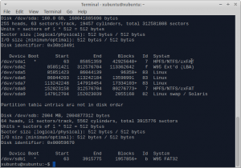
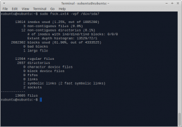

## ¿QUÉ ES LA FRAGMENTACIÓN DE UN SISTEMA DE ARCHIVOS?

La información dentro de nuestro disco duro se almacena en bloques. Así por ejemplo un archivo que ocupe 4 megas puede requerir de  6 bloques. Si los bloques que almacenan los 4 megas están uno al lado del otro se dice que no hay fragmentación. El caso que acabamos de describir se puede representar de la siguiente forma:<!--more-->

[](images/Fragmentacion-1.png)

En el caso que los 4 megas del archivo se almacena en bloques no contiguos entre si es cuando aparece la fragmentación. Gráficamente lo podemos representar de la siguiente forma:

[](images/Fragmentacion-2.png)

Las consecuencias de la fragmentación son lentitud y pesadez en el sistema. En algunos extremos en el que sistema esté muy fragmentado incluso puede generar errores.

## ¿EXISTE FRAGMENTACIÓN EN LINUX?

Mucho se ha hablado y se seguirá hablando sobre si la fragmentación en linux o no. La respuesta creo que es sencilla y clara y todo el mundo estará de acuerdo. El sistema de archivos ext4 también genera fragmentación al igual que genera NTFS, FAT32 u otros sistemas de archivos. No obstante el algoritmo de asignación de bloques de ext4 trabaja de forma diferente y por lo tanto la fragmentación en linux siempre será infinitamente menor.

## ¿RAZONES POR LAS CUALES LA FRAGMENTACIÓN EN LINUX EXISTE?

### Disco duro Lleno

Cuando el disco duro esta lleno el algoritmo de asignación de bloques por muy bien impletantado que este no puede hacer nada. Imaginaros que tenemos un disco duro casi al límite de su capacidad y sin fragmentación:

[](images/Disco-Lleno-1.png)

Si borramos dos archivos del disco duro, y cada archivo ocupa 2 bloques es probable que el disco presente un estado similar al siguiente:

[](images/Disco-Lleno-2.png)

Si ahora queremos copiar un archivo que ocupe que necesite 3 bloques vemos que no tenemos espacio para  ubicar el archivo. Por lo tanto el algoritmo de asignación de bloques no tiene más remedio que fragmentar el sistema.

[](images/Disco-Lleno-3.png) 

### El algoritmo de asignación de archivos no puede predecir lo que crecerán los archivos ni los archivos que borraremos

Supongamos que nuestro en nuestro sistema de archivos ext4 tenemos 3 archivos que presentan la siguiente distribución:

[](images/Asignación-ext41.png)

Ahora si el archivo de color azul aumenta de tamaño y necesitamos 3 bloques adicionales para almacenar la información vemos que aparecerá la fragmentación.

[](images/Crecimiento.png)

### En el caso de copiar archivos de forma simultanea en el disco duro

Existe el caso en que nosotros por ejemplo estamos descargando 2 torrents o 2 archivos grandes en nuestro navegador. Cuando realizamos esta operación se asignan los bloques para cada uno de los 2 archivos sin conocer los bloques totales que ocuparan cada uno de los archivos. Por lo tanto es posible que se pueda dar el siguiente caso:

[](images/write2.png)

Podemos ver un gráfico en el que estamos descargando 2 archivos y de momento cada uno de los archivos ocupa 2 bloques.Llegará un punto que el estado que presentaran nuestro bloques es:

[](images/write3.png)

Si aún nos queda 1 bloque azul y otro bloque verde inevitablemente la fragmentación se producirá.

## ¿COMO AVERIGUAR LA  LA FRAGMENTACIÓN DE NUESTRAS PARTICIONES?

Seguidamente les presento una forma, según mi forma de ver, segura de medir la fragmentación de nuestras unidades y además sin peligro de dañar nuestro sistema. La primera cosa importante y que tenemos que tener muy en cuenta es que para medir la fragmentación de una unidad esta tiene que estar desmontada. Por lo tanto para evitar problemas arrancaremos nuestro sistema desde un live USB. En mi caso he realizado u nlive USB de Xubuntu 12.10.

Una vez arrancado el sistema averiguamos cual es la denominación de nuestra partición raíz y nuestra partición home. Abrimos la terminal y tecleamos el comand0:

> ```
> sudo fdisk -l
> ```

[](images/dispositivos1.png)

 

 

 

 

 

 

 

Viendo la imagen observamos que nuestra partición raiz es la sda6 y nuestra partición home es la sda7. Para analizar la fragmentación en nuestra partición raíz abrimos la terminal y tecleamos:

> ```
> sudo fsck.ext4 -vpf /dev/sda6
> ```

[](images/fragmentacion-root.png)

Para analizar la fragmentación en la partición home tecleamos en la terminal:

> ```
> sudo fsck.ext4 -vpf /dev/sda7
> ```

[](images/fragmentacion-home.png)

 

 

 

 

 

 

 

Como podéis ver después de usar Xubuntu 12.04 de mi notebook durante 9 meses la fragmentación es casi inexistente. El % de archivos no contiguos en la partición root es de un 0.1%  y en nuestra partición home de un 1.1%. Los resultados son muy bajos y mas considerando que uso el notebook para realizar las descargas de todos mis torrent que los guardo a la home. Además tengo la home siempre relativamente llena.

No obstante hay que ir con cuidado en las cifras que muestra este comando ya que solo nos dice el % de archivos no contiguos. Podría darse el caso de que tengamos un archivo de gran dimensión que se encuentre muy fragmentado. En este caso el % de archivos no contiguos seria bajo pero la fragmetnación seria alta.

## ¿ES NECESARIO DEFRAGMENTAR LINUX?

Personalmente si estamos usando GNU/Linux en principio no es necesario preocuparse de la fragmentación. Los motivos por los que considero que no es necesario:

1- Después de usar 2 años una distro linux puede decir que los resultados de fragmentación en mi unidad raíz son mínimos. Además en el apartado anterior tenéis el ejemplo del notebook que ha tenido Xubuntu instalado durante 10 meses llenando y vaciando su partición home constantemente. Esto en un sistema de archivos NTFS es impensable.

2- Porque el algoritmo de asignación de archivos de ext4 es más eficiente  NTFS. El algoritmo de asignación de bloques del sistema de archivos NTFS guarda los diferentes archivos de forma contigua sin dejarles espacio para crecer mientras que el algoritmo de asignación de archivos ext4 lo esparce dejandeles espacio para crecer. Gráficamente lo podemos representar de la siguiente forma:

[](images/Asignación-ext4.png)

En el gráfico vemos un sistema de archivos ext4 con 2 archivos de 2 bloques y un tercer archivo que ocupa un bloque. Están esparcidos para que puedan crecer sin generar fragmentación.

[](images/assignacion-ntfs.png)

En el gráfico vemos representada la forma en que NTFS ordena los bloques. En principio está forma es más problemática para la asignación de archivos.

3- Porqué el sistema de archivos ext4 utiliza una técnica de asignación de bloques retardada mientras la gran mayoría de sistemas de archivos trabajan sin asignación retardada. La asignación retardada consiste en:

- La información se tiene que escribir en el disco. Antes de escribirse en el disco se almacena en una cache, en el cache permanece la información almacenada durante un tiempo, cuando haya transucrrido un tiempo el contenido de la cache es escribe en el disco duro.
- La **asignación retardada**  hace que la asignación de bloques se haga en justo en el momento antes de que la memoria cache se vacía para escribir en el disco duro. En otras palabras se hace la asignación de bloques en el momento de la escritura. Al retardar la asignación de bloques disponemos de más información y se puedan asignar los bloques de forma mucho más  eficiente que los sistemas a de asignación sin retraso como por ejemplo NTFS.
- Los **sistemas de asignación sin retraso**, como lo son la gran mayoría, empiezan a asignar bloques justo cuando se almacenan en la memoria cache. Por lo tanto no se hace la asignación en el momento la escritura lo que genera una mayor fragmentación ya que en el momento de asignar los bloques se dispone de menor información para realizar una asignación inteligente.

4- Porqué en un sitema GNU/Linux es necesario disponer de permisos root para mover los archivos de la partición raíz de nuestro sistema.  Así por lo tanto es difícil que aparezca fragmentación en nuestra partición raíz que es el corazón de nuestro SO. De este modo la fragmentación queda mayormente limitada a nuestra partición Home que es donde si hay un movimiento importante de archivos.

###### nota: Es probable que existan casos como por ejemplo gente que use su partición home para realizar descargas de torrent de gran tamaño. En este caso existen altas probabilidades que nuestra partición presente una fragmentación importante y más si el disco duro en que estamos almacenando está casi al tope de su capacidad.

## ¿CÓMO DEFRAGMENTAR NUESTRAS UNIDADES?

###### nota importante: Los usuarios que tengan un disco duro SSD no realizar este proceso. Los discos duros SSD no es necesario defragmentarlos. Si lo defragmentais el no se consigue ninguna mejora en rendimiento y lo único que conseguiréis es disminuir la vida de vuestro disco.

En el caso extremo que tengamos fragmentada nuestra unidad la forma más simple de defragmentarla es copiar la totalidad de archivos de la partición fragmentada en un disco externo. Seguidamente borraremos los archivos de la partición fragmentada y para finalizar volveremos a copiar los datos del disco duro externo a la unidad que antes estaba fragmentada.

Otra opción es usar **e4defrag**. Personalmente solo he usado una vez con mi notebook para realizar este post.  Hay que ir con cuidado en usar esta herramienta y solo hay que hacerlo en casos extremos ya que imagino que el proceso es peligroso y puede dañar el sistema. Por lo tanto en el caso que alguien decida hacerlo tiene que ser bajo su responsabilidad y haciendo las copias de seguridad pertinentes por si dejamos el sistema inservible.

Para usar e4defrag tenemos que asegurarnos que tenemos instalado el paquete e2fsprogs. En caso de no tenerlo instalado en la terminal tecleamos:

> ```
> sudo apt-get install e2fsprogs
> ```

Seguidamente miramos la denominación de la partición que quiero defragmentar con el siguiente comando:

> ```
> sudo fdisk -l
> ```

Con el siguiente comando obtendremos un resultado similar al siguiente:

[](images/dispositivos1.png)

Suponemos que queremos defragmentar la partición sda6 que es nuestra home. Antes hemos visto que nuestra home tiene un 1,1% de los archivos estaban fragmentados. Lo que debemos realizar es ingresar a la terminal y teclear el siguiente comando:

> ```
> sudo e4defrag /dev/sda6
> ```

###### [](images/despues-de-defragmentar.png)

Una vez finalizada la defragmentación miramos el nuevo valor de fragmentación tecleando:

> ```
> sudo fsck.ext4 -vpf /dev/sda6
> ```

###### [](images/home-sin-fragmentacion.png)

Y si miramos la captura de pantalla vemos el el % de número de archivos no contiguos ha bajado del 1.1% al 0.0%. Por lo tanto unidad defragmentada. Hay que tener en cuenta que despues de 10 meses de uso intesivo la fragmentación solo era del 1.1% y todo lo que he realizado es completamente innecesario ya que no voy a notar ninguna mejora en el rendimiento.

###### Nota: e4defrag es útil para defragmentar sistemas de archivos ext4. En el caso de tener otros sistemas de archivos habrá que usar otras herramientas.

###### Nota: Es recomendable dejar el ordenador en reposo hasta que todo el proceso de defragmentación haya finalizado.

## ¿QUE PODEMOS HACER PARA EVITAR LA FRAGMENTACION EN LINUX?

Después de leer el post podemos afirmar que poca cosa podemos hacer para evitar la fragmemtación. La única cosa es intentar evitar que nuestro disco duro este lleno hasta al tope. Siempre es recomendable tener como mínimo un 10% de espacio vacío en nuestro disco duro para intentar evitar la fragmentación.

 Las fuentes de información en las que me inspirado a la hora de escribir este blog son las siguientes:

[http://diegocg.blogspot.com.es/](http://diegocg.blogspot.com.es/)

[http://www.pensamientoscomputables.com/](http://www.pensamientoscomputables.com/)
