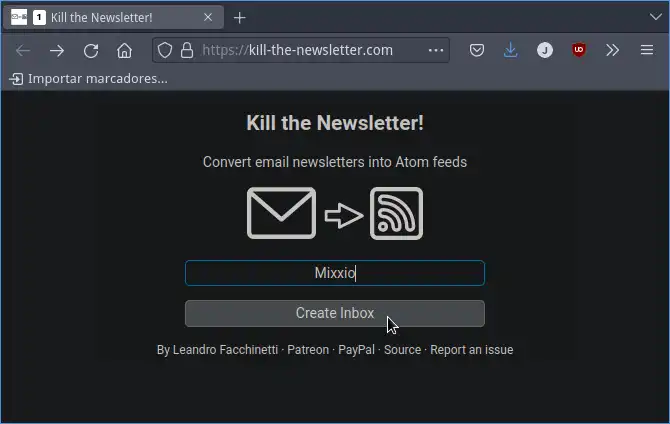
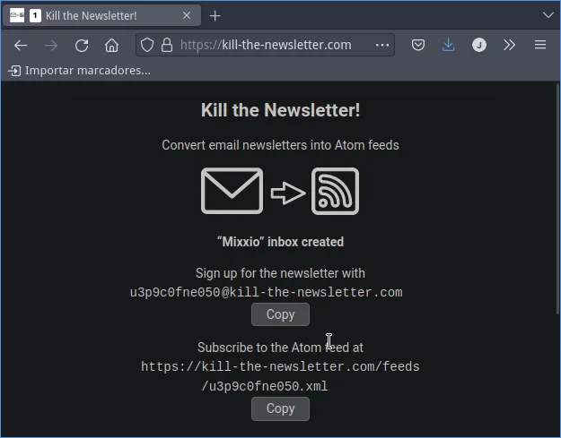
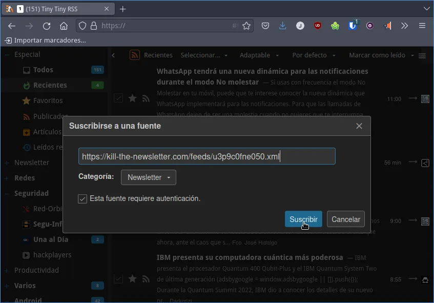
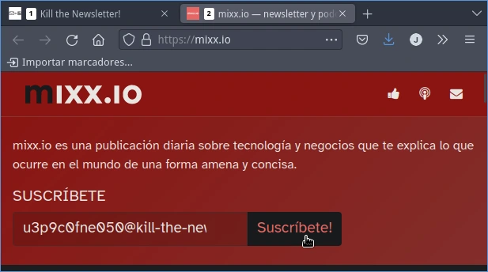
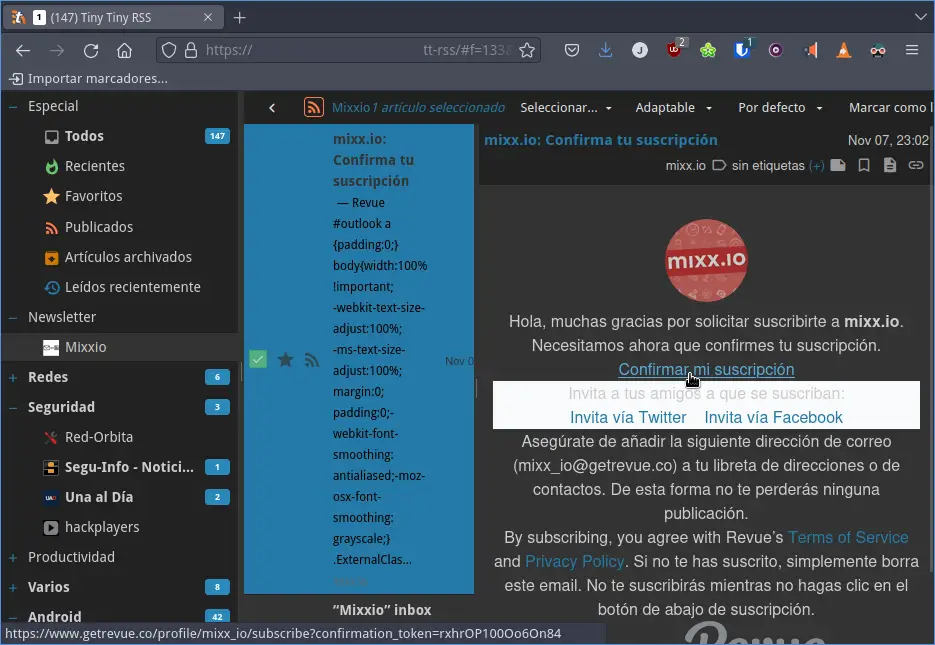
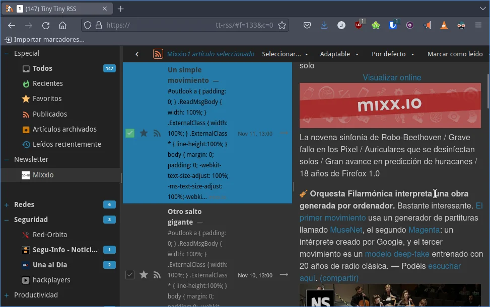

En mi caso no me gusta leer newsletter a través del email. Mi opción preferida para consumir la totalidad de contenido es a través de un lector de feeds RSS que en mi caso es [Tiny Tiny RSS](). En mi lector de feeds centralizo la totalidad de contenido que me interesa leer incluyendo también las newsletter y me resulta sumamente práctico. Desafortunadamente hay muchas newsletter que no ofrecen un feed RSS a los lectores y por lo tanto la única forma que tenemos para leer su contenido es a través del email. Pero afortunadamente gracias al servicio Kill the newsletter podremos convertir las newsletter que recibimos por email a un feed RSS al que podremos suscribirnos.<!--more-->

## ¿QUÉ UTILIDAD TIENE EL SERVICIO KILL THE NEWSLETTER?

La función de Kill the Newsletter es convertir las newsletter que recibimos por email en un feed RSS. Una vez tengamos la URL del feed podremos abrir nuestro lector de feed y suscribirnos a cualquier newsletter a través de nuestro lector de feeds. De esta forma tendremos nuestra información perfectamente clasificada y evitaremos mezclar información personal o de trabajo con nuestro ocio en el momento que abramos el email.

Otra utilidad interesante es que nos podremos suscribir a una newsletter sin tener que dar nuestro email. De este modo evitaremos dar nuestro email a un tercero y tendremos menos posibilidades de recibir correo no deseado.

**Nota:** Algunos de los lectores de feed más conocidos son Feedly, Feed Reader, InoReader, FreshRSS, Tiny Tiny RSS, etc.

## COMO LEER UNA NEWSLETTER EN UN LECTOR DE FEEDS RRS USANDO KILL THE NEWSLETTER

Seguidamente veremos como podemos usar el servicio Kill The Newsletter mediante un simple ejemplo. El caso práctico que mostraré a continuación será como suscribirse a la Newsletter de Mixxio.

### Generar un email para suscribirse a la newsletter y un Feed RSS para leer la newsletter en nuestro lector de feeds

Para generar un email y un feed RSS deberemos acceder a la página web [https://kill-the-newsletter.com/](https://kill-the-newsletter.com/). A continuación introduciremos el nombre de la newsletter que queremos usar, que en mi caso es Mixxio, y presionaremos encima del botón **Create Inbox**.



Acto seguido obtendrán el email para suscribirse a la newsletter y el feed RSS para poder leer el contenido de la newsletter en el lector del feeds.



Como pueden ver en la captura de pantalla:

1. El email para suscribirme a la newsletter es:

```shell
u3p9c0fne050@kill-the-newsletter.com
```

2. La URL del feed es la siguiente:

```shell
https://kill-the-newsletter.com/feeds/u3p9c0fne050.xml
```

### Introducir la newsletter en nuestro lector de feeds mediante la URL que acabamos de generar

A continuación añadiremos el feed RSS que acabamos de generar a nuestro lector de feeds preferido. En mi caso el lector de feeds es Tiny Tiny RSS.



### Suscribirnos a la newsletter mediante el email que hemos generado

Seguidamente nos dirigiremos a la página web de la newsletter a la que nos queremos suscribir y usaremos el email que generamos anteriormente para suscribirnos a la Newsletter.



### Confirmar la suscripción a la newsletter

Acto seguido es muy posible que tengamos que confirmar la suscripción a la newsletter. Para confirmar la suscripción tendremos que ir a nuestro lector de feeds y visualizar el contenido del feed al que nos hemos suscrito. Acto seguido veremos una entrada en la que en su interior podremos encontrar el link para confirmar la suscripción a la newsletter.



**Nota:** Tengan en cuenta que los lectores de feed se actualizan cada cierto tiempo. Por lo tanto no encontrarán el enlace de confirmación de forma inmediata.

### Leer el contenido de una newsletter en nuestro lector de feeds

A partir de este momento podremos visualizar el contenido de la newsletter sin ningún tipo de problema cuando consultemos nuestro lector de feeds. Lo que acabo de mencionar lo podéis ver en la siguiente captura de pantalla.



Además la totalidad de contenido que os interese leer lo tendréis centralizado en vuestro lector de feeds. Por lo tanto no tendréis que usar más de una herramienta para leer las noticias que os interesen.

#### Fuentes e información adicional

[https://www.youtube.com/watch?v=FMTb3Z-QiPY](https://www.youtube.com/watch?v=FMTb3Z-QiPY)
