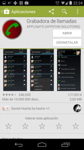
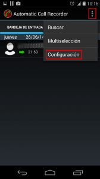
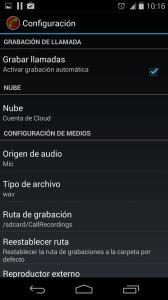
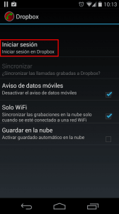
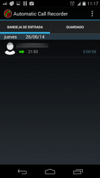
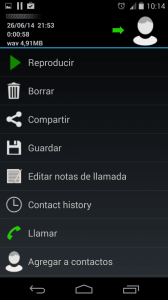
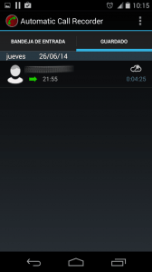

Esta semana me decidí a cambiar de compañía telefónica y utilizar un [operadora OMV](https://es.wikipedia.org/wiki/Operador_m%C3%B3vil_virtual "explicación de lo que es un operador móvil virtual"). El proceso empezó de forma habitual, contacte con la nueva compañía y empecé el proceso de portabilidad.

Cuando mi compañía actual recibió la solicitud de portabilidad me llamaron para realizar una contraoferta. Escuche la contraoferta y realmente era irrechazable y difícil de creer ya que ningúno de los operadores OMV actuales puede igualar las condiciones que me ofrecieron.<!--more-->

Vista la situación decidí volver decidí volver a llamar a mi actual compañía telefónica para confirmar las condiciones y obviamente grabe la conversación por si en un futuro esta compañía no me aplica las condiciones que me prometió.

A raíz de esta experiencia reflexione y vi lo útil que pude llegar a ser grabar las llamadas. **En el siguiente artículo podrán ver el porque considero que es útil grabar las llamadas, saber si la grabación de una llamada es legal y tiene una validez jurídica, y conocer el procedimiento que seguí para obtener la grabación**.

## UTILIDADES DE GRABAR LLAMADAS TELEFÓNICAS

Las utilidades que puede tener grabar llamadas y conversaciones son muchas. Algunas de las utilidades que se me ocurren ahora mismo son las siguientes:

1. **Para tener una posible defensa en el caso que se tenga que llegar a acuerdos vía telefónica** con terceros como por ejemplo una compañía de teléfonos. Creo que no será la primera ni la última vez que después de llegar a un acuerdo con una persona u compañía resulta que al cabo de unos meses una parte ha entendió una cosa y la otra parte entendió otra completamente opuesta.
2. **Para protegernos de llamadas agresivas que se pueden realizar en el entorno laboral** por parte de nuestros propios compañeros y superiores. El simple hecho de grabar una llamada puede ayudar a denunciar un caso de mobbing u otras situaciones anómalas que se pueden dar en el entorno laboral.
3. **Para denunciar situaciones de bullying y abuso en el entorno escolar** y de esta forma proteger a los menores que son víctimas del acoso.
4. Es posible que en ciertas ocasiones se nos transmita instrucciones o trabajos a realizar vía telefónica. **Si guardamos el audio de las instrucciones, las podremos escuchar las veces que haga falta** y tendremos más seguridad para realizar exactamente la tarea que nos han pedido.
5. **Para denunciar posibles amenazas** que podamos recibir de terceros como por ejemplo conocidos, exparejas, etc.
6. **Para grabar llamadas de un ser querido** que echamos de menos porqué y vive lejos de nosotros.

## ¿ES LEGAL GRABAR LLAMADAS TELEFÓNICAS?

Esta cuestión obviamente variará en función del país residencia de cada persona. Después de realizar varias consultas y de buscar información concluimos que la situación actual en España es la siguiente:

1. **El hecho de grabar una conversación telefónica en la que nosotros mismos participamos es completamente legal y para evitar problemas se aconseja informar al interlocutor que está siendo grabado**. El hecho de informar que la conversación es grabada implica que el interlocutor acepta la situación y por lo tanto en ningún caso nadie podrá considerar que se esta invadiendo la intimidad o vulnerando los derechos y libertades fundamentales de la persona mencionados en el [capítulo segundo](http://noticias.juridicas.com/base_datos/Admin/constitucion.t1.html#c2 "Capitulo en el que que se detallan los derechos de los ciudadanos") de la constitución española.
2. **El hecho de grabar una conversación telefónica en la que participamos sin dar previo aviso al otro interlocutor también es completamente legal siempre y cuando** la grabación sea privada y tenga como finalidad guardar la conversación para un uso privado o un futuro procedimiento judicial, administrativo o laboral con el fin de defender nuestros intereses. Bajo estas premisas existe jurisprudencia por parte del tribunal constitucional que con la grabación no se vulneran los derechos y libertades fundamentales de los ciudadanos incluidos en el [capítulo segundo](http://noticias.juridicas.com/base_datos/Admin/constitucion.t1.html#c2 "Capitulo en el que que se detallan los derechos de los ciudadanos") de la constitución española.
3. **Las grabaciones realizadas, tanto en el supuesto 1 como en el supuesto 2, tienen validez judicial y serán aceptadas como pruebas válidas por un juez**. Por lo tanto la grabación telefónica que realice con mi operador telefónico me podría servir perfectamente como defensa en el caso que mi compañía decidiera vulnerar el trato que adquirimos vía telefónica.
4. **Es ilícito difundir o divulgar las grabaciones realizadas en una web o en cualquier otro medio a no ser que la grabación se trate de un hecho noticiable o público**. Por lo tanto seria ilegal que pusiera a disposición de todos los lectores del blog la negociación o conversación que tuve con mi compañía telefónica. En caso de hacerlo estaría incurriendo un delito que puede llegar a ser penado con prisión.

###### Nota: Todos los puntos mencionados en este apartado hacen referencia a grabar una llamada privada en la que nosotros mismos estamos participando. El caso de grabar una conversación entre terceras personas es una situación completamente distinta y las conclusiones de este apartado no son válidas. El caso de grabar una conversación entre terceras personas sin previo aviso supone una vulneración las libertades y derechos fundamentales de las personas grabadas y por lo tanto estamos incurriendo en un delito que puede suponer penas de prisión de uno a cuatro años.

## GRABAR LLAMADAS CON LA APP GRABADORA DE LLAMADAS EN ANDROID

Una vez vistos los posibles usos de grabar una llamada y después de comprobar que es completamente legal el hecho de realizar grabaciones, al menos en España, tan solo nos falta ver como realizar la grabación de una llamada telefónica.

Para realizar la grabación de una llamada telefónica usaremos la app [Grabadora de llamadas](https://play.google.com/store/apps/details?id=com.appstar.callrecorder&hl=es "App Grabadora de llamadas"). Existen otras aplicaciones para poder grabar llamadas telefónicas, pero las veces que he usado la aplicación grabadora de llamadas en un Nexus 5 nunca me fallado obteniendo unos resultados satisfactorios y una calidad óptima de audio. Además es gratuita y en el Google Play verán que es la aplicación que más gente se descarga y las valoraciones y comentarios son realmente buenos.

#### Instalar la aplicación

Para instalar la aplicación tan solo tiene **ir a la tienda google play e instalar la aplicación grabadora de llamadas**. Si clican en el siguiente [enlace](https://play.google.com/store/apps/details?id=com.appstar.callrecorder&hl=es "Enlace de descarga de la app grabadora de llamadas") accederán directamente a la página de descarga de aplicación grabadora de llamadas.

Para que no tengan ningún tipo de duda del programa que se trata les dejo esta captura de pantalla en la que pueden ver información relativa al programa.

####  Configuración de la aplicación para grabar llamadas

Una vez instalada la aplicación tendremos que **acceder a los ajustes de la misma para configurarlos adecuadamente**. Para ello abren la aplicación.

Una vez abierta la aplicación, tal y como se puede ver en la captura de pantalla, **clicamos encima del botón de** **Opciones**. Seguidamente aparecerá un menú desplegable en el tendremos que **seleccionar la opción** **Configuración**.

Una vez seleccionada la opción Configuración aparecerá la pantalla donde realmente configuraremos el funcionamiento de la aplicación:

En esta pantalla tenemos que **asegurarnos que las siguientes opciones de configuración están configuradas del siguiente modo**:

**Grabar llamadas:** Tal y como se puede ver en la captura de pantalla **esta opción tiene que estar activada**. Al activarla cada vez que nos llamen o llamemos la grabación de la llamada se hará automáticamente.

**Nube:** Este apartado es para integrar la aplicación con Dropbox o con Google Drive. Una vez integrada la aplicación con Dropbox podremos subir fácilmente las conversaciones que hemos grabado a Dropbox. Para integrar la aplicación primero tienen que **apretar sobre la opción** **Nube**. Una vez seleccionada la opción Nube aparecerá una ventana en la que tenemos que **seleccionar si queremos sincronizar la aplicación con **Dropbox** o con **Google Drive****. **En mi caso selecciono **Dropbox****. Una vez seleccionada la opción Dropbox les aparecerá la siguiente pantalla:

En esta pantalla tan solo hay que **apretar encima de la opción** **Iniciar Sesión**. Una vez seleccionada esta opción tan solo hay **ir siguiendo siguiendo los pasos para autorizar/Permitir la aplicación Dropbox**.

**Origen del audio:** En este apartado tenemos que seleccionar el origen del audio. **La opción que tenemos que marcar es** **Mic**. En el caso que las grabaciones no se realicen de forma adecuada con la opción Mic pueden probar otras opciones.

**Tipo de archivo:** En este campo tenemos que seleccionar el formato del archivo de audio en que se grabará la conversación. Hay varios formatos de audio disponibles pero **se recomienda seleccionar la opción** **wav** ya que es un formato de audio bastante universal y que la mayoría de reproductores de audio podrán leer.

**Modo por defecto:** La aplicación permite configurar las llamadas de los contactos que queremos que se graben. Tenemos 3 opciones de configuración disponibles.

1. ****Grabar Todo**:** Si seleccionamos esta opción **se graban la totalidad de las llamadas excepto los contactos preseleccionados para ignorar**.
2. ****Ignorar Todo**:** Seleccionando esta opción **no se graba ninguna llamada excepto los contactos preseleccionados para grabar**.
3. ****Ignorar Contactos**:** Seleccionando esta opción **se graban todas las llamadas de las personas que no están en la lista de contactos, excepto aquellos contactos que hayan sido seleccionados para grabar**.

**En mi caso tengo seleccionada la opción** **Grabar Todo**. Así aseguro que se graban el 100% de las llamadas realizadas o recibidas.

#### Usar la Aplicación para grabar llamadas

Una vez configurada la aplicación **las llamadas realizadas** y recibidas **se grabarán automáticamente sin tener que hacer absolutamente nada**. Una vez finalizada la llamada en el panel de notificaciones se nos comunicará que se ha realizado una grabación.

Ahora tan solo tenemos que **abrir la aplicación y veremos que en la bandeja de entrada de la aplicación hay la llamada que acabamos de grabar**.

###### Nota:  La bandeja de entrada está configurada para almacenar las últimas 40 conversaciones en la memoria interna del teléfono. Al almacenar la grabación número 41 se borrará la grabación más antigua y se almacena la nueva grabación. Este parámetro se puede modificar en la configuración de la aplicación.

Al **clicar encima de la llamada que acabamos de almacenar les aparecerá esta pantalla**:

**En esta pantalla tendrán un amplio abanico de opciones que les permitirá realizar las siguientes opciones:**

1. **Reproducir:** sirve para reproducir y por lo tanto **escuchar el audio que acabamos de grabar**.
2. **Borrar:** sirve para **borrar permanentemente la conversación que acabamos de mantener**.
3. **Compartir:** permitirá **enviar/compartir la conversación que acabamos de mantener** vía whattsapp, vía correo electrónico, subir la conversación a dropbox, etc.
4. **Guardar:** es interesante y **recomiendo usarla en el caso que la conversación que hemos grabado sea importante. Al seleccionar la opción guardar la grabación se guardará de forma permanente y no se borrará cuando se haya alcanzado la cifra de 40 grabaciones mencionada anteriormente. En el momento de guardar la grabación también se nos preguntará si queremos almacenar la grabación en nuestra cuenta de Dropbox o Google drive**. Tan solo tienen que **indicar que si** y en el caso de usar Dropbox la grabación se almacenará en la ubicación Aplicaciones/Auto Call Recorder/ . De esta forma siempre tendremos a salvo las grabaciones que sean importantes.

Para poder consultar las llamadas que hemos guardado, y que por lo tanto se almacenarán permanentemente en nuestro teléfono,  tal y como se puede ver en la captura de pantalla, tan solo tienen que **acceder a la pestaña de** **Guardado**:

###### Nota: Las grabaciones que guardamos dentro de nuestro teléfono se guardan en la ruta /sdcard/CallRecordings. Si queremos seleccionar otra ubicación lo podemos hacer tranquilamente en las opciones de configuración de la aplicación.

###### Nota: Esta aplicación lógicamente dispone de otras opciones adicionales pero con las opciones mencionadas hay más que suficiente para el uso que una persona normal le dará a la aplicación.

###### Nota: Algunas ROM de teléfono bastante conocidas, como por ejemplo [MIUI](http://en.miui.com/ "Web Oficial de Miui") , traen la funcionalidad de grabar llamadas incorporada en la misma ROM.

## OPCIONES ALTERNATIVAS A LA APP GRABADORA DE LLAMADAS

Si la aplicación que recomiendo no les convence, no les funciona, o simplemente no son usuarios de Android tienen multitud de opciones adicionales para probar. Algunas de las opciones alternativas existentes son las siguientes:

1- [Record Call](https://play.google.com/store/apps/details?id=polis.app.callrecorder&hl=es "Descargar la aplicación Record Call"): Disponible para Android. 2- [All Call Recorded](https://play.google.com/store/apps/details?id=androidlab.allcall&hl=es "Descargar la aplicación All Call Recorded"): Disponible para Android. 3-[Call recorder](https://itunes.apple.com/us/app/recorder/id284428991?l=en&mt=8&affId=1836926&ign-mpt=uo%3D4 "Descargar la aplicación Call Recorder para iOS"): Disponible para iOS. 4- [Call recorder Free](https://itunes.apple.com/us/app/call-recorder-free-record/id637819447?mt=8 "Descargar la aplicación Call Recorder Free para iOS"): Disponible para iOS. 5- [Burovoz](https://itunes.apple.com/es/app/burovoz/id573891874?l=en&mt=8&affId=1836926&ign-mpt=uo%3D4 "Aplicación Burovoz"): Solo ofrece servicio en España. Disponible para [iOS](https://itunes.apple.com/es/app/burovoz/id573891874?l=en&mt=8&affId=1836926&ign-mpt=uo%3D4 "Link de descarga de Burovoz para iOS") y [Android](https://play.google.com/store/apps/details?id=es.burovoz.burovozapp&hl=es "Link de descarga de Burovoz para Android").
