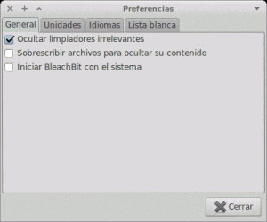
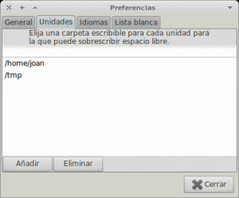
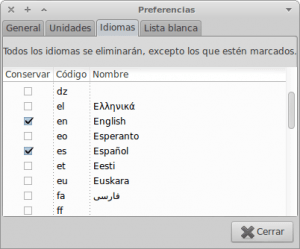
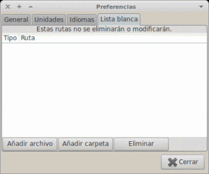
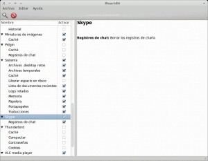
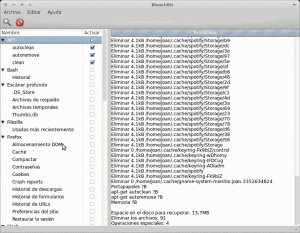
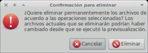
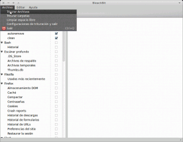

Bleachbit es un software de código abierto multiplaforma disponible tanto para Linux como para Windows principamente para liberar espacio de nuestro disco duro. Para que la gente se pueda hacer una idea diremos que las prestaciones que ofrece bleachbit son similares a las que nos ofrece ccleaner en Windows. Las utilidades principales del programa bleachbit según mi forma de ver son 2.<!--more-->

## 1- Utilidades principales del software Bleachbit

1. Liberarse de archivos innecesarios en nuestro disco duro y de esta forma liberar espacio e incrementar en la medida de lo posible la eficiencia y rendimiento de nuestro sistema.
2. Preservar nuestra privacidad ya que con bleachbit podemos triturar archivos y el espacio teóricamente libre de nuestro disco. De esta forma un tercero nunca podrá recuperar los datos que nosotros hemos borrado de nuestro disco duro.

## 2- Funciones que nos proporciona bleachbit

Las funciones que nos proporciona bleachbit en modo normal y en modo root los las que se detallan a continuación:

1. **APT:** Limpieza de la totalidad de paquetes .deb almacenados en la memoria cache, ubicada en (/var/cache/apt/archive), así como también dependencias de programas que nos olvidamos de quitar cuando desinstalamos programas. (Funciones equivalentes a los comandos apt-get autoremove, apt-get clean y apt-get autoclean)
2. **BASH:** Eliminar el historial de comandos de nuestra terminal. Muchas veces os habréis fijado que al terner abierta la terminal y al presionar los cursores nos van apareciendo los últimos comandos introducidos. Bleachbit te permite limpiar este historial. El historial de comandos mencionados se guarda en nuestra home dentro de un archivo oculto que se llama .bash\_history. Esta operación se puede hacer manual si entramos en el archivo y borramos el contenido del archivo .bash\_history.
3. **ESCÁNER PROFUNDO:** La función escáner profundo busca y  elimina los siguientes tipo de archivos: **.DS\_store o también .trashes:** Archivos en que se guarda información de la posición que ocupan los iconos en la pantalla, tipo de vista en el navegador de archivos, etc. **Archivos de respaldo:** Borra archivos de respaldo con extensión .bak como por ejemplo la copia de respaldo de las bookmark de Chromium, etc. **Thumbs.db:** Archivo que se acostumbra a generar en las carpetas donde tenemos imágenes. Este archivo es una cache donde se almacenan las vistas en miniatura de las imágenes que guardamos dentro de una carpeta en concreto. **Archivos temporales:** Eliminación de los archivos temporales de nuestro sistema.
4. **SISTEMA:** Conjunto de opciones que nos permite eliminar y optimizar las siguientes áreas: **Archivos .desktop rotos:** Elimina entradas de aplicaciones y asociaciones de archivo rotas. **Archivos temporales:** Elimina los archivos temporales ubicados en la carpeta /tmp. **Cache:** Borrar la totalidad del contenido de la cache ubicada en nuestra home. La ubicación de la cache es home/usuario/.cache **Liberar espacio en disco:** Al marcar esta opción lo que estamos haciendo es un borrado real del espacio asignado como libre en nuestro disco duro. La mayoría sabrán que si borramos un archivo de forma habitual no estamos borrando el contenido. Lo único que estamos haciendo es eliminar la referencia del contenido de tal forma nuestro sistema piense que se ha borrado el archivo (pero el archivo continua estando en la misma ubicación).  Esta opción que es lenta y en el caso que no haya información sensible en nuestro ordenador es completamente inútil realizarla. **Lista de documentos recientes:** Al marcar esta opción borramos la lista de documentos usados recientemente. **Logs rotados:** Si tildamos esta opción borraremos logs antiguos de nuestro sistema operativo. **Memoria:** Opción que al seleccionarla permite borrar la parte libre de nuestra memoria RAM y Swap. Como saben en la memoria RAM y swap se almacenan datos para la ejecución de programas. Si queremos borrar estos datos tan solo tenemos que tildar esta opción. (Solo borra la información que no está en uso en el momento de dar la orden de borrado) **Papelera:** Seleccionar esta opción simplemente vacía la papelera de reciclaje. **Portapapeles:** Al seleccionar esta opción se borrará la totalidad de elementos que tengamos en el portapapeles de nuestro escritorio. **Traducciones:** Al seleccionar esta opción se elimina la totalidad de archivos de idiomas no deseados. Para saber como seleccionar los idiomas que deseamos podemos consultar el apartado 4 de este post. Según la experiencia acumulada con está esta herramienta puedo afirmar que es más potente que localepurge. Una vez saque por accidente el español de los idiomas preferentes y esto me ocasiono que algunos de los programas instalados en mi ordenador nunca más pudieran estar en Español.
5. **Trituración de archivos** para poder preservar el anonimato y que nadie los pueda volver a recuperar los archivos que hemos eliminado.
6. **Limpiadores para más de 90 programas**. Pueden consultar el siguiente [enlace](http://bleachbit.sourceforge.net/features "Limpiadores Bleachbit") para ver la totalidad de Limpiadores que contiene Bleachbit. Cada limpiador para cada uno de los programas ofrece diferentes opciones como por ejemplo borrar cache, borrar historiales de conversaciones, borrar historiales de navegación, cookies, ficheros usados recientemente, etc. Cada programa ofrece distintas opciones que se entenderán muy fácilmente ya que bleachbit te ofrece explicaciones detalladas de que realiza cada una de las funciones.

## 3- Instalar Bleachbit

Bleachbit es un software que prácticamente esta en la totalidad de repositorios de las principales distros de linux (Ubuntu, Debian, Linux Mint, Fedora, Open Suse, slackware, Linux Mint Debian, etc.). Para instalarlo solamente tenemos que abrir una terminal y teclear:

> ```
> sudo apt-get install bleachbit
> ```

Una vez instalado ya estamos listos para usar el programa. Podemos abrir bleachbit tanto en modo normal como en modo root desde el menú de nuestro escritorio. Si se quiere ejecutar des de la terminal simplemente tenemos que teclear:

Para arrancarlo en modo normal tecleamos en la terminal:

> ```
> bleachbit
> ```

Para arrancarlo en modo root tecleamos:

> ```
> sudo bleachbit
> ```

## 4- Configurar Bleachbit

Ahora el programa ya está abierto. El primer paso a realizar una vez abierto es configurar las opciones del programa. Para acceder a las configuraciones del programa clicamos sobre el menú editar ya posteriori seleccionamos preferencias. Nos aparecerá un menú similar al siguiente:

[](images/Bleachbit-preferencias-general.png)

Como podemos ver en la imagen, la pestaña general tiene tres opciones:

1. Si seleccionamos ocultar los limpadores irrelevantes se ocultan los limpiadores de programas que no tenemos instalados en nuestros sistema.
2. Si seleccionamos escribir archivos para ocultar su contenido entonces los archivos eliminados se van a triturar y nunca más los podremos volver a recuperar. Por lo tanto si estais muy seguro de lo que quieres eliminar y quieres que una tercera no pueda recuperar los datos que borras podéis seleccionar esta opción.
3. Si seleccionamos iniciar bleachbit con el sistema entonces se ejecutará bleachbit cada vez que arranquemos nuestro sistema.

Finalizada la configuración general ahora seleccionamos la pestaña unidades:

[](images/Bleachbit-preferencias-Unidades.png)

Dentro de la pestaña unidades unidades seleccionamos los directorios que queremos que se sobrescriban para borrar todos los archivos definitivamente y eliminar cualquier rastro. Por defecto tenemos seleccionado la home y la carpeta de archivos temporales. Ustedes pueden añadir las ubicaciones que crean oportunas.

Una vez Configurada la opción unidades seleccionamos idiomas:

[](images/Bleachbit-preferencias-idiomas.png)

 En la pestaña idiomas seleccionamos los idiomas preferentes en nuestro sistema. En mi caso elijo el Inglés por ser el idioma base de mi distro y el Español que es mi idioma. De está forma aseguramos que se eliminaran paquetes de programas y del sistema instalados que hagan referencia a idiomas que no usamos.

###### nota: La opción de idiomas que nos ofrece Bleachbit es mucho más agresiva que localepurge. El método de bleachbit puede eliminar archivos de idiomas no deseados que localepurge no puede. Hay que ir con cuidado con esta opción. Recuerdo una vez borre el español por accidente. Nunca más pude tener ciertos programas del sistema en Español.

Al seleccionar la última pestaña, denominada Lista Blanca, podemos añadir las rutas o carpetas que queremos que bleachbit no pueda tener acceso y por lo tanto no pueda modificar. Al no seleccionar nada, bleachbit podrá modificar y tener acceso a la totalidad de información de nuestro ordenador.

[](images/Bleachbit-preferencias-lista-blanca1.png)

## 5- Usar Bleachbit para liberar espacio de nuestro disco duro

Una vez configurado el programa ya podemos ejecutar el limpiador.

[](images/Bleachbit-funcionamiento.png)

Primero usaremos bleachbit sin ser root. Como podemos ver en la imagen:

1. Vemos que al lado izquierdo se enumeran las opciones de limpieza que tenemos disponibles así como también cada uno de los programas que bleachbit puede optimizar y liberar espacio.
2. En la parte derecha podemos ver una detallada descripción de los archivos que se eliminarán en función de las opciones seleccionadas en la parte derecha.
3. Seleccionar la totalidad de opciones de limpieza que queremos aplicar. Algunas de las opciones de limpieza seleccionadas se pueden ver en la imagen de este apartado. Como podéis ver por ejemplo he seleccionado la opción sistema y dentro de sistema he seleccionado la totalidad de acciones excepto de liberar espacio en disco (Sí queréis ver los motivos podéis leer el apartado 2 de este post).
4. Si continuamos viendo la lista vemos que también he seleccionado skype. Skype solo nos ofrece la opción de borrar registros de chat. Como puedes ver en la parte derecha de la pantalla bleachbit nos informa que si seleccionamos esta opción se borrará el histórico de conversaciones que tenemos almacenadas en nuestro ordenador.
5. Una vez seleccionadas la totalidad de opciones clicaremos sobre el icono de la lupa. Entonces Bleachbit buscará la totalidad de archivos que quiere eliminar. [](images/bleachbit-limpiar-lupa.png)
6. Estudiamos detalladamente los archivos que bleachbit quiere eliminar. Si no vemos problema en eliminarlos solamente tenemos que apretar el símbolo de eliminar que está justo al lado de la lupa. Justo al apretar eliminar nos aparecerá un mensaje si estamos seguros de eliminar los archivos. Al responder eliminar eliminaremos los archivos. [](images/bleachbit-elimnar-definitivamente.png)

###### Nota: Al finalizar el proceso de borrar un archivo nos presentará un informe. En el informe veréis un detalle de los archivos borrados. En color rojo también veréis una serie de archivos que no se han podido borrar por falta de privilegios. Para eliminar los archivos que han aparecido en rojo solo tenemos que repetir el proceso descrito en el apartado 5 arrancando bleachbit como superusuario.

## 6- Triturar archivos con Bleachbit para preservar nuestra privacidad

Como se ha comentado en el apartado 4 de este mismo post, si queremos podemos eliminar definitivamente la totalidad de elementos que borramos con bleachbit. En el menú editar/preferencias solamente tenemos que seleccionar la opción sobrescribir archivos para ocultar su contenido. Si seleccionamos esta opción todo lo que borraremos con bleachbit es para siempre.

En el caso que solo deseemos triturar archivos específicos como por ejemplo un archivo de texto que queremos que una vez eliminado nadie pueda tener acceso a el solamente tenemos que:

1. Dar click en el menú archivo y seleccionar la opción adecuada que en nuestro caso es Triturar archivos. [](images/Triturar-archivos.png)
2. Seguidamente aparecerá el navegador de archivos y deberemos solamente deberemos buscar y seleccionar el archivo a eliminar. Una vez encontrado lo seleccionamos y apretamos el botón de eliminar. Al apretar el botón de eliminar nos dirá si estamos seguros de eliminar permanentemente el archivo seleccionado. Solo tendremos que decirlo que sí y el proceso habrá finalizado.

###### Nota: En el caso que quisiéramos triturar una carpeta el procedimiento es el mismo que el que acabamos de ver pero en el paso uno deberíamos seleccionar triturar carpetas.

Una vez terminado el proceso vais a quedar altamente sorprendidos de la cantidad de espacio que hemos liberado. Sí queréis en los comentarios podéis comentar los resultados que habéis conseguido.

En el caso que queráis seguir optimizando vuestro sistema operativo podéis encontrar más información en le siguiente enlace.

[https://geekland.eu/limpiar-nuestro-sistema/]()
