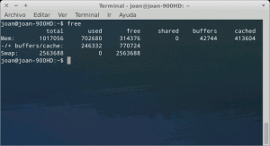
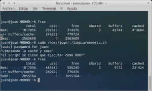
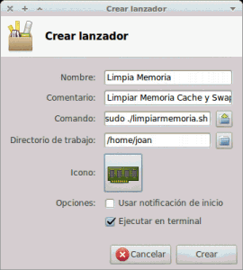

Liberar memoria cache de nuestra RAM es el primer post de una serie para optimizar el uso de la RAM en nuestros ordenadores y de esta forma poder sacar siempre el máximo rendimiento a nuestro ordenador. Los post que se crearán durante las próximas semanas  son:<!--more-->

1. **Liberar memoria cache de nuestra RAM**.
2. [Limitar el uso de nuestra memoria Swap y limpiarla en el caso que se active]().
3. [Usar la RAM más eficientemente con ZRAM.]()
4. [Acelerar el inicio de nuestras aplicaciones con Preload.]()
5. [Acelerar el inicio de nuestras aplicaciones con Prelink.]()
6. [Aligerar el rendimiento de nuestro sistema operativo con Zswap]().

Por lo tanto por el orden establecido iniciamos el primer post de la serie:

## LIBERAR MEMORIA CACHE DE LA RAM

Particularmente uso este tip y pienso que es útil. No obstante en teoría para máquinas potentes no se debería notar mucha diferencia en el rendimiento que obtenemos ya que en principio lo que se almacena y borra en la memoria cache de nuestra RAM es controlado por nuestro Kernel. Con la siguiente explicación podrán comprender como funciona nuestra memoria cache.

## ¿Cómo funciona la memoria cache?

Nuestra memoria RAM se subdivide en varias partes. Una parte de la memoria se denomina SRAM o RAM estática y otra parte de llama DRAM o RAM dinámica. La parte de la memoria que denominamos SRAM es la memoria rápida y la que denominamos cache. ¿Cómo funciona la memoria cache o SRAM?

Cuando ejecutamos un programa, por ejemplo Libreoffice, se tiene que cargar en nuestra memoria y posteriormente arrancar. El proceso descrito puede tener una duración de tranquilamente 6 o 7 segundos. Una vez cerremos Libreoffice parte de la información que se ha cargado a la memoria quedará almacenada de forma permanente en nuestra memoria SRAM o cache de tal forma que cuando volvamos a ejecutar libreoffice nuestro ordenador primero mirará si tenemos almacenada la información necesaria en la SRAM o cache, y como en este caso ya tenemos la información en nuestra memoria la aplicación arrancará mucho más rápido que la primera vez.

Si además de Libreoffice arrancamos muchos más programas como por ejemplo Firefox, Chrome, gimp, etc. llegará a un punto que nuestra memoria SRAM o cache está llena y en teoría esto debería perjudicar al rendimiento de nuestro equipo. Pero en este punto entra en acción nuestro Kernel. En esta situación el Kernel de nuestro ordenador se encargará de gestionar inteligentemente la cache (SRAM) de nuestro equipo. Así que cuando detecte que nuestra SRAM o cache está llena procederá a vaciarla de forma inteligente y borrando siempre los datos que más nos conviene para obtener el mejor rendimiento posible. Por esto a priori no es necesario hacer un vaciado de la memoria cache.

## ¿Por qué considero que es necesario liberar memoria cache?

A pesar de la gestión que puede hacer el kernel considero que hacer limpieza de la cache es provechoso debido a los siguientes motivos:

1. En determinados casos y en ordenadores poco potentes, como por ejemplo un ASUS Eee PC que a veces utilizo, el kernel no gestiona eficientemente la cache de nuestro ordenador. Mi experiencia con un ASUS Eee PC y Xubuntu es que cuantas mas horas lo uso mas se sobrecarga la swap y la memoria cache. Al día de estar funcionando, y dependiendo del uso que le doy, me quedo sin memoria cache y la memoria swap se dispara. El resultado es un sistema muy lento.
2. Una cosa es la teoría y otra la práctica. Si tenéis el ordenador permanentemente funcionando y nunca se apaga la memoria cache tarde o temprano acabará saturándose. En teoría no debería pasar pero pasa.
3. Puede resultar útil liberar la cache justo después de cerrar una aplicación muy pesada para posteriormente arrancar otra aplicación que también sea muy pesada.

## ¿Cómo liberar memoria cache de nuestra RAM?

Para realizar la limpieza podemos generar un script muy básico y simple. El script lo podemos hacer de la siguiente forma: Creamos un archivo en nuestra home que se llame limpiamemoria.sh. Para crearlo abrimos una terminal y teclemaos:

> ```
> sudo gedit limpiamemoria.sh
> ```

Dentro del archivo copiamos el siguiente texto   (**antes de copiar el texto ver nota**):

> ```
> #!/bin/bash
> ```
> 
> ```
> echo “Limpiando la caché~ “;
> ```
> 
> ```
> sync ; echo 1 > /proc/sys/vm/drop_caches
> ```
> 
> ```
> sync ; echo 2 > /proc/sys/vm/drop_caches
> ```
> 
> ```
> sync ; echo 3 > /proc/sys/vm/drop_caches
> ```

###### Nota: En el script hay una frase de color rojo, otra de color verde y otra de color negro, Solo debemos copiar una de las tres frases en función de lo agresivos que queremos ser en limpiar nuestra cache. Si elegimos la frase de color rojo es la opción menos agresiva mientras que si elegimos la frase de color negro estamos eligiendo la opción más agresiva.

Una vez definido el texto del script tanto tenemos que guardar y cerrar.

Antes de seguir adelante es importante hace un paréntesis y comprender lo que estamos haciendo con el comando que se ejecuta en el script. El comando que estamos ejecutando es:

> ```
> sync ; echo (1,2 o 3) > /proc/sys/vm/drop_caches
> ```

Con este comando lo que hacemos es modificar el archivo drop\_caches que se halla en la ubicación /proc/sys/vm/. Este archivo tiene 4 valores posibles. En función del valor que le asignamos a este archivo nuestro kernel actuará de una forma u otra con la información que tenemos almacenada en nuestra cache. Los posibles valores que podemos definir en el archivo son:

- **0**: Es el valor por defecto siempre que arrancamos nuestro ordenador. Si dejamos este comando no se liberara absolutamente nada de nuestra memoria cache.
- **1**: Equivaldría a usar el script con "echo 1 > /proc/sys/vm/drop\_caches". Al ejectuar el script con este valor estamos forzando a nuestro kernel a liberar la pagecache.
- **2**: Equivaldría a usar el script con "echo 2 > /proc/sys/vm/drop\_caches". Al ejectuar el script con este valor estamos forzando a nuestro kernel a liberar los inodos y dentries.
- **3**: Equivaldría a usar el script con "echo 3 > /proc/sys/vm/drop\_caches". Al ejectuar el script con este valor estamos forzando a nuestro kernel a liberar la pagecache, los inodos y las dentries.

###### Nota: Podéis elegir tranquilamente la opción más agresiva de las 3. Si os fijáis en el script aparece el comando sync. Con el comando sync aseguramos que solo se liberen de la cache los objetos que no estamos usando actualmente. Por lo tanto a priori no hay peligro de cuelgues ni estabilidad en realizar esta operación.

###### Nota: Si elegimos la opción 3 estaremos borrando los inodos, dentries y pagecache. Los inodos contienen meta-información de archivos individuales como por ejemplo el propietario, el grupo, la fecha de creación, la hora de creación etc, así como también los bloques del disco duro que contienen la información que acabamos de citar. Las dentries contienen información para enlazar los nombres de los distintos directorios con los ficheros que contienen para de esta forma acceder más rápido a nuestras aplicaciones. Mientras que la pagecache almacna copias de los bloques de nuestro disco duro.

A estas alturas ya solo nos queda ejecutar el script. Para ejecutar el script primero tenemos que darle permisos. Para darle permisos abrimos una terminal en la misma ruta donde hemos guardado el script y tecleamos:

> ```
> sudo chmod +x limpiamemoria.sh
> ```

Antes de ejectuar el script tecleamos en la terminal el comando:

> ```
> free
> ```

Y obtenemos el siguiente resultado:

[](images/mem-ini.png)

En la captura de pantalla que acabamos de pegar se pueden ver el estado de nuestra memoria RAM en este preciso instante. Después de ejecutar el script podremos comparar los resultados.

Ahora ejecutamos el script mediante el comando

> ```
> sudo ./limpiamemoria.sh
> ```

Una vez ejecutado el script en la terminal volvemos a usar el comando free. Con el comando free ahora podremos observar lo que ha realizado la ejecución de nuestro script:

[](images/mem-clean.png)

Si observamos la captura de pantalla podemos ver que la ejecución del script nos ha liberado aproximadamente 200 mb de nuestra RAM cache. Por lo tanto podemos decir que el proceso ha salido correctamente.

###### Nota: Una vez liberada la memoria cache no hay que preocuparse de nada más. A medida que vayamos abriendo programas el contenido se cacheara como lo hace habitualmente. Cuando cuando volvamos a arrancar nuestro ordenador nuestra configuración seguirá siendo la standard ya que con este script no estamos modificando la configuración de arranque de nuestro ordenador.

Para hacer persistente el cambio, cosa que no aconsejo, podemos hacerlo de la siguiente forma:

Entramos en terminal y tecleamos

> ```
> sudo gedit /etc/sysctl.conf
> ```

Dentro del fichero añadimos, o modificamos en el caso que ya exista, la siguiente linea y guardamos:

> ```
> vm.drop_caches = 3
> ```

Como hemos visto antes la variable vm.drop\_caches puede tener los valores 0,1,2 o 3.

## Ejectuar el script mediante un simple click de ratón

Si queremos ejecutar el script mediante un click de ratón tan solo tenemos que ir a nuestro escritorio. Le damos click al botón derecho de nuestro  mouse y elegimos la opción crear lanzador.

Les aparecerá una ventana similar a la siguiente. Rellenen los campos de esta ventana tal y como se puede ver en la siguiente captura de pantalla:

[](images/acceso-directo-script.png)

Una vez rellenados los campos solamente tenemos que apretar en el botón crear. Ahora tendremos un nuevo lanzador en nuestro escritorio. Tan solo tenemos que apretar 2 veces sobre el lanzador. Se abrirá una terminal. Nos pedirá nuestra contraseña de usuarios root. La introducimos y a posteriori se ejecutará el script limpiando nuestra cache.

## Automatizar el proceso de limpieza de la Cache

En el caso que seáis de las personas que tenéis las 24 horas vuestro ordenador funcionando les puede interesar realizar la operación de limpieza de cache de forma automática. Para ello tenemos que seguir los siguientes pasos:

Copiaremos el script creado en la carpeta /bin. Para ello abrimos una terminal y tecleamos:

> ```
> mv limpiamemoria.sh /bin
> ```

Ahora configuraremos contrab para que el script se ejecute periódicamente a las 12 de la noche. Para ello en la terminal tecleamos:

> ```
> crontab -e
> ```

Se abrirá el editor de textos en modo terminal y copiamos el siguiente contenido:

> ```
> 0 0 * * * /bin/limpiamemoria.sh
> ```

Cerramos y guardamos. De esta forma nuestro script se ejecutará periódicamente sin que nosotros tengamos que hacer nada.

## Fuentes

[http://www.atareao.es/ubuntu/liberando-la-memoria-cache/](http://www.atareao.es/ubuntu/liberando-la-memoria-cache/ "http://www.atareao.es/ubuntu/liberando-la-memoria-cache/")
