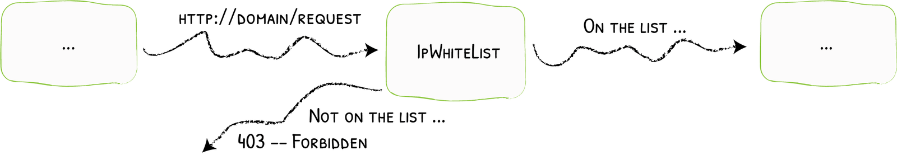
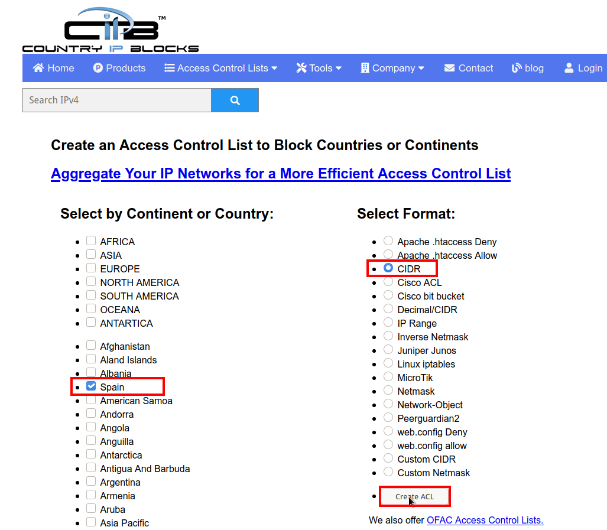
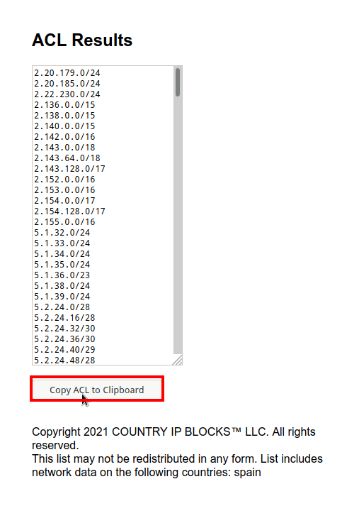
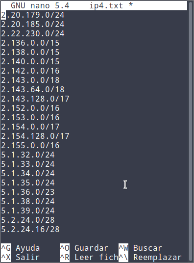
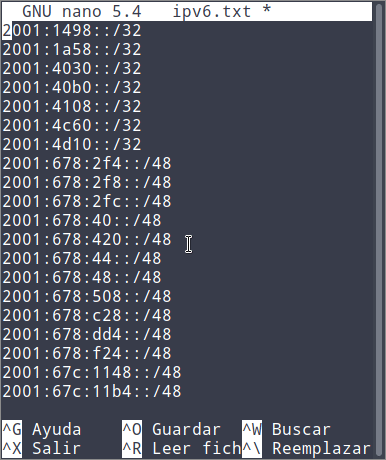
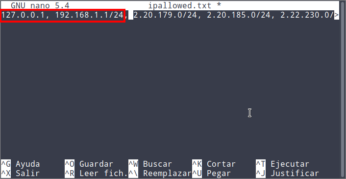

Es posible que tengáis una nube o algún que otro servicio autoalojado en casa o en un servicio VPS mediante Docker y Traefik. Por norma general estos servicios únicamente tienen que ser accesibles desde vuestro país, por lo tanto en términos de seguridad es interesante limitar el acceso del servicio a los habitantes de un determinado país del siguiente modo.<!--more-->

## LIMITAR EL ACCESO A UN SERVICIO WEB HACIENDO QUE ÚNICAMENTE LOS VISITANTES DE UN DETERMINADO PAÍS PUEDAN ACCEDER A ELLA

En el ejemplo que veremos a continuación partimos de una [nube owncloud autoalojada]() en una Raspberry Pi mediante Docker y Traefik. Para limitar el acceso y que solo puedan entrar en nuestra nube los habitantes de un determinado país tendremos que usar el Middleware IpWhiteList de Traefik.

El middleware IpWhiteList almacenará una larga lista de IP. Si la IP del usuario que quiere acceder a mi nube está en la lista podrá acceder sin ningún tipo de problema. Pero si la IP del visitante o cliente no figura en el middleware entonces el acceso será bloqueado por Traefik.

[](images/esquema-de-funcionamiento-ipwhitelist.png)

### Construir un listado con las IP que podrán acceder a nuestro servicio autoalojado

Lo primero que tenemos que realizar es construir un listado que contenga las IP que podrán acceder a nuestro servicio. Existen multitud de páginas web que nos ayudarán a construir el listado de IP permitidas.

En mi caso quiero que solo puedan acceder a mi nube Owncloud los usuarios que tengan IP española. Para generar un listado de IPv4 pertenecientes a España tan solo hay que acceder a la siguiente URL:

[https://www.countryipblocks.net/acl.php](https://www.countryipblocks.net/acl.php)

Una vez dentro de la web seleccionamos el país del que queremos obtener las IP, seleccionamos el formato CIDR y finalmente presionamos el botón `Create ACL`.

[](images/obtener-ipv4-de-un-pais-o-territorio.png)

Seguidamente aparecerá un listado de IP. Para copiarlo tan solo tienen que presionar encima del botón `Copy ACL to Clipboard`.

[](images/copiar-IPv4.png)

A continuación ejecutaremos el siguiente comando en una terminal de Linux:

> ```shell
> joan@gk55:~$ nano ipv4.txt
> ```

Una vez se abra el editor de texto nano pegaremos las IP dentro del fichero de texto y guardaremos los cambios.

[](images/generar-listado-ipv4.png)

Para generar el listado de IPv6 existentes en España lo haremos del mismo modo. Para empezar accederemos a la siguiente URL.

[https://www.countryipblocks.net/ipv6\_acl.php](https://www.countryipblocks.net/ipv6_acl.php)

Una vez dentro de la URL seleccionamos el país del que queremos obtener las IP, seleccionamos el formato CIDR y finalmente presionamos el botón `Create ACL`.

A continuación ejecutaremos el siguiente comando en una terminal Linux.

> ```shell
> joan@gk55:~$ nano ipv6.txt
> ```

Cuando se abra el editor de texto nano pegaremos las IPv6 dentro del fichero de texto y guardaremos los cambios.

[](images/generar-listado-ipv6.png)

Una vez disponemos de los 2 listados los combinaremos en un solo archivo de texto que contenga el formato apropiado para usar en Traefik. Para ello ejecutaremos el siguiente comando en la terminal:

> ```shell
> joan@gk55:~$ cat ipv4.txt ipv6.txt | paste -sd "" | sed 's/ /, /g' > ipallowed.txt
> ```

Una vez ejecutado el comando tendremos un fichero de texto con el nombre `ipallowed.txt` que contiene gran parte de las IP que se se usan en España. Para evitar problemas abriremos este fichero y añadiremos las IP 127.0.0.1 y 192.168.1.1/24. De este modo aseguraré que puedo acceder sin problema a mi nube Owncloud desde mi red local.

[](images/Listado-de-ip-permitadas-finalizado.png)

**Nota**: Únicamente las IP dentro del fichero ipallowed.txt podrán acceder a nuestro servicio autoalojado.

### Introducir las etiquetas al Docker-Compose para limitar el acceso a nuestro servidor y que Traefik filtre las IP que pueden acceder a nuestra mube

En el artículo de como [autoalojar nuestra propia nube owncloud]() usamos las siguientes etiquetas en el fichero `docker-compose.yml`:

> ```shell
>     labels:
>       - traefik.enable=true
>       - traefik.http.routers.owncloud.rule=Host(`owncloud.ejemplo1.duckdns.org`)
>       - traefik.http.routers.owncloud.tls=true
>       - traefik.http.routers.owncloud.entrypoints=websecure
>       - traefik.http.routers.owncloud.tls.certresolver=lets-encrypt
>       - traefik.http.middlewares.owncloud-headers.headers.framedeny=false
>       - traefik.http.middlewares.owncloud-headers.headers.sslredirect=true
>       - traefik.http.middlewares.owncloud-headers.headers.stsSeconds=155520011
>       - traefik.http.middlewares.owncloud-headers.headers.stsIncludeSubdomains=true
>       - traefik.http.middlewares.owncloud-headers.headers.stsPreload=true
>       - traefik.http.routers.owncloud.middlewares=owncloud-headers@docker
>       - traefik.port=8080
> ```

Lo primero que hay que ver es que estamos usando un middleware con nombre `owncloud-headers`. A este middleware hay que añadirle otro middleware que llamaré `lista-blanca`. Cuando hay más de un middleware hay que encadenarlos y dar un nombre a la cadena. Para encadenar los middleware `owncloud-headers` y `lista-blanca` y generar una cadena con el nombre `secured` tendré que añadir la siguiente etiqueta:

>       **`- traefik.http.middlewares.secured.chain.middlewares=owncloud-headers,lista-blanca`**

Una vez generada la cadena tenemos que crear el middleware del tipo `ipwhitelist.sourcerange` con el nombre `lista-blanca` que filtrará las IP que se podrán conectar al servicio Owncloud. Para ello usaremos la siguiente etiqueta:

> ```shell
>       - traefik.http.middlewares.lista-blanca.ipwhitelist.sourcerange=127.0.0.1/32, 192.168.1.1/24, 2.20.179.0/24, 2.20.185.0/24, 2.22.230.0/24, ...,2a10:fb80::/29, 2a10:fc00::/29
> ```

**Nota**: La etiqueta que acabáis de ver no es completa ya que su longitud es muy extensa. En vuestro caso tendréis que reemplazar `127.0.0.1/32, 192.168.1.1/24, 2.20.179.0/24, 2.20.185.0/24, 2.22.230.0/24, ... ,2a10:fb80::/29, 2a10:fc00::/29` por la totalidad de IP que tenéis en el fichero de texto `ipallowed.txt`. Para ello la mejor solución es hacer un copiar/pegar.

Finalmente tenemos que conectar el router `owncloud` con la cadena de middleware `secured`. Por lo tanto lo primero que tenemos que hacer deshacer el link existente entre el router `owncloud` y el middleware `owncloud-headers`. Para ello borraremos la siguiente etiqueta:

>       `**- traefik.http.routers.owncloud.middlewares=owncloud-headers@docker**`

A continuación hay que conectar el router `owncloud` con la cadena `secured` añadiendo la siguiente etiqueta:

> ```shell
>       - traefik.http.routers.owncloud.middlewares=secured
> ```

Una vez realizadas todas las modificaciones, las etiquetas del `docker-compose.yml` quedarán de la siguiente forma:

> ```shell
>     labels:
>       - traefik.enable=true
>       - traefik.http.routers.owncloud.rule=Host(`owncloud.ejemplo1.duckdns.org`)
>       - traefik.http.routers.owncloud.tls=true
>       - traefik.http.routers.owncloud.entrypoints=websecure
>       - traefik.http.routers.owncloud.tls.certresolver=lets-encrypt
>       - traefik.http.middlewares.secured.chain.middlewares=owncloud-headers,lista-blanca
>       - traefik.http.middlewares.owncloud-headers.headers.framedeny=false
>       - traefik.http.middlewares.owncloud-headers.headers.sslredirect=true
>       - traefik.http.middlewares.owncloud-headers.headers.stsSeconds=155520011
>       - traefik.http.middlewares.owncloud-headers.headers.stsIncludeSubdomains=true
>       - traefik.http.middlewares.owncloud-headers.headers.stsPreload=true
>       - traefik.http.middlewares.lista-blanca.ipwhitelist.sourcerange=127.0.0.1/32, 192.168.1.1/24, 2.20.179.0/24, 2.20.185.0/24, 2.22.230.0/24, ...,2a10:fb80::/29, 2a10:fc00::/29
>       - traefik.http.routers.owncloud.middlewares=secured
>       - traefik.port=8080
> ```

### Borrar los contenedores y levantar de nuevo el Docker-compose

En el momento que tenemos generado el fichero `docker-compose.yml` el proceso ha finalizado. Para que Traefik empiece a filtrar las IP y a limitar el acceso a nuestro servicio web tenemos que borrar los contenedores existentes y volverlos a generar. Por lo tanto en el caso de Owncloud tendré que ejecutar los siguientes comandos:

> ```shell
> pi@raspberrypi:~/owncloud $ docker rm owncloud_owncloud_1 owncloud_db_1 owncloud_redis_1
> pi@raspberrypi:~/owncloud $ docker rm owncloud_owncloud_1 owncloud_db_1 owncloud_redis_1
> pi@raspberrypi:~/owncloud $ docker-compose up -d
> ```

A partir de estos momentos si intento acceder a mi nube Owncloud desde una IP que no sea de España el acceso será bloqueado. Por lo tanto habremos conseguido limitar el acceso a nuestro servidor y tan solo podran acceder a él los usuarios que tengan alguna de las IP instroducidas en el docker-compose.

#### Fuentes

[https://doc.traefik.io/traefik/middlewares/overview/](https://doc.traefik.io/traefik/middlewares/overview/)

[https://doc.traefik.io/traefik/middlewares/ipwhitelist/](https://doc.traefik.io/traefik/middlewares/ipwhitelist/)
