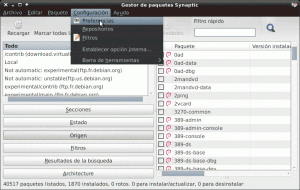

Con el paso del tiempo seguramente tendremos la necesidad de limpiar nuestro sistema operativo. Veremos que el disco duro de nuestro ordenador se va llenando de basura y que si no hacemos nada este problema siempre irá en aumento.  Cabe remarcar que aunque tengamos instalada "basura" en nuestro disco duro, el rendimiento de nuestro sistema será mas que aceptable y en ningún caso el comportamiento que tendremos se puede asimilar a lo que nos pasaría con Windows. Lo único que notaremos en Linux es que nos quedamos sin espacio en el disco duro. ¿Por qué se nos llena nuestro disco duro de basura?<!--more-->

# Razones por las cuales tenemos que limpiar nuestro sistema

1. Cuando desinstalamos programas muchas veces solo se desinstalan los paquetes principales y nos olvidamos de desinstalar la totalidad de dependencias de los paquetes desintalados.
2. Cuando desinstalamos programas muchas veces nos olvidamos de borrar los archivos de configuración de los programas que desinstalamos.
3. Cada vez que actualizamos nuestro sistema se descargan paquetes de los repositorios. Estos paquetes quedan almacenados en nuestro ordenador hasta que no los borramos.
4. Muchas veces tenemos paquetes instalados en nuestro sistema que son completamente innecesarios. Hay que intentar tener los paquetes que nos hacen falta y ya está.
5. En el caso de compilar ciertos programas a partir del código fuente con configure, make, make install hace que todos los ficheros y librerías del programa se guarden en la carpeta donde hemos realizado la compilación. Por lo tanto en el caso de hacer un upgrade o desinstalar el programa los comando normales no nos servirán y es probable nos queden archivos inútiles dentro de nuestros sistema.
6. A medida que pasa el tiempo los Kernel se van actualizando y multitud de Kernel antiguos se van acumulando en nuestro sistema comiendo una parte importante de nuestro disco duro.
7. A veces al desinstalar programas nos quedan paquetes huérfanos. Los paquetes huérfanos son aquellos paquetes que no dependen ni son usado por ningún otro paquete que tengamos en nuestro sistema. Por lo tanto son paquetes que no realizan ninguna función y se pueden eliminar.
8. Cuando instalamos programas a veces se nos instala documentación y paquetes de idiomas que nunca vamos a usar. Estos paquetes nos roban espacio en nuestro disco duro.
9. Con el paso del tiempo el software que tenemos instalado en nuestro disco duro va acumulando archivos temporales, incrementando la memoria cache, cookies, etc. Esto hace que nos quedemos sin espacio en nuestro disco duro.

Una vez vistas las causas seguidamente detallamos 9  pasos para prevenir o solucionar  la totalidad de puntos que acabamos de mencionar. Siguiendo los pasos mencionados evitaremos tener que reinstalar nuestro sistema operativo.

###### Nota: Antes de empezar es altamente recomendable ir guardando un registro de los cambios que se realizan para poder revertir la operación en caso de problemas. El 99,9% de veces la operación será satisfactoria pero a veces cabe la posibilidad de desinstalar paquetes que no tocan.

## 1- Limpiar nuestro sistema de paquetes no deseados que tenemos instalados con Debfroster

Debfoster es una herramienta que nos permitirá ver aquellos paquetes que tenemos instalados en nuestro sistema operativo. Después de verlos y estudiarlos deberemos ser nosotros mismos quienes decidan si mantenemos o queremos eliminar estos paquetes.

Para instalar debfoster abrimos una terminal y tecleamos:

> ```
> sudo apt-get install debfoster
> ```

Una vez instalado el programa vamos a generar una lista de paquetes. La lista de paquetes que generaremos contendrá los paquetes que nosotros mismo hemos instalado y no contendrá ninguna de sus dependencias. En el listado solo tendremos los paquetes principales. Para generar el listado tecleamos el siguiente comando en la terminal:

> ```
> sudo debfoster -q
> ```

Ahora el listado ya esta generado. Para consultarlo tan solo tenemos que teclear el siguiente comando en la terminal:

> ```
> sudo gedit /var/lib/debfoster/keepers
> ```

Una vez introducido el comando se abrirá un editor de texto con todos los paquetes. Ahora tenemos que mirar paquete por paquete y decidir si hay algún paquete prescindible o no. Por ejemplo podemos detectar paquetes que no teníamos conocimiento de tener instalado, por  ejemplo alguna librería -dev que no tiene ningún utilidad. Una vez detectados los paquetes a eliminar los borramos del listado y guardamos. En mi caso y solo para realizar una prueba he borrado el paquete totem de nuestro listado.

Volvemos a la terminal y ejecutamos:

> ```
> sudo debfoster
> ```

Al borrar el paquete totem la terminal nos devolverá el siguiente resultado:

[](images/debfoster.png)

Al borrar totem del listado el programa debfoster no está preguntando si realmente queremos eliminar totem y sus dependencias de nuestro sistema operativo. Solamente tenemos que contestar sí o no. Al contestar si se desinstalará el programa y si contestamos que no el paquete no se desinstalará y se incluirá de nuevo en el archivo ubicado en /var/lib/debfoster/keepers.

## 2- Instalar los paquetes compilados siempre a partir de un archivo .deb

Este punto es simplemente un consejo. Hoy en día raramente es necesario tener que compilar un programa a partir del código fuente pero en el hipotético caso que tengamos que hacerlo tenéis que tener en cuenta que tenemos 2 opciones:

1. Compilar mediante los comando configure // make // make install
2. Empaquetar todo el contenido en un paquete deb mediante checkinstall e instalarlo, y a posteriori instalar el programa con nuestro gestor de paquetes habitual.

La opción 1 genera multitud de problemas. Los problemas generados por la opción uno son básicamente:

1. Todas las librerías y ficheros se guardan en la carpeta donde hemos realizado la compilación. Esto en un futuro va a imposibilitar realizar un upgrade del programa en condiciones.
2. También por el mismo motivo detallado en el punto 1 se dificultará la desinstalación del programa ya que nuestro gestor de paquetes no detectará que tenemos instalado este software. Los comandos habituales tampoco nos servirán para eliminar el programa.

Por lo tanto vistos los problemas es fácil concluir que si trabajamos de esta forma nos quedaran paquetes instalados que no sabremos como desinstalar, o que ni tan siquiera sabremos si los tenemos instalados.

La solución es usar checkinstall. Con checkinstall podremos generar un paquete .deb a partir del código fuente. Una vez generado el paquete .deb entonces instalar, desinstalar o actualizar será muy fácil ya que las herramientas y comandos que utilizamos habitualmente serán 100% funcionales.

En las próximas semanas publicaré otro post en que se mostrará como usar checkinstall para generar un paquete .deb. Como podréis ver el proceso es muy sencillo.

## 3- Limpiar nuestro sistema de Kernel antiguos que ya no se usan

Como he explicado anterior a medida que nos van llegando actualizaciones de los kernel estos se acumulan en nuestra partición raíz y boot robándonos espacio en nuestro disco duro. Para borrar los kernel que nos sobran debemos proceder de la siguiente manera:

###### nota: Es altamente recomendable disponer de al menos los 2 kernel más actuales instalados en nuestro ordenador. En el caso que alguno de los kernel fallará siempre tendríamos la opción de arrancar con el otro. En el caso que pongo como ejemplo inicialmente solo tenia 2 kernel. Por lo tanto cabe decir que me he saltado la recomendación que os estoy haciendo.

Para averiguar la versión de Kernel que estamos usando abrimos la terminal y tecleamos:

> ```
> uname -r
> ```

El resultado que me da es el siguiente:

> ```
> 3.2.0-4-amd64
> ```

Por lo tanto el kernel 3.2.0-4-amd64 no le debemos borrar bajo ningún concepto.

Ahora miraremos la totalidad de kernel que tenemos instalados mediante el comando:

> ```
> dpkg --get-selections | grep linux-image
> ```

Obtendréis un resultado parecido al siguiente:

linux-image-3.2.0-3-amd64               install linux-image-3.2.0-4-amd64               install linux-image-amd64                            install

Veo que en mi caso tengo instalados los kernel 3.2.0-3 y el 3.2.0-4. Como el 3.2.0-4 es el kernel actual,  el único candidato a eliminar es el linux-image-3.2.0-3-amd64.

Para eliminar el kernel 3.2.0-3 hay que aplicar los siguiente comandos:

> ```
> sudo apt-get remove --purge linux-image-3.2.0-3-amd64
> ```

###### Nota!: En ningún caso borrar el linux-image-amd64. En caso de hacerlo no recibiremos actualizaciones de futuros Kernel.

Seguidamente tenemos que borrar los headers del Kernel. Para borrar los headers del kernel abrimos una terminal y tecleamos el siguiente comando:

> ```
> dpkg --get-selections | grep linux-headers
> ```

Este comando nos devolverá:

linux-headers-3.2.0-3-amd64                install linux-headers-3.2.0-3-common            install linux-headers-3.2.0-4-amd64                install linux-headers-3.2.0-4-common            install linux-headers-amd64                            install

Como únicamente queremos eliminar el Kernel 3.2.0-3 borramos únicamente los archivos seleccionados en rojo con el siguiente comando (lineas que hacen referencia al kernel 3.2.0-3):

> ```
> sudo apt-get remove --purge linux-headers-3.2.0-3-amd64 linux-headers-3.2.0-3-common
> ```

En este momento ya hemos eliminado el kernel, y nuestro Grub en teoria se tiene que haber actualizado en función de los nuevos kernel disponibles en nuestro sistema. No obstante si nos queremos asegurar que el grub se ha actualizado podemos teclear los siguientes comandos en la terminal:

> ```
> sudo update-grub2
> ```

> ```
> sudo update-grub
> ```

## 4- Limpiar nuestro sistema de paquetes huérfanos

Después de multiples instalaciones y desinstalaciones de programas, en nuestro sistema quedarán una serie de paquetes que no tienen ninguna función y que lo único que hacen es ocupar espacio en nuestro ordenador. Para detectar y eliminar estos paquetes tenemos que proceder de la siguiente manera:

Instalamos el paquete deborphan tecleando el siguiente comando en la terminal:

> ```
> sudo apt-get install deborphan
> ```

Una vez instalada la aplicación podemos obtener fácilmente una lista de los paquetes huérfanos de nuestro sistema. Ejecutamos el siguiente comando en la terminal:

> ```
> deborphan
> ```

y la salida que me da en mi caso es la siguiente:

> **lib32v4l-0:amd64** **gstreamer0.10-gnomevfs:amd64** **lib32bz2-1.0:amd64** **lib32ncurses5:amd64** **ttf-punjabi-fonts:all** **ttf-droid:all** **libavfilter2:amd64** **ttf-lyx:all**

Como podeís ver esta es la totalidad de paquetes huérfanos que tengo.

Para desinstalarlos ejecutamos el siguiente comando en la terminal:

> ```
> sudo apt-get --purge remove $(deborphan)
> ```

Si también queremos borrar los paquetes en la sección libdevel tecleamos:

> ```
> deborphan --libdevel
> ```

En el caso de encontrar paquetes huérfanos en la sección libdevel los podemos borrar con el comando:

> ```
> sudo apt-get --purge remove $(deborphan --libdevel)
> ```

Seguidamente también podemos desinstalar la totalidad de ficheros de  ficheros de configuración obsoletos que no estamos usando. Para consultar los ficheros tecleamos el siguiente comando en la terminal:

> ```
> deborphan --find-config
> ```

En mi caso no tengo ficheros de configuración obsoletos. En el caso que los tuviera para eliminarlos debería teclear el siguiente comando:

> ```
> sudo dpkg --purge $(deborphan --find-config)
> ```

Finalmente y solo en el caso que sepamos muy bien lo que estamos haciendo podemos ejecutar el siguiente comando para terminar el proceso de eliminación de paquetes huérfanos:

> ```
> deborphan --guess-all
> ```

El siguiente comando nos da un listado de los paquetes que en principio no son necesarios para el sistema. En mi caso los paquetes que me da son:

> **lib32nss-mdns:amd64** **python-statgrab:amd64** **gnome-desktop-data:all** **fuse-utils:all** **spotify-client-qt:all** **nvidia-kernel-3.2.0-3-amd64:amd64**

Antes he dicho de ir en cuenta porqué bajo mi humilde criterio este comando nos está dando paquetes que creo que es mejor no eliminar. Por ejemplo si borramos el paquete nvidia-kernel-3.2.0-3-amd64:amd64 puedo dar fe que el entorno gráfico no funcionará si arranco con el kernel 3.2.0-3. Otros paquetes como gnome-dektop-data:all creo que también daría problemas si lo eliminamos. El resto de paquetes que nos da el comando en principio se podrían eliminar ya que se tratan la gran mayoría de paquetes transicionales.

En el caso que quisiéramos eliminar la totalidad los paquetes que acabamos de hallar tecleamos el siguiente comando en la terminal:

> ```
> sudo dpkg --purge $(deborphan --guess-all)
> ```

En el caso que solo quisieramos eliminar algunos de los paquetes que acabamos de encontrar podemos usar el siguiente comando:

> ```
> sudo dpkg --purge nombredelpaquete
> ```

## 5- Limpiar nuestro sistema de paquetes de idiomas que no usamos

Hay un paquete que se encarga de eliminar los paquetes de idiomas que en principio no usamos. El paquete en cuestión se llama localepurge. Lo instalamos con el siguiente comando:

> ```
> sudo apt-get install localepurge
> ```

###### Nota: El objetivo de este paquete es eliminar los paquetes de idiomas que nos usamos y que se acostumbran a instalar cuando instalamos programas.

Inmediatamente después de instalar el paquetes nos saldrá una pantalla de selección donde tenemos que elegir los idiomas que en principio queremos usar. Yo acostumbro a instalar 2. El inglés por tratarse del idioma base de la distro y mi idioma propio que en mi caso es el Español. Las opciones a seleccionar para definir el Inglés y el Español son:

> **en** **en\_US** **en\_US.ISO-8859-15** **en\_US.UTF-8** **es** **es\_ES** **es\_ES@euro** **es\_ES.UTF-8** 

Para ejecutar localpurge y hacer una limpieza de paquetes de idiomas que no deseamos, simplemente tenemos que abrir la terminal y teclear:

> ```
> sudo localepurge
> ```

De esta forma se desinstalan las traducciones de los programas instalados que tienen paquetes de idiomas diferente a los marcados en localepurge.

###### nota: En principio este paquete ya lo tienen que tener instalado. En mi caso no lo tenia instalado porqué instalé Debian a partir de una netinstall. En el caso de tener instalado el paquete y querer reconfigurar los idiomas base tiene que teclear el comando dpkg-reconfigure localepurge

## 6- Eliminar paquetes que se instalaron para satisfacer las dependencias de algunos programas que instalamos

Cuando desinstalamos paquetes, a veces no se desinstalan la totalidad de dependencias del paquete que estamos eliminando. Para solucionar este problema problema ejecutamos:

> ```
> sudo apt-get autoremove
> ```

Por lo tanto ejecutando este comando nos aseguramos que al desinstalar un paquete también estamos desinstalando la totalidad de dependencias que tiene el paquete que estamos eliminando.

## 7- Borrar los archivos de configuración que no tienen uso

Muchas veces al acabar de desinstalar nuestros programas nos quedan residentes sus archivos de configuración. Para borrar los archivos de configuración y liberar espacio en el directorio /etc podemos ejecutar el siguiente comando:

> ```
> sudo dpkg --purge `COLUMNS=300 dpkg -l | egrep "^rc" | cut -d' ' -f3`
> ```

###### Nota: Esté paso si queremos lo podemos omitir. El comando sudo dpkg --purge $(deborphan --find-config) del apartado 4 es equivalente al comando del apartado 7 que acabamos de ver.

## 8- Consejo de como desinstalar un programa adecuadamente

Este punto es simplemente un consejo. Cuando desinstaleis un paquete utilizar siempre el siguiente comando:

> ```
> sudo apt-get remove --purge nombredelpaquete 
> ```

De esta forma nos estamos asegurando que se desinstalan la totalidad de dependencias y los archivos de configuración del programa.

## 9- Borrar los paquetes almacenados en la caché

Cada vez que descargamos algún paquete para instalar o actualizar nuestros sistema, este queda almacenado en la siguiente ubicación (/var/cache/apt/archive). Por este motivo cuando desinstalamos una aplicación y la volvemos a reinsalar no es necesario volverla a descargar el paquete del repositorio. Con el paso del tiempo si no tomamos medidas la cache ubicado en (/var/cache/apt/archive) llegará a tener un tamaño importante. Para vaciarla usamos el siguiente comando:

> ```
> sudo apt-get clean
> ```

Si queréis como medida preventiva, desde synaptic, podemos hacer que no se almacenen los paquetes en la cache y también podemos hacer que se borre el historial de paquetes instalados y desinstalados. Para ello abrimos synaptic. Vamos al menú configuración y elegimos preferencias.

[](images/Limpieza-sistema-Synaptic-1.png)

Al darle click en preferencias se abrirá otra ventana y allí elegimos la opción archivos:

[](images/Limpieza-sistema-Synaptic-2.png)

En la opción archivos podemos jugar con las diferentes opciones que se nos ofrecen. Como podéis ver en la imagen con las opciones elegidas no se almacenará ningún paquete en la cache y solo dispondremos de un historial de 5 días en lo que se refiere a las operaciones que hacemos con los paquetes. (instalar, desinstalar, etc.)

###### Nota: Este comando no desinstala ningún paquete de nuestra distro. Solo borra paquetes almacenados en la memoria caché

## 10- Limpiar paquetes que ya no existen en los repositorios de la memoria caché

A veces, y sobretodo en distribuciones rolling release, puede ser que haya paquetes que desaparezcan de los repositorios. Si pasa esto y queremos eliminar este paquete de nuestra memoria caché solamente tenemos que usar el siguiente comando en la terminal:

> ```
> sudo apt-get autoclean
> ```

###### Nota: Este comando no desinstala ningún paquete de nuestra distro. Solo borra los paquetes que han desaparecido de los repositorios y están almacenados en la memoria caché.

## 11- Vaciar la papelera de reciclaje del usuario root

A menudo acostumbramos a entrar en modo root a nuestro navegador de archivos para realizar modificaciones. A veces cuando realizamos modificaciones acostumbramos a eliminar archivos. Cuando se eliminan archivos en modo root mucha gente pensará que se eliminan definitivamente pero no es así. Cuando eliminamos archivos en modo root se van a la papelera de reciclaje del usuario root. Para  vaciar la papelera de reciclaje del usuario root tienen que abrir una terminal y teclear el siguiente comando:

> ```
> sudo rm -rf ~/.local/share/Trash/*
> ```

## 12- Usar la herramienta Bleachbit

Como paso final propondría limpiar el sistema con Bleachbit. Bleachbit es una herramienta que se  asemeja a lo que hace ccleaner en windows. Algunas de las tareas que realiza bleachbit son:

1. Limpiar cache, cookies e historiales de los navegadores que tengamos, de flash, de google earth, etc.
2. Además de limpiar la cache también podemos realizar muchas otras operaciones como por ejemplo limpiar el cache de apt, eliminar archivos temporales, y otras opciones.

Para instalar el programa simplemente tenemos que teclear:

> ```
> sudo apt-get install bleachbit
> ```

Para el funcionamiento de Bleachbit en detalle pueden visitar el siguiente post:

[https://geekland.eu/liberar-espacio-con-bleachbit/]()

Para finalizar el post dar las gracias a [esdebian.org](http://www.esdebian.org/ "esbebian.org Limpieza del sistema") y a [daboweb.com](http://www.daboweb.com/ "daboweb Limpieza del sistema") tanto por el contenido usado de sus wiki como de la resolución de las dudas que tenia mientas iba elaborando el post.
