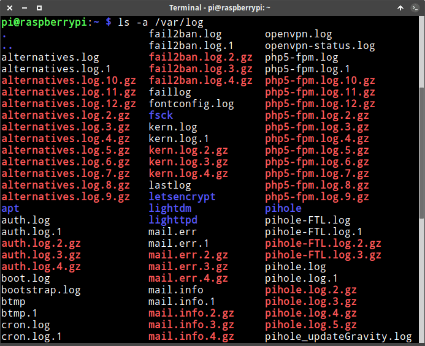
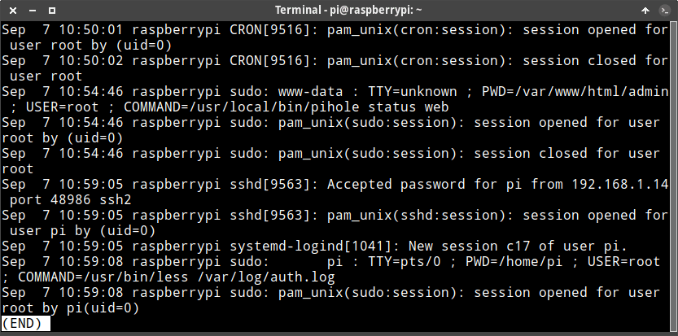
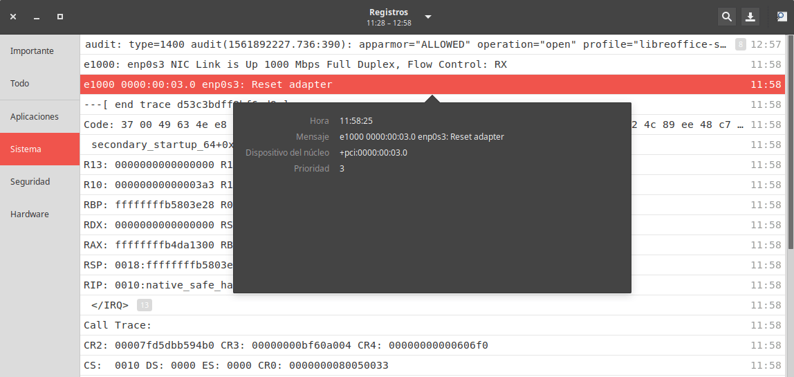
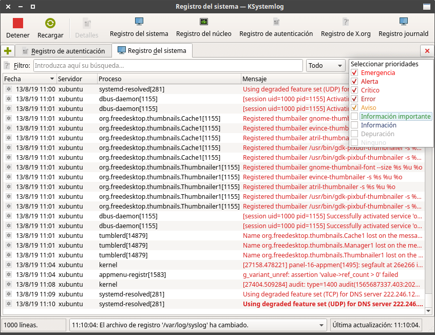

En el siguiente artículo veremos nociones generales sobre los logs en Linux. En las explicaciones del artículo únicamente considero el sistema de logs proporcionado por rsyslog. Journald/Systemd será abordado en futuros artículos.<!--more-->

## ¿QUÉ SON LOS LOGS DE UN SISTEMA OPERATIVO GNU LINUX?

Los logs o registros del sistema son ficheros de texto que registran cronológicamente la totalidad de actividades e incidencias importantes que ocurren en el sistema operativo o red.

Tienen que ser conscientes que Linux registra absolutamente todo lo que pasa en el sistema operativo mediante los logs. Este es uno de los motivos por los que Linux es un sistema operativo excelente.

## ¿QUÉ REGISTRAN LOS LOGS DE UN SISTEMA OPERATIVO GNU LINUX?

Algunos **ejemplos de la información que contienen los logs** en Linux son los siguientes:

1. Los paquetes que se instalan y desinstalan en el sistema operativo.
2. Información sobre los accesos remotos a nuestro equipo.
3. Los intentos fallidos de autenticación de los usuarios al equipo.
4. Registro de errores que se dan en los programas o servicios que usamos.
5. Los accesos o salidas bloqueadas por nuestro firewall.
6. Etc.

Como acaban de ver, **los logs en Linux son una fuente básica para saber que está pasando en nuestro equipo**. Por lo tanto, todo administrador de sistemas debería saber como consultar los logs para de este modo:

1. Detectar la causas de los problemas que puede tener un equipo o servidor.
2. Registrar y detectar ataques informáticos por parte de un hacker.
3. Detectar comportamientos anómalos de programas o servicios que tenemos instalados en nuestro equipo.
4. Ver el rendimiento de un ordenador o servidor.
5. Averiguar que ocurrió en una determinada actualización de un equipo.
6. Etc.

###### Nota: En apartados posteriores verán otros ejemplos de usos e información que contienen los logs en Linux.

## ¿CÓMO SE CLASIFICAN LOS LOGS DE LINUX Y DÓNDE SE ENCUENTRAN?

Simplificando al máximo los logs en Linux se pueden clasificar del siguiente modo:

1. **Logs de sistema:** Generalmente generados por el demonio Rsyslogd. Registran información relacionada con el funcionamiento del sistema operativo. Algunos ejemplos de logs de sistema son los que registran información sobre los servicios, los que registran los accesos al equipo, los mensajes del sistema, etc.
2. **Logs de programas:** Son aquellos que registran cronológicamente los eventos más importantes mientras estamos usando una aplicación o programa. En este caso, los logs pueden ser generados por la propia aplicación o por Rsyslogd.

Prácticamente la totalidad de logs se almacenan en las siguientes ubicaciones:

1. En el directorio /var/log.
2. En los subdirectorios de /var/log.

[](images/ubicacion-logs-en-linux.png)

No obstante, es posible encontrar programas que guarden los logs en otras ubicaciones del sistema operativo.

### ¿Qué contienen los logs de sistema y como podemos consultarlos?

A continuación les dejaré una tabla en la que mostraremos la siguiente información:

1. Los logs de sistema más importantes.
2. La información que almacenan cada uno de los logs de sistema y para que puede sernos útil.
3. Los comandos que tenemos que usar para consultar cada uno de los logs.

  
|   **Ubicación del log**   |   **Datos registrados en el log y funcionalidad**   |   **Comando para consultar el log**   |
| --- | --- | --- |
|   **/var/log/auth.log**   |   Proporciona un registro de todas las actividades que implican un proceso de autenticación. Por ejemplo registra los usuarios logueados al sistema operativo. Registra el día, hora, usuario y ordenes que se han ejecutado con el comando sudo, los cronjobs que se han ejecutado, los intentos fallidos de autenticación, etc.   |   sudo less /var/log/auth.log   |
|   **/var/log/debug**   |   Para registrar datos de los programas que están actuando en modo depuración. De esta forma los programadores pueden obtener información si sus programas están funcionando adecuadamente.   |   sudo less /var/log/debug   |
|   **/var/log/syslog**   |   Contiene la totalidad de logs capturados por rsyslogd. Por lo tanto en este fichero encontraremos multitud logs y será difícil de consultar y filtrar. Por este motivo, los logs se distribuyen en otros ficheros siguiendo la configuración del fichero /etc/rsyslog.conf.   |   sudo less /var/log/syslog   |
|   **/var/log/****kern.log:**   |   Proporciona información detallada de mensajes del kernel. Por ejemplo si habéis compilado un kernel y tenéis problemas podréis ver los mensajes de error y advertencias en kern.log. También puede ser útil para intentar detectar y solucionar problemas con la detección de hardware.   |   sudo less /var/log/kern.log   |
|   **/var/log/dmesg**   |   Dentro del fichero encontraremos información relacionada con el hardware de nuestro equipo. Por lo tanto podremos obtener información para concluir si nuestro hardware funciona de forma adecuada.   |   dmesg \| less   |
|   **/var/log/messages**   |   Contiene mensajes informativos y no críticos de la actividad del sistema operativo. Acostumbra a contener los errores que se registran en el arranque del sistema que no estén relacionados con el Kernel. Por lo tanto, si no se inicia un servicio, como por ejemplo el servidor de sonido, podemos buscar información dentro de este archivo.   |   sudo less /var/log/messages   |
|   **/****var/log/f****aillog**   |   Registra los intentos fallidos de autenticación de cada usuario. Dentro del archivo se almacena una lista de usuarios, los fallos totales de cada usuario, el número de fallo máximos que permitimos y la fecha y hora del último fallo. Si un usuario supera el número de fallos máximos establecidos se deshabilitará el usuario por el tiempo que nosotros fijemos.   |   faillog   |
|   **/****var/log/****btmp**   |   Almacena los intentos fallidos de logins en un equipo. Si alguien realizará un ataque de fuerza bruta a un servidor ssh, el fichero registraría la IP del atacante, el día y hora en que ha fallado el login, el nombre de usuario con que se ha intentado loguear, etc.   |   sudo utmpdump /var/log/btmp  o  sudo last -f /var/log/btmp \| more   |
|   **/****var/log/lastlog**   |   Ayuda a ver la fecha y la hora en que cada usuario se ha conectado por última vez.   |   lastlog \| less   |
|   **/var/log/wtmp**   |   En todo momento contiene los usuarios que están logueados al sistema operativo.   |   who   |
|   **/var/log/boot.log**   |   Información relacionada con el arranque del sistema. Podemos consultarlo para analizar si se levantan los servicios del sistema, si se levanta la red, si se montan las unidades de almacenamiento, para averiguar un problema que hace que nuestro equipo no inicie, etc.   |   sudo /var/log/boot.log   |
|   **/var/log/cron**   |   Registra la totalidad de información de las tareas realizadas por cron. Si tienen problemas con la ejecución de tareas tienen que consultar este log para ver si el trabajo se ha ejecutado o da errores. Debian no dispone de este log, pero encontrarán la misma información en /var/​log/syslog. En Debian pueden configurar el fichero de configuración /etc/rsyslog.conf para generar un log especifico para cron.   |   sudo less /var/log/cron.log   |
|   **/var/log/daemon.log**   |   Registra la actividad de los demonios o programas que corren en segundo plano. Para ver si un demonio se levanto o está dando errores podemos consultar este log. Dentro de daemon.log encontraremos información sobre el demonio que inicia el gestor de inicio, el demonio que inicia la base de datos de MySQL, etc.   |   sudo less /var/log/daemon.log   |
|   **/var/log/dpkg.log**   |   Contiene información sobre la totalidad de paquetes instalados y desinstalados mediante el comando dpkg.   |   sudo less /var/log/dpkg.log   |
|   **/var/log/apt/history.log**   |   Detalle de los paquetes instalados, desinstalados o actualizados mediante el gestor de paquetes apt-get.   |   sudo less /var/log/apt/history.log   |
|   **/var/log/apt/term.log**   |   Contiene la totalidad de información mostrada en la terminal en el momento de instalar, actualizar o desinstalar un paquete con apt-get.   |   sudo less /var/log/apt/term.log   |
|   **/var/log/mail.log**   |   Información relacionada con el servidor de email que tengamos instalado en el equipo. En mi caso uso sendmail y registra la totalidad de sus acciones en mail.log.   |   sudo less /var/log/mail.log   |
|   **/var/log/alternatives.log**   |   Registra todas las operaciones relacionadas con el sistema de alternativas. Por lo tanto, todas las acciones que realicemos usando el comando update-alternatives se registrarán en este log. El sistema de alternativas permite definir nuestro editor de texto predeterminado, el entorno de escritorio predeterminado, la versión de java que queremos usar por defecto, etc.   |   sudo less /var/log/alternatives.log   |
|   **/****var/log/****Xorg.0.log**   |   Registra la totalidad de eventos relacionados con nuestra tarjeta gráfica desde que arrancamos el ordenador hasta que lo apagamos. Por lo tanto puede ayudar a detectar problemas con nuestra tarjeta gráfica.   |   sudo less /var/log/Xorg.0.log   |
|   **/var/run/utmp**   |   Ver los usuarios que actualmente están logueados en un equipo.   |   who   |

###### Nota: Existen más logs en Linux, no obstante en el artículo solo he comentado los que considero más importantes.

### ¿Qué contienen los logs de aplicaciones y como podemos consultarlos?

Del mismo modo que en el apartado anterior, a continuación veremos:

1. Los logs de las aplicaciones o programas más importantes.
2. La información que almacenan cada uno de los logs y para que puede sernos útil.
3. Los comandos que tenemos que usar para consultar cada uno de los logs.

  
|   **Ubicación de log**   |   **Datos registrados en el log y funcionalidad**   |   **Comando para consultar el log**   |
| --- | --- | --- |
|   **/var/log/rkhunter.log**   |   Registra la totalidad de resultados obtenidos por rkhunter. rkhunter es una utilidad que analiza el sistema en busca de puertas traseras, rootkits, etc. Dentro del log de este programa encontraremos información sobre lo que ha detectado rkhunter en su análisis.   |   sudo less /var/log/rkhunter.log   |
|   **/var/log/samba/\*.\***   |   Dentro de la ubicación /var/log/samba encontrarán distintos logs que registrarán los eventos que han ocurrido en nuestro servidor samba. Algunos de los registros que encontrarán son sobre creaciones de directorios, renombrado de archivos, ficheros creados y borrados, registros de conexiones y desconexiones al servidor, etc.   | sudo less /var/log/samba/samba.log  (Los logs de Samba requieren ser configurados. La ubicación de los logs depende del sistema operativo que usemos)   |
|   **/var/log/cups/\*.\***   |   error\_log, page\_log y access\_log contienen información acerca las horas en que una IP se ha conectado al servidor, el usuario que se ha conectado al servidor, los errores y advertencias del servidor, la fecha en que se ha imprimido un determinado documento, el número de copias, etc. Para más información sobre el contenido de los logs de cups pueden consultar el siguiente [enlace](https://manpages.ubuntu.com/manpages/cosmic/man5/cupsd-logs.5.html "Información adicional que proporcionan los logs de Cups").   |   sudo less /var/log/cups/error\_log  sudo less /var/log/cups/access\_log  sudo less /var/log/cups/page\_log   |
|   **/var/log/lighttpd/\*.\***   |   access.log y error.log contienen información sobre las visitas y errores que se generan cuando un usuario visita una página web montada sobre un servidor lighttpd.   |   sudo less /var/log/lighttpd/access.log  sudo less /var/log/lighttpd/error.log   |
|   **/var/log/apache2/access.log**  **o**  **/var/log/httpd/access\_log**   |   Contiene información de los usuarios que han accedido al servidor web Apache. En este fichero encontraremos datos como las páginas que ha visitado una determinada IP, la hora en que una IP nos ha visitado, etc.   |   sudo less /var/log/apache2/access.log  o  sudo less /var/log/httpd/access\_log   |
|   **/var/log/apache2/error.log**  **o**  **/var/log/httpd/error\_log**   |   Es el encargado de registrar la totalidad de errores cuando se procesan las solicitudes de los visitantes al servidor web Apache.   |   sudo less /var/log/apache2/error.log  o  sudo less /var/log/httpd/error\_log   |
|   **/var/log/prelink/**   |   Contiene información sobre las modificaciones que la utilidad [prelink]() realiza a los binarios y librerías compartidas.   |   sudo less /var/log/prelink/   |
|   **/var/log/mysql/mysql.log**   |   Registro de la totalidad de sentencias que los clientes envían al servidor   |   sudo less /var/log/mysql/mysql.log   |
|   **/var/log/mysql/error.log**   |   Registra los errores o problemas detectados al iniciar, ejecutar o parar el servicio. Por lo tanto en el caso que MySQL o MariaDB no se inicien deberemos acceder a este fichero para obtener información del problema.   |   sudo less /var/log/mysql/error.log   |
|   **/var/log/mysql/mysql-slow.log**   |   Encontraremos información acerca de las sentencias que han tardado más segundos que los especificados en la variable del sistema long\_query\_time. De esta forma podremos conocer la sentencias SQL que se ejecutan de forma lenta.   |   sudo less /var/log/mysql/mysql-slow.log   |
|   **/var/log/fail2ban.log**   |   Registra el día y la hora en que una determinada IP ha sido bloqueada y desbloqueada al intentar acceder a un determinado servicio.   |   sudo less /var/log/fail2ban.log   |
|   **/var/log/openvpn.log**   |   La hora en la que una determinada IP se ha conectado al servidor OpenVPN. Si quieren registrar los intentos fallidos de autenticación también pueden usar fail2ban.   |   sudo less /var/log/openvpn.log   |
|   **/var/log/openvpn-status.log**   |   Contiene información de los usuarios conectados al servidor OpenVPN. Ejemplos de la información que contiene es la IP de cada uno de los usuarios, La cuenta de usuario con que se ha conectado una determinada IP, la hora en que cada usuario ha iniciado la conexión, etc.   |   sudo less /var/log/openvpn-status.log   |
|   **/var/log/letsencrypt/letsencrypt.log**   |   Contiene todo tipo de información acerca de los certificados de let’s Encrypt. Por ejemplo si se han producido errores en la renovación de los certificados será útil consultar este log.   |   sudo less /var/log/letsencrypt/letsencrypt.log   |

###### Nota: Existen más logs, no obstante en el artículo solo he comentado los que considero más importantes.

## COMO CONSULTAR LA INFORMACIÓN CONTENIDA EN LOS LOGS

En apartados anteriores existen tablas en que se detallan los comandos a usar para consultar cada uno de los logs de nuestro sistema operativo. Si las consultan verán que podremos consultar la gran mayoría de logs mediante las siguientes utilidades:

1. **less:** Utilidad que permite leer ficheros de texto en Linux.
2. **zless:** Comando que permite visualizar ficheros comprimidos por el sistema de rotación de logs.
3. **tail:** Utilidad que sirve para mostrar las 10 últimas líneas de un log o fichero de texto.
4. **head:** Programa para visualizar las 10 primeras líneas de un log o fichero de texto.
5. Etc.

A modo de ejemplo, si queremos consultar el log /var/log/auth.log tan solo tenemos ejecutar un comando del siguiente tipo:

1. En la primera parte del comando tenemos que teclear la utilidad que queremos usar para ver el log. En mi caso acostumbro a usar less.
2. En la segunda parte tan solo tenemos que indicar la ruta completa del log a visualizar.

Por lo tanto, para visualizar el contenido del log /var/log/auth.log ejecutaremos el siguiente comando:

> ```
> sudo less /var/log/auth.log
> ```

[](images/visualizar-contenido-log-less.png)

###### Nota: En futuros artículos mostraremos como podemos consultar los logs de nuestro sistema mediante journalctl.

En el caso que quieran consultar los logs mediante una interfaz gráfica les recomiendo que lean el siguiente apartado.

### Consultar los logs del sistema a través de un entorno gráfico

Existen diversos programas para consultar los logs a través de una interfaz gráfica. Algunos de ellos son:

1. **gnome-logs:** Programa del entorno gnome usado para visualizar los logs registrados por journald.
2. **KSystemLog:** Utilidad elaborada por el equipo de KDE que nos permitirá consultar los logs del sistema operativo registrados por journald.
3. **gnome-system-log:** Aplicación que al igual que las anteriores nos permitirá consultar los registros del sistema.
4. Etc.

A los usuarios que utilicen entornos de escritorio basados en Gnome les recomiendo Gnome logs por los siguientes motivos:

1. Mantiene un desarrollo activo por parte del equipo de Gnome. Por lo tanto tendremos garantías que el programa funcionará de forma adecuada.
2. Los logs son clasificados por días y por categorías como por ejemplo Hardware, Sistema, Aplicaciones, Seguridad e Importante. De esta forma es más fácil consultar los logs del sistema.
3. Tiene implementado un sistema de búsqueda por palabras.
4. Si clicamos encima del evento obtendremos información detallada sobre el mismo.
5. La interfaz gráfica está traducida a varios idiomas.

Para instalar gnome-logs tan solo tienen que ejecutar el siguiente comando en la terminal:

> ```
> sudo apt install gnome-logs
> ```

[](images/consultar-logs-linux-gnome-logs.png)

En el caso que sean usuarios del entorno plasma la mejor opción será KsystemLog. Para instalar KsystemLog tendrán que ejecutar el siguiente comando en la terminal:

> ```
> sudo apt install ksystemlog
> ```

[](images/consultar-logs-ksystemlog.png)

KsystemLog es mucho más completo que Gnome-logs. No obstante si lo instalamos en entornos de escritorio gnome tendremos que instalar una gran cantidad de dependencias adicionales.

Las características adicionales respecto Gnome logs que ofrecerá KsystemLog son las siguientes:

1. Filtrar los logs por prioridad, por fecha, por servidor, proceso, mensaje, etc.
2. Posibilidad de añadir varias pestañas para visualizar los logs de forma mucho más cómoda.
3. Líneas del registro de logs coloreadas.
4. Capacidad para copiar líneas del registro de logs al portapapeles.
5. Etc.

## COMO SE REGISTRAN LOS LOGS EN LINUX

La totalidad de logs de nuestro equipo los registran y gestionan los demonios rsyslogd y/o journald.

###### Nota: Existen otros demonios para gestionar los logs en Linux. No obstante rsyslogd es el más habitual. Otros demonio que se pueden usar son syslog-ng o syslog.

Como en este artículo solo consideramos rsyslogd, a continuación detallaremos el funcionamiento de rsyslogd:

1. Recolecta la totalidad de mensajes que provienen de servicios, aplicaciones y kernel del sistema operativo.
2. Redirige cada uno de estos mensajes al archivo de registro o log correspondiente. Los archivos de registro acostumbran a estar almacenados en la ubicación /var/log.

###### Nota: Rsyslog también es capaz de redirigir los mensajes hacia un servidor Linux externo u a otro equipo que esté en la misma red. Los protocolos usados para enviar los logs a equipos remotos pueden ser el TCP, UDP y [RELP](https://en.wikipedia.org/wiki/Reliable_Event_Logging_Protocol "Explicación del protocolo RELP"). De este modo rsyslog actúa como un servidor o cliente de logs.

Para realizar las tareas que acabo de citar rsyslogd opera del siguiente modo:

1. La aplicaciones, los servicios y el Kernel escribirán sus mensajes en diversos socket y buffer de memoria. Algunos de los socket y buffer de memoria son /dev/log, /dev/kmsg, /proc/kmsg, etc.
2. Acto seguido el demonio rsyslogd leerá/obtendrá el contenido de los distintos socket y buffer de memoria.
3. Rsyslogd procesará los mensajes de los socket y buffer de memoria en función de la configuración/reglas de los ficheros /etc/rsyslog.conf o /etc/rsyslog.d/50-default.conf en Ubuntu. Los ficheros de configuración que acabo de citar especifican el fichero o log en que se deben almacenar cada uno de los mensajes adquiridos por rsyslogd.

###### Nota: Un socket es un fichero especial que se usa para transferir información entre distintos procesos. En otras palabras, los procesos pueden leer y escribir datos en un socket/fichero con el fin de comunicarse entre ellos.

Para ver los sockets de nuestro sistema operativo podemos usar el comando:

> ```
> systemctl list-sockets --all
> ```

Para comprobar que el demonio rsyslogd está activo podemos ejecutar el siguiente comando en la terminal:

> ```
> sudo service rsyslog status
> ```

### Fichero de configuración de rsyslogd

Como acabamos de ver, rsyslogd lee los mensajes de varios socket y buffer de memoria. Acto seguido rsyslogd ubica cada uno de los mensajes en los ficheros/logs pertinentes. Las reglas que rsyslogd utiliza para procesar los mensajes provenientes del socket se definen en los ficheros /etc/rsyslog.d/50-default.conf y/o /etc/rsyslog.conf. A través de estos ficheros podremos configurar los siguientes aspectos:

1. Definir el propietario y el grupo al que pertenecen los logs.
2. Establecer los permisos de los logs y de los directorios que contienen los logs.
3. Definir si queremos disponer un log individual para registrar la actividad de un determinado servicio o utilidad. Por ejemplo, para registrar todos los mensajes del servicio cron en la ubicación /var/log/cron.log descomentaremos la línea cron.\* /var/log/cron.log del fichero de configuración /etc/rsyslog.conf o /etc/rsyslog.d/50-default.conf en Ubuntu.
4. Definir el nivel prioridad de las actividades que queremos registrar. A modo de ejemplo, con el código “kern.crit /var/log/kernlog” el fichero kernlog únicamente registrará las actividades del kernel que se consideren críticas. Los niveles de prioridad existentes son emerg, alert, crit, err, warning, notice, info y debug. Si usamos el símbolo \* el log contendrá la totalidad de logs independientemente de su nivel de prioridad.

Para consultar y editar el fichero de configuración deben ejecutar los siguientes comandos:

> ```
> sudo nano /etc/rsyslog.conf
> ```
> 
> ```
> sudo nano /etc/rsyslog.d/50-default.conf
> ```

###### Nota: Tengan cuidado a la hora de editar los ficheros de configuración. Antes de modificar la configuración estándar hagan una copia de seguridad.

## MECANISMO DE ROTACIÓN DE LOGS EN LINUX

Si observáis los logs veréis que muchos tienen un nombre parecido. A modo de ejemplo os encontraréis con la siguiente situación:

> ```
> auth.log
> auth.log.1
> auth.log.2.gz
> auth.log.3.gz
> auth.log.4.gz
> ```

La totalidad de archivos que he nombrado contienen información del mismo tipo. En este caso existen 4 archivos que han sido creados por el mecanismo de rotación de logs.

**La función del mecanismo de rotación de logs es evitar que los logs consuman todo el espacio de almacenamiento y sean fáciles de consultar**. Si analizamos el comportamiento del log auth.log veremos que semanalmente realiza las siguientes operaciones:

1. El contenido que estaba en el fichero auth.log.4gz se borrará y perderá de forma definitiva.
2. El contenido que estaba en el fichero auth.log.3 se trasladará al fichero comprimido auth.log.4.gz.
3. El contenido que estaba en el fichero auth.log.2 se traspasará ql fichero comprimido auth.log.3.gz.
4. El contenido que estaba en el fichero auth.log.1 se comprimirá y trasladará al fichero auth.log.2.gz.
5. Finalmente, la información almacenada en auth.log se trasladará al fichero auth.log.1 y el fichero auth.log quedará vacío y listo para seguir registrando información.

Trabajando de esta forma únicamente estaremos almacenando los logs de las últimas 4-5 semanas. Por lo tanto, para consultar las autenticaciones al sistema operativo de 3 semanas atrás deberemos consultar el log auth.log.3.gz

La rotación de los logs es una tarea programada que se realiza de forma periódica. Los logs se rotan en función de un criterio que nosotros mismos podemos configurar. El criterio de rotación de logs se establece en los ficheros de configuración ubicados en /etc/logrotate.d

A modo de ejemplo si quieren ver la configuración establecida para rotar el log auth.log ejecuten el siguiente comando:

> ```
> less /etc/logrotate.d/rsyslog
> ```

La configuración establecida en mi caso es la siguiente:

> ```
> /var/log/auth.log
> {
>   rotate 4
>   weekly
>   missingok
>   notifempty
>   compress
>   delaycompress
>   sharedscripts
>   postrotate
>     invoke-rc.d rsyslog rotate > /dev/null
>   endscript
> }
> ```

El código mencionado establece el criterio para rotar el log /var/log/auth.log. El método de rotación es el que se estable en el inicio de este último apartado.

En siguientes artículos continuaremos tratando más temas sobre los logs en Linux.
