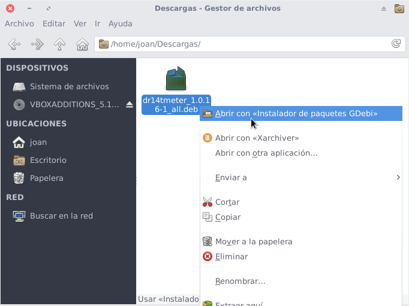
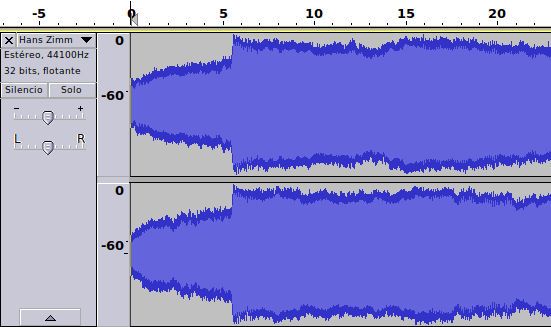
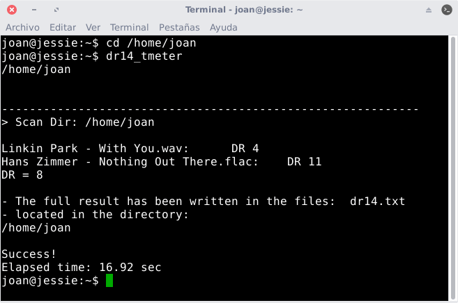
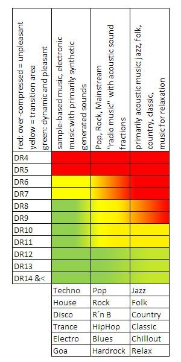
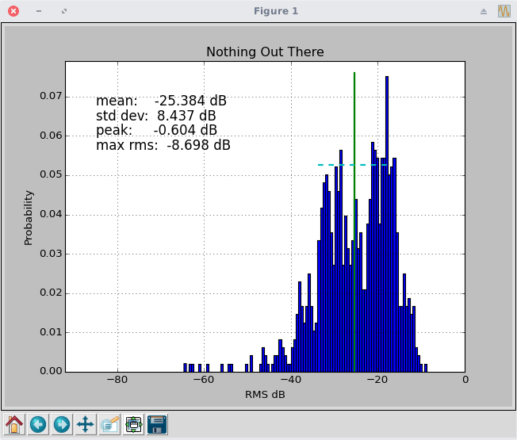
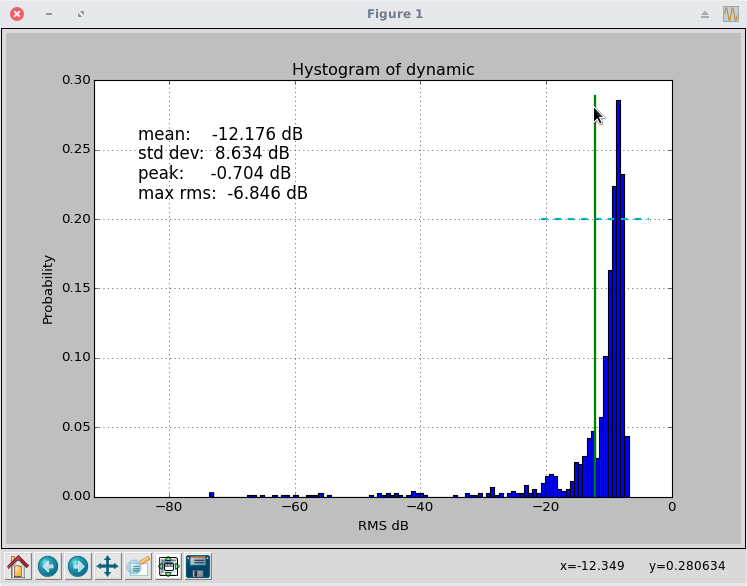

Hace una semana vimos [que es el rango dinámico de un audio]() y las ventajas e inconvenientes que nos proporcionan los audios con un rango dinámico elevado. A raíz de este artículo veremos como medir el rango dinámico de cualquier archivo de sonido y a posteriori analizaremos si los valores obtenidos para ver si son aceptables.<!--more-->

## COMO MEDIR EL RANGO DINÁMICO DE UN AUDIO

Podemos medir el rango dinámico de cualquier archivo de audio mediante un simple software.

Existen muchos software para medir el rango dinámico, pero en mi caso usaré DR14 T.meter por los siguientes motivos:

1. Se trata de software libre escrito en phyton bajo la licencia GPL3.
2. Porqué el algoritmo de cálculo que usa es el mismo que Dynamic Range Meter.
3. Está disponible para la totalidad de distribuciones GNU-Linux.
4. Da los mismos valores que el plugin de Foobar Dynamic Range Meter elaborado por la Pleasurize Music Foundation.
5. Aparte de medir el rango dinámico tiene otras funcionalidades como por ejemplo sacar histogramas de rangos dinámicos, comprimir un audio, representar la onda de un archivo de audio, etc.

## INSTALAR DR14 T.METER EN LINUX

Para instalar el software que usaremos para medir el rango dinámico accedemos a la siguiente página web:

[http://dr14tmeter.sourceforge.net/index.php/Main\_Page](http://dr14tmeter.sourceforge.net/index.php/Main_Page "Link para descargar el programa DR14 T.meter")

Dentro de la página web descargamos el paquete binario para la instalación del programa. En mi caso como uso Debian descargo el paquete .deb de Debian.

Una vez descargado el archivo binario lo instalamos de forma habitual. En mi caso, tal y como pueden ver en la captura, de pantalla lo instalo mediante gdebi.

[](images/Instalar-DR14-T.Meter_.png)

###### Nota: Es posible que el programa DR14 T.meter se encuentre directamente en los repositorios de vuestra distro. Por ejemplo en Archlinux lo podréis encontrar en AUR.

Una vez instalado el paquete ya podremos medir el rango dinámico de cualquier archivo de audio.

### Paquetes a instalar para obtener funcionalidades adicionales

###### Nota: Este apartado no es necesario para medir el rango dinámicos

Si aparte de medir el rango dinámico queréis hacer histogramas de rango dinámico, ver el espectrograma de una canción o imprimir su onda tenemos que instalar MatPlotLib.

Para ello en Debian y en distribuciones derivadas de Debian ejecutamos el siguiente comando en la terminal:

> ```
> sudo apt-get install python-matplotlib
> ```

En el caso de ser usuario de Fedora ejecutaremos el siguiente comando:

> ```
> sudo dnf install python-matplotlib
> ```

Si además queremos usar este software como compresor de audio aún tendremos que instalar más paquetería.

En Debian y en distribuciones derivadas de Debian la instalaremos ejecutando el siguiente comando en la terminal:

> ```
> sudo apt-get install python-numpy python-scipy python-matplotlib ipython ipython-notebook python-pandas python-sympy python-nose
> ```

En Fedora y en distribuciones derivadas de Fedora ejecutaremos el siguiente comando:

> ```
> sudo dnf install numpy scipy python-matplotlib ipython python-pandas sympy python-nose atlas-devel
> ```

## ¿CÓMO FUNCIONA EL PROGRAMA DR14 T.METER

El programa DR14 T.METER nos dará un valor de rango dinámico en dB.

Este valor lo obtiene analizando la media de la diferencia acumulada entre los picos y los valores de promedio de volumen RMS durante un periodo específico de tiempo que será lo que dura la canción. Durante el proceso solo se consideran el 20% de los volúmenes más altos para evitar que canciones que únicamente tengan un buen rango dinámico en alguna parte de la canción den buenos resultados.

Para que se hagan una idea de la explicación les muestro el siguiente gráfico:

[](images/Muestra-onda-Sonido-dB.png)

La onda de color azul claro corresponde a los valores promedio de volumen RMS, mientras que la onda de color azul oscuro corresponde a los valores de pico.

## MEDIR EL RANGO DINÁMICO DE UNA O VARIAS CANCIONES

Para medir el rango dinámico tenemos que seguir las siguientes instrucciones.

El primer paso consiste en abrir una terminal.

Seguidamente nos dirigimos a la carpeta que contiene los archivos de audio que queremos analizar. Para ello en mi caso ejecuto el siguiente comando:

> ```
> cd /home/joan
> ```

Una vez dentro de la ubicación ejecutamos el siguiente comando:

> ```
> dr14_tmeter
> ```

Después de ejecutar el comando se calculará el rango dinámico de todos los audios de la ubicación en que hemos ejecutado dr14\_tmeter.

[](images/Resultados-del-rango-dinámico.png)

Además se creará un archivo de texto con nombre dr14.txt que contendrá los resultados obtenidos en la medición.

Si quieren también pueden analizar varias carpetas de forma recursiva o únicamente un audio en concreto. Para saber como hacerlo pueden consultar la ayuda del programa ejecutando el siguiente comando en la terminal:

> ```
> dr14_tmeter --help
> ```

### Interpretar los resultados obtenidos

Como vimos en pasados artículos, el valor de rango dinámico de una canción depende de muchos factores, y uno de ellos es el tipo de música.

Con lo que acabo de decir debe quedar claro lo siguiente:

1. Si un archivo de música disco obtiene una calificación de DR8 se puede considerar que tiene un rango dinámico bueno.
2. Si una una pieza de música clásica obtiene un valor de DR8 entonces el rango dinámico es malo.

Una vez clarificado este punto podemos analizar los resultados obtenidos con la ayuda de esta tabla:

\[caption id="attachment\_7944" align="alignnone" width="300"\][](images/Tabla-para-valorar-el-rango-dinamico.jpg) Fuente: http://www.pleasurizemusic.com/\[/caption\]

En el ejemplo anterior obtuvimos los siguientes resultados:


|   **DR**   |   **Peak**   |   **RMS**   |   **Duration**   |   **Title**   |
| --- | --- | --- | --- | --- |
|   **DR11**   |   \-0,6 dB   |   \-18,78 dB   |   02:50:00   |   Hans Zimmer - Nothing out there.flac   |
|   **DR4**   |   \-0,7 dB   |   \-7,27 dB   |   03:23:00   |   Linkin Park – With you.wav   |

Por lo tanto las conclusiones de las mediciones son las siguientes:

**La canción de linkin Park “With you”** tiene un rango dinámico de 4 dB. Al tratarse de un estilo de música metal alternativo nos vamos a la fila DR4 de la columna 2 y vemos que le corresponde el color rojo. Por lo tanto la conclusión es que esta canción tiene un rango dinámico muy malo.

Si analizamos **la canción de Hans Zimmer “Nothing out there”** vemos que tiene un rango dinámico de 11 dB. Como en este caso es una canción de música clásica nos vamos a la fila DR11 de la columna 3 y vemos que el color es amarillo tirando a verde. Por lo tanto, aunque el rango dinámico no es plenamente satisfactorio, lo podemos considerar aceptable.

No os sorprendáis cuando descubráis que la mayoría de archivos que analicéis obtienen calificaciones pésimas. El responsable de estás calificaciones es la industria musical que se dedica a subir el volumen de las canciones mediante compresores de audio.

## OTRAS OPERACIONES QUE PERMITE REALIZAR DR14 T.Meter

DR14 T.Meter tiene otras funcionalidades aparte de medir el rango dinámico de una canción.

Una de las que creo interesantes comentar es la de realizar histogramas de rango dinámico.

### Realizar un histograma de rango dinámico

Para realizar un histograma de rango dinámico tecleamos el comando dr14t\_meter --hist seguido la ruta del archivo de audio que queremos analizar.

Por lo tanto para realizar el histograma de la canción de Hans Zimmer ejecuto el siguiente comando en la terminal:

> ```
> dr14_tmeter --hist '/home/joan/Hans Zimmer - Nothing Out There.flac'
> ```

El resultado obtenido es el siguiente:

[](images/Histograma-de-rango-Dinamico-Bueno.png)

Vemos que la media de valores RMS no es muy elevada (-25,384 dB) y lejos de los 0 dB que es donde acostumbran a estar los picos. Además si imaginamos la representación gráfica como una pirámide vemos que tiene una base ancha. Todas observaciones hacen pensar que la canción que hemos analizado tiene un rango dinámico aceptable.

En el caso que hubiéramos obtenido un histograma de un audio con bajo rango dinámico veríamos algo parecido a lo siguiente:

[](images/Histograma-de-Rango-Dinamico-malo.png)

Este histograma contiene las características opuestas al caso anterior. Además en este caso también vemos que la probabilidad de encontrar sonidos de volumen alto es mucho más elevada que en el caso anterior.

## BASES DE DATOS DE RANGO DINÁMICOS DE CANCIONES

Si lo desean pueden consultar bases de datos de artistas, álbumes y canciones por Internet. Una de las bases de datos interesantes es la siguiente:

[http://dr.loudness-war.info/](http://dr.loudness-war.info/ "Base de datos de rangos dinámicos de canciones")

Si lo desean pueden contribuir en alimentar la base de datos de este sitio con los datos que vosotros obtengáis. Para hacerlo tendremos que rellenar una serie de datos referentes al álbum que queremos subir, y finalmente deberemos proporcionar el archivo dr14.txt de la medición que hemos realizado.

## NOTAS DEL ARTÍCULO

En este artículo se detalla el proceso para medir el rango dinámico en el sistema operativo Linux. En un futuro si la gente lo pide puedo realizar un post semejante para los usuarios de Windows.
