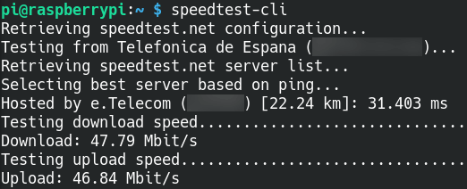
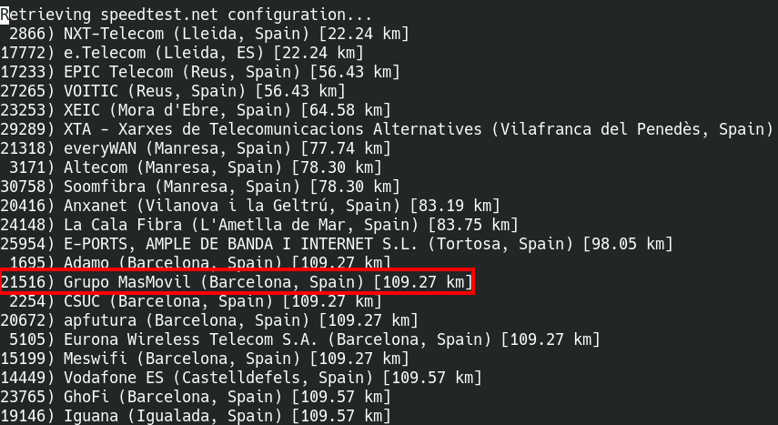
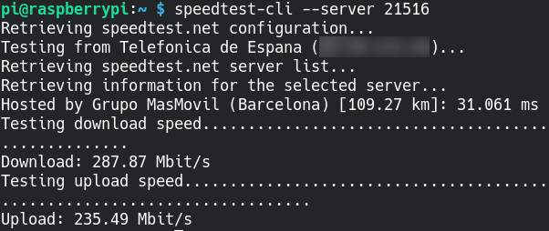
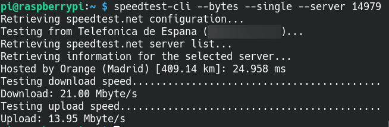

En mi caso acabo de adquirir una Raspberry Pi 4. Al adquirir y terminar de configurar un dispositivo es interesante ver que su velocidad de subida y bajada es adecuada. Y más en mi caso que estoy usando un cable Ethernet que no tengo ni idea de que clase es. <!--more-->Por esto motivo voy a medir la velocidad de Internet desde la terminal usando el programa [speedtest](https://github.com/sivel/speedtest-cli).

## INSTALAR EL GESTOR DE PAQUETES PIP

Inicialmente instalaremos el gestor de paquete pip. Como mi Raspberry Pi dispone de Python 3 ejecutaré el siguiente comando en la terminal:

> ```
> sudo apt install python3-pip
> ```

En el caso que solo dispusiéramos de Python 2 deberíamos ejecutar el siguiente comando:

> ```
> sudo apt-get install python-pip
> ```

## INSTALAR SPEEDTEST-CLI PARA MEDIR LA VELOCIDAD DE INTERNET DESDE LA TERMINAL

Una vez el gestor de paquetes pip sea funcional, si estamos usando Python 3 ejecutaremos el siguiente comando para instalar speedtest:

> ```
> sudo pip3 install speedtest-cli
> ```

En el caso que usemos Python 2 ejecutaremos el siguiente comando:

> ```
> sudo pip install speedtest-cli
> ```

## MEDIR LA VELOCIDAD DE NUESTRA CONEXIÓN A INTERNET DESDE LA TERMINAL

Para realizar una medición de la velocidad de nuestra conexión a Internet tan solo tenemos que ejecutar el siguiente comando en la terminal:

> ```
> speedtest-cli
> ```

En mi caso los resultados obtenidos son los siguientes:

[](images/resultados-medicion-velocidad-internet-terminal.png)

Mi velocidad de bajada es 47,79 Mbit/s y la de subida es 46,87 Mbit/s. Considerando que tengo una conexión de 300 Mbit/s simétricos los resultados obtenidos son pobres. Pero como verán más adelante, el motivo de los pobres resultados es que el servidor usado para realizar las pruebas está saturado o no tiene suficiente ancho de banda.

### Seleccionar un buen servidor para realizar el test de velocidad para medir la velocidad de internet desde la terminal

Por defecto Speedtest usa el servidor más cercano a nuestra ubicación para realizar los test de velocidad. No obstante Speedtest tiene infinidad de servidores para realizar un test de velocidad. Para generar un listado completo de los servidores existentes ejecuten el siguiente comando en la terminal:

> ```
> speedtest-cli --list > servers.txt
> ```

Acto seguido ejecuten el siguiente comando para visualizar el listado de servidores disponibles:

> ```
> nano servers.txt
> ```

A continuación aparecerá un listado de servidores ordenados por proximidad geográfica. En mi caso usaré uno que en principio debería ir sobrado de recursos como por ejemplo el de Masmovil. Para usarlo tendremos que anotar el número de servidor que según la captura de pantalla inferior es 21516.

[](images/servidores-disponibles-para-medir-la-velocidad-internet.png)

Acto seguido ejecutamos el siguiente comando en la terminal:

> ```
> speedtest-cli --server 21516
> ```

En este caso los resultados obtenidos son muy diferentes a los anteriores. Tal y como se puede ver en la captura de pantalla estoy obteniendo resultados de 287.87 Mbit/s y 235.49 Mbit/s.

[](images/test-velocidad-con-servidor-alternativo-1.png)

Por lo tanto en estos momentos tengo la certeza que la velocidad de conexión a Internet de mi Raspberry Pi es correcta.

Si quisiéramos buscar el número de servidor de una forma más rápida y sencilla podríamos ejecutar un comando del siguiente tipo:

> ```
> speedtest-cli --list | grep palabra_clave
> ```

Donde palabra\_clave debe ser sustituido por palabras que ayuden a identificar servidores fiables y rápidos para hacer el test. Algunos palabras clave que pueden usar son nombres de grandes proveedores de Internet como Vodafone, Telefonica, Movistar, etc. Otras palabras que podemos usar son nombres de grandes ciudades cercanas a su localidad como por ejemplo Madrid, Barcelona, London, etc.

### Averiguar la velocidad de carga y descarga máxima en una transferencia de archivos

Los resultados de velocidad medidos por speedtest son usando múltiples conexiones. Si solo pretenderemos usar una conexión y de esta forma intentar simular la descarga/carga de un archivo podemos usar la opción \--single. Por lo tanto para ver la velocidad de bajada y subida máxima aproximada en bytes ejecutaremos el siguiente comando:

> ```
> speedtest-cli --bytes --single --server 14979
> ```

Los resultados obtenidos son los mostrados a continuación:

[](images/simular-velocidad-carga-y-descarga-archivo-.png)

### Obtener ayuda para usar speedtest

Si pretenden profundizar sobre la totalidad de opciones ofrecidas por speedtest ejecuten el siguiente comando en la terminal:

> ```
> speedtest-cli -h
> ```

Y recuerden que para obtener conclusiones fiables hay que probar varios servidores para realizar los test. El motivo es que el servidor usado puede tener una capacidad limitada y además hay multitud de factores que afectan a nuestra velocidad de internet.

## DESINSTALAR SPEEDTEST

Si en algún momento quieren desinstalar speedtest tan solo tendrán que ejecutar el siguiente comando en la terminal:

> ```
> sudo pip3 uninstall speedtest-cli
> ```

En el caso que estuvieran usando python 2 deberían deberían ejecutar el siguiente comando:

> ```
> sudo pip uninstall speedtest-cli
> ```

De esta forma tan sencilla podremos medir la velocidad de Internet en los casos que únicamente tengamos una terminal de texto.
