Por los mismos motivos que en el pasado artículo medí la [velocidad de mi conexión a Internet](), ahora vamos a medir la velocidad de nuestra red local. Para ello usaré el software iPerf.<!--more-->

## ¿QUÉ ES Y PARA QUE SIRVE IPERF?

Es un software gratuito disponible para Windows, Linux, MacOS, Android, iOS y FreeBSD que nos permite analizar el rendimiento y velocidad de nuestra red local (LAN). La información que nos proporcionará este software es:

1. La velocidad de transferencia.
2. La pérdida de paquetes.
3. Valores de Jitter.
4. Cantidad total de información transferida.

Tener una buena velocidad de conexión en nuestra red local (LAN) es útil en los siguientes casos:

1. Ver contenido multimedia en nuestro televisor procedente de un disco duro en red.
2. Para sincronizar archivos de forma rápida en un servidor WebDAV local o en una nube Nextcloud que funcione a nivel local.
3. Establecer llamadas y videollamadas fluidas entre personas que establecen una llamada o videoconferencia entre si dentro de una misma red local.
4. Para montar una LAN Party con nuestros amigos y poder jugar online de forma fluida y sin lag.
5. Etc.

No confundáis la velocidad de conexión a Internet con la velocidad de conexión en nuestra red local.

**Cuando realizamos un test de velocidad de Internet** estamos analizando la velocidad con la que un dispositivo puede subir y bajar información con un dispositivo que está fuera de la red local. Concretamente estamos analizando el segmento de color verde de la siguiente imagen.

[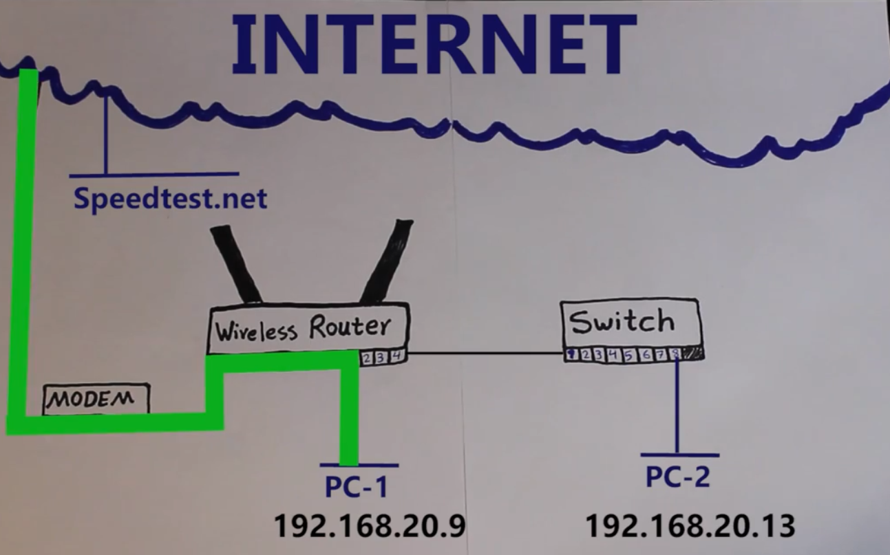](images/esquema-area-analizada-test-velocidad-internet.png)

**Cuando medimos la velocidad de nuestra red local** estamos analizando parámetros como por ejemplo la velocidad con que se pueden transferir información dos aparatos conectados a nuestra red local. Concretamente estamos analizando el segmento de color verde de la siguiente imagen.

[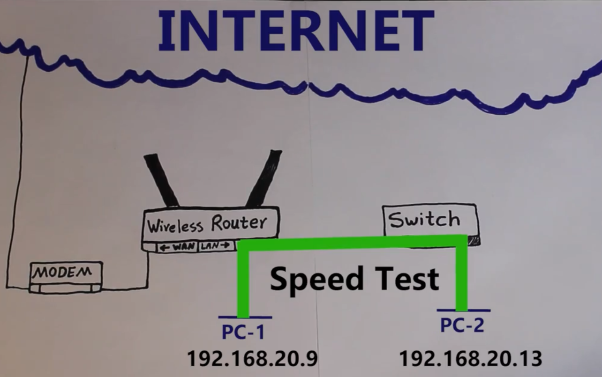](images/esquema-area-analizada-test-velocidad-red-local.png)

## MEDIR LA VELOCIDAD DE TRANSFERENCIA Y RENDIMIENTO DE NUESTRA RED LOCAL (LAN)

IPerf analiza los parámetros que citamos en el inicio del apartado anterior entre 2 equipos que están conectados a la misma red local.

En el caso práctico que veremos en el siguiente artículo analizaremos la velocidad de conexión y rendimiento entre mi Raspberry Pi y mi ordenador portátil. El esquema de la situación analizada es el que presento a continuación:

[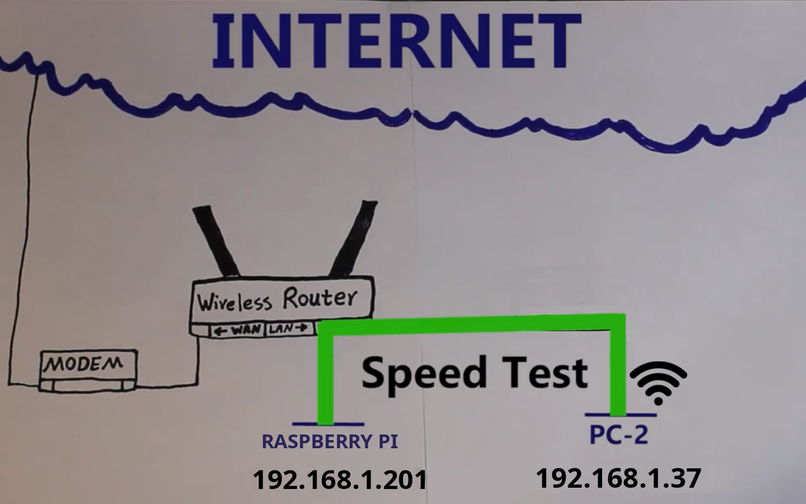](images/esquema-red-local-medir-rendimiento.png)

**Nota:** La Raspberry Pi está conectada directamente al Router mientras que mi ordenador portátil está conectado vía Wifi

Si quiero analizar la velocidad de conexión de red entre mi ordenador portátil y mi Raspberry Pi tendremos que instalar iPerf tanto en mi ordenador como en mi Raspberry Pi.

### Instalar iPerf en mi Raspberry Pi

Para instalar iPerf en mi Raspberry Pi o en cualquier sistema operativo Linux tan solo tengo que ejecutar el siguiente comando en la terminal:

> ```
> sudo apt install iperf
> ```

**Nota:** Estoy instalando la versión 2 de iPerf. Si quieren instalar la versión 3 deberán ejecutar sudo apt install iperf3. En mi caso uso iPerf 2 porque me gusta mas como presenta los resultados de forma predeterminada. Pero si usan IPv6 entonces deberán usar iPerf3. Si les interesan las diferencias entre las 2 versiones de iPerf pueden ver el [siguiente vídeo](https://www.youtube.com/watch?v=ssYkMWUQbFo "Diferencias existentes entre la versión 2 y 3 de iPerf").

Si lo prefieren también pueden instalar iPerf accediendo a la siguiente [página web](https://iperf.fr/iperf-download.php "URL para descargar iPerf") y descargando e instalando el paquete binario que corresponda a su distribución.

### Instalar iPerf en mi ordenador portátil con Windows

Para instalar iPerf en Windows accederemos a la siguiente [página web](https://iperf.fr/iperf-download.php "URL para descargar iPerf") y descargaremos el binario que corresponda con nuestra versión de Windows. En mi caso uso una versión de 64 bits y descargaré la versión 2 de iPerf. Tengan en mente que el servidor y el cliente deberán usar la misma versión de iPerf.

[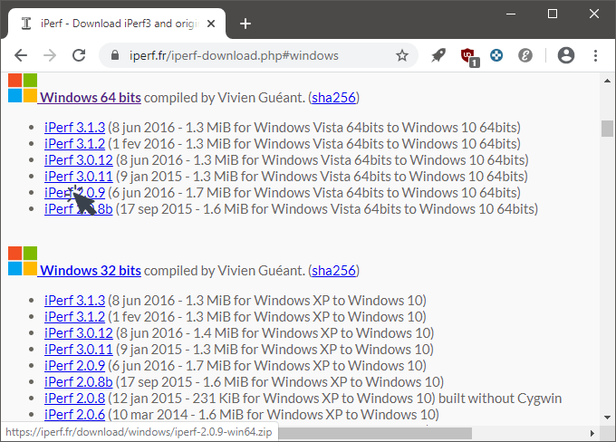](images/web-para-descargar-iperf.png)

Una vez finalizada la descarga pegamos el archivo .zip descargado en la ubicación C: y lo descomprimimos:

[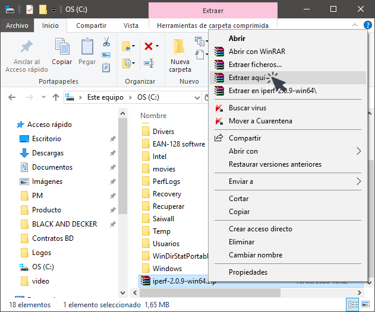](images/descomprimir-iperf.png)

### Medir la velocidad de red local (LAN)

**En mi caso elijo que la Raspberry Pi actue como servidor**. Por lo tanto lo primero que tendremos que realizar es averiguar la IP de nuestra Raspberry Pi. Para ello ejecutaremos el siguiente comando en la terminal:

> ```
> ifconfig
> ```

Justo después de ejecutar el comando verán que en mi caso la IP es la 192.168.1.201

[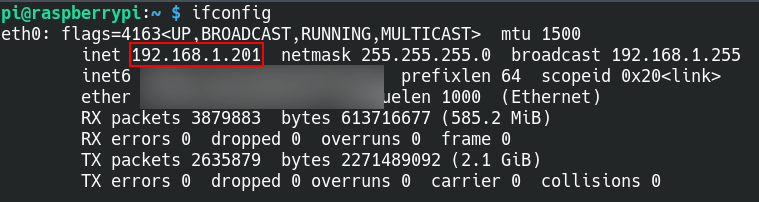](images/ver-la-ip-del-servidor.png)

Acto seguido iniciaremos el servidor ejecutando el siguiente comando en la terminal:

> ```
> iperf -s
> ```

De este modo el equipo que actuará como servidor estará a la espera que se conecte algún cliente.

[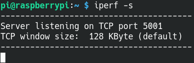](images/servidor-iperf-escuchando-cliente-tcp.png)

**A continuación iremos al ordenador portátil con Windows** que actuará como cliente y abriremos una consola. Una vez abierta accederemos a la ruta donde descomprimimos iPerf ejecutando el siguiente comando:

> ```
> cd c:/iperf-2.0.9-win64
> ```

Acto seguido ejecutamos el comando iperf -c seguido de la IP del servidor que vimos que era 192.168.1.201

> ```
> iperf -c 192.168.1.201
> ```

El resultado obtenido es el siguiente:

[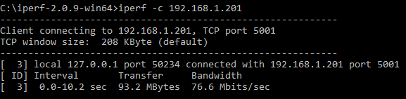](images/resultados-en-lado-del-cliente.png)

Tanto en el lado del cliente como en el lado del servidor veremos los mismos resultados que serán los siguientes:

[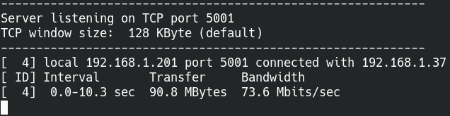](images/resultados-de-la-medicion-en-el-servidor.png)

Durante 10 segundos el cliente envía paquetes de 208 KB al servidor mediante el protocolo TCP. Durante estos 10 segundos se han transferido 90.8 MB con un ancho de banda de 73.6 Mbps

Los resultados obtenidos son muy pobres considerando que tengo todo el equipo necesario para obtener velocidad Gigabit. El resultado es así de malo porque el ordenador que actúa como cliente está conectado a la red local vía Wifi.

### Realizar la medición modificando el tamaño de paquete estándar

Si en vez de paquetes de 208KB queremos transmitir paquetes de 4KB, en el ordenador Windows, que en mi caso actual como cliente, ejecutaremos el mismo comando que ejecutamos anteriormente añadiendo el parámetro \-w seguido del tamaño en bits que queremos que tengan los paquetes. Por lo tanto en mi caso ejecutaré el siguiente comando en la consola de Windows:

> ```
> iperf -c 192.168.1.201 -w 4096
> ```

Los resultados obtenidos en este caso han sido mejores que en el caso anterior. No obstante los resultados distan mucho de lo que podrían ser.

[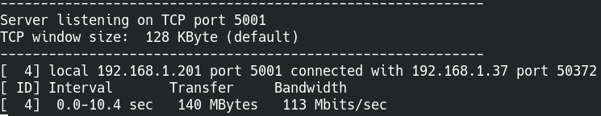](images/velocidad-red-con-paquetes-de-4096-bytes.png)

### Medir la velocidad de de red realizando ensayos bidireccionales

Los ensayos realizados hasta el momento son unidireccionales. Solo estamos midiendo la velocidad del cliente al servidor.

Si queremos realizar un análisis bidireccional de modo que el cliente envíe contenido al servidor durante 10 segundos, se midan los resultados, y que después el servidor envíe datos al cliente y se realice una nueva medición ejecutaremos los siguientes comandos:

En el lado del servidor:

> ```
> iperf -s
> ```

En el lado del cliente:

> ```
> iperf -c 192.168.1.201 -r
> ```

Los resultados obtenidos de la medición son los siguientes:

[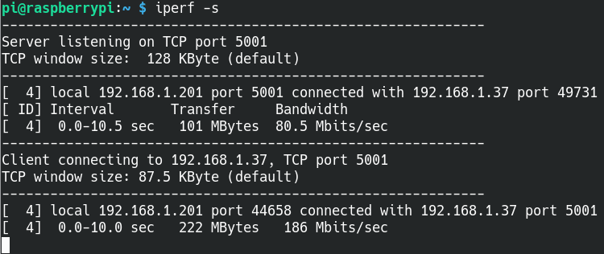](images/resultados-velocidad-bidreccional-entre-cliente-servidor.png)

Si queremos realizar  una medición en que el cliente y el servidor se envían información de forma simultánea ejecutaremos los siguientes comandos:

En el lado del servidor:

> ```
> iperf -s
> ```

En el lado del cliente:

> ```
> iperf -c 192.168.1.201 -f
> ```

Los resultados obtenidos en este caso son los siguientes:

[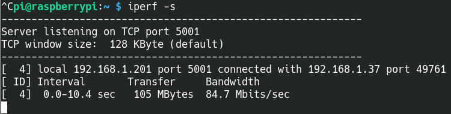](images/resultados-medicion-bidireccional-simultanea.png)

### Realizar mediciones de velocidad de nuestra red local usando el protocolo UDP

Todas las mediciones realizadas hasta el momento han sido usando el protocolo TCP. Si queremos realizar mediciones usando el protocolo UDP tan solo tendremos que añadir el parámetro \-u tanto en el lado del servidor como en el lado del cliente. Por lo tanto en el equipo que actuará como servidor ejecutaremos el siguiente comando:

> ```
> iperf -s -u
> ```

A posteriori en el lado del cliente ejecutaremos el siguiente comando:

> ```
> iperf -c 192.168.1.201 -u
> ```

Acto seguido obtendremos los siguientes resultados:

[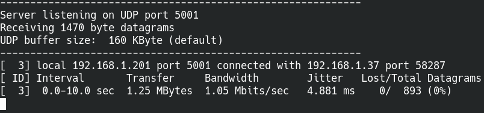](images/resultados-medicion-velocidad-red-udp.png)

Por lo tanto durante 10 segundos el cliente envía paquetes de 1470 byte al servidor mediante el protocolo UDP. Durante estos 10 segundos se han transferido 1,25MB con un ancho de banda de 1.05 Mbps, un valor the Jitter de 4.881 ms y sin pérdida de paquetes.

**Nota:** Valor de Jitter es importante en entornos que se necesiten realizar transmisiones de voz IP o vídeo.

**Nota:** En este apartado se penaliza el ancho de banda por estar enviando paquetes de un tamaño muy pequeño.

### Realizar mediciones de velocidad segundo a segundo o periódicamente

Si queremos obtener mediciones del rendimiento de nuestra red local segundo a segundo o periódicamente lo realizaremos del siguiente modo:

En el lado del servidor ejecutaremos el comando que ejecutaríamos de forma habitual, pero ahora añadiremos el parámetro \-i seguido del intervalo en segundos en que queremos que se nos muestren los resultados medidos. Por lo tanto si queremos medir el rendimiento de nuestra red usando el protocolo UDP y queremos que se impriman los resultados segundo a segundo ejecutaremos el siguiente comando en el servidor:

> ```
> iperf -s -u -i 1
> ```

Por otro lado en el lado del cliente ejecutaríamos el mismo comando que usaríamos de forma habitual que sería el siguiente:

> ```
> iperf -c 192.168.1.201 -u
> ```

Los resultados obtenidos en mi caso son los siguientes:

[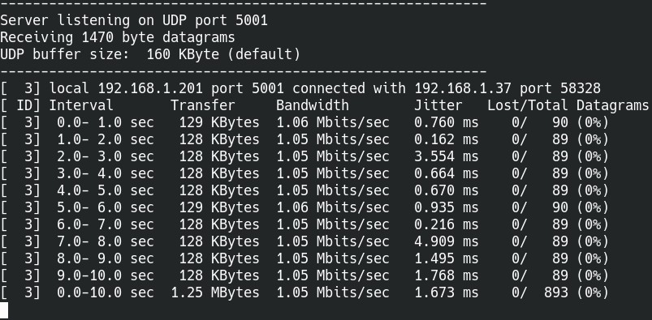](images/mediciones-de-velociad-de-red-segundo-a-segundo.png)

## VER LA TOTALIDAD DE OPCIONES OFRECIDAS POR IPERF

Si queréis analizar la totalidad de opciones ofrecidas por iPerf tan solo tenéis que ejecutar el siguiente comando en la consola de Windows o en la terminal de Linux:

> ```
> iperf --help
> ```

## INTERFACES GRÁFICAS PARA MEDIR LA VELOCIDAD DE NUESTRA RED LOCAL

Existen interfaces gráficas para poder medir la velocidad de nuestra red local. Dos de ellas son las siguientes:

1. Jperf
2. xjperf

Podéis buscar información vosotros mismos sobre ellas. El objetivo de este artículo era ver el funcionamiento de iPerf vía terminal. El uso de la terminal es mejor para aprender lo que estamos haciendo en cada momento y además es más útil en el caso que tengamos que automatizar procesos de medición.

###### Photo by Brett Sayles from Pexels
