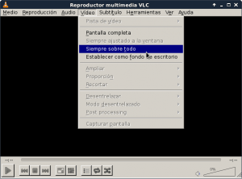
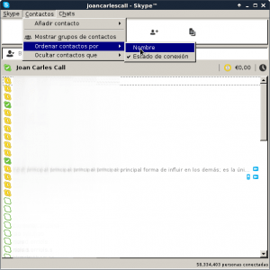
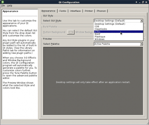
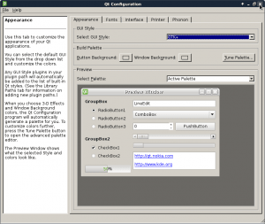
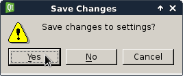
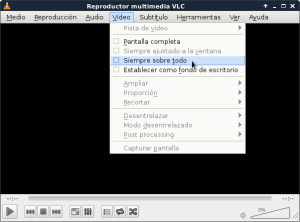
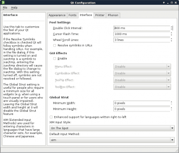

A raíz de un comentario realizado por un lector del blog, me di cuenta que al instalar Debian Jessie Xfce, y muchas otras distros con el entorno Xfce, es probable que la visualización de aplicaciones programadas con [librerías Qt](https://es.wikipedia.org/wiki/Qt_%28biblioteca%29) sea simplemente horrorosa. A raíz de esto escribiré este breve post para comentar como mejorar el aspecto de las aplicaciones qt en xfce.<!--more-->

## ASPECTO INICIAL DE LAS APLICACIONES QT EN XFCE

En mi caso justo en el momento de instalar Debian Jessie, la visualización de aplicaciones como Skype o VLC era la siguiente:

\[caption id="attachment\_5997" align="alignnone" width="300"\][](images/Visualización-incorrecta-de-VLC.png) Aspecto inicial del software VLC\[/caption\]

\[caption id="attachment\_5998" align="alignnone" width="300"\][](images/Visualización-incorrecta-de-Skype.png) Aspecto inicial del Software Skype\[/caption\]

Como se puede apreciar en las capturas de pantalla, el aspecto de las aplicaciones qt en xfce se asemeja a Windows 95 y no se integra para nada con el resto de aplicaciones que utilizan librerías GTK.

## MEJORAR LA VISUALIZACIÓN DE APLICACIONES QT EN XFCE

Si os encontráis en la situación que se muestra en el inicio de este post, no os tenéis que preocupar para nada ya que la solución de este problema es muy sencilla.

Lo primero que tenemos que realizar es **abrir una terminal**. Seguidamente **instalaremos el paquete qt4-qtconfig ejecutando el siguiente comando** en la terminal:

> ```
> sudo apt-get install qt4-qtconfig
> ```

Una vez instalado este paquete, conjuntamente con sus dependencias, tan solo tenemos que **ejecutar el siguiente comando en la terminal**:

> ```
> qtconfig
> ```

Al ejecutar este comando se abrirá la siguiente ventana:

[](images/Configurar-Visualización-Aplicaciones-Qt-en-xfce.png)

En esta ventana, **dentro de la pestaña de** **Appearence**, podremos configurar el aspecto de visualización de las aplicaciones programadas con librerías Qt.

Para que la visualización de aplicaciones Qt sea exactamente la misma que las aplicaciones programadas en GTK, tal y como se puede ver en la captura de pantalla, tan solo tenemos que **clicar encima del menú desplegable** **Select GUI Style**, y seguidamente **seleccionar la opción** **GTK+**.

[](images/Cerrar-qtconfig.png)

Después de seleccionar la opción GTK+, tal y como se puede ver en la captura de pantalla, **cerramos la ventana de configuración**. Al cerrarse la ventana nos **aparecerá el siguiente cuadro de dialogo** preguntándonos si queremos guardar los cambios realizados:

[](images/Guardar-los-cambios-de-configuración.png)

Tal y como se puede ver en la captura de pantalla, **respondemos Yes**. En estos momentos la totalidad de aplicaciones programadas en librerías Qt se verán con el mismo diseño que las programadas en GTK. Por lo tanto Skype, VLC y el resto de aplicaciones que se visualizaban de forma incorrecta, ahora se visualizarán correctamente.

## RESULTADOS OBENTIDOS: ASPECTO FINAL DE LAS APLICACIONES QT EN XFCE

Una vez realizadas las modificaciones volveré a mostrar las mismas captura de pantalla que mostré en el inicio de este post:

\[caption id="attachment\_6004" align="alignnone" width="300"\][](images/Visualización-correcta-de-VLC1.png) Visualización correcta del software VLC\[/caption\]

\[caption id="attachment\_6003" align="alignnone" width="300"\][](images/Visualización-correcta-de-VLC.png) Visualización correcta del Software Skype\[/caption\]

Ahora la visualización de las aplicaciones qt en xfce es correcta. Por lo tanto podemos afirmar que el problema se ha solucionado ya que podemos visualizar las aplicaciones Qt en Xfce de forma correcta, tal y como si se trataran de aplicaciones programadas con librerías GTK.

## OTRAS MODIFICACIONES QUE PODEMOS REALIZAR

Aparte de seleccionar la visualización gráfica que queramos que tengan las aplicaciones programadas con librerías Qt, también podemos configurar otros aspectos, como por ejemplo los siguientes:

1. Seleccionar la fuente por defecto de las aplicaciones que usan librerías Qt.
2. Seleccionar fuentes sustitutorias. De esta forma si la fuente por defecto no dispone de ciertos caracteres, nuestro sistema operativo los tomará prestados de la fuente sustitutoria.
3. Configurar otros parámetros de las aplicaciones como por ejemplo, el tamaño mínimo de los widgets programados con librerías Qt, configurar la sensibilidad del scroll cuando movemos la ruedecita del ratón, definir el intervalo de doble click de nuestro ratón, habilitar XIM para escribir en idiomas que tengan caracteres como los chinos o los japoneses, etc.

En el caso que tengamos necesidad de modificar los aspectos que acabamos de citar tan solo tienen que abrir la terminal y ejecutar el comando:

> ```
> qtconfig
> ```

Al ejecutar este comando se abrirá la siguiente ventana:

[](images/Otras-opciones-de-configuración.png)

Para modificar los diferentes aspectos citados, tan solo tendremos que ir inspeccionando cada una de las pestañas que se pueden ver en la captura de pantalla e ir probando y jugando con las diferentes opciones que se nos ofrece.

###### Nota: Recomiendo no tocar ninguno de los parámetros que se muestran en este último apartado. En principio lo único necesario a configurar en la gran mayoría de los casos es el aspecto visual.
