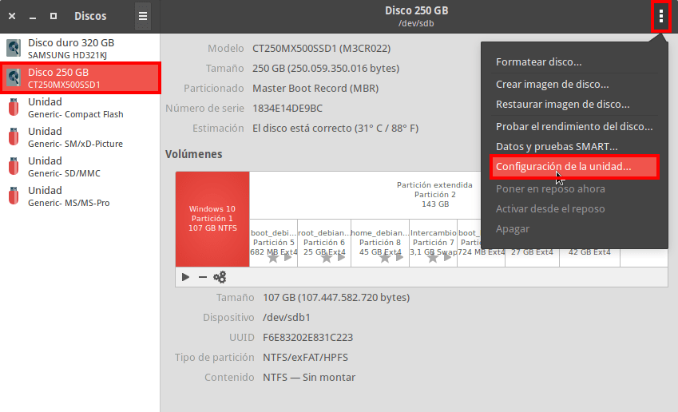
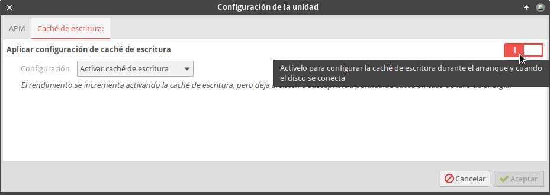

A continuación detallaré una serie de modificaciones en la configuración que les ayudarán a mejorar el rendimiento de su sistema operativo Linux. Las modificaciones que aplicaremos modificarán la gestión de la memoria de nuestro equipo y el funcionamiento del disco duro.<!--more-->

Las mejoras serán claramente palpables en equipos no actuales o que sean escasos en recursos. Si disponen de máquinas modernas difícilmente notarán una mejora.

###### Nota: Las modificaciones son para aplicar en ordenadores personales. No están pensadas para aplicar en servidores de gran capacidad que tengan gran cantidad de usuarios y una carga importante.

## MODIFICAR LA GESTIÓN DE LA MEMORIA PARA MEJORAR EL RENDIMIENTO

Para aprovechar mejor la memoria de nuestro equipo les recomiendo realicen lo siguiente. Abran un terminal y ejecuten el siguiente comando:

> ```
> sudo nano /etc/sysctl.conf
> ```

Cuando se abra el editor de texto nano vayanse al final del archivo y peguen el siguiente código:

> ```
> vm.swappiness = 10
> vm.vfs_cache_pressure = 50
> vm.watermark_scale_factor = 200
> vm.dirty_ratio = 3
> ```

Una vez pegado el código ya pueden guardar los cambios, cerrar el fichero y reiniciar el equipo. Una vez reiniciado el equipo deberían ser capaces de ver una mejora en el rendimiento y desempeño de su equipo. A continuación les daré una breve explicación de lo que hace cada uno de los parámetros de la memoria que hemos modificado.

### Mejorar el rendimiento modificando el valor swappiness

El valor predeterminado de sawppiness es 60. Con la siguiente línea lo reducimos a 10.

> ```
> vm.swappiness = 10
> ```

Al tener un valor inferior nuestro sistema operativo hará un uso mucho menor de la memoria de intercambio. Como el uso de la memoria de intercambio será menor, la fluidez en la ejecución y uso de los programas debería ser mejor. Si quieren más información sobre el funcionamiento de la memoria Swap pueden consultar el siguiente enlace:

https://geekland.eu/optimizar-el-uso-de-la-memoria-swap/

### Cambiar el valor de ”cache\_pressure” para incrementar el rendimiento

El valor predeterminado de la variable cache pressure es 100. Mediante el siguiente código los reducimos a 50.

> ```
> vm.vfs_cache_pressure = 50
> ```

Bajando el valor reduciremos la frecuencia con que la memoria RAM libera el espacio ocupado en cachear [inodos y dentries](). De este modo reducimos el intercambio de información entre el disco duro y la memoria RAM y por lo tanto mejoraremos el rendimiento del equipo.

### Mejorar el rendimiento del equipo con la variable “vm.watermark\_scale\_factor”

La variable vm.watermark\_scale\_factor determina el momento en que se activa el demonio Kswapd y se inicia la paginación. También determina la cantidad de información en la memoria que será paginada al disco.

Mediante la siguiente la siguiente línea de código modificamos el valor estándar de 10 y lo incrementamos a 200:

> ```
> vm.watermark_scale_factor = 200
> ```

###### Nota: El valor máximo es 1000.

Cambiando el valor de 10 a 200 conseguimos que el proceso de paginación se inicie antes. Si el valor es 200, cuando quede un 2% de RAM libre se iniciará Kswapd para paginar datos de la memoria RAM al disco duro.

Esta característica ayuda a sistemas que no van sobrados de memoria RAM. Si un equipo modesto trabaja con el valor por defecto (10) significa que la paginación se iniciará cuando solo quede un 0,1% de memoria RAM libre. Esta situación extrema puede hacer que equipos modestos se cuelguen o congelen por falta de recursos y memoria disponible.

### Mejorar el rendimiento del ordenador con la variable “vm.dirty\_ratio”

El valor por defecto de vm.dirty\_ratio es de 40. En nuestro caso lo hemos reducido a 3 mediante el siguiente código:

> ```
> vm.dirty_ratio = 3
> ```

Reduciendo el valor, los datos presentes en la memoria que se han modificado y por lo tanto son diferentes a los almacenados en el disco duro, se esrcriben al disco con una frecuencia más alta, pero en cada transferencia la cantidad paginada será mucho menor.

De este modo, en el caso que la velocidad de escritura de nuestro disco duro sea lenta y/o en el caso que la CPU sea poco potente notaremos una mejora de rendimiento en nuestro equipo.

## MEJORAR EL RENDIMIENTO ACTIVANDO LA CACHE DE ESCRITURA DE LA UNIDAD DE ALMACENAMIENTO

Habilitando la cache de escritura de nuestra unidad de almacenamiento, las operaciones se realizarán más rápido.

**Al activar la cache de escritura se pueden iniciar procesos sin tener que esperar que la información de la memoria RAM se escriba en el disco duro**. De esta forma conseguiremos un mayor rendimiento. No obstante hay que tener en cuenta que una pérdida de energía o un error en el equipo pueda ocasionar la pérdida de la información de los datos almacenados en la cache y que por lo tanto aun no se han escrito en el disco duro.

###### Nota: A priori no me preocuparía por la posibilidad de pérdida de información. Todos los sistemas Windows activan la cache de escritura por defecto.

### Instrucciones para activar la cache de escritura en disco

La forma más sencilla para activar la cache de escritura de nuestra unidad de almacenamiento es con la utilidad gnome-disk. Para su instalación tenemos que ejecutar el siguiente comando en la terminal:

> ```
> sudo apt install gnome-disk-utility
> ```

Una vez instalada la utilidad realizamos lo siguiente:

1. Abrimos la aplicación que acabamos de instalar. La aplicación la encontraréis en el menú de vuestra distro. En el caso que no la encontréis la podéis abrir ejecutando el comando gnome-disks en la terminal.
2. Seleccionamos la unidad de almacenamiento en que tenemos instalado el sistema operativo.
3. Acto seguido clicamos en icono de opciones de la unidad y cuando se despliegue el menú clicamos en la opción Configuración de la unidad…

[](images/opciones-configuracion-disco.png)

A continuación clicamos en la pestaña **cache de escritura**. Acto seguido activen la cache de escritura y presionen el botón Aceptar.

[](images/activar-cache-escritura-disco.png)

Una vez realizadas las modificaciones que hemos indicado reinicien el ordenador. A partir de estos momentos deberían nota una mejora importante en su sistema operativo.

## MEJORAR EL RENDIMIENTO PRECARGANDO INFORMACIÓN EN LA MEMORIA CON PRELOAD

A grandes rasgos **Preload precarga procesos y librerías de las aplicaciones que acostumbramos a usar en la memoria RAM**. De este modo las aplicaciones se abrirán de forma más rápida y fluida y notaremos un mejor desempeño de nuestro ordenador. Para instalar Preload en Debian y en distribuciones derivadas de Debian tan solo tienen que ejecutar el siguiente comando:

> ```
> sudo apt install preload
> ```

Una vez finalizada la instalación ejecutaremos los siguientes comandos para asegurar que Preload se inicie de forma automática cada vez que reiniciamos el equipo:

> ```
> sudo service preload start
> sudo service preload enable
> ```

Una vez ejecutados los comando reinicien el equipo. Después de reiniciar el equipo Preload debería estar contribuyendo a mejorar el rendimiento de nuestro equipo. Si quieren más información acerca de preload pueden leer el siguiente enlace:

https://geekland.eu/incrementar-el-rendimiento-con-preload/

## ¿POR QUÉ LINUX NO USA LAS OPCIONES QUE CITO EN ARTÍCULO DE FORMA PREDETERMINADA?

La configuración por defecto de las distros GNU-Linux está pensada para trabajar con servidores de gran capacidad que tienen una cantidad limitada de RAM y recursos. Obviamente este no es el caso de un ordenador de escritorio en que la mayoría de casos es usado para que un solo usuario realice tareas simples.

Además hay que tener presente que las distros se configuran para ser compatibles con el 100% de los equipos y existen características, como por ejemplo la cache de escritura de disco, que no están disponibles en todos los hardware.

## OTRAS ACCIONES PARA MEJORAR EL RENDIMIENTO DEL EQUIPO

Siguiendo los pasos de este artículo es más que probable que noten una mejora importante en el rendimiento. No obstante hay otros puntos que deberían tener en cuenta para que el rendimiento de su equipo sea óptimo. Algunos de estos puntos son los siguientes:

1. Hay **comprobar que no se autoinicien aplicaciones que no usamos**. Una aplicación cargada en memoria y que no usamos está consumiendo recursos que no podrán usar el resto de programas que si usamos. La gran mayoría de entornos de escritorio disponen de interfaces gráficas para controlar los programas y aplicaciones que se autoinician con el ordenador.
2. También es interesante **tener conocimiento de los demonios y/o servicios que se ejecutan en nuestro ordenador**. En el caso que haya servicios y demonios que no usemos los deberíamos deshabilitar para evitar el consumo inútil de recursos. A modo de ejemplo, si su ordenador no tiene bluetooth deberíamos desactivar todos los demonios relacionados con la gestión del bluetooth.
3. Existen otras herramientas no citadas en el post que pueden ayudar a mejorar el rendimiento de nuestro equipo. Algunos de ellas son [Zram](), [Prelink](), [Zswap](), etc.

## RESULTADOS OBTENIDOS EN MI CASO

En mi caso dispongo de un equipo con pocos recursos. Después de aplicar las configuraciones del artículo he conseguido mejorar notablemente el rendimiento del equipo.

Antes de aplicar la configuración del artículo notaba que el equipo se congelaba en determinadas situaciones como por ejemplo al navegar. Pero con las soluciones citadas en el artículo todos los problemas de rendimiento que tenia han desaparecido.

##### Fuentes

[https://docs.gluster.org/en/latest/Administrator-20Guide/Linux-20Kernel-20Tuning/](https://docs.gluster.org/en/latest/Administrator%20Guide/Linux%20Kernel%20Tuning/)

[https://major.io/2008/08/07/reduce-disk-io-for-small-reads-using-memory/](https://major.io/2008/08/07/reduce-disk-io-for-small-reads-using-memory/)

[https://www.vertica.com/kb/Tuning-Linux-Dirty-Data-Parameters-for-Vertica/Content/BestPractices/Tuning-Linux-Dirty-Data-Parameters-for-Vertica.htm](https://www.vertica.com/kb/Tuning-Linux-Dirty-Data-Parameters-for-Vertica/Content/BestPractices/Tuning-Linux-Dirty-Data-Parameters-for-Vertica.htm)

[https://javaworks.wordpress.com/2013/08/27/performance-impact-of-dirty-pages-in-linux/](https://javaworks.wordpress.com/2013/08/27/performance-impact-of-dirty-pages-in-linux/)
