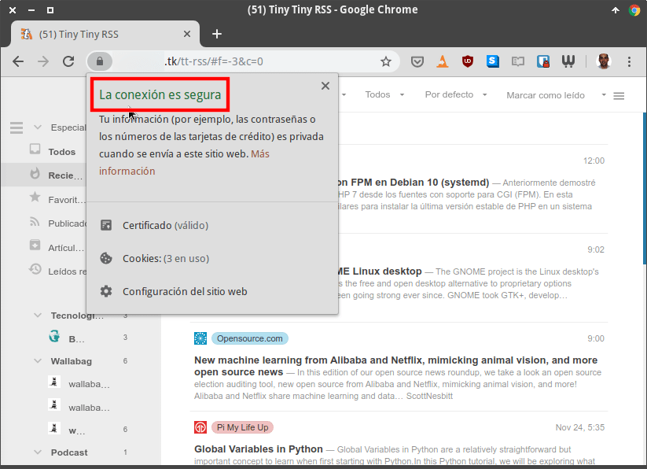

En su día [instalamos el lector de feeds Tiny Tiny RSS]() en Ubuntu usando el servidor web Apache. A continuación les mostraré como podéis configurar y mejorar la seguridad de Tiny Tiny RSS.<!--more-->

## MEJORAR LA SEGURIDAD DE TINY TINY RSS

Los pasos a seguir para mejorar la seguridad de Tiny Tiny RSS son los que veréis a continuación.

### Instalar un certificado SSL

Un paso indispensable para preservar nuestra privacidad y seguridad es instalar un certificado SSL. De esta forma nadie será capaz de esnifar nuestra contraseña de acceso ni ver el contenido almacenado en nuestro lector de feeds. Para instalar el certificado SSL lo haremos con [Let’s Encrypt](https://letsencrypt.org/es/getting-started/).

El primer paso a realizar es instalar el paquete software-properties-common. Este paquete nos permitirá manejar los repositorios de nuestra distribución de forma mucho más fácil. Para ello ejecutamos el siguiente comando:

> ```
> sudo apt install software-properties-common
> ```

Acto seguido aseguraremos que el repositorio Universe de Ubuntu está activado. Para ello ejecutaremos el siguiente comando:

> ```
> sudo add-apt-repository universe
> ```

A continuación agregaremos el repositorio de Certbot ejecutando el siguiente comando en la terminal:

> ```
> sudo add-apt-repository ppa:certbot/certbot
> ```

Seguidamente instalaremos los paquetes necesarios para instalar el certificado SSL a nuestro servidor. Para ello ejecutaremos el siguiente comando:

> ```
> sudo apt install certbot python-certbot-apache
> ```

Finalmente, como instalamos Tiny Tiny RSS en un servidor apache, ejecutamos el siguiente comando para que se instale el certificado:

> ```
> sudo certbot --apache
> ```

Durante el proceso de instalación del certificado deberán responder las siguientes preguntas:

#### Definir una dirección de email

La primera de las preguntas será nuestra dirección de email. Introduzcan una que esté accesible y sea funcional. De esta forma si hay alguna incidencia importante let’s Encrypt nos podrá avisar.

`Enter email address (used for urgent renewal and security notices) (Enter 'c' to cancel): geekland@gmail.com`

#### Aceptar las condiciones de servicio de Let's Encrypt

La segunda de las preguntas a responder será si aceptamos las condiciones de servicio de Let's Encrypt. Obviamente deberán responder que sí.

`Please read the Terms of Service at https://letsencrypt.org/documents/LE-SA-v1.2-November-15-2017.pdf. You must agree in order to register with the ACME server at https://acme-v02.api.letsencrypt.org/directory - - - - - - - - - - - - - - - - - - - - - - - - - - - - - - - - - - - - - - - - (A)gree/(C)ancel: A`

#### Compartir nuestra dirección de email

La tercera de las preguntas es definir si queremos compartir nuestra dirección de correo electrónico con Certbot. Bajo mi punto de vista Certbot no necesita nuestra dirección de email para nada. Por lo tanto respondan que No.

`Would you be willing to share your email address with the Electronic Frontier Foundation, a founding partner of the Let's Encrypt project and the non-profit organization that develops Certbot? We'd like to send you email about our work encrypting the web, EFF news, campaigns, and ways to support digital freedom. - - - - - - - - - - - - - - - - - - - - - - - - - - - - - - - - - - - - - - - - (Y)es/(N)o: N`

#### Dominios en los que quiero instalar el certificado para mejorar la seguridad

En el siguiente paso deberán indicar los dominios en que quieren instalar el certificado de Let’s Enrypt. Los escriben manualmente y presionan la tecla Enter.

`Which names would you like to activate HTTPS for? - - - - - - - - - - - - - - - - - - - - - - - - - - - - - - - - - - - - - - - - 1: geeklandserver.tk 2: www.geeklandserver.tk - - - - - - - - - - - - - - - - - - - - - - - - - - - - - - - - - - - - - - - - Select the appropriate numbers separated by commas and/or spaces, or leave input blank to select all options shown (Enter 'c' to cancel): 1 2`

#### Redireccionar todas las peticiones a https

La quinta acción a realizar es definir si queremos que la totalidad de peticiones http se redirijan a https. Les recomiendo encarecidamente que respondan que Sí.

`Please choose whether or not to redirect HTTP traffic to HTTPS, removing HTTP access. - - - - - - - - - - - - - - - - - - - - - - - - - - - - - - - - - - - - - - - - 1: No redirect - Make no further changes to the webserver configuration. 2: Redirect - Make all requests redirect to secure HTTPS access. Choose this for new sites, or if you're confident your site works on HTTPS. You can undo this change by editing your web server's configuration. - - - - - - - - - - - - - - - - - - - - - - - - - - - - - - - - - - - - - - - - Select the appropriate number [1-2] then [enter] (press 'c' to cancel): 2`

#### Mensaje de confirmación de la instalación

Finalmente, si todo ha ido como tenia que ir verán un mensaje parecido al siguiente que les confirma que el certificado se ha instalado con éxito.

`Congratulations! You have successfully enabled https://geeklandserver.tk and https://www.geeklandserver.tk`

Una vez instalado el certificado reiniciaremos TT-RSS y el servidor web apache ejecutando los siguientes comandos en la terminal:

> ```
> sudo service apache2 restart
> sudo service tt-rss restart
> ```

Acto seguido comprueben que pueden acceder de forma correcta y segura a Tiny Tiny RSS.

[](images/certificado-ssl-instalado-correctamente.png)

### Incrementar la seguridad Protegiéndonos de ataques de fuerza bruta con fail2ban

Para protegernos de ataques por fuerza bruta instalaremos y configuraremos fail2ban. Para ello ejecutaremos el siguiente comando en la terminal:

> ```
> sudo apt install fail2ban
> ```

#### Definir una acción de bloqueo para Tiny Tiny RSS con fail2ban

Acto seguido crearemos una acción para bloquear a los usuarios que intenten loguearse a nuestro tt-rss de forma indiscriminada. Para ello empezaremos haciendo una copia de seguridad de las reglas predeterminadas ejecutando el siguiente comando:

> ```
> sudo cp /etc/fail2ban/jail.conf /etc/fail2ban/jail.local
> ```

A continuación accederemos al fichero donde se definen las acciones ejecutando el siguiente comando en la terminal:

> ```
> sudo nano /etc/fail2ban/jail.local
> ```

Al final del archivo jail.local copiaremos el siguiente texto:

> ```
> [ttrss]
> enabled = true
> port = http,https
> filter = ttrss
> logpath = /var/log/apache2/error.log
> bantime = 3600
> findtime = 2000
> maxretry = 3
> ```

Una vez pegado el código guardaremos los cambios y cerraremos el fichero. El código que acabamos de pegar realizará lo siguiente:

1. Si un usuario comete 3 errores de autenticación en un período de 2000 segundos será bloqueado.
2. El tiempo de bloqueo será de 3600 segundos.

#### Crear un filtro de bloqueo para Tiny Tiny RSS

El filtro de bloqueo que crearemos a continuación será el encargado de detectar los intentos fallidos de autenticación. Para ello ejecutamos el siguiente comando en la terminal:

> ```
> sudo nano /etc/fail2ban/filter.d/ttrss.conf
> ```

Cuando se abra el editor de textos pegaremos el siguiente código:

> ```
> [Definition]
> 
> failregex = Failed login attempt.*? from <HOST>
> 
> ignoreregex =
> ```

Acto seguido guardaremos los cambios y cerraremos el fichero.

Para que fail2ban pueda detectar los errores de autenticación debemos cambiar la ubicación donde TT-RSS guarda los logs. Para ello ejecutamos el siguiente comando en la terminal:

> ```
> sudo nano /var/www/html/tt-rss/config.php
> ```

Una vez dentro del archivo de configuración buscamos la siguiente línea:

> ```
> define('LOG_DESTINATION', 'sql');
> ```

Una vez encontrada la modifican para que quede de la siguiente forma:

> ```
> define('LOG_DESTINATION', '');
> ```

Finalmente guardan los cambios y cierran el fichero. De este modo, la próxima vez que reinicien Apache, los logs se almacenarán en /var/log/apache2/error.log

Una vez realizados todos los cambios reiniciaremos fail2ban, TT-RSS y el servidor web Apache ejecutando los siguientes comandos en la terminal:

> ```
> sudo service fail2ban restart
> sudo service apache2 restart
> sudo service tt-rss restart
> ```

### Limitar el número de usuarios que pueden usar TT-RSS

Por defecto Tiny Tiny RSS no permite que un usuario cualquiera que acceda a la web pueda crearse una cuenta. Esto sin duda es una buena práctica de seguridad. Además también podemos limitar el número de cuentas activas de Tiny Tiny RSS. Para ello tan solo tenemos que acceder al fichero de configuración ejecutando el siguiente comando:

> ```
> sudo nano /var/www/html/tt-rss/config.php
> ```

Una vez dentro del fichero de configuración busquen el siguiente código.

> ```
> define('REG_MAX_USERS', 10);
> // Maximum amount of users which will be allowed to register on this
> // system. 0 - no limit.
> ```

Modificando el numero que está en rojo podremos fácilmente definir el número máximo de usuarios que podemos tener activos. En mi caso con 2 cuentas/usuarios es suficiente. Por lo tanto escribo un 2, guardo los cambios y cierro el fichero.

### Los usuarios deben usar contraseñas robustas para mejorar la seguridad

Obviamente cada uno de los usuarios de Tiny Tiny RSS debe usar una contraseña robusta. Si quieren consejos útiles para crear contraseñas robustas les dejo el siguiente enlace:

https://geekland.eu/buenas-practicas-gestion-uso-contrasenas/

### Borrar el usuario admin para incrementar la seguridad

Tiny Tiny RSS no permite borrar el usuario admin de forma sencilla. La única forma de hacerlo es acceder a la base de datos y borrarlo manualmente.

###### Nota: Si deciden borrar el usuario admin tengan en cuenta que antes hay que crear otro usuario.

###### Nota: En el caso que borren el usuario admin tienen que ser conscientes que no podrán usar el modo de usuario único.

Por lo tanto no les recomendaré que borren el usuario. Simplemente les pediré que creen y trabajen con un usuario diferente al admin. Si usan una contraseña fuerte y además fail2ban no debemos preocuparnos.

### ACTUALIZAR EL SERVIDOR Y TINY TINY RSS

Las actualizaciones no solamente incluyen funcionalidades adicionales. También solucionan problemas de seguridad que se van detectando y solucionando durante el transcurso del tiempo. Por lo tanto:

1. Actualicen el servidor sobre el que está instalado Tiny Tiny RSS.
2. Cuando salga una nueva versión de Tiny Tiny RSS la deben instalar.

Con estos simples pasos conseguiremos el objetivo inicial que era mejorar la seguridad de Tiny Tiny RSS.
