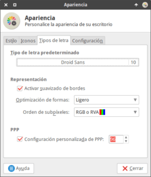
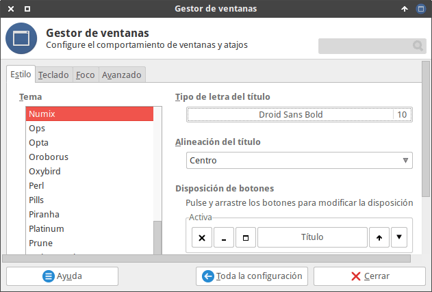

En mi caso me da la sensación que distribuciones como Ubuntu o Linux Mint tienen un renderizado de fuentes perfecto. En cambio en otras distribuciones las cosas dejan bastante que desear y requieren de nuestra intervención para conseguir un resultado satisfactorio.

Algunos de los consejos que podéis seguir para mejorar el renderizado de fuentes de vuestra distro son los siguientes:<!--more-->

## INSTALAR FUENTES ADICIONALES PARA MEJORAR EL RENDERIZADO DE FUENTES

El tipo de letra es importante para obtener un buen renderizado de fuentes. Los motivos son los siguientes:

1. Existen fuentes tipografías más bonitas que otras. Cuanto más nos guste la fuente tipográfica seleccionada mejor la veremos en pantalla.
2. El renderizado de fuentes será mejor o peor en función de como ha sido creada la fuente. Con esto quiero decir que podemos tener fuentes que nos proporcionan un renderizado pésimo y otras fuentes que nos proporcionan un renderizado excelente.
3. Un programa puede requerir una fuente. Si no tenemos esta fuente instalada será reemplazada por otra y es posible que su visualización no sea del todo correcta o no nos guste.

Por todos estos motivos recomiendo instalar las siguientes tipográficas en nuestro sistema operativo:

> ```
> ttf-mscorefonts-installer, fonts-dejavu fonts-freefont-ttf ttf-bitstream-vera fonts-freefont-otf fonts-lyx xfonts-100dpi xfonts-75dpi texlive-extra-utils texlive-math-extra texlive-fonts-extra texlive-fonts-utils texlive ttf-aenigma fonts-roboto-hinted fonts-roboto-unhinted, fonts-liberation, fonts-croscore, fonts-crosextra-caladea, fonts-crosextra-carlito y ubuntu fonts.
> ```

Si requieren de ayuda para instalar estas tipografías pueden seguir las instrucciones que encontrarán en el siguiente enlace:

[https://geekland.eu/instalar-fuentes-en-debian-linux/]()

## CONFIGURAR EL RENDERIZADO DE FUENTES MEDIANTE FONTS.CONF

A continuación crearemos/modificaremos el archivo fonts.conf para configurar el renderizado de fuentes.

### Creación del archivo fonts.conf

Crearemos/modificaremos el archivo fonts.conf en la ruta ~/.config/fontconfig. Para ello ejecutamos el siguiente comando en la terminal:

> ```
> nano ~/.config/fontconfig/fonts.conf
> ```

###### Nota: La ruta en la que creamos el archivo fonts.conf es válida para todas las versiones de fontconfig iguales o superiores a la 2.10.1. En caso de tener versiones más antiguas, la ruta del archivo debe ser la ~/fonts.conf

Una vez se abra el editor de textos podemos empezar a configurar el renderizado de fuentes.

###### Nota: Los cambios efectuados a continuación únicamente se aplicarán a nuestro usuario. Si quisiéramos que los cambios fueran para todos los usuarios deberíamos crear el archivo fonts.conf en la ubicación /etc/fonts/local.conf.

### Crear el código en el archivo fonts.conf

En el archivo fonts.conf que acabamos de crear pegamos el siguiente código:

> ```
> <?xml version="1.0"?>
> <!DOCTYPE fontconfig SYSTEM "fonts.dtd">
> <fontconfig>
>  <match target="font">
>  <edit mode="assign" name="hinting" >
>  <bool>true</bool>
>  </edit>
>  <edit mode="assign" name="autohint" >
>  <bool>false</bool>
>  </edit>
>  <edit mode="assign" name="hintstyle" >
>  <const>hintslight</const>
>  </edit>
>  <edit mode="assign" name="rgba" >
>  <const>rgb</const>
>  </edit>
>  <edit mode="assign" name="lcdfilter">
>  <const>lcddefault</const>
>  </edit>
>  <edit mode="assign" name="antialias" >
>  <bool>true</bool>
>  </edit>
>  <edit mode="assign" name="embeddedbitmap">
>  <bool>false</bool>
>  </edit>
>  </match>
> 
> <!-- Set preferred serif, sans serif, and monospace fonts. -->
>  <alias>
>  <family>serif</family>
>  <prefer>
>  <family>Droid Serif</family>
>  </prefer>
>  </alias>
>  <alias>
>  <family>sans-serif</family>
>  <prefer>
>  <family>Droid Sans</family>
>  </prefer>
>  </alias>
>  <alias>
>  <family>sans</family>
>  <prefer>
>  <family>Droid Sans</family>
>  </prefer>
>  </alias>
>  <alias>
>  <family>monospace</family>
>  <prefer>
>  <family>Droid Sans Mono</family>
>  </prefer>
>  </alias>
>  <alias>
>  <family>mono</family>
>  <prefer>
>  <family>Droid Sans Mono</family>
>  </prefer>
>  </alias>
> </fontconfig>
> ```

###### Nota: Las partes del código en rojo o en verde son las que admiten modificaciones y definen el estado de la propiedad que estamos configurando.

Una vez pegado el código guardamos los cambios y cerramos el archivo.

A continuación veremos una breve explicación de la función que realiza cada una de las partes del código hemos pegado.

#### Configuración del hinting

Las tipografías que usamos están diseñadas para ser usadas a altas resoluciones, mientras que las pantallas acostumbran a ser de resoluciones bajas.

El hinting es una información adicional codificada que traen las fuentes TrueType y PostScript. Esta información adicional es la responsable de adaptar las letras de alta resolución a un monitor de baja resolución. En otras palabras el hinting ayuda a adaptar cada trazo de una letra (TrueType o PostScript) al píxel de la pantalla para conseguir que la letra sea lea y visualice mejor.

##### Activar el hinting (Byte-Code Interpreter)

Activaremos el mecanismo que permite interpretar los hints que traen incorporadas las fuentes TrueType y Postscript. El encargado de realizar esta función es el siguiente código:

> ```
> <edit mode="assign" name="hinting" >
> <bool>true</bool>
> </edit>
> ```

###### Nota: En este apartado únicamente podemos usar las propiedades true y false.

##### Activar el autohinter

A día de hoy no tiene mucha importancia tener activado el autohinter para mejorar el renderizado de fuentes. Por lo tanto en mi caso tengo desactivada esta opción.

Al desactivar esta opción, el proceso de hinting de las fuentes TrueType y PostScript se realiza a partir los hints que traen incorporadas cada una de las fuentes.

Para desactivar el autohinter usamos la siguiente parte del código:

> ```
> <edit mode="assign" name="autohint" >
> <bool>false</bool>
> </edit>
> ```

###### Nota: En el caso que alguna de las fuentes no contenga hints esta opción será útil tenerla activada.

##### Optimización de forma de la tipografía

Podemos aplicar distintos grados de hinting a nuestras fuentes. Los grados que podemos elegir para intentar mejorar el renderizado de fuentes son los siguientes:

**hintnone:** No se aplica ningún tipo de hinting. **hintslight:** La fuente se verá más borrosa, pero la forma de la fuente será más natural. **hintmedium:** Se trata de un punto intermedio entre la opción hintslight y hintfull. **hintfull:** La fuente será extremadamente nítida, pero la forma de la letra será menos natural y con aristas.

En mi caso considero que la mejor opción en este apartado es usar **hintslight**. Los motivos son los siguientes:

1. Después de probar todas las opciones disponibles es la que a mi me da mejores resultados.
2. Es la que usan distribuciones como Ubuntu o Linux Mint. Cabe recordar que estas 2 distribuciones tienen un renderizado de fuentes perfecto.

La parte del código encargada de definir la optimización de forma de las fuentes es la siguiente:

> ```
> <edit mode="assign" name="hintstyle" >
> <const>hintslight</const>
> </edit>
> ```

###### Nota: En Xfce, y en un gran número de entornos de escritorio, también podemos aplicar esta configuración a través de las herramientas que nos proporciona la interfaz gráfica.

#### Configurar el subpixel rendering

La gran mayoría de monitores actuales son del tipo RGB. Esto significa que el color de cada uno de los píxeles de nuestra pantalla es una combinación de colores entre el rojo, el verde y el azul.

El subpixel rendering jugará con los colores de los contornos de las letras con el fin de obtener una letra más nítida y con una forma visualmente correcta.

[](images/ejemplo-subpixel-rendering.png)

Para que el subpixel rendering se realice correctamente tenemos que indicar nuestro tipo de monitor en el archivo fonts.conf mediante el siguiente código:

> ```
> <edit mode="assign" name="rgba" >
> <const>rgb</const>
> </edit>
> ```

En el caso poco probable que no tengáis un monitor RGB, deberéis reemplazar el valor RGB por alguno de los siguientes valores:

**BGR:** En el caso que dispongáis de un monitor del tipo BGR. **VBGR:** Para monitores del tipo VBGR. **VRGB:** En monitores VRGB.

###### Nota: Para averiguar el tipo de monitor que tienen pueden consultar su manual de instrucciones o la siguiente [página web](http://www.lagom.nl/lcd-test/subpixel.php "Ver si nuestro monitor es RGB").

#### Activar el filtrado LCD

Al usar subpixel rendering tenemos que activar el filtrado LCD. El filtrado LCD ayudará a evitar el fenómeno conocido como color-fringing o franjas de color.

[](images/ejemplo-color-fringing.png)

Hay varios modos de filtrado LCD para seleccionar. El filtro que funcionará mejor en el 99,9% de los casos es el lcddefault. Para activar el filtro lcdefault usamos el siguiente código en el archivo fonts.conf:

> ```
> <edit mode="assign" name="lcdfilter">
> <const>lcddefault</const>
> </edit>
> ```

Si el filtro lcdefault no da buen resultado pueden probar otros filtros como por ejemplo los siguientes:

**lcdlight:** Usar en caso que tengamos problemas de fuentes borrosas o demasiado negritas. **lcdlegacy:** Otro tipo de filtro que podemos aplicar en el caso que observemos que las letras están desenfocadas. **lcdnone:** Para desactivar por completo el filtrado LCD.

Si lo consideran necesario pueden hacer las pruebas pertinentes o pueden consultar la siguiente página web para ver el resultado de cada uno de los modos de filtrado que podemos aplicar.

[http://www.spasche.net/files/lcdfiltering/](http://www.spasche.net/files/lcdfiltering/ "Ejemplos de resultados obtenidos con lcdfiltering")

#### Activar el anti-aliasing

Activamos la opción de [anti-aliasing](https://en.wikipedia.org/wiki/Anti-aliasing "Explicación de que es el anti-aliasing"). De este modo conseguiremos un mejor [rasterizado de la fuente](https://en.wikipedia.org/wiki/Font_rasterization "Explicación del proceso de rasterización de una fuente") y los contornos y esquinas de las letras se visualizaran mejor.

Para activar el anti-aliasing usamos el siguiente código:

> ```
> <edit mode="assign" name="antialias" >
> <bool>true</bool>
> </edit>
> ```

###### Nota: Para desactivarlo únicamente tendríamos que reemplazar la opción true por la opción false.

#### Desactivar las fuentes con formato Bitmap

En ocasiones hay programas que quieren usar fuentes que no están presentes en nuestro sistema operativo. Para solucionar el problema, la fuente que falta es reemplazada por otra fuente.

Si la fuente elegida para reemplazar al fuente faltante es del tipo bitmap, el resultado obtenido puede ser una fuente pixelada y demasiado grande.

Para evitar que esto ocurra desactivaremos las fuentes bitmap usando el siguiente código en el archivo fonts.conf:

> ```
> <edit mode="assign" name="embeddedbitmap">
> <bool>false</bool>
> </edit>
> ```

#### Reemplazar letras no presentes por las siguientes

Mientras usamos nuestro sistema operativo pueden darse las siguientes circunstancias:

1. Un programa en concreto utiliza un tipo de fuente que no nos gusta.
2. Un determinado tipo de fuente no está disponible y nuestro sistema operativo la reemplaza por una fuente que no nos gusta.

Para solucionar estos problemas podemos introducir código en nuestro archivo fonts.conf.

De este modo si que queremos que todos los programas que usen la letra Georgia pasen a usar la letra Droid Sans podemos introducir el siguiente código en el archivo fonts.conf:

> ```
> <match target="pattern">
> <test qual="any" name="family"><string>georgia</string></test>
> <edit name="family" mode="assign" binding="same"><string>Droid Sans</string></edit>
> </match>
> ```

En el caso que por ejemplo un programa requiera la letra Sans y no esté disponible, puedo forzarlo a utilizar la letra Droid Sans mediante el siguiente código:

> ```
> <alias>
> <family>sans</family>
> <prefer>
> <family>Droid Sans</family>
> </prefer>
> </alias>
> ```

Lo comentado hasta el momento son simples pinceladas de las opciones que ofrece fonts.conf. Si quieren ampliar la información les recomiendo que visiten los siguientes enlaces:

[https://wiki.archlinux.org/index.php/font\_configuration](https://wiki.archlinux.org/index.php/font_configuration "Configurar fontconfig paso a paso") [https://wiki.archlinux.org/index.php/Font\_configuration/Examples](https://wiki.archlinux.org/index.php/Font_configuration/Examples "Ejemplos de configuración del archivo fonts.conf")

## CONFIGURAR EL RENDERIZADO DE FUENTES MEDIANTE .XRESOURCES

Existen aplicaciones, como por ejemplo Urxvt, que ignoran la configuración de fontconfig.

Para solucionar este problema crearemos el fichero .Xresources en nuestra ubicación home. Para ello en la terminal ejecutaremos el siguiente comando:

> ```
> nano ~/.Xresources
> ```

Cuando se abra el editor de textos nano pegaremos el siguiente código:

> ```
> Xft.antialias: 1
> Xft.hinting: 1
> Xft.autohint: 0
> Xft.hintstyle: hintslight
> Xft.dpi: 96
> Xft.lcdfilter: lcddefault
> Xft.rgba: rgb
> ```

Una vez copiado el código guardamos los cambios y cerramos el fichero. Respecto a los parámetro de configuración de .Xresources es interante mencionar los siguientes aspectos:

La propiedad Xft.dpi define el escalado de fuente. Utilizo el valor 96 porque es el valor de DPI que utiliza mi monitor. Para saber el valor DPI que utiliza vuestro monitor pueden abrir una terminal y ejecutar el siguiente comando:

> ```
> xdpyinfo | grep dots
> ```

El resto de valores no requiere de explicación. Los parámetros de configuración de este fichero han sido explicados de forma detallada en apartados anteriores de este artículo.

Para comprobar las propiedades definidas en .Xresources podemos ejecutar el siguiente comando en la terminal:

> ```
> xrdb -query
> ```

## CONFIGURAR EL TIPO DE FUENTE QUE USAREMOS

Una vez finalizada la configuración seleccionaremos y activaremos una tipografía que nos guste y que nos ayude a obtener un buen renderizado de fuentes.

En mi caso, como utilizo Xfce, abro una terminal y ejecuto el siguiente comando:

> ```
> xfce4-appearance-settings
> ```

A continuación clicamos encima de la pestaña Tipos de letra.

[](images/elegir-fuente-del-sistema.png)

Seguidamente seleccionamos un tipo de letra que nos guste para nuestro sistema. En mi caso siempre uso la letra Droid Sans con tamaño 10.

###### Nota: Otro tipo de fuente que luce bien y podéis seleccionar es la Aller o la Ubuntu. Si no usáis la letra Droid Sans deberéis realizar pequeñas adaptaciones al fichero fonts.conf.

A continuación aseguro que la opción de suavizado de bordes está activada. El suavizado de bordes corresponde al parámetro anti-aliasing que hemos configurado anteriormente en el archivo fonts.conf.

Seguidamente aseguramos que en optimización de formas tengamos seleccionada la misma opción que seleccionamos en el archivo fonts.conf. Como en mi caso seleccioné la opción **hintslight** ahora aseguraré que esté activa la opción equivalente que es Ligero.

En el apartado orden de subpíxeles, en la mayoría de casos tenemos que seleccionar al opción RGB. En caso de dudas pueden mirar el manual de vuestro monitor o consultar la [siguiente página web](http://www.lagom.nl/lcd-test/subpixel.php#subpixel.png "Comprobar si nuestro monitor es RGB").

Finalmente en el apartado de escalado de fuentes definimos los dpi (puntos por pulgada) que queremos usar para representar las fuentes.

###### Nota: Si nuestra pantalla tiene 90 dpi y seleccionamos un escalado de fuente de 96 dpi, entonces cuando se renderice la fuente se considerará que una pulgada es 2,71cm en vez de 2,54cm. De esta forma la fuente se escalará ampliándose.

En mi caso selecciono el valor 96 porque como he explicado anteriormente es valor de DPI que tiene asignado el monitor de mi ordenador. Si quieren pueden jugar con este valor hasta encontrar el que más les convenga. Algunos valores pueden hacer que determinadas fuentes no se visualicen de forma correcta.

Finalmente nos dirigimos a la configuración de nuestro gestor de Ventanas y seleccionamos la fuente y el tamaño que nos guste para nuestros bordes de ventana. En mi caso selecciono la fuente Droid Sans Bold con tamaño 10.

[](images/tipografia-bordes-ventana.png)

## APLICAR LA CONFIGURACIÓN DEL RENDERIZADO DE FUENTES

A lo largo de este tutorial hemos aplicado multitud de cambios en las fuentes de nuestro sistema. Para asegurar que los cambios se apliquen de forma correcta ejecutamos el siguiente comando para actualizar el cache de las fuentes:

> ```
> fc-cache -fv
> ```

Finalmente reiniciamos el ordenador. Una vez se reinicie el ordenador el renderizado de fuentes debería ser perfecto.
