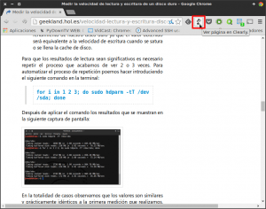
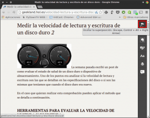

En mi caso trabajo todo el día delante de una pantalla de ordenador y cuando llego a casa a veces me pongo a leer algún que otro blog. Después de haber pasado horas y horas delante de una pantalla **a veces se me hace bastante pesado leer según que blogs porqué visualmente están cargados, la combinación de colores del tema cansa a la vista, la letra es pequeña, etc**.<!--more-->

**A las personas que les pase lo mismo les propongo instalar la extensión** [Clearly](https://evernote.com/intl/es/clearly/ "Web de Clearly") en su navegador. **Con la extensión clearly podremos emular** e incluso añadir funcionalidades al **modo de lectura que actualmente existe en Safari** para Mac OS e iOS.

###### Nota: La extensión clearly está disponible para los principales navegadores web. Como mínimo está disponible en Chrome, Chromium, Firefox y Opera. Las personas que usen Microsoft Explorer con su entorno UI tienen esta característica de serie en su navegador.

###### Nota: Que yo sea consciente los primeros y prácticamente los únicos que han implementado el modo lectura de serie en su navegador ha sido Apple. Safari incluye esta característica desde la versión 5. Esta característica también está disponible en la totalidad de dispositivos móviles de Apple a partir de iOS 5.0.

###### Nota: En lo que se refiere a dispositivos móviles Android disponer del modo lectura a día de hoy no es fácil ya que el único navegador que conozco para Android que tiene en cuenta esta característica es Firefox para Android. En un futuro cercano Google Chrome para Android pasará a incluir esta funcionalidad ya que Chromium actualmente ya incorpora este modo. A raíz de esto podemos deducir que el navegador de escritorio de Google, Chrome, pronto debería incluir también esta característica.

## ¿QUÉ ES EL MODO LECTURA EN UN NAVEGADOR?

**Para explicar lo que es el modo lectura del navegador lo mejor es hacerlo con una imagen**. La imagen que detalla claramente que es el modo lectura del navegador es la siguiente:

Como se puede ver en la captura de pantalla la diferencia salta a la vista. **Si comparamos la imagen de la izquierda con la de la derecha, veremos que en la imagen de la derecha, que es la que está en modo de lectura, se han quitado la totalidad de elementos redundantes y superfluos**. Sin la totalidad de elementos redundantes la lectura es mucho más agradable y productiva.

###### Nota: Si queréis realizar la misma prueba que he realizado en el artículo tenéis que visitar el siguiente [enlace](http://www.elladodelmal.com/2014/08/examen-master-seguridad-2014.html "Blog Chema Alonso").

## ¿POR QUÉ USAR EL MODO LECTURA EN EL NAVEGADOR?

Básicamente **los motivos** por los que me gusta disponer de un modo lectura **son 2** y son los siguientes:

1. Podemos **leer sin distracciones**. Cuando estamos leyendo un contenido que nos interesa solo veremos el contenido y nada más. Como hemos visto anteriormente desaparecen todos los menús del blog, las etiquetas, las categorías, la publicidad, etc.
2. **Visualmente cansa menos la vista**. Si volvemos a la explicación de lo que es el modo lectura podréis comprobar que es muchísimo más sencillo leer un artículo en el modo lectura.

###### Nota: Además si continúas leyendo podréis ver que la extensión clearly dispone de otras funcionalidades aparte de la función de modo lectura que destacamos en este artículo.

## INSTALAR CLEARLY

El proceso de instalación de clearly es muy simple y muy rápido. El proceso de instalación que explico es para Google Chrome y para Chromium. Para el resto de navegadores, como por ejemplo Firefox y Opera, tan solo hay realizar los pasos equivalentes a los que veremos a continuación.

Lo primero que tenemos que hacer es **acceder a la tienda de Google Chrome Store y realizar una búsqueda la palabra **clearly**.**

Una vez finalizada la búsqueda, tal y como se puede ver en la captura de pantalla, tenemos que **clicar encima del botón** **GRATIS** de la extensión Clearly de Evernote. Después de clicar encima del botón aparecerá una ventana preguntándonos si queremos instalar la extensión Clearly. Para indicar que queremos proceder con la instalación tenemos que **presionar el botón** **Añadir**. Una vez presionado el botón se añadirá el botón de la extensión en nuestro navegador web.

###### Nota: Si quieren acceder directamente a la pantalla de instalación de clearly pueden usar el siguiente [enlace](https://chrome.google.com/webstore/detail/clearly/iooicodkiihhpojmmeghjclgihfjdjhj "Enlace directo de descarga de Clearly").

## USO DEL MODO LECTURA EN EL NAVEGADOR

Una vez instalada la extensión **activar y desactivar el modo lectura es sumamente sencillo**. **Visitan una página cualquiera**. Por ejemplo pueden visitar la [siguiente]():

Una vez dentro de la página, tal y como se puede ver en la captura de pantalla, tan solo hay que **clicar encima del icono de la lámpara**. **Después de clicar encima del icono de la lámpara se activará el modo lectura**.

Como se puede ver en la captura de pantalla el modo lectura se ha activado. El artículo se visualiza con un fondo blanco y letras negras. **Si queremos cambiar el color del fondo y de las letras, el tipo de letra y su tamaño tan solo tenemos que clicar encima del icono **Aa**** de la barra lateral derecha. Allí encontraremos 3 temas de visualización predefinidos y una opción **para** personalizar nuestro propia visualización.

En el caso que por cualquier motivo se quiera **desactivar el modo lectura**, tal y como se muestra en la captura de pantalla, tienen que **presionar el botón de la flecha que está presente en la barra lateral derecha**. Así de fácil.

## OTRAS FUNCIONES DE CLEARLY

En mi caso lo único que uso de esta de clearly es el modo lectura. Pero **aparte del modo lectura, clearly aporta las siguientes funcionalidades adicionales**.

Clearly **se puede conectar con Evernote. Al conectarlo con nuestra cuenta de Evernote se abren las siguientes funcionalidades**:

1. **En el caso de ver un artículo interesante lo podemos etiquetar y almacenar de forma automática en nuestra cuenta de Evernote**. De está forma podremos leer el artículo sin conexión a internet cuando nos apetezca en nuestra cuenta de Evernote.
2. **Permite subrayar o remarcar ciertas partes del contenido que consideramos importantes**. De esta forma si abrimos el artículo al cabo de un tiempo, sabremos las partes que son interesantes y las cuales tenemos que focalizar nuestra atención.
3. **En el caso de ser usuario Premium de Evernote** tenemos la opción de texto de voz. Simplemente **apretando el botón de **texto de voz** de la barra lateral de Clearly una voz nos leerá la totalidad de contenido del artículo que tenemos en modo lectura**.

Ahora quien a priori esté interesado solo hace falta que experimente con esta extensión y vea si realmente cumple sus expectativas. A mi me funciona a la perfección y además tiene la garantía que ha sido desarrollada por Evernote.

Seguramente habrán otras opciones alternativas a la mencionada. Quien conozca alguna y la quiera compartir lo puede hacer en los comentarios de este artículo.
