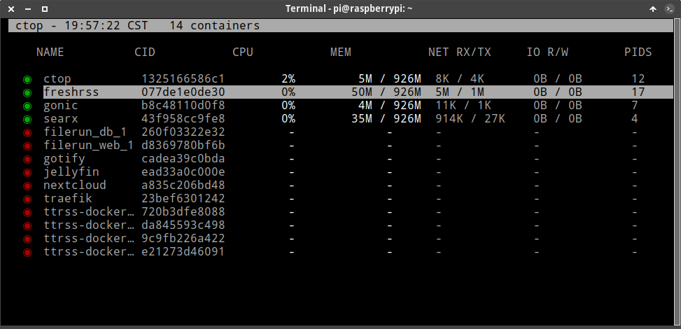
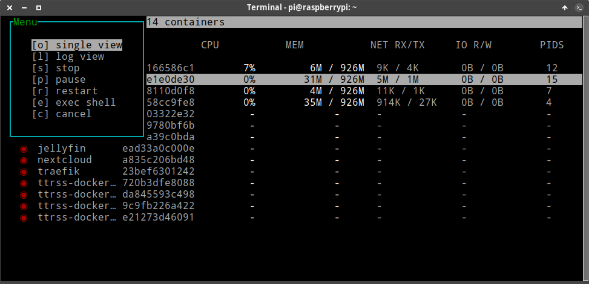
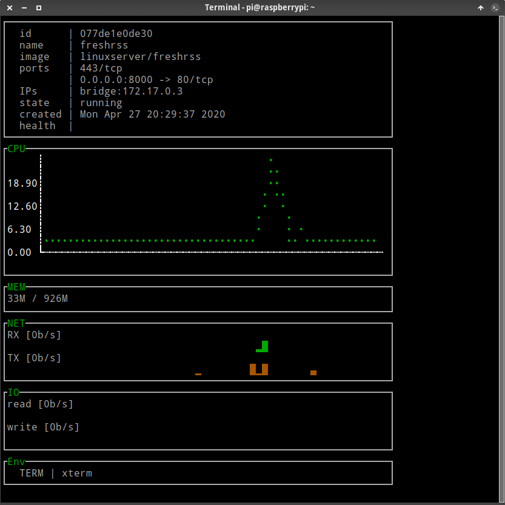
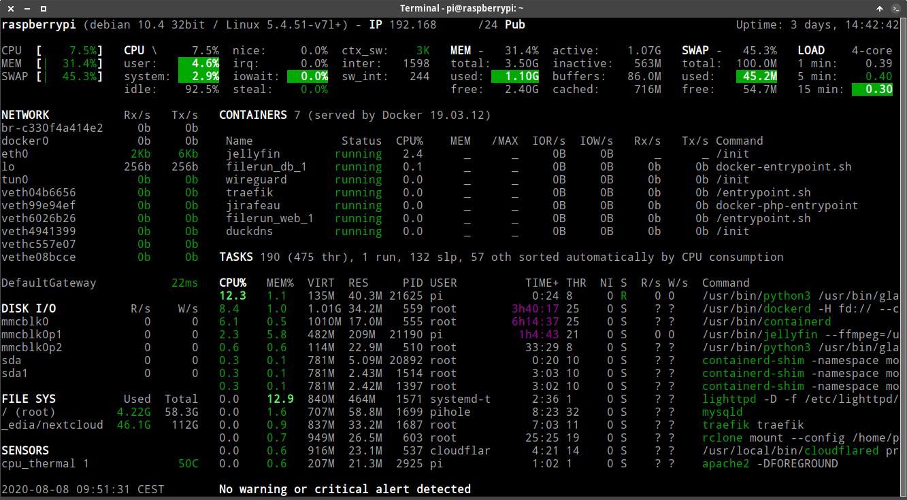
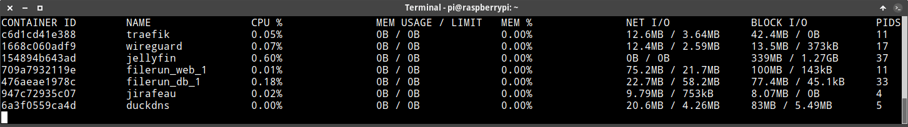
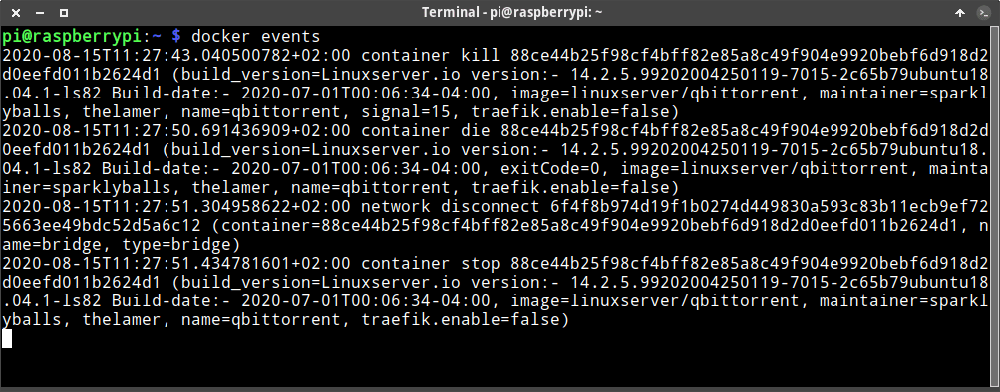

Existen varias herramientas con las que podemos monitorizar el rendimiento y saber que está pasando en nuestros contenedores Docker. Algunas de estas herramientas son Ctop, Glances y ciertos comandos que trae incorporado el mismo Docker. La primera de las opciones que analizaremos y veremos como funciona es Ctop.<!--more-->

## MONITORIZAR EL RENDIMIENTO DE NUESTROS CONTENEDORES CON CTOP

Ctop es un monitor de recursos que nos permitirá monitorizar el rendimiento de nuestros contenedores. Algunas de las opciones que proporciona ctop son las siguientes:

1. Ver el consumo de memoria y CPU por contenedor `(CPU y MEM)`.
2. Datos que se han leído y escrito en disco `(IO R/W)`.
3. Registrar el consumo de ancho de banda de cada uno de los contenedores `(NET RX/TX)`.
4. Arrancar, parar y eliminar contenedores.
5. Acceder directamente dentro de un contenedor para manipularlo y ejecutar comandos dentro de él.
6. Consultar los logs generados por el contenedor. El resultado mostrado será equivalente al ejecutar el comando `docker logs`.

### Instrucciones para instalar Ctop en su equipo

Para instalar y ejecutar el monitor Ctop en un dispositivo con arquitectura ARM tan solo tienen que ejecutar los siguientes comandos:

> ```shell
> docker pull jinnlynn/ctop:latest
> ```
> 
> ```shell
> docker run --rm -it --name ctop --volume /var/run/docker.sock:/var/run/docker.sock:ro jinnlynn/ctop
> ```

Si usan otras arquitecturas, como por ejemplo amd64, deberán ejecutar el siguiente comando:

> **`docker run --rm -it --name ctop \ --volume /var/run/docker.sock:/var/run/docker.sock:ro \ quay.io/vektorlab/ctop:latest`**

Una vez ejecutado el comando se iniciará Ctop de forma completamente automática y verán lo siguiente:

[](images/Monitorear-el-rendimiento-de-nuestros-contenedores-con-ctop.png)

### Instrucciones a seguir para monitorizar el rendimiento de nuestros contenedores

Con el cursor nos posicionamos sobre el contenedor que nos interesa y presionamos `Enter`. Acto seguido aparecerán una serie de opciones. Seleccionan la que más les interese que en mi caso es monitorizar únicamente el contenedor seleccionado. Por lo tanto selecciono la opción `Single view` y presiono Enter.

[](images/seleccionar-opcion-monitorizacion-ctop.png)

**Nota**: Las otras opciones disponibles son ver el log del contenedor, parar, pausar y reiniciar el contenedor y acceder dentro del contenedor.

El resultado obtenido es el siguiente:

[](images/resultados-al-monitorear-un-contenedor.png)

Si quieren ir atrás y volver a la pantalla principal tan solo tienen que presionar la tecla `q`.

Por lo tanto mediante el uso de los cursores y la tecla Enter podrán realizar todas las acciones mencionadas en el inicio de este apartado. Asimismo pueden usar una serie de atajos de teclado que les ayudarán a obtener la información que buscan de una forma mucho más rápida. Los atajos de teclado son los siguientes:

| Atajos de teclado | Acción |
| --- | --- |
| **o** | Para monitorizar únicamente el contenedor que hayamos seleccionado. |
| **l** | Mostrar los logs de un determinado contenedor. |
| **e** | Acceder dentro de un contenedor. |
| **q** | Ir para atrás o cerrar Ctop. |
| **ENTER** | Acceder al menú de Ctop. |
| **a** | Para mostrar en pantalla únicamente los contenedores que están corriendo. |
| **f** | Para filtrar / buscar contenedores por su nombre. Para deshabilitar el filtro aplicado deben presionar la tecla `ESC`. |
| **H o Mays+h** | Para mostrar/ocultar la cabecera que apare en la parte superior de la terminal. |
| **h** | Ayuda que muestra los atajos de teclado. |
| **s** | Para ordenar los contenedores por uso de CPU, por consumo de memoria, por nombre, por número de proceso, por consumo de ancho de banda, etc. |
| **r** | Para invertir el orden actual en que aparecen los contenedores. |

**Nota:** Para ejecutar Ctop de forma habitual les recomiendo que creen un alias porque el comando para ejecutar ctop en Docker es extremadamente largo.

Ahora que hemos terminado con Ctop pasaremos a ver las opciones que nos ofrece Glances.

## MONITORIZAR EL RENDIMIENTO DE NUESTROS CONTENEDORES CON GLANCES

Glances no es más que otro monitor de recursos, pero con diferencias importantes respecto a Ctop. La información está presentada de una forma mucho más atractiva, pero al contrario que Ctop, Glances no permite interactuar con los contenedores. Con Glances tan solo podremos ver datos estadísticos y de funcionamiento de cada uno de los contenedores.

### Instalación del monitor de recursos Glances

Glances se encuentra en los repositorios de la mayoría de distribuciones. Por lo tanto, para instalarlo en mi caso solo he tenido que ejecutar el siguiente comando en la terminal:

> ```shell
> sudo apt install glances
> ```

Si lo prefieren también lo pueden instalar mediante docker ejecutando el siguiente comando en la terminal:

> ```shell
> docker run -d -v /var/run/docker.sock:/var/run/docker.sock:ro --pid host -p 61208:61208 -e GLANCES_OPT="-w" jdreinhardt/glances:latest
> ```

**Nota**: Si instalan Glances en Docker tengan en cuenta que Glances estará monitorizando nuestro equipo de forma permanente. Si quieren parar la monitorización tienen que parar el contenedor.

### Iniciar el monitor de recursos Glances y datos que nos mostrará

Si han instalado Glances mediante repositorios tan solo tenéis que ejecutar el comando `glances` en la terminal para que se abra el monitor de recursos. Si lo habéis realizado a través de Docker tendréis que abrir un navegador y acceder a la siguiente URL:

> ```shell
> http://IP_servidor:61208
> ```

Una vez iniciado el software veremos que nos proporcionará datos interesantes sobre los contenedores de Docker que tenemos levantados y están funcionando. Un ejemplo del contenido mostrado por Glances es el siguiente:

[](images/resultados-glances.png)

Si observan la captura de pantalla verán datos útiles de los contenedores presentados de forma clara y atractiva. Algunos de los datos que podrán ver son:

1. Contenedores que tenemos levantados y el % de CPU que está consumiendo cada contenedor.
2. La cantidad total de memoria que está usando un contenedor y saber la cantidad total de memoria que un contenedor está autorizado a usar.
3. La cantidad de memoria que está consumiendo cada uno de los contenedores.
4. Cantidad total de datos leídos y escritos por cada uno de los contenedores.
5. Datos recibidos y enviados por parte de cada uno de los contenedores que tenemos levantados.
6. Detalle de las redes que tenemos levantadas y el tráfico de entrada y salida que se genera en cada una de las redes.

Otra de las opciones disponibles para obtener información sobre el funcionamiento de nuestros contenedores es consultar los logs de Docker de la siguiente forma.

## ANALIZAR QUE PASA EN LOS CONTENEDORES DOCKER MEDIANTE LOS LOGS

Mediante los logs podemos obtener información importante sobre el funcionamiento de cada uno de los contenedores. Para consultar los logs deberán proceder del siguiente modo.

### Consultar los logs del contenedor con Docker logs y obtener detalles de lo que está ocurriendo en nuestros contenedores

Disponemos de logs en todos y cada uno de los contenedores que tenemos instalados y corriendo en nuestro equipo. Los logs nos permitirán obtener la siguiente información:

1. Detectar errores en el caso que un contenedor no se levante o no funcione como es de esperar.
2. Confirmar que el funcionamiento del contenedor es correcto y no se producen errores.
3. Observar si en un determinado momento se realizo la operación que se tenia que realizar.

Para poder consultar los logs de un contenedor determinado tan solo tienen que ejecutar un comando del siguiente tipo:

> ```shell
> docker logs -f 'nombre o identificador del contenedor'
> ```

Por lo tanto para ver los logs del contenedor de DuckDNS ejecutaré el siguiente comando en la terminal:

> **`docker logs -f duckdns`**

En mi caso los resultados obtenidos al ejecutar el comando han sido los siguientes:

```shell
-------------------------------------
GID/UID
-------------------------------------

User uid:    1000
User gid:    1000
-------------------------------------

[cont-init.d] 10-adduser: exited 0.
[cont-init.d] 40-config: executing... 
Retrieving subdomain and token from the environment variables
log will be output to file
Your IP was updated at Sat Aug 1 09:49:41 CEST 2020
[cont-init.d] 40-config: exited 0.
[cont-init.d] 99-custom-files: executing... 
[custom-init] no custom files found exiting...
[cont-init.d] 99-custom-files: exited 0.
[cont-init.d] done.
[services.d] starting services
[services.d] done.
```

Si leemos el contenido de los logs y tenemos paciencia podremos ver detalles interesantes sobre el funcionamiento del contenedor. Por ejemplo en el caso de DuckDNS podemos ver que el día 1 de Agosto a las 09:49:41 se asocio una nueva IP a mi dominio.

**Nota**: Es altamente recomendable consultar los logs del contenedor la primera vez que lo arrancamos. De esta forma podremos asegurar que funciona de forma correcta.

Podemos añadir opciones adicionales al comando que acabamos de aplicar. De este modo podremos filtrar los resultados mostrados en pantalla y encontrar la información que buscamos de forma más fácil y más rápida. Las opciones adicionales que pueden añadir son:

| Opciones | Función |
| --- | --- |
| `--since` | Mostrar los logs desde una fecha determinada. |
| `--until` | Mostrar los logs hasta una fecha determinada. |
| `-f` | Monitorizar el log de forma continua. |
| `--tail` | Indicar el número de líneas que queremos mostrar del log. |
| `-t` | Para mostrar el día y la hora en que se ha registrado el log. |
| `--details` | Ver información adicional sobre un log. |

A modo de ejemplo si queremos ver las últimas 5 líneas del log del contenedor Jellyfin ejecutaré el siguiente comando en la terminal:

> ```shell
> docker logs --tail 5 jellyfin
> ```

Si pretendemos ver todos los logs generados entre el 13/08/2020 a las 00:01 hasta el 14/08/2020 a las 00:01 podemos ejecutar el siguiente comando:

> ```shell
> docker logs --since 2020-08-13T00:00:01 --until 2020-08-14T00:00:01 jellyfin
> ```

Para consultar los logs generados durante los últimos 10 minutos en Jellyfin usaré el siguiente comando:

> ```shell
> docker logs --since 10m jellyfin
> ```

### Consultar los logs generados por el propio servicio Docker

El propio servicio de Docker estará registrando logs sobre su funcionamiento. Por lo tanto si Docker no funciona tal y como esperamos les recomiendo que ejecuten los siguientes comandos:

> ```shell
> journalctl -u docker.service | less
> ```
> 
> ```shell
> less /var/log/messages | grep docker
> ```
> 
> **`/var/log/messages`**

Una vez ejecutados los comandos deberán analizar cuidadosamente los resultados para intentar detectar donde está realmente el problema.

Si quieren obtener más información de como consultar los logs de un container les recomiendo que consulten el siguiente enlace:

[https://docs.docker.com/config/containers/logging/](https://docs.docker.com/config/containers/logging/ "Más información de como consultar logs en Docker")

### Entrar dentro del contenedor y mirar manualmente los logs.

Otra opción que pueden considerar es entrar directamente en el contenedor que quieren monitorizar. Una vez dentro del contenedor pueden [consultar los logs]() o usar un monitor de recursos como por ejemplo [top]() para saber lo que está sucediendo. Para acceder dentro del contenedor que estamos usando lo podemos hacer mediante Ctop o mediante la ejecución de un comando del siguiente tipo:

> ```shell
> docker exec -it nombre_contenedor bash
> ```

**Nota**: Deberéis reemplazar nombre\_contenedor por el nombre del contenedor al que quieren acceder.

Si el comando anterior no les funciona es posible que sea porque no dispone de la shell de bash. En tal caso es posible que use la shell sh. Por lo tanto deberán ejecutar el siguiente comando:

> ```shell
> docker exec -it nombre_contenedor sh
> ```

Una vez dentro del contenedor ya podrán consultar los logs o usar un monitor de recursos de la misma forma que lo harían en su sistema operativo habitual. Para finalizar el artículo veremos una serie de comandos que también podemos usar para monitorizar el rendimiento de nuestros contenedores.

## COMANDOS A USAR PARA MONITORIZAR EL RENDIMIENTO NUESTROS CONTENEDORES

Docker dispone de una serie de comandos para que podamos saber en todo momento lo que sucede en nuestro contenedores. Algunos de estos comandos son los siguiente:

1. Docker stats
2. Docker info
3. Docker events

A continuación veremos en detalle cada uno de ellos.

### Monitorizar el rendimiento de nuestros contenedores con docker stats

El comando `docker stats` mostrará datos de funcionamiento en tiempo real de los contenedores que tenemos levantados y funcionando. Por lo tanto si abrimos una terminal y ejecutamos el comando:

> ```shell
> docker stats
> ```

Obtendremos un resultado similar el siguiente:

[](images/resultados-mostrados-docker-stats.png)

Los datos que se muestran son los siguientes:

1. Número de contenedores que están corriendo.
2. Consumo de CPU de cada uno de los contenedores. `(CPU %)`
3. Memoria que están consumiendo cada uno de los contenedores. `(MEM USAGE / LIMIT)`
4. Cantidad de datos que el contenedor ha recibido y enviado a través de la red. `(NET I/O)`
5. Cantidad de datos que un contenedor a leído y escrito en disco. `(BLOCK IO)`
6. Número de proceso del contenedor. `(PIDS)`

Si solo quisieran obtener información de un contenedor en concreto, como por ejempo traefik, tan solo tendrían que añadir el nombre del contenedor al comando anterior. Por lo tanto ejecutaríamos:

> ```shell
> docker stats traefik
> ```

Si queremos que los resultados no se vayan refrescando periódicamente y solo pretendemos obtener una foto del estado del contenedor en el momento de ejecutar el comando tendremos que añadir la opción `--no-stream`. Por lo tanto ejecutaríamos el siguiente comando:

> ```shell
> docker stats --no-stream traefik
> ```

Docker stats también nos permite modificar la forma en que se muestran los resultados. Por ejemplo si solo queremos que se muestre el nombre de los contenedores y su consumo de CPU sin ninguna cabecera y separando los resultados mostrados por `:` ejecutaremos el siguiente comando en la terminal:

> ```shell
> docker stats --format "{{.Name}}: {{.CPUPerc}}"
> ```

Si ahora queremos mostrar el mismo resultado, pero que salga correctamente tabulado por columnas ejecutaremos el siguiente comando:

> ```shell
> docker stats --format "{{.Name}}:\t {{.CPUPerc}}"
> ```

Si además queremos que se muestren las cabeceras para saber que es exactamente cada uno de los resultados mostrados ejecutaremos el siguiente comando:

> ```shell
> docker stats --format "table {{.Name}}:\t {{.CPUPerc}}"
> ```

Para finalizar solo comentar que el el formato stándard que aplica docker stats es `"table {{.ID}}\t{{.Name}}\t{{.CPUPerc}}\t{{.MemUsage}}\t{{.MemPerc}}\t{{.NetIO}}\t{{.BlockIO}}\t{{.PIDs}}"`. Por lo tanto si ejecutamos el siguiente comando veremos exactamente lo mismo que si ejecutáramos el comando `docker stats`.

> ```shell
> docker stats --format "table {{.ID}}\t{{.Name}}\t{{.CPUPerc}}\t{{.MemUsage}}\t{{.MemPerc}}\t{{.NetIO}}\t{{.BlockIO}}\t{{.PIDs}}"
> ```

### Obtener información de nuestros contenedores con Docker events

Para ver monitorizar los eventos de todo lo que pasa en Docker podemos ejecutar el siguiente comando en la terminal:

> ```shell
> docker events
> ```

Una vez ejecutado el comando, la terminal quedará bloqueada a la espera de mostrar eventos relacionados con nuestros contenedores. A modo de ejemplo en el momento de parar un contenedor se mostrará del siguiente resultado:

[](images/monitorizar-eventos-contenedor-docker-events.png)

La totalidad de eventos que podremos registrar los encontraréis en el siguiente [enlace](https://docs.docker.com/engine/reference/commandline/events/ "Información adicional sobre los eventos en Docker"). A continuación muestro un breve resumen de los eventos más importantes que podemos registrar:

1. Creación o eliminación de un contenedor.
2. La creación o eliminación de una red.
3. Todo tipo de operaciones realizadas con plugins.
4. La actualización de una imagen.
5. Etc.

### Información aportada por el comando Docker info

Para finalizar con el artículos veremos el comando `docker info`. Si abren una terminal y ejecutan el siguiente comando:

> ```shell
> docker info
> ```

Obtendremos información genérica sobre Docker. Algunos de los datos que podrán obtener son los siguientes:

1. Número de imágenes y contenedores que tenemos en nuestro servidor.
2. Contenedores que están levantados y que por lo tanto estamos usando.
3. Datos e información sobre el sistema operativo en que tenemos instalados los contenedores.
4. El directorio raíz de Docker.
5. Etc.

Si conocen algún otro método útil para que saber lo que está ocurriendo y obtener información de los contenedores les ruego que los citen en los comentarios del artículo.

**Fuentes**

[https://thorsten-hans.com/docker-container-metrics-ctop](https://thorsten-hans.com/docker-container-metrics-ctop)

[https://docs.docker.com/engine/reference/commandline/stats/](https://docs.docker.com/engine/reference/commandline/stats/)

[https://docs.docker.com/config/containers/logging/](https://docs.docker.com/config/containers/logging/)

[https://docs.docker.com/engine/reference/commandline/events/](https://docs.docker.com/engine/reference/commandline/events/)
