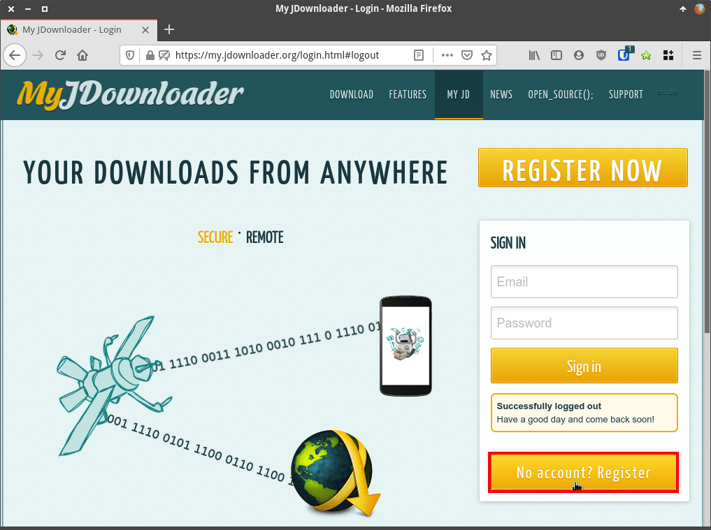
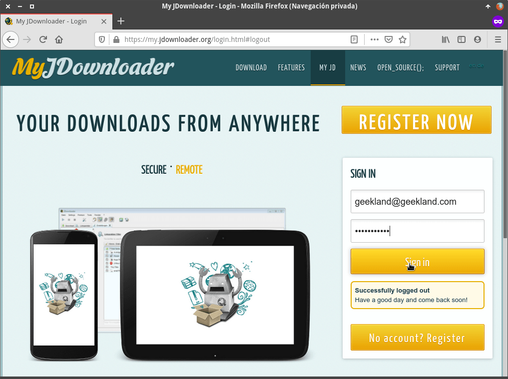
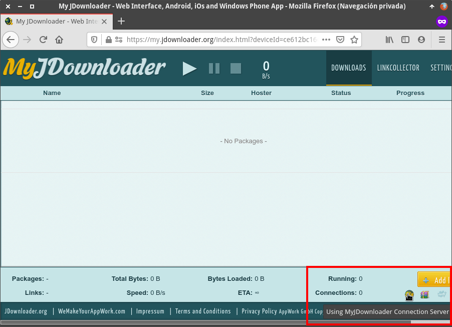
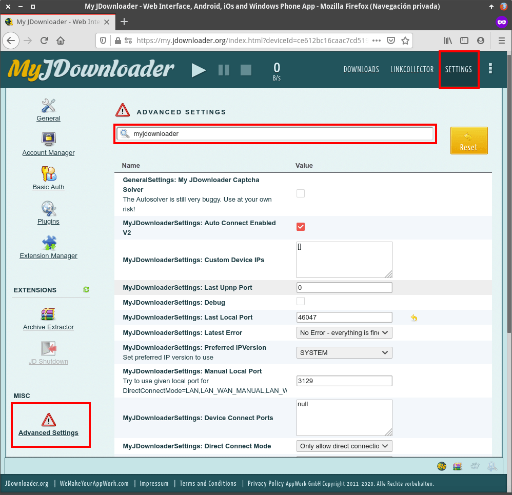
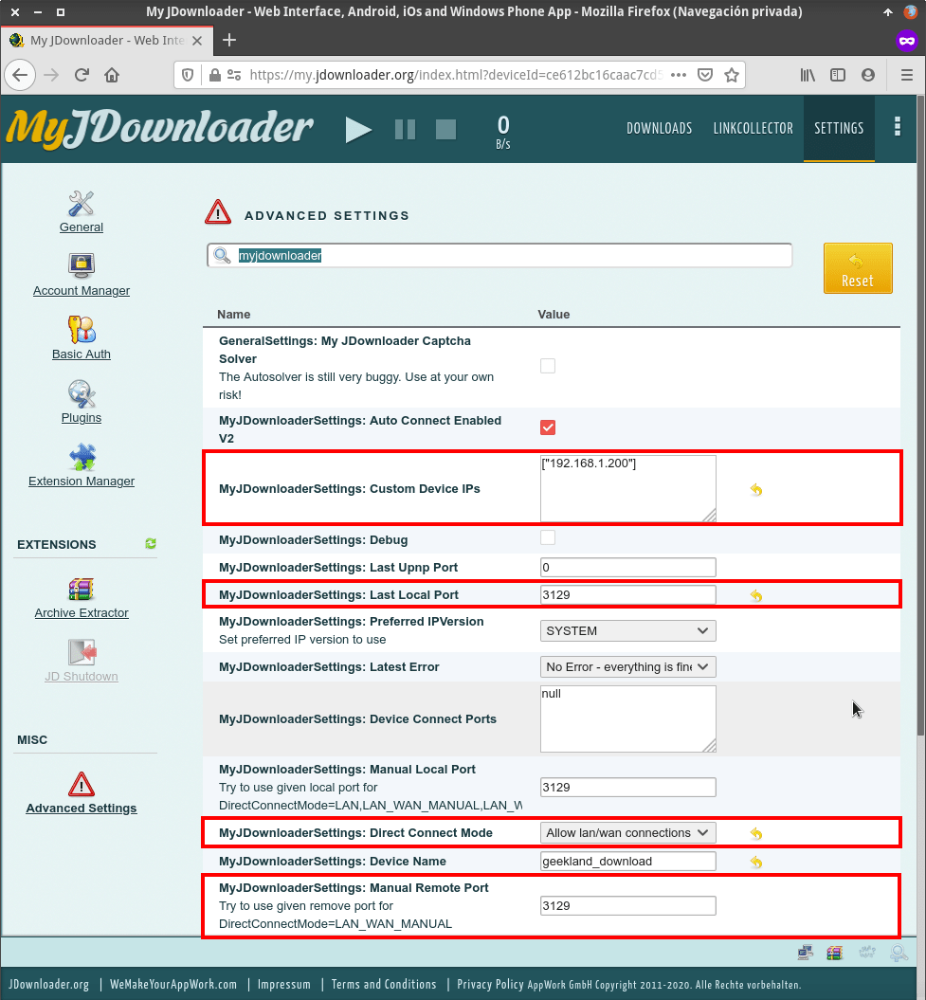
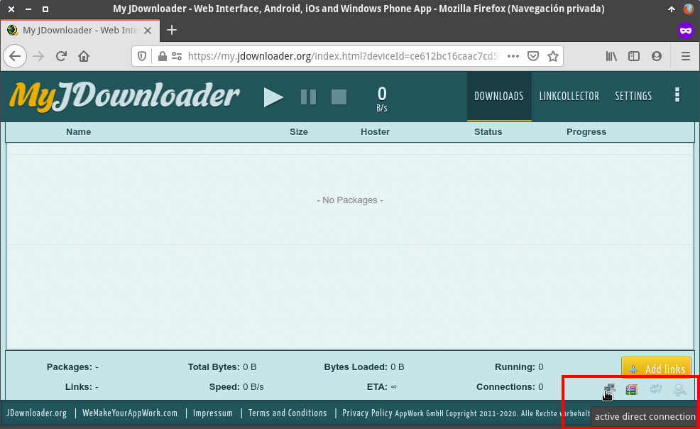
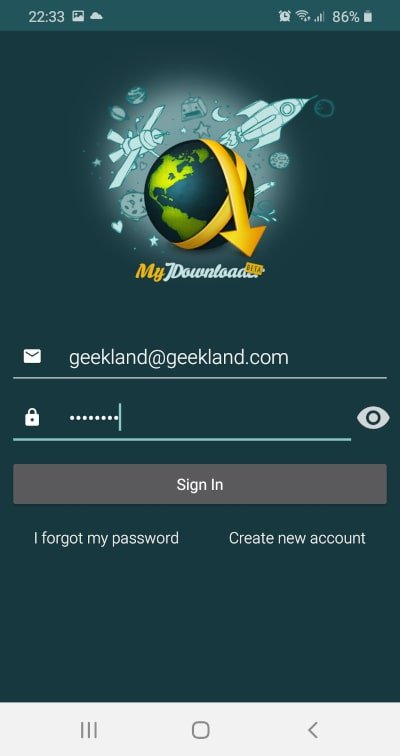
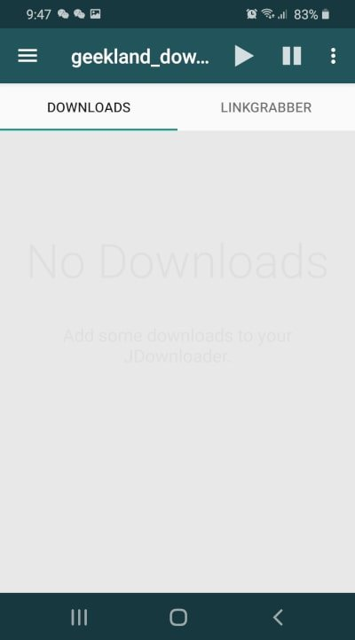

A continuación detallaremos como podemos montar nuestro propio gestor de descargas remoto con JDownloader y MyJDownloader en una Raspberry o en cualquier equipo en el que podamos instalar Docker.<!--more-->

## ¿QUÉ PODREMOS REALIZAR CON NUESTRO SERVIDOR O GESTOR DE DESCARGAS?

Con JDownloader y MyJDownloader podremos gestionar y realizar descargas con las siguientes particularidades:

1. Podremos **descargar enlaces de prácticamente la totalidad de plataformas de descarga directa** y alojamiento de vídeos como por ejemplo Mega, 1ficiher, uptbox, uptoload, youtube, archive.org, WeTransfer, OneDrive, Google Drive y un larguísimo etc.
2. Estemos donde estemos y **sin necesidad de abrir puertos en nuestro router** podremos ver el estado de nuestras descargas, podremos iniciar nuevas descargas de forma cómoda, etc. Esto es así porque MyJDownloader es una interfaz gráfica que nos dará acceso remoto a nuestro gestor de descargas JDownloader.
3. **No tendremos que preocuparnos de introducir captcha** para iniciar las descargas. JDownloader tiene una función experimental para solucionar los captcha de forma automática. En el caso que no se puedan descifrar los captcha recibiremos una notificación y podremos completarlos manualmente.
4. **Podemos dejar encendido el servidor de descargas sin tener que preocuparnos si hemos excedido las limitaciones de las plataformas de descarga**. En caso que las excedamos tendremos que esperar y cuando se hayan reseteado nuestro gestor de descargas continuará con las descargas pendientes.
5. En el caso que el contenido que descargamos esté en formato comprimido no hay problema. Justo después de finalizar la descarga el contenido se descomprimirá. **En el momento de finalizar la descarga encontraremos el contenido listo para consumir** en nuestra carpeta de descargas.
6. **La velocidad de descarga de los ficheros puede ser superior a si los descargamos manualmente en el navegador**. Esto es así porque en algunos casos el gestor de descargas puede abrir más de un hilo de descarga para un mismo fichero.
7. En caso que nos interese **podremos priorizar o limitar la velocidad de descarga de nuestros ficheros**. Esta función puede ser especialmente útil en caso que tengamos conexiones de Internet con velocidad reducida.

## CREARSE UNA CUENTA EN MYJDOWNLOADER

En nuestro servidor de descargas, que en mi caso será una Raspberry Pi, instalaremos el gestor de descargas JDownloader sin interfaz gráfica mediante Docker. La forma de conectarnos a JDownloader y gestionar nuestras descargas será mediante MyJDownloader.

Por lo tanto lo primero que tenemos que realizar es hacernos una cuenta de usuario de MyJDownloader accediendo a la siguiente URL:

[https://my.jdownloader.org/login.html#logout](https://my.jdownloader.org/login.html#logout "URL para registrarse a MyJDownloader")

Una vez dentro de la URL clicamos sobre el botón de `No account? Register` y seguimos las instrucciones para registrarnos a MyJDownloader.

[](images/registrarse-a-myjdownloader.png)

Una vez registrados tendrán un usuario y una contraseña que en mi caso son:

usuario: `geekland@geekland.com` contraseña: geekland

## INSTALAR DOCKER Y DOCKER-COMPOSE

Con la cuenta de MyJDownloader generada instalaremos Docker en el equipo en que instalaremos JDownloader. Las instrucciones a seguir para instalar Docker son las que dejo en el siguiente enlace:

https://geekland.eu/instalar-docker-y-docker-compose-en-linux/

## DEFINIR Y CREAR LOS VOLÚMENES DE PERSISTENCIA Y EL DIRECTORIO EN QUE SE DESCARGARÁ EL CONTENIDO

A continuación definiremos los volúmenes de persistencia y donde queremos almacenar los archivos descargados. Para ello seguiremos las siguientes instrucciones.

### Definir los volúmenes de persistencia del contenedor

Lo primero que realizaremos es definir un directorio que será el encargado de almacenar nuestras descargas. En mi caso almacenaré las descargas en el directorio `/media/hd/downloads`. Para crear el directorio en mi caso procederé del siguiente modo:

> **`pi@raspberrypi:~ $ cd /media/hd pi@raspberrypi:~ $ mkdir downloads`**

Una vez creado el directorio que almacenará las descargas crearemos 2 directorios adicionales que almacenarán los ficheros de configuración y logs del servicio de MyJDownloader. Los logs quiero que se almacenen en la dirección `/media/hd/services/jdownloader/config` y la configuración en `/media/hd/services/jdownloader/config`. Para ello ejecutaremos ejecutaremos los siguiente comandos:

> ```shell
> pi@raspberrypi:~ $ cd /media/hd/services
> pi@raspberrypi:/media/hd/services $ mkdir jdownloader
> pi@raspberrypi:/media/hd/services $ cd jdownloader
> pi@raspberrypi:/media/hd/services/jdownloader $ mkdir config
> pi@raspberrypi:/media/hd/services/jdownloader $ mkdir logs
> ```

A estas alturas ya estamos listos para levantar el contenedor que alojará nuestro gestor de descargas remoto.

## LEVANTAR EL CONTENEDOR DE JDOWNLOADER PARA TENER DISPONIBLE NUESTRO GESTOR DE DESCARGAS

Para levantar el contenedor de MyJDownloader crearemos un fichero docker-compose ejecutando el siguiente comando:

> ```shell
> pi@raspberrypi:~/jdownloader $ nano docker-compose.yml
> ```

Una vez se abra el editor de textos pegaremos el siguiente código.

> ```shell
> version: '3'
> 
> services:
>    jdownloader:
>     image: jaymoulin/jdownloader
>     container_name: jdownloader
>     restart: unless-stopped
>     user: 1000:100
>     volumes:
>         - /media/hd/services/jdownloader/config:/opt/JDownloader/cfg
>         - /media/hd/downloads:/opt/JDownloader/Downloads
>         - /media/hd/services/jdownloader/logs:/opt/JDownloader/logs
> 
>     environment: 
>             MYJD_USER: geekland@geekland.com
>             MYJD_PASSWORD: geekland
>             MYJD_DEVICE_NAME: geekland_download
>             XDG_DOWNLOAD_DIR: /opt/JDownloader/Downloads
>     ports:
>         - 3129:3129
> ```

**Nota:** Válido para equipos con arquitectura amd64 y arm.

Las partes de color azul del código que acabáis de pegar las deberéis reemplazar siguiendo las siguientes instrucciones:

- `1000`: Hay que reemplazar el `1000` por el user id del usuario que ejecuta el contenedor de Docker. Para averiguar el user id del usuario tendréis que ejecutar el comando `id` seguido del nombre del usuario que ejecutará el contenedor de Docker. En mi caso el usuario que ejecuta Docker es `pi`, por lo tanto el comando que ejecutaré será `id pi`.
- `geekland@geekland.com`: Hay que poner la cuenta de email con la que nos registramos a MyJDownloader.
- `geekland`: Tendréis que reemplazar `geekland` por la contraseña que definimos para MyJDownloader.
- `geekland_download`: Debéis reemplazar `geekland_download` por una palabra cualquiera que os ayude a identificar el equipo en que estamos instalando el gestor de descargas.
- `/media/hd/services/jdownloader/config`: Reemplazar la ruta del ejemplo por la ruta que hayáis definido para almacenar los ficheros de configuración.
- `/media/hd/downloads`: Sustituir la ruta del ejemplo por la ruta en que queréis descargar los ficheros.
- `/media/hd/services/jdownloader/logs`: Reemplazar la ruta del ejemplo por la ruta que en que queréis almacenar los logs de JDownloader.

Una vez pegado el código guardamos los cambios y cerramos el fichero. A continuación tan solo tenemos que ejecutar el siguiente comando para levantar el contenedor.

> ```shell
> pi@raspberrypi:~/jdownloader $ docker-compose up -d
> Creating network "jdownloader_default" with the default driver
> Pulling jdownloader (jaymoulin/jdownloader:)...
> latest: Pulling from jaymoulin/jdownloader
> 905674ea9d94: Pull completeInstalar un gestor de descargas remoto con JDownloader y MyJDownloader para poder descargar todo tipo de enlaces de descarga directa.
> d91fe322e169: Pull complete
> 3598bf75cef8: Pull complete
> e66c33bcc110: Pull complete
> 02c5162db231: Pull complete
> 128bb1d337bc: Pull complete
> 33d79945fb57: Pull complete
> 96916b4c3436: Pull complete
> 546a7405264d: Pull complete
> 15b07ec4d9cd: Pull complete
> d23975164a25: Pull complete
> Digest: sha256:3c2581a7b6b93194c566b2d3410845909a8b78009737950ea98f501c81093cbc
> Status: Downloaded newer image for jaymoulin/jdownloader:latest
> Creating jdownloader ... done
> ```

Una vez levantado el contenedor el procedimiento ha fanilizado. Tan solo tenemos que esperar unos segundos o minutos para que nuestro gestor de descargas esté 100% disponible y listo para trabajar.

## INSTRUCCIONES PARA CONECTARSE AL SERVIDOR DE DESCARGAS

Existen varias formas para conectarse y gestionar el servidor de descargas. Lo podemos hacer a través hacer a través de:

1. Una interfaz Web.
2. Un aplicación de Android o iOS que podemos instalar en nuestro teléfono.
3. Extensiones que podemos instalar en nuestro navegador.

En mi caso uso las opciones 1 y 3 del siguiente modo.

### Conectarse al gestor de descargas mediante el navegador web

Para conectarnos desde cualquier lugar a nuestro gestor de descargas abrimos el navegador y accedemos la siguiente URL:

[https://my.jdownloader.org/apps/?ref=myjd\_web](https://my.jdownloader.org/apps/?ref=myjd_web "Conectarse al gestor de descargas MyJDownloader")

Una vez dentro de la URL introducimos nuestro usuario y contraseña y presionamos el botón `Sign in`.

[](images/acceder-al-gestor-de-descargas-myjdownloader.png)

Acto seguido podrán empezar a gestionar sus descargas de forma simple y totalmente intuitiva.

#### Habilitar el modo directo "Direct Mode" para que el proceso de descarga sea más fluido

De buenas a primeras, toda la comunicación entre el gestor de descargas remoto y el cliente que usamos para conectarnos a él se hace a través de los servidores de MyJDownloader. Esto es así porque en la parte inferior derecha aparece el icono de MyJDownloader indicando que la conexión se realiza a través de los servidores de MyJDownloader.

[](images/myjdownloader-sin-conexion-directa.png)

Si queremos establecer una conexión directa entre el gestor de descarga y el cliente deberemos clicar en el botón de `Seetings`. A posteriori clicaremos encima del botón `Advanced Settings` y en el cuadro de búsqueda escribiremos las palabras `myjdownloader`.

[](images/configuracion-inicial-myjdownloader.png)

Acto seguido cambiaremos los siguientes parámetros de la configuración:

- `MyJDownloaderSettings: Custom Device IPs`: Tenemos que indicar la IP del servidor que tiene instalado el gestor de descargas de JDownloader. En mi caso la IP es la `192.168.1.200`
- `MyJDownloaderSettings: Last Local Port`: Indicamos el puerto en que está escuchando JDownloader. Cuando levantamos el contenedor expusimos el puerto 3129, por lo tanto en este apartado deberemos introducir el puerto 3129. También asegurad que los parámetros `MyJDownloaderSettings: Manual Local Port` y `MyJDownloaderSettings: Manual Remote Port` apunten al puerto 3129.
- `MyJDownloaderSettings: Direct Connect Mode`: Establecemos el parámetro `Allow lan/wan connections`. De este modo podremos establecer el modo de conexión directa tanto dentro como fuera de nuestra red local. Para establecer la conexión directa fuera de la red local será necesario abrir el puerto 3129 en el router y mapear el puerto a la dirección IP del equipo que contiene nuestro gestor de descargas.

[](images/configuracion-final-myjdownloader.png)

Si ahora os fijáis en la parte inferior derecha, en vez del icono de JDownloader, aparece el icono de un ordenador indicando que el modo `conexión directa` está activado.

[](images/modo-conexion-directa-activado.png)

De está forma la respuesta de la interfaz gráfica será más fluida. A pesar de establecer el modo de conexión directa para ciertos procesos como por ejemplo las notificaciones y el proceso de autenticación seguirán dependiendo de los servidores de MyJDownloader.

### Conectarse al gestor de descargas a través de nuestro teléfono o tablet

MyJDownloader dispone de aplicaciones móviles para gestionar las descargas para Android e iOS. Las podemos encontrar en la AppStore o en la Google Play Store. Para instalarlas tan solo tenéis que clicar en los siguientes links:

[https://play.google.com/store/apps/details?id=org.appwork.myjdandroid&hl=es&gl=US](https://play.google.com/store/apps/details?id=org.appwork.myjdandroid&hl=es&gl=US "URL para instalar la APP de MyJDownloader en Android")

[https://apps.apple.com/es/app/myjdownloader-remote/id1203271558](https://apps.apple.com/es/app/myjdownloader-remote/id1203271558 "URL para instalar la APP de MyJDownloader en iOS")

Una vez instalada tan solo tienen que abrirla e introducir su usuario y contraseña.

[](images/login-myjdownloader-android.jpg)

Acto seguido podrán gestionar sus descargas de forma cómoda y práctica.

[](images/myjdownloader-en-android.jpg)

#### Fuentes

[https://hub.docker.com/r/jaymoulin/jdownloader](https://hub.docker.com/r/jaymoulin/jdownloader)

[https://github.com/jaymoulin/docker-jdownloader](https://github.com/jaymoulin/docker-jdownloader)
