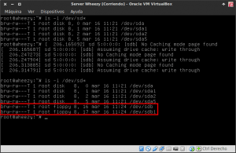
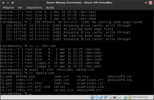

No es algo habitual pero a veces cuando se trabaja con servidores, en caso de avería, o en cualquier otra circunstancia, aparece la necesidad de usar una memoria USB sin disponer de ningún entorno gráfico.

Para poder montar la memoria USB desde la terminal y sin la necesidad de ningún entorno gráfico que automonte la memoria, tan solo tenemos que seguir los siguientes pasos:<!--more-->

## PASO 1: CREAR EL DIRECTORIO PARA MONTAR LA MEMORIA USB

El primer paso a realizar es crear el directorio en que queremos montar la memoria USB. Para crear el directorio en que queremos montar la memoria USB **tecleamos el siguiente comando en la terminal**:

> ```
> mkdir /media/usb
> ```

###### Nota: Este comando lo que hace es crear una carpeta con nombre media, y dentro de la carpeta con nombre media se creara otra carpeta con el nombre usb. En la ubicación /media/usb que acabamos de crear es donde estarán y se montarán la totalidad de archivos y directorios que tenemos en nuestra memoria USB.

###### Nota: En el caso que queramos montar 2 memorias USB de forma simultanea tan solo tendríamos que montar otra ubicación, como por ejemplo /media/usb2, y aplicar los pasos que mostraremos a continuación para cada una de las memorias y directorios que hemos creado.

## PASO 2: IDENTIFICAR EL NOMBRE DE LA UNIDAD QUE QUEREMOS MONTAR

Cada dispositivo que conectamos a nuestro sistema operativo se reconoce con un nombre determinado. Ahora lo que tenemos que hacer es averiguar con que nombre se reconoce nuestra memoria USB. Para ello **tecleamos el siguiente comando en la terminal sin tener el USB enchufado en el ordenador:**

> ```
> ls -l /dev/sd*
> ```

Una vez tecleado el comando los **aparecerá un resultado similar al siguiente:**

```
 brw-rw--- T 1 root disc 8, 0 mar 16 11:21 /dev/sda
 brw-rw--- T 1 root disc 8, 1 mar 16 11:21 /dev/sda1
 brw-rw--- T 1 root disc 8, 2 mar 16 11:21 /dev/sda2
 brw-rw--- T 1 root disc 8, 5 mar 16 11:21 /dev/sda5
```

Esto simplemente nos indica que nuestro ordenador tiene un solo dispositivo con el nombre **sda** que es nuestro disco duro. **sda1, sda2 y sda5** serán las distintas particiones que tiene nuestro disco duro que en mi caso son la boot, la root y la home.

Seguidamente **enchufamos el dispositivo USB en el ordenador y tecleamos de nuevo el mismo comando en la terminal:**

> ```
> ls -l /dev/sd*
> ```

**Ahora aparte del contenido que aparecía antes aparecerá contenido adicional**. **El contenido adicional** que aparecerá hace referencia a nuestra memoria USB y **será algo parecido a lo siguiente:**

```
 brw-rw--- T 1 root disc 8, 0 mar 16 11:21 /dev/sda
 brw-rw--- T 1 root disc 8, 1 mar 16 11:21 /dev/sda1
 brw-rw--- T 1 root disc 8, 2 mar 16 11:21 /dev/sda2
 brw-rw--- T 1 root disc 8, 5 mar 16 11:21 /dev/sda5
 brw-rw--- T 1 root floppy 8, 16 mar 16 11:24 /dev/sdb
 brw-rw--- T 1 root floppy 8, 17 mar 16 11:24 /dev/sdb1
```

Como se puede en la salida del comando **ha aparecido un dispositivo nuevo con nombre /dev/sdb** **el cual contiene una partición con nombre sdb1**. Sin duda se trata de nuestra memoria USB y **la partición que estábamos buscando y tenemos que montar es la /dev/sdb1.**

Seguidamente les dejo una captura de pantalla en la que pueden ver el proceso que seguido para la identificación de la denominación de la memoria USB.

[](images/Identificar-memoria-USB.png)

## PASO 3: MONTAR LA MEMORIA USB CON LA TERMINAL

Con la información que tenemos ya podemos montar la memoria USB. En mi caso el sistema de archivos de mi memoria USB es FAT. Por lo tanto **en el caso que sistema de archivos de la memoria USB o pendrive sea [FAT](https://es.wikipedia.org/wiki/ExFAT "Explicación de lo que es el sistema de archivos FAT") el comando a usar para montar la memoria USB es el siguiente:**

> ```
> mount -t vfat /dev/sdb1 /media/usb
> ```

###### Nota: La palabra mount indica montar. Con el parámetro \-t vfat estamos especificando que el sistema de archivos a montar es del tipo FAT. /dev/sdb1 es la partición de nuestra memoria USB y /media/usb es el directorio en que se montará el contenido de la partición /dev/sdb1 de nuestra memoria USB.

**En el caso que mi memoria USB estuviera formateada en [NTFS](https://es.wikipedia.org/wiki/NTFS "Explicación de lo que es el sistema de archivos NTFS")** el comando para montar la memoria USB seria el siguiente:

> ```
> mount -t ntfs-3g /dev/sdb1 /media/usb
> ```

###### Nota: La palabra mount indica montar. Con el parámetro \-t ntfs-3g estamos especificando que el sistema de archivos a montar es del tipo NTFS. /dev/sdb1 es la partición de nuestra memoria USB y /media/usb es el directorio en que se montará el contenido de la partición /dev/sdb1 de nuestra memoria USB.

**En el caso poco probable que alguien tenga formateada su memoria USB en formato [ext4](https://es.wikipedia.org/wiki/Ext4 "Explicación de lo que es el sistema de archivos Ext4")** el comando para montar la memoria USB debería ser el siguiente:

> ```
> mount -t ext4 /dev/sdb1 /media/usb
> ```

###### Nota: La palabra mount indica montar. Con el parámetro \-t ext4 estamos especificando que el sistema de archivos a montar es del tipo ext4. **/dev/sdb1** es la partición de nuestra memoria USB y /media/usb es el directorio en que se montará el contenido de la partición /dev/sdb1 de nuestra memoria USB.

## PASO 4: REALIZAR LAS OPERACIONES QUE TENEMOS QUE REALIZAR

Una vez realizados todos estos pasos ya tenemos la memoria USB montada y es plenamente operativa.

Ahora **mediante la introducción de comandos en la terminal ya podemos renombrar archivos dentro de nuestra memoria USB, copiar archivos del disco duro a la memoria USB, etc.** Solo para mostrarles un ejemplo:

[](images/Montar-la-memoria-USB.png)

Tal y como podemos ver en la captura de pantalla si queremos ver el contenido que tenemos en nuestra memoria USB tan solo tenemos que teclear el comando:

> ```
> ls /media/usb
> ```

Si quieren realizar otras operaciones diferentes a la mencionada tan solo tendrán que usar el comando pertinente.

## PASO 5: DESMONTAR LA MEMORIA USB

Una vez hayamos terminado de realizar todo lo que tenemos que realizar con la memoria usb tan solo tenemos que desmontarla. Para desmontarla tienen que introducir el siguiente comando en la terminal:

> ```
> umount /media/usb
> ```

###### Nota:  umount indica desmontar. /media/usb indica la ruta donde teníamos montada nuestra memoria USB.

Una vez desmontada la memoria ya la pueden sacar del ordenador.
