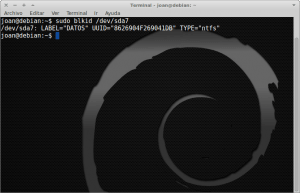

**PASO 1. Conocer la denominación de la partición que queremos montar**

Para montar cualquier partición en GNU Linux una vez arrancamos el sistema lo primero que tenemos que tener claro la denominación de la partición que vamos a montar. Para conocerla entramos en la terminal:<!--more-->

> **sudo  fdisk -l**

y obtenemos:

En nuestro bemos que la denominación de nuestra unidad NTFS es /dev/sda7 . Por lo tanto en nuestro caso montaremos la partición sda7.

**PASO 2. Conocer el punto de montaje y tipo de la unidad que vamos a montar**

Ahora tenemos que averiguar el punto de montaje de nuestra unidad. Para ello en la terminal tecleamos:

> **sudo blkid /dev/sda7**

Nota: Usamos sda7 porqué es la unidad que queremos montar.

En la imagen vemos claramente que: El punto de montaje es 8626904F269041DB El tipo de unidad que queremos montar es NTFS. Nota: Otra forma alternativa de encontrar el punto de montaje es mediante el comando:

> **ls -l /dev/disk/by-uuid**

**PASO 3. Crear la carpeta donde se montará nuestra partición**

Dentro de la ubicación /media tenemos que crear la carpeta donde se montará nuestra partición. En mi caso quiero que se denomine DATOS. Por lo tanto ejecutamos los siguientes comandos:

> **sudo mkdir /media/DATOS**

**PASO 4. Configurar que cada que arranquemos el sistema se monte la unidad**

Para decirle a nuestro sistema que monte la unidad debemos configurar el archivo /etc/fstab. Por lo tanto usamos el comando:

> **sudo nano /etc/fstab**

**Montar unidad NTFS**

Una vez abierto el archivo si queremos montar nuestra unidad del tipo NTFS debemos añadir la siguiente linea:

> UUID=XXXXXXXXXXXXX /media/carpeta de montaje ntfs-3g default\_permissions,uid=1000 0 0

Por lo tanto en nuestro caso seria:

> UUID=**8626904F269041DB** /media/**DATOS** ntfs-3g default\_permissions,uid=1000 0 0

**Montar unidad FAT**

Para montar una unidad FAT usar:

> UUID=XXXXXXXXXXXX  /media/carpeta de montaje   vfat rw,uid=1000,gid=1000 0 0

**Montar unidad ext4**

Para montar una unidad EXT4 usar:

> UUID=XXXXXXXXXXXX  /media/carpeta de montaje ext4 errors=remount-ro 0 1
