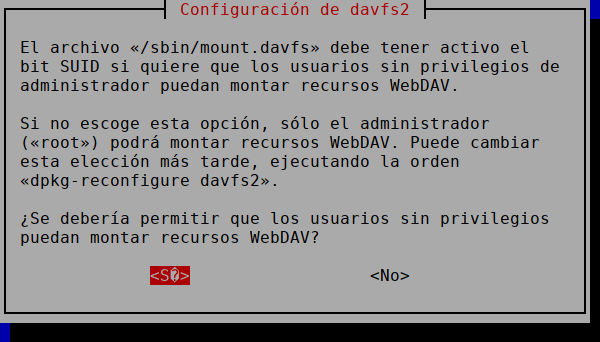
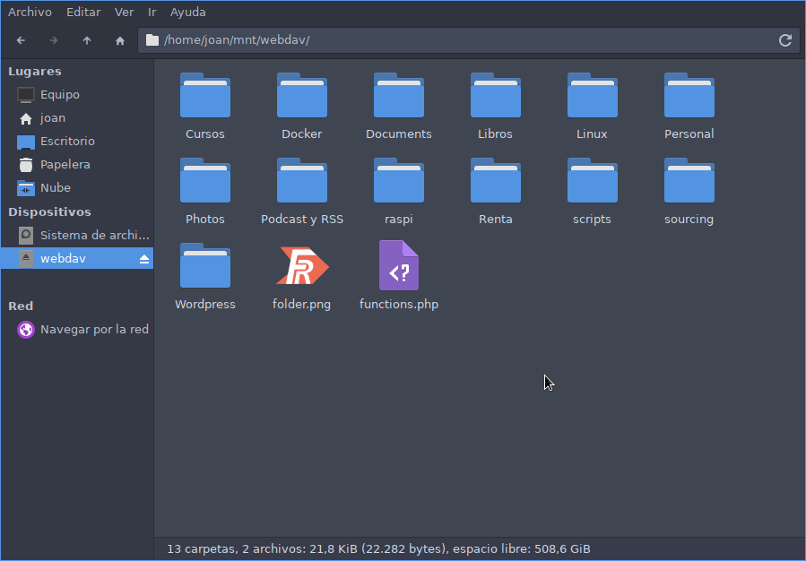
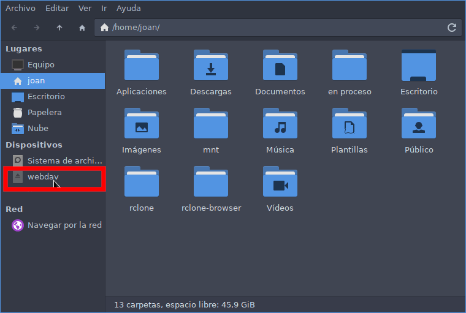

En su día comentamos como [crear nuestro propio servidor WebDAV](). Ahora veremos como podemos montar el contenido almacenado en un servidor WebDAV en un ordenador que corre GNU/Linux. Una vez montado el contenido pretendo editar el contenido del servidor WebDAV como si estuviera realmente almacenado en mi ordenador. Hay varias formas de conseguir mi propósito, pero en mi caso lo he realizado del siguiente modo.<!--more-->

## INSTALAR EL CLIENTE DAVFS2

El cliente WebDAV que he usado para montar el contenido del servidor WebDAV en mi equipo ha sido Davfs2. Para instalarlo en una distribución Debian deberán ejecutar el siguiente comando en la terminal:

> **`joan@asus:~$ sudo apt install davfs2`**

## DAR PERMISOS A NUESTRO USUARIO PARA MONTAR RECURSOS WEBDAV Y EDITAR FICHEROS DEL SERVIDOR WEBDAV

Ahora tendremos que otorgar permisos para que cualquier usuario sin privilegios de administrador pueda montar recursos WebDAV. Para ello ejecutaremos el siguiente comando en la terminal:

> ```shell
> sudo dpkg-reconfigure davfs2
> ```

Una vez ejecutado el comando les aparecerá la siguiente pantalla en la que tendrán que Responder `Sí`

[](images/Captura-de-pantalla_2021-09-04_06-47-32.png)

Ahora para poder leer y editar los ficheros y directorios del servidor WebDAV sin tener problemas de permisos tienen que añadir su usuario, que en mi caso es `joan`, dentro del grupo `davfs2`. Para ello ejecuten el siguiente comando:

> ```shell
> sudo usermod -aG davfs2 joan
> ```

**Nota**: Es importante escribir el parámetro `-aG`. El parámetro `-a` hace referencia a "append" o añadir y el parámetro `G` hace referencia a grupo. Es importante añadir el parámetro `a`, si no lo hacemos en vez de añadir el usuario al grupo lo estaremos borrando.

Una vez realizado todos los pasos reinicien el ordenador.

## ¿CÓMO CONECTARSE A UN SERVIDOR WEBDAV DE FORMA MANUAL?

Recomiendo que la primera vez que se conecten al servidor WebDAV lo hagan de forma manual y paso a paso.

### Crear y seleccionar un punto de montaje

Inicialmente definiremos el directorio en que queremos montar el contenido almacenado en nuestro servidor WebDAV. En mi caso voy a montar el contenido en la ubicación `/home/joan/mnt/webdav`

Para ello primero ello crearé los directorios que me faltan del siguiente modo:

> ```shell
> cd
> mkdir mnt
> cd mnt
> mkdir webdav
> ```

### Conectarse al servidor WebDAV y montar el contenido en nuestro equipo

Una vez definido el punto de montaje ya podemos montar el contenido del servidor WebDAV al punto de montaje. Para ello usaremos un comando del siguiente tipo:

> ```shell
> sudo mount -t davfs URL_servidor_WebDAV punto_de_montaje
> ```

En mi caso:

La URL del servidor WebDAV es: `https://webdav.geekland.duckdns.org/nube/`

El punto de montaje es: `/home/joan/mnt/webdav/`

Por lo tanto ejecutaré el siguiente comando y justo después de ejecutarlo tendré que introducir las credenciales para acceder al servidor WebDAV.

> ```shell
> joan@asus:~$ sudo mount -t davfs https://webdav.geekland.duckdns.org/nube/ /home/joan/mnt/webdav/
> Please enter the username to authenticate with server
> https://webdav.geekland.duckdns.org/nube/ or hit enter for none.
>   Username: geekland
> Please enter the password to authenticate user geekland with server
> https://webdav.geekland.duckdns.org/nube/ or hit enter for none.
>   Password: xxxxxx 
> /sbin/mount.davfs: warning: the server does not support locks
> ```

Una vez finalizado el proceso podrán ver que se ha montado el contenido sin ningún problema.

[](images/unidad-montada.png)

Una vez comprobado que pueden conectarse al servidor lo desmontan. Para ello usen el siguiente comando:

> **`joan@asus:~$ sudo umount /home/joan/mnt/webdav/ /sbin/umount.davfs: waiting for mount.davfs (pid 10758) to terminate gracefully .. OK`**

**Nota:** Siguiendo las instrucciones de este apartado únicamente podrá editar contenido del servidor WebDAV el usuario root. Para que nuestro usuario pueda leer y editar contenido sin problemas de permisos hagan lo que se muestra en el siguiente apartado.

## AUTOMATIZAR LA CONEXIÓN A UN SERVIDOR WEBDAV

Acabamos de montar el servidor WebDAV de forma manual. Si queremos automatizar el proceso tendremos que editar el fichero `/etc/fstab`. Para ello ejecutaremos el siguiente comando:

> ```shell
> sudo nano /etc/fstab
> ```

Una vez se abra el gestor de ficheros nano añadiremos una entrada del siguiente tipo:

> ```shell
> URL_servidor_WebDAV      punto_de_montaje       davfs rw,noauto,user 0 0
> ```

Como vimos en apartados anteriores:

La URL del servidor WebDAV es: `https://webdav.geekland.duckdns.org/nube/`

El punto de montaje es: `/home/joan/mnt/webdav/`

Por lo tanto en mi caso el comando a introducir dentro del fichero fstab es:

> ```shell
> https://webdav.geekland.duckdns.org/nube/ /home/joan/mnt/webdav davfs rw,noauto,user 0 0
> ```

Una vez introducida la entrada ya podemos guardar los cambios y cerrar el fichero.

## Autenticación automática al servidor WebDAV

Si queremos que nuestro usuario, que en mi caso es joan, pueda montar el servidor WebDAV sin necesidad de introducir las credenciales abriremos una terminal y ejecutaremos el siguiente comando:

> ```shell
> nano ~/.davfs2/secrets
> ```

Una vez se abra el editor de texto nano vamos al final del fichero y añadimos una entrada del siguiente tipo:

> ```shell
> URL_servidor_WebDAV      usuario_servidor_webdav      contraseña_usuario_servidor_webdav
> ```

Por lo tanto según visto en apartados anteriores en mi caso introduciré la siguiente entrada:

> ```shell
> https://webdav.geekland.duckdns.org/nube/ geekland contraseñageekland
> ```

A continuación guardamos los cambios, cerramos el fichero y damos los permisos 600 al fichero que almacena las credenciales para loguearse al servidor WebDAV.

> ```shell
> chmod 600 ~/.davfs2/secrets
> ```

**Nota:** Los permisos 600 hacen que únicamente el usuario root pueda leer y escribir en el fichero. El resto de usuarios no tienen ningún tipo de permiso.

Ahora si reinician el equipo verán que el servidor WebDAV está montado y plenamente operativo.

[](images/automontado-de-inicio.png)

Además si han seguido las instrucciones correctamente podrán visualizar y editar los documentos del servidor WebDAV como si estuvieran en su disco duro.

### Fuentes

[https://wiki.archlinux.org/title/Davfs2](https://wiki.archlinux.org/title/Davfs2)
