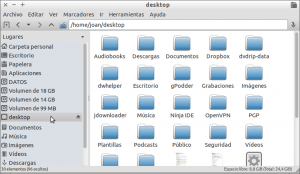
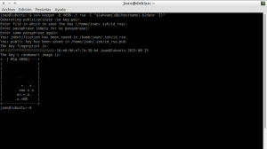
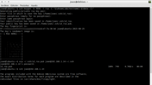
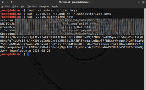
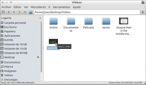
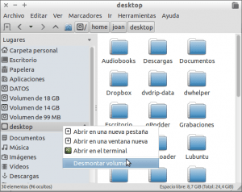

A raíz de la propuesta de uno de los lectores del blog, en este post veremos los pasos a seguir para montar un sistema de archivos remoto usando SSHFS.<!--more-->

## ¿QUÉ ES LO QUE PRETENDEMOS CONSEGUIR?

Lo que pretendemos hacer en este tutorial es **acceder y editar archivos de un equipo remoto como si los tuviéramos en nuestro propio ordenador**. Por lo tanto el objetivo es trabajar con archivos que no están en nuestro ordenador como si estuviesen físicamente en nuestro ordenador.

El objetivo planteado lo conseguiremos usando SSHFS. Con SSHFS montaremos un volumen adicional en nuestro ordenador que contendrá la información que queramos del equipo remoto. Este volumen adicional que montaremos actuará de la misma forma que si tuviéramos un pendrive o un disco duro adicional conectado en nuestro ordenador.

###### Nota: Lo que que pretendemos conseguir también lo podríamos conseguir instalando y configurando un servidor NFS. No obstante en este tutorial usaremos SSHFS.

## ¿QUÉ ES SSHFS?

[SSHFS (Secure Shell FileSystem)](https://es.wikipedia.org/wiki/Secure_Shell_Filesystem "Explicación de lo que es SSHFS") es la herramienta que nos **permite montar sistemas de archivos remotos en nuestro ordenador.** Además nos **posibilita interactuar con los ficheros remotos** usando el protocolo SFTP.

Mediante el protocolo SFTP podremos acceder, transferir y modificar los archivos remotos de forma segura, porque el protocolo SFTP usa SSH para la autenticación y transmisión de datos entre el equipo local y el equipo remoto.

## USOS QUE PODEMOS DAR AL SISTEMA DE ARCHIVOS REMOTO SSHFS

El uso principal que podemos dar a SSHFS es **tener disponibles nuestros datos remotos de forma segura y amigable en todo momento**. Por lo tanto usos posibles que le podemos dar son los siguientes:

1. Nube personal para almacenar información de forma segura.
2. Tener acceso a la información de los ordenadores que forman parte de nuestra red local.
3. Poder interactuar y tener información compartida con las máquinas virtuales que tenemos montadas en nuestro ordenador.
4. Tener acceso permanente al contenido de un servidor web.
5. Compartir una misma carpeta en varios ordenadores distintos.
6. Método para realizar copias de seguridad de ficheros y archivos remotos.
7. Etc.

## REQUISITOS PREVIOS A MONTAR EL SISTEMA DE ARCHIVOS REMOTO CON SSHFS

Antes de proceder a montar el sistema de archivos remotos con SSHFS tenemos que cumplir con los siguientes requisitos:

### Equipamiento necesario

Como mínimo precisamos de **2 ordenadores con** un sistema sistema operativo **GNU-Linux**.

**El primero de los ordenadores actuará como cliente**. En mi caso este equipo tiene instalado el sistema operativo Lubuntu y tiene la IP 192.168.1.12.

**El segundo de los equipos actuará como servidor**. En mi caso este equipo tiene instalado el sistema operativo Debian y tiene la IP 192.168.1.14.

###### Nota: Para averiguar la ip interna, tan solo hay que abrir una terminal y ejecutar el comando ifconfig. Para averiguar la IP Publica pueden clicar encima del siguiente [enlace](http://www.vermiip.es/ "URL para comprobar nuestra IP Pública").

###### Nota: También es posible implementar este tipo de solución en Mac OS y en Windows, pero obviamente el procedimiento es diferente.

### Instalar los paquetes necesarios

Los 2 ordenadores que usaremos tienen que tener instalados los paquetes openssh-server y openssh-client. Para instalar estos paquetes hay que **abrir una terminal y ejecutar el siguiente comando tanto en el servidor como en el cliente**:

> ```
> sudo apt-get install openssh-server openssh-client
> ```

**En el ordenador que actúa como cliente** tenemos que asegurarnos que los paquetes paquetes sshfs y fuse están instalados. Para ello **ejecutamos el siguiente comando en la terminal**:

> ```
> sudo apt-get install sshfs fuse
> ```

### Activar el módulo Fuse en ordenador que actúa como cliente

Para que el sistema de archivos remoto se pueda montar hay que hacer uso de un módulo del Kernel conocido como FUSE. **Para ver si este módulo está activado** tenemos que **teclear el siguiente comando en la terminal**:

> ```
> lsmod | grep fuse
> ```

**Si el comando nos da un resultado del tipo** “**fuse 86016 3**” podemos tener la seguridad que el módulo **FUSE está activado** y podemos pasar al siguiente apartado.

**Si por lo contrario el comando no devuelve ningún resultado** pueden pasar 2 cosas. La primera es que el módulo esté desactivado. La segunda es que el módulo FUSE se haya compilado directamente en el Kernel y por lo tanto no haga falta cargar ningún módulo.

Para comprobar si el módulo FUSE se ha compilado directamente en el Kernel **ejecutamos el siguiente comando en la terminal:**

> ```
> grep -i fuse /lib/modules/$(uname -r)/modules.builtin
> ```

**Si el comando nos devuelve un resultado similar del tipo** “**kernel/fs/fuse/fuse.ko**” podemos tener la seguridad que **FUSE está activo** y por lo tanto podemos pasar al siguiente apartado.

Finalmente **en el caso que el comando no devuelva ningún resultado** significará que el módulo no está cargado en el kernel. Para cargarlo tan solo hay que **ejecutar el siguiente comando en la terminal**:

> ```
> modprobe fuse
> ```

### Asegurar que nuestro usuario forme parte del grupo FUSE

Una vez activado el módulo Fuse, en el ordenador que actúa como cliente tenemos que comprobar que nuestro usuario forme parte del grupo fuse. Para ello instalamos el paquete members ejecutando el siguiente comando en la terminal:

> ```
> sudo apt-get install members
> ```

Justo después de instalar el paquete ejecutamos el siguiente comando en la terminal:

> ```
> members fuse
> ```

Si la salida del comando no muestra el nombre de nuestro usuario, que en mi caso es joan, entonces es que nuestro usuario no pertenece al grupo fuse. Si es este el caso, para que nuestro usuario pertenezca al grupo fuse hay que ejecutar el siguiente comando en la terminal:

> ```
> sudo gpasswd -a joan fuse
> ```

Una vez ejecutado el comando el usuario joan se habrá añadido dentro del grupo fuse. Si queremos lo podemos comprobar ejecutando de nuevo el siguiente comando en la terminal:

> ```
> members fuse
> ```

###### Nota: Una vez hecha la comprobación se puede desinstalar el paquete members.

### Crear la carpeta donde se montará el sistema de archivos SSHFS

Seguidamente en el ordenador que actúa como cliente crearemos la carpeta en la que montaremos el sistema de archivos remoto SSHFS. Para ello ejecutamos el siguiente comando en la terminal:

> ```
> mkdir /home/joan/desktop
> ```

Por lo tanto en mi caso montaré el sistema de archivos remotos en una carpeta llamada desktop que está ubicada en mi partición home.

Una vez realizados los pasos previos ya podemos pasar a la acción montando el sistema de archivos remoto en nuestro ordenador.

## MONTAR EL SISTEMA DE ARCHIVOS REMOTO SSHFS MANUALMENTE

Primeramente montaremos el sistema de archivos de forma manual para comprobar si todo está funcionando correctamente. Para ello e**n el ordenador que actuará como cliente ejecutaremos el siguiente comando el la terminal**:

> ```
> sshfs joan@192.168.1.14:/home/joan /home/joan/desktop
> ```

El significado de cada uno de los parámetros que aparecen en el comando es el siguiente:

**sshfs :** Es el comando que tenemos que ejecutar para montar sistema de archivos SSHFS.

**joan@192.168.1.14 :** Es la dirección ip servidor. El usuario del servidor es joan y la ip del servidor es 192.168.1.14. Como podréis observar la ip del servidor es la interna. En caso de tener necesidad de acceder al servidor de archivos fuera de la red local, deberemos sustituir la ip interna por la ip pública o por un dominio de redireccionamiento DNS.

**:/home/joan :** Es la dirección de la carpeta que queremos montar en nuestro equipo cliente. Por lo tanto una vez montado el sistema de archivos en nuestro equipo cliente, tendremos acceso al contenido del servidor ubicado en la partición home (/home/joan)

**/home/joan/desktop :** Es la ruta del cliente en la que queremos montar el sistema de archivos remoto SSHFS.

Después de ejecutar el comando tan solo hay que **abrir el gestor de archivos y comprobar que aparezca un nuevo volumen llamado desktop**. Tal y como se puede ver en la captura de pantalla, **si clicamos encima del volumen desktop tendremos acceso a la totalidad de contenido** de la partición home **del equipo remoto** que actúa como servidor.

[](images/Sistemas-de-ficheros-remoto-montado-con-SSHFS.png)

###### Nota: Obviamente los comandos de este apartado hay que adaptarlos en función de las características de vuestra red.

### Desmontar el volumen

Si queremos desmontar el volumen que acabamos de montar, tan solo tenemos que abrir la terminal y ejecutar el siguiente comando:

> ```
> fusermount -u /home/joan/desktop
> ```

Después de ejecutar el comando, el volumen SSHFS se desmontará y dejaremos de tener acceso a los ficheros del equipo remoto.

## MONTAR EL SISTEMA DE ARCHIVOS REMOTO SSHFS AUTOMÁTICAMENTE

Acabamos de comprobar que el sistema de archivos SSHFS se puede montar de forma manual sin ningún tipo de problema. Por lo tanto ahora ya podemos automatizar el proceso de montaje de la siguiente forma:

### Crear un par de claves asimétricas

**Vamos a generar un par de claves asimétricas** para poder montar nuestro sistema de archivos remoto SSHFS sin necesidad de introducir ninguna contraseña.

**Para ello** en el ordenador que actuará como cliente, tenemos que **abrir una terminal y teclear el siguiente comando**:

> ```
> ssh-keygen -b 4096 -t rsa -C "$(whoami)@$(hostname)-$(date -I)"
> ```

El significado de cada unos de los parámetros del comando es el siguientes:

**ssh-keygen :** Es el comando que genera el par de claves.

**\-b 4096 :** Estamos indicando que la clave asimétrica que se generará tenga un tamaño de 4096 bits. Otros tamaños que podemos elegir por ejemplo son 1024 o 2048.

**\-t rsa :** Indica que el algoritmo usado para generar el par de claves tiene que ser el rsa. Otros algoritmos que podemos usar son el dsa, ecdsa, rsa1 y ed25519.

**\-C "$(whoami)@$(hostname)-$(date -I)":** Esta parte del comando es simplemente para insertar un comentario identificativo en nuestra clave. Quien lea el contenido de nuestra clave verá que la clave fue creado por el usuario joan, cono el equipo Lubuntu el día 25-08-2015.

Justo después de ejecutar el comando, se nos preguntará la ubicación donde queremos guardar las claves y el nombre que les queremos poner. Cuando nos haga esta pregunta **presionaremos la tecla** **Enter**. De este modo las claves que generaremos se guardarán en la ubicación estándar que es la **/home/usuario/.ssh/**, y tendrán el nombre estándar que es **id\_rsa**.

Seguidamente se nos preguntará si queremos introducir una contraseña para cifrar nuestra clave privada. Como queremos conectarnos al servidor sin necesidad de introducir ninguna contraseña, **presionamos la tecla** **Enter** sin introducir ninguna contraseña.

Finalmente se nos pregunta que volvamos a introducir la contraseña que acabamos de introducir. Como anteriormente no introducimos ninguna contraseña volvemos a **presionar la tecla** **Enter**.

###### Nota: Al no introducir un password, la clave privada se guarda en nuestro disco duro sin cifrar. Esto es un riesgo de seguridad que correremos. Si alguien robase nuestro ordenador podría acceder sin problemas al contenido remoto de nuestro servidor. Para protegernos de este peligro podemos cifrar el disco duro de nuestro ordenador o poner una contraseña a nuestra clave y usar ssh-agent.

Después de realizar estos pasos se crearan las claves asimétricas en la ubicación **~/.ssh**. En la siguiente captura de pantalla se puede ver un resumen de todos los pasos realizados.

[](images/Generación-de-un-par-de-claves.png)

### Crear el fichero donde se guardaran las claves públicas autorizadas (acción en el servidor)

**En el ordenador que actúa como servidor de ficheros** vamos a crear un archivo donde se van a guardar las claves públicas que nuestro servidor aceptará. Para ello **ejecutamos el siguiente comando en la terminal**:

> ```
> touch ~/.ssh/authorized_keys
> ```

Una vez tecleado el comando se creará el archivo **authorized\_keys** en la ubicación **~/.ssh**.

### Copiar la clave pública del cliente al servidor

**En el ordenador que actuará como cliente** abrimos una terminal. Una vez abierta la terminal **exportaremos la clave pública al servidor ejecutando el siguiente comando**:

> ```
> scp ~/.ssh/id_rsa.pub joan@192.168.1.14:~/.ssh
> ```

El significado de cada unos de los parámetros del comando es el siguiente:

**scp :** Es el comando que sirve para copiar archivos de forma cifrada entre un sistema local y un servidor remoto.

**~/.ssh/id\_rsa.pub :** Es la ruta de la clave pública que queremos exportar al servidor.

**joan@192.168.1.14:~/.ssh :** Es la dirección del servidor donde queremos copiar la clave pública. El usuario del servidor es joan, la ip del servidor es 192.168.1.14 y queremos que la clave pública se guarde en la ubicación home/.ssh. En el caso que el servidor remoto al que queremos copiar la clave esté fuera de nuestra red local, deberemos reemplazar la ip 192.168.1.14 por la ip pública del servidor o por un dominio de redireccionamiento DNS

###### Nota: Obviamente los comandos de este apartado hay que adaptarlos en función de las características de vuestra red.

Una vez se haya ejecutado el comando **se nos preguntará la contraseña del servidor SSH al que queremos copiar la clave pública. Introducimos la contraseña** y justo después de introducirla, la clave pública del cliente se copiara la ubicación home **~/.ssh** del servidor SSH. Seguidamente se muestra una captura de pantalla de los pasos realizados en este apartado:

[](images/Copiar-la-clave-al-servidor.png)

### Autorizar la clave pública del cliente en el servidor (acción en el servidor)

Una vez tenemos la clave pública del cliente en el servidor tan solo nos queda introducir la clave pública del cliente a la lista de claves autorizadas del servidor **authorized\_keys**. Para ello **ejecutamos el siguiente comando en la terminal del servidor**:

> ```
> cat ~/.ssh/id_rsa.pub >> ~/.ssh/authorized_keys
> ```

El significado de cada unos de los parámetros del comando es el siguiente:

**cat :** Comando que usamos para añadir la clave pública dentro del fichero authorized\_keys.

**~/.ssh/id\_rsa.pub :** Es la ruta y el nombre de la clave pública que queremos autorizar.

**\>> ~/.ssh/authorized\_keys :** Es la ruta del archivo que almacenará las claves públicas autorizadas. La parte del comando >> es importante ya que es la parte posibilita que se añada la clave pública al fichero authorized\_keys.

Una vez ejecutado el comando la clave pública se copiará en el fichero de claves autorizadas. Para comprobar que es que así podemos ejecutar el siguiente comando:

> ```
> cat ~/.ssh/authorized_keys
> ```

Si después de ejecutar el comando nos aparece una clave en pantalla el proceso ha sido un éxito. Ahora ya podemos montar nuestro sistema de archivos remoto SSHFS sin necesidad de introducir ninguna contraseña. En la siguiente captura de pantalla se muestran los pasos que se han seguido para autorizar la clave pública:

[](images/Autorizar-la-clave-pública.png)

### Configurar fstab para que el sistema de archivos remoto SSHFS se monte de forma automática

Si queremos que nuestro sistema de archivos remoto SSHFS se monte de forma automática al arrancar nuestro ordenador tenemos que configurar debidamente el archivo fstab. Para ello **ejecutamos el siguiente comando en la terminal del ordenador que actuará como cliente**:

> ```
> sudo nano /etc/fstab
> ```

Una vez abierto el fichero fstab, tenemos que **introducir la siguiente línea al final del archivo**:

> ```
> joan@192.168.1.14:/home/joan /home/joan/desktop fuse.sshfs defaults,idmap=user,_netdev,users,IdentityFile=/home/joan/.ssh/id_rsa,allow_other,reconnect 0 0
> ```
> 
> ```
> La línea que acabamos de introducir para montar el sistema de archivos me ha funcionado tanto en distros que usan systemd como en distros que usan SysVinit. En el caso que este comando os de problemas y estéis usando una distro que use Systemd, deberéis reemplazar la linea anterior por la siguiente:
> ```
> 
> ```
> joan@192.168.1.14:/home/joan /home/joan/desktop fuse.sshfs noauto,x-systemd.automount,_netdev,users,idmap=user,IdentityFile=/home/joan/.ssh/id_rsa,allow_other,reconnect 0 0
> ```

El significado de cada uno de los parámetros introducido en el comando son los siguientes:

**joan@192.168.1.14 :** Es la dirección del servidor donde está ubicado el sistema de archivos que queremos montar en nuestro equipo. El usuario del servidor es joan, la ip del servidor es 192.168.1.14. Como podréis observar la ip del servidor es la ip interna. En caso de tener necesidad de acceder al servidor de archivos fuera de nuestra red local, deberemos sustituir la ip interna por la ip pública o por un dominio de redireccionamiento DNS.

**/home/joan :** Es la ruta del servidor que queremos montar en el cliente.

**/home/joan/desktop :** Es la ruta del cliente donde queremos montar el sistema de archivos remoto SSHFS.

**fuse.sshfs :** Estamos indicando el tipo de sistema de archivos que queremos montar.

**defaults :** Esta parte asigna las opciones de montaje estándar al sistema de archivos sshfs que vamos a montar. Las opciones por defecto son rw, suid, dev, exec, auto, nouser, y async.

**idmap=user:** Está opción hace que el propietario de los ficheros remotos sea nuestro usuario. Si no usamos esta opción es posible que nuestro ordenador piense que el propietario de los archivos remotos sea otro.

**\_netdev :** Con este comando indicamos que para montar el sistema de archivos se requiere una interfaz de red levantada.

**users :** Para permitir que la totalidad de usuarios puedan montar y desmontar el sistema de archivos remotos SSHFS.

**IdentityFile=/home/joan/.ssh/id\_rsa :** Se indica la ruta de la clave privada. De esta forma podremos montar el sistema de archivos sin usar contraseña.

**allow\_other :** Para dar acceso a otros usuarios diferentes al usuario root a la carpeta que vamos a montar.

**reconnect :** En el caso que el sistema de archivos se caiga por cualquier motivo, se reconectará de forma automática sin tener que hacer nada.

**0 0 :** Introduciendo el primer cero estamos diciendo que no queremos respaldar el sistema de archivos SSHFS que vamos a montar. Introduciendo el segundo cero lo que hacemos es indicar que no queremos que la utilidad fsck compruebe el sistema de ficheros.

Una vez realizadas las modificaciones **guardamos los cambios y cerramos el fichero.**

###### Nota: Si alguno de los parámetros en el fichero fstab es introducido de forma errónea es posible que el ordenador no arranque. Por lo tanto recomiendo tener un LiveUSB a mano y realizar una copia de seguridad del archivo /etc/fstab para poder actuar de forma fácil en caso de tener problemas.

### Modificar la configuración de fuse

En el apartado anterior habréis observado que una de las opciones de montaje es **allow\_other**. Para que esta opción sea válida tenemos que modificar la configuración de fuse. Para ello **abrimos una terminal y tecleamos el siguiente comando**:

> ```
> sudo nano /etc/fuse.conf
> ```

Una vez se abra el editor de textos nano con la configuración de fuse, tenemos que **localizar la siguiente línea**:

> ```
> #user_allow_other
> ```

Una vez localizada **la descomentamos** de forma que quede de la siguiente forma:

> ```
> user_allow_other
> ```

Una vez realizadas las modificaciones **guardamos los cambios y cerramos el fichero**.

### Comprobación de los pasos realizados

A estas alturas el proceso ha finalizado. Para comprobar que las configuraciones aplicadas funcionan de forma correcta **abrimos una terminal y ejecutamos el siguiente comando**:

> ```
> mount ~/desktop
> ```

El significado del comando que acabamos de ejecutar es el siguiente:

**mount:** Comando para indicar que se monte el sistema de ficheros.

**~/desktop:** La ubicación donde se tiene que montar el sistema de ficheros.

**Si el sistema de archivos remoto se monta sin problemas entonces** la configuración y todos **los pasos realizados hasta el momento son correctos**. En caso de tener problemas habrá que volver a repasar todos los pasos que se han realizado.

### Montar el sistema de archivos SSHFS en el arranque del sistema

En estos momentos ya estamos en condiciones de **reiniciar el ordenador**. Al reiniciar el ordenador el sistema de archivos remoto SSHFS se montará de forma automática. Una vez arrancado el ordenador, tal y como se puede ver en la captura de pantalla, tan solo tenemos que **abrir el gestor de archivos y veremos que existirá un volumen nuevo llamado desktop** que contiene los ficheros de nuestro equipo remoto.

[](images/Sistemas-de-ficheros-remoto-montado-con-SSHFS.png)

Ahora tan solo tenemos **clicar encima del volumen desktop**, y tal como se puede ver en la captura de pantalla, podremos navegar y hacer absolutamente lo que queramos en el sistema de archivos remoto.

[](images/Usando-el-sistema-de-archivos-remoto-SSHFS.png)

### Desmontar el sistema de archivos SSHFS

Sí queremos desmontar el sistema de archivos ahora tenemos 2 opciones. Podemos desmontarlo vía terminal, tal y como hicimos en el caso anterior, o podemos hacerlo mediante el explorador de archivos.

Si lo queremos hacer con el explorador de archivos, tal y como se puede ver en la captura de pantalla, **seleccionamos el volumen** que acabamos de montar, **presionamos el botón derecho del ratón** y finalmente **clicamos** encima de la opción **Desmontar Volumen**.

[](images/Demontar-el-sistema-de-archivos-remots.png)

## PUNTOS ADICIONALES A TENER EN CUENTA

Los puntos adicionales para poder montar y optimizar el rendimiento de nuestro sistema de archivos remoto son los siguientes:

1. La configuración de nuestro firewall tiene que ser la adecuada correcta. En caso contrario no podremos copiar las claves ni montar el sistema de archivos remoto.
2. En el caso que nuestro sistema de archivos remoto se halle fuera de nuestra red local, tenemos que configurar el router de la red que tiene el sistema de archivos remoto para que redireccione las peticiones de los clientes al ordenador que actúa como servidor.
3. Este tutorial no contiene ningún consejo para fortificar la seguridad de nuestro sistema de archivos remoto. En el caso de tener necesidad de asegurar el servidor tendrán que buscar en google como fortificar un servidor SSH.
4. Un usuario cualquiera podría llegar a montar una partición del servidor a la que no queremos que tenga acceso. Para ello lo que podríamos realizar es enjaular al usuario joan. Para enjaular a un usuario pueden aplicar el método que se muestra en el siguiente [enlace]().
