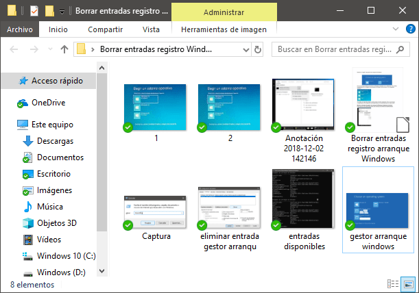
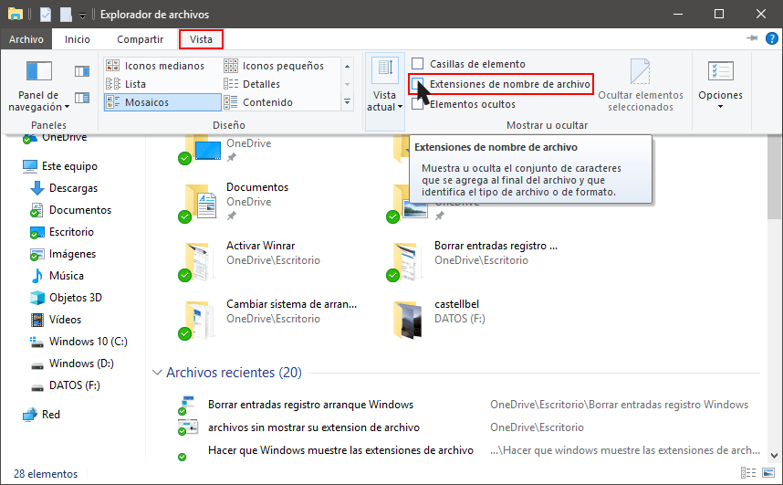
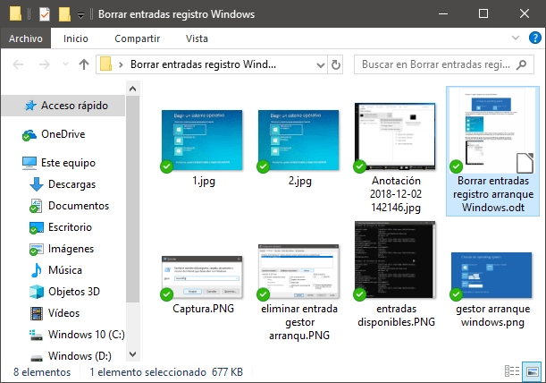
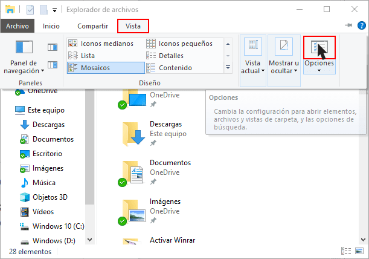
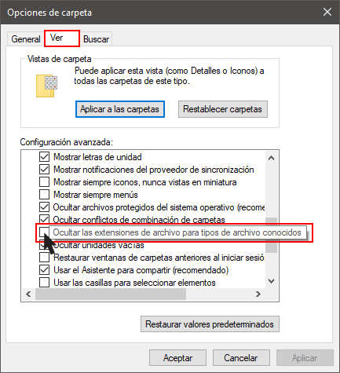

**Windows por defecto no muestra la extensión de los archivos. Esto genera** que un muchos casos **me resulte más difícil identificar el archivo que tengo que abrir**. Tal y como pueden ver en la captura de pantalla resulta difícil identificar el archivo de LibreOffice que está mezclado con las fotos.<!--more-->

**Aparte del problema que acabo de citar se me ocurren otros inconvenientes** como por ejemplo los siguientes:

1. **No tenemos la posibilidad de cambiar la extensión de los archivos**. Cabe mencionar que en ciertos casos puede resultar útil modificar la extensión de un archivo.
2. No ver la extensión de los archivos **puede resultar un riesgo de seguridad**. Un atacante nos puede enviar un correo con un archivo adjunto que se llame carta.txt.exe. Al ocultarse la extensión .exe, el receptor del email puede pensar que se trata de un archivo de texto e infectarse con un malware al intentar abrirlo.

Para solucionar estos pequeños inconvenientes tan solo tenemos que proceder del siguiente modo.

## HACER QUE WINDOWS MUESTRE LA EXTENSIÓN DE LOS ARCHIVOS

Presionamos la combinación de teclas Windows+E para abrir el explorador de archivos. Una vez abierto clicamos en la pestaña Vista. Acto seguido tan solo tenemos que tildar la opción Extensiones de nombre de archivo.

###### Nota: Si lo creéis oportuno también podéis marcar la opción de Mostrar los archivos ocultos. Esta opción está justo debajo de la opción de mostrar la extensión de los archivos.

A partir de estos momentos ya podremos identificar los archivos de dentro de una carpeta con mayor facilidad.

Además si tengo necesidad podré cambiar la extensión de los archivos sin ningún tipo de problemas.

## MÉTODO ALTERNATIVO PARA QUE WINDOWS MUESTRE LA EXTENSIÓN DE LOS ARCHIVOS

Abrimos el explorar de Windows presionando la combinación de teclas Win+E. A continuación clicamos sobre la pestaña Vista y finalmente clicamos en el botón Opciones.

 Cuando aparezca la ventana Opciones de carpeta clicamos encima de la pestaña Ver y **Destildamos** la opción Ocultar las extensiones de archivo para tipos de archivo conocidos. Finalmente tan solo tendremos que clicar encima del botón Aplicar.

A partir de estos momentos Windows nos permitirá ver la extensión de todos los archivos presentes en nuestro disco duro.

Si alguna vez precisáramos ocultar de nuevo la extensión de los archivos tan solo tendríamos que revertir los pasos que hemos ido siguiendo a lo largo de este artículo.
