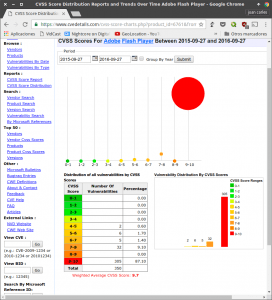
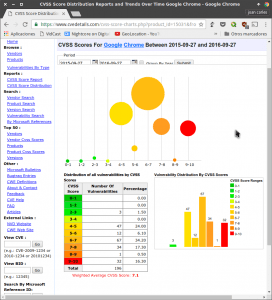

Hace años en que se comenta que Flash va a desaparecer, pero la verdad es que no acaba de desaparecer y no hace muchos días acaban de sacar una nueva versión Beta para Linux después de 4 años en que solo se limitaban a sacar actualizaciones de seguridad. Por este motivo en el siguiente post detallaré los motivos por los que todos los usuarios debería bloquear Flash en su navegador.<!--more-->

## MOTIVOS PARA BLOQUEAR FLASH PLAYER EN NUESTRO ORDENADOR

A pesar que Adobe haya tomado la decisión de seguir adelante con Flash, lo mejor que podríamos hacer todos es desinstalarlo o intentar limitar su uso.

Los motivos para realizar tal afirmación son los siguientes:

### Flash supone un riesgo de seguridad muy importante

Usar Flash sin duda es un riesgo para la seguridad de la totalidad de internautas. Es una tecnología obsoleta y vulnerable.

Los motivos principales para realizar esta afirmación son:

1. Es una aplicación en la que se acostumbran a detectar numerosas vulnerabilidades de seguridad.
2. Prácticamente la totalidad de vulnerabilidades de seguridad existentes son graves o muy graves.
3. Se trata de una tecnología obsoleta que fue creada hace demasiados años.

#### Análisis de las vulnerabilidades de Adobe Flash Player

Para demostrar lo que acabo de citar tan solo tenemos que acceder a la siguiente página web:

[https://www.cvedetails.com/cvss-score-charts.php?product\_id=6761&fromform=1](https://www.cvedetails.com/cvss-score-charts.php?product_id=6761&fromform=1 "Web dedicada a recopilar, analizar y evaluar vulnerabilidades de programas")

Una vez dentro de la página web podrán observar el número de vulnerabilidades de Adoble Flash Player detectadas durante el periodo de tiempo que nosotros seleccionemos:

Si analizamos las vulnerabilidades de Adobe Flash durante el último año podemos ver lo siguiente:

1. Se han detectado un total de 350 vulnerabilidades.
2. De las 350 vulnerabilidades 305 son de una severidad extrema.

Por lo tanto podemos afirmar que existe un gran número de vulnerabilidades y que prácticamente la totalidad de vulnerabilidades que se detectan son muy severas.

Algunas de las consecuencias de las vulnerabilidades de Flash son las siguientes:

1. Posibilidades que alguien acceda a nuestro equipo de forma remota.
2. Que un atacante nos pueda realizar un ataque de denegación de servicio (DOS).
3. Que alguien pueda ejecutar código malicioso en nuestro ordenador de forma remota.
4. Posibilidad que un atacante pueda instalar software malicioso en nuestro ordenador.
5. Un atacante puede tomar el control de ciertos dispositivos enchufados a nuestro ordenador y realizar cualquier acción con ellos.
6. Podemos sufrir un robo de credenciales como por ejemplo usuarios, contraseñas, número de cuentas bancarias, etc.
7. Etc.

Esto hace que los hackers con malas intenciones se focalicen en generar virus y malware para explotar las vulnerabilidades existentes de Flash. Por lo tanto visto lo visto todo el mundo debería bloquear flash en su navegador.

#### Comparación de las vulnerabilidades de Flash Player con Google Chrome

Una vez vistos los resultados de Adobe Flash podemos consultar los resultados de otro programa como Google Chrome y realizar una simple comparación.

Si observamos la imagen vemos que el número de vulnerabilidades detectadas en Google Chrome es bastante inferior a las de Adobe Flash Player. Además en Google Chrome las vulnerabilidades detectadas únicamente tienen una severidad media.

Por lo tanto después de ver este apartado creo que a todo el mundo le debería quedar claro que instalar y usar Adobe Flash Player supone un riesgo de seguridad importante.

### Flash no es una tecnología eficiente

Otra de las razones para bloquear Flash es que es una tecnología poco eficiente porque para realizar sus funciones consume gran cantidad de potencia de procesamiento y memoria RAM.

Esto básicamente ocasiona los siguientes problemas:

1. Desaprovechamos los recursos de nuestro ordenador.
2. Flash drena la batería de nuestro ordenador o dispositivo móvil.
3. Componentes como la CPU se calientan en exceso y a largo plazo esto puede ocasionar que se reduzca la vida de nuestro ordenador.

Por lo tanto al bloquear Flash obtendremos una navegación más rápida y consumiremos menos recursos. Esta mejora de rendimiento será especialmente visible en el caso que usemos ordenadores poco potentes.

Otras tecnologías, como por ejemplo html5, pueden realizar las mismas funciones que Flash de forma mucho más eficiente y segura. Este es uno de los principales motivos por los que Flash está abocado a la desaparición.

### Hoy en día prácticamente nadie usa Flash

En la actualidad prácticamente nadie utiliza tecnología Flash para crear sitios web. Los motivos para ello son los siguientes:

1. Google no valora positivamente las páginas web que usan tecnología Flash. Por lo tanto cualquier web seria que pretenda estar bien posicionada en Google no usará Flash.
2. En entornos móviles la tecnología Flash es prácticamente inexistente. Tanto en iOS como en Android hace tiempo que no hay soporte para Flash. A pesar de esto en Android si nos buscamos la vida podemos llegar a reproducir contenido Flash de forma relativamente fácil.
3. En la mayoría de ocasiones la tecnología Flash se utiliza simplemente para insertar publicidad en las páginas web.
4. Grandes empresas como Google y Apple, o grandes fundaciones como Mozilla hace tiempo que han dado la espalda a Flash. En Apple y en Android Flash no existe, en Youtube la totalidad de vídeos se reproducen mediante tecnología html5 y en Firefox a partir del 2017 Firefox vendrá desactivado de serie.

Por lo tanto en prácticamente la totalidad de casos podremos navegar sin el plugin de adobe Flash instalado y no notaremos absolutamente ninguna molestia.

A pesar de los comentarios realizados hasta el momento cabe decir que aún existen casos en que algunas personas podrían echar de menos a Flash. Algunas de estas situaciones son las siguientes:

1. Prácticamente la totalidad de videojuegos antiguos usan Flash. Por lo tanto a las personas que juegan a este tipo de juegos necesitaran usar Flash.
2. Hoy en día aun existen ciertos servicios web, como por ejemplo Spotify web, que aún necesitan Flash para poder funcionar.

### Flash consume nuestro ancho de banda y la batería de un dispositivo móvil

El consumo de memoria RAM y de procesamiento de Flash es elevado.

Esto hace que el consumo de batería en dispositivos móviles y en ordenadores portátiles sea muy elevado.

Además muchas páginas web incluyen audio y vídeos con autoreproducción que al reproducirse lo único que hacen es molestarnos y consumir nuestro ancho de banda.

### Flash es una tecnología obsoleta

Flash nació en el año 1996 y entre los años 2000 y 2010 Flash fue la herramienta de referencia para crear contenido web interactivo y reproducir vídeo en páginas web.

No obstante hoy en día existentes alternativas técnicamente mejores y más seguras que Flash como por ejemplo las siguientes:

1. HTML5
2. Silverlight
3. Swfdec
4. GNU Gnash
5. Lightspark

## COMO SOLUCIONAR LOS INCONVENIENTES GENERADOS POR FLASH

Para eliminar o minimizar los problemas descritos en este artículo disponemos de 2 soluciones.

1. [Desinstalar completamente Adobe Flash Player]().
2. Desinstalar o bloquear Flash Player para que únicamente lo usemos cuando nosotros le demos permiso.

En las próximas semanas escribiré un artículo en el que se detallará de forma precisa como podemos eliminar o minimizar los problemas generados por Flash.
