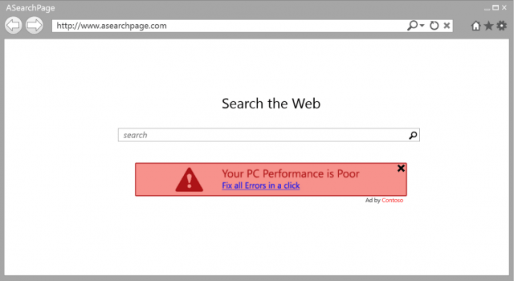
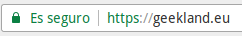

Recientemente acabo de adquirir un certificado SSL para el blog. Inicialmente era reticente a usar un certificado SSL, pero reflexionando un poco he llegado a la conclusión que a día de hoy tienen su utilidad.<!--more-->

## ¿CÚAL ES LA FUNCIÓN DE UN CERTIFICADOS SSL?

La función principal de un certificado SSL es la de proteger la seguridad de los visitantes de una página web.

La forma en que los certificados SSL incrementan nuestra seguridad y la de nuestros visitantes es la siguiente:

### Asegurando que nos conectamos donde nos queremos conectar

Cuando nos conectamos a una web, como por ejemplo [https://geeklandlinux.github.io/](https://geeklandlinux.github.io/), el navegador realiza las siguientes acciones:

1. Recibe el certificado SSL de [https://geeklandlinux.github.io/](https://geeklandlinux.github.io/). El certificado SSL dispone de información como por ejemplo un nombre de dominio, su fecha de seguridad, un número de serie, etc.
2. A continuación el navegador comprueba que el certificado está debidamente firmado por una autoridad de certificación.
3. Si la verificación de la firma es correcta significa que el sitio al que nos estamos conectando es quien dice ser. Por lo tanto se iniciará el proceso para cargar el contenido de la página web que queremos visitar.
4. Si la firma del certificado no puede ser verificada a través de las claves pública de alguna de las autoridades de certificación, entonces el navegador nos advertirá que el sitio al que nos estamos conectando es posible que no sea [https://geeklandlinux.github.io/](https://geeklandlinux.github.io/)

Por lo tanto siguiendo este metodología podemos estar seguros que siempre nos estamos conectando al sitio web que pretendemos conectarnos.

### Cifrando la totalidad de información entre el servidor y el navegador

Una vez confirmada la identidad de la web a la que nos queremos conectar empieza el proceso de cifrado. A groso modo el proceso de cifrado funciona del siguiente modo:

1. El navegador y el servidor se comunican entre ellos para establecer el protocolo de intercambio de claves, el tipo de cifrado y el hash.
2. El servidor envía el certificado SSL. El certificado SSL contiene datos como el propietario de la página web a la que nos conectamos, la fecha de caducidad del certificado, la clave para cifrar toda la información entre el navegador y el servidor, etc.
3. Mediante un sistema de criptografia asimétrica se establece un túnel cifrado entre nuestro navegador y el servidor.
4. A continuación la totalidad de información entre nuestro navegador y el servidor de la web [https://geeklandlinux.github.io/](https://geeklandlinux.github.io/) viajará de forma cifrada con el método y características definidas en el punto 1 de este apartado.

Al cifrar la totalidad de información entre nuestro navegador y el cliente conseguimos lo siguiente:

1. Aunque un atacante intercepte nuestro tráfico no podrá ver absolutamente nada porque todo el tráfico interceptado estará cifrado.
2. Aseguramos la integridad de los datos enviados y recibidos. Al existir una capa de cifrado nadie puede modificar la información que circula entre el navegador y el servidor. Por lo tanto aseguramos que tanto el servidor como el navegador reciben los datos que el otro les ha enviando.

De este modo mediante el cifrado estaremos garantizando la confidencialidad e integridad de los datos que enviamos y recibimos de nuestros clientes.

## ¿POR QUÉ ES RECOMENDABLE USAR UN CERTIFICADO SSL?

Acabamos de explicar de forma clara las ventajas que nos proporcionan los certificados SSL. A continuación veremos los motivos que deberían hacer que hoy en día todo el mundo usará https en vez de http.

### Por motivos de seguridad y para ofrecer una buena experiencia a los lectores

Existen personas que afirman no necesitar un certificado SSL por los siguientes motivos:

1. Mi web es pequeña y es visitada por pocas personas.
2. En mi sitio no se realizan transacciones de compra y venta.
3. Ninguno de los lectores o clientes introduce información personal en mi web.

Estos argumentos pueden parecer contundentes, pero tenemos que tener en cuenta los siguientes aspectos.

En el caso que no tengamos instalado un certificado SSL estamos dando la posibilidad que los ISP, o  intermediarios maliciosos, estén inyectando código malicioso o anuncios en nuestro sitio web.

Por lo tanto puede darse perfectamente el caso que nuestra web no tenga publicidad ni banners y nuestros lectores vean lo siguiente:

En este caso nuestros lectores sufrirán las siguientes consecuencias:

1. La interacción con nuestra página web será más lenta.
2. Nuestros visitantes o clientes pueden ser bombardeados con publicidad.
3. Quien introduce el banner tiene la posibilidad de bloquear nuestros propios anuncios e introducir los suyos. De este modo podríamos estar perdiendo dinero.
4. Los visitantes pueden ser infectados por Malware.

Por lo tanto con este ejemplo queda claro que un certificado SSL es útil en todos los casos.

### Para acceder al panel de administración de nuestro CMS

Cada vez que accedemos al panel de administración de nuestro CMS tenemos que introducir nuestro usuario y contraseña. En el caso que no estemos usando un certificado SSL corremos el riesgo que un atacante nos robe nuestras credenciales y se haga con el control de nuestra página web.

### Para usar ciertos servicios y tecnologías hay que disponer de https

Disponer de https permite que podamos disponer de más funcionalidades en nuestra página web. Un ejemplo de lo que estoy diciendo es lo siguiente:

1. Algunas APIS de google no pueden ser usadas si nuestra web no dispone de https. Un ejemplo de lo que estoy diciendo es el servicio de geolocalización de Google.
2. El servicio de notificaciones web push únicamente puede usarse si disponemos de un certificado SSL.
3. Cuando se implante HTTP/2 será estrictamente necesario disponer de un certificado SSL.

### No hay una diferencia significativa en la velocidad de carga

Se ha demostrado que cuando más rápida sea una web, como por ejemplo un marketplace, más visitas y más dinero ganará. Por lo tanto muchos usuarios temen que https haga su web más lenta.

La verdad es que si instalamos un certificado SSL de forma adecuada, la web seguirá cargando igual de rápido que antes. La diferencia de velocidad y de recursos consumidos se puede considerar despreciable.

https dispone de los siguientes mecanismos para asegurar que su velocidad de carga sea prácticamente las misma que http:

1. **TLS False Start:** Activando TLS False Start en nuestros servidores Web. Este mecanismo permite que nuestro navegador pueda iniciar la petición https después de recibir el certificado sin tener que esperar a que termine el TLS handshake.
2. **TLS session resumption:** Activando TLS session resumption en nuestros servidores web. Una vez realizado el primer TLS handshake el navegador recordará la sesión de usuario. Por lo tanto la siguiente vez que se deba realizar una conexión TLS con el servidor se podrá realizar de forma mucho más rápida.
3. **Usando HSTS:** Mediante HSTS evitamos las redirecciones de http a https diciendo de antemano a los navegadores que únicamente accedan a nuestro sitio web mediante https.
4. Etc.

###### Nota: De todos los mecanismos citados en este apartado únicamente estoy usando HSTS. El motivo es porque mi servidor no tiene habilitados el resto de mecanismos.

### Tu web ganará posicionamiento SEO

Existen webmasters que temen perder posicionamiento SEO en el proceso de transición entre de http a https.

Si procedemos de forma correcta evitando en todo momento el contenido duplicado, evitando las redirecciones y el contenido mixto, el impacto de pasar de http a https debe ser mínimo o incluso nulo.

Una vez finalizada la transición de http a https las visitas deben recuperar los niveles normales. Además a día de hoy el hecho de disponer de una web con https ayuda ligeramente a obtener un mejor posicionamiento SEO.

###### Nota: En mi caso hace 2 semanas que realice la transición de http a https. En mi caso el impacto en visitas y posicionamiento ha sido nulo. Durante este periodo puedo decir que las visitas han crecido.

### Porque google quiere que todas las web sean https

Google en más de una ocasión ha dicho que https es la mínima seguridad exigida para las webs de hoy en día. Por lo tanto la gente debería empezar a realizar la transición cuanto antes mejor.

###### Nota: Google quiere que todo el mundo se mueva a https. Por lo tanto tarde o temprano Google forzará a todo el mundo a realizar el cambio. Si os fijáis las últimas versiones de Firefox y Chrome están marcando las páginas http como inseguras.

### Los certificados SSL no suponen una inversión importante

Adquirir un certificado SSL básico para un solo dominio es extremadamente económico. En mi caso he adquirido uno por 8 Euros al año a través de mi hosting. Si lo prefieren incluso pueden obtener certificados gratuitos mediante proyectos como Let’s Encrypt.

Si hablamos de un certificado Wildcard, o un certificado SSL multidominio, el coste se incrementará considerablemente hasta llegar a los 80 Euros anuales en el mejor de los casos.

### Su instalación es más fácil de lo que la gente piensa

Cualquier persona puede instalar un certificado SSL en su sitio web.

Es relativamente fácil instalar un certificado SSL y en caso de problemas pueden pedir ayuda a su proveedor de Hosting.

Si el proveedor de hosting no les proporciona la atención adecuada entonces cambien de hosting porque el servicio que estáis recibiendo es malo.

## CONCLUSIONES

Después de leer este artículo espero que la gran mayoría de gente pueda entender los siguientes aspectos:

1. La utilidad de usar un certificado SSL a día de hoy.
2. Que no tengan prejuicios erróneos y piensen que adquirir e instalar un certificado SSL les supondrá inconvenientes.

Además cuando estén navegando les recomiendo que miren que en su barra de direcciones aparezca el siguiente candado de color verde:

Este candado será una prueba que nuestra privacidad está a salvo y que los datos que estamos leyendo no han sido modificados por nadie.

###### Nota: A lo largo de este artículo hablamos de certificados SSL. No obstante técnicamente hablando deberíamos llamarlos certificados TLS.
