Es común que muchas personas dispongan de un bloqueador de publicidad para poder navegar sin anuncios en sus ordenador, pero no es tan común que la gente aplique prácticas similares cuando usan su dispositivo móvil Android porqué las opciones son menores.

Con el fin de dar una solución a estos usuarios y evitar la lacra de la publicidad, en este post veremos como podemos eliminar la publicidad mientras estemos navegando con nuestro teléfono Android de forma fácil y sencilla.<!--more-->

## INSTRUCCIONES PARA NAVEGAR SIN ANUNCIOS EN ANDROID

El proceso para poder navegar sin anuncios en Android es sumamente sencillo. Tan solo hay que **seguir los pasos que se muestran a continuación**:

### Instalar Firefox

El primer paso para poder navegar sin anuncios es instalar el navegador Firefox. **Para instalarlo** lo podemos hacer de la forma habitual a través de la tienda de Google Play store. Si **clican en el siguiente [enlace](https://play.google.com/store/apps/details?id=org.mozilla.firefox&hl=es "Link para la instalación de Firefox")** accederán directamente a la página de descarga de Firefox y seguidamente tan solo tendrán que **presionar el botón Instalar**.

Para que no tengan ningún tipo de duda del programa que se trata, les dejo esta captura de pantalla en la que pueden ver información relativa al programa.

### Instalar Adblock en Firefox

Una vez disponemos de Firefox tenemos que instalarle el complemento Adblock. Para ello **abriremos el navegador Firefox**. Una vez abierto, tal y como se puede ver en la captura de pantalla, **presionamos encima del icono de opciones** del navegador y seguidamente **presionamos encima del menú Herramientas**.

[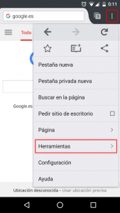](images/Acceder-a-la-configuración-y-herramientas.png)

Seguidamente, tal y como se puede ver en la captura de pantalla, **presionamos sobre la opción Complementos**.

[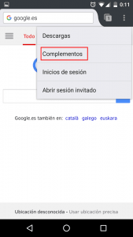](images/Acceder-a-complementos.png)

A continuación, tal y como se puede ver en la captura de pantalla, hay que **clicar encima de la opción Examinar todos los complementos para Firefox**.

[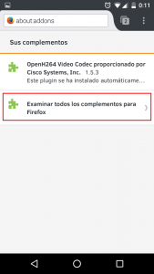](images/Examinar-todos-los-complementos-para-Fireox.png)

El siguiente paso, tal y como se puede ver en la captura de pantalla, es la de buscar el complemento adblock. Para ello **introducimos el nombre adblock en cuadro de búsqueda y presionamos la tecla Enter**.

[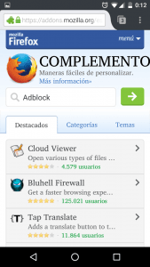](images/Buscar-el-complementos-Adblock-Plus.png)

**Una vez encontrado el complemento**, tal y como se puede ver en la captura de pantalla, **presionamos encima de él**.

[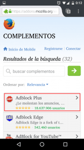](images/Acceder-a-Adblock.png)

Una vez hayamos presionado encima de él aparecerá la siguiente pantalla en la que tendremos que **clicar encima del botón Agregar a Firefox**.

[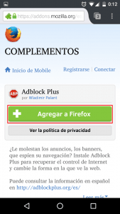](images/Agregar-Adblock-a-Firefox.png)

Finalmente, tal y como se puede ver en la captura de pantalla tan solo nos faltará **presionar encima del botón Instalar**.

[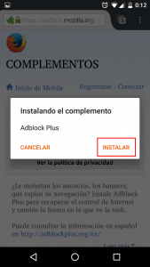](images/Instalar-Adblock-para-navegar-sin-anuncios.png)

Después de seguir estos simples pasos ya podremos navegar tranquilamente con Firefox sin que la publicidad nos moleste.

**Aparte de este complemento existen otros complementes** iguales o mejores **para el mismo fin como por ejemplo uBlock Origin**. Así que si quieren reemplazar Adblock por uBlock Origin lo pueden hacer sin ningún tipo de problema.

## HACER QUE FIREFOX SEA NUESTRO NAVEGADOR PREDETERMINADO

En estos momentos ya podemos navegar en Firefox evitando todo tipo de publicidad, pero **aun tenemos el problema que cuando clicamos un link de alguna aplicación o red social, se sigue abriendo nuestro navegador habitual y por lo tanto tenemos que seguir soportando la publicidad**.

**Para evitar este problema vamos a establecer Firefox como nuestro navegador predeterminado**. Para ello **accedemos a los ajustes de nuestro teléfono**.

Seguidamente, tal y como se puede ver en la captura de pantalla, **entramos en el apartado de Aplicaciones**.

[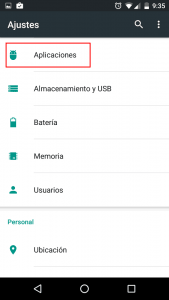](images/Acceder-al-Menu-Aplicaciones.png)

El siguiente paso es **clicar el icono de configuración** que se puede ver en la siguiente captura de pantalla.

[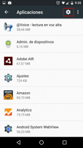](images/Acceder-a-la-configuración-de-las-aplicaciones.png)

A continuación **clicamos encima de Aplicaciones predeterminadas**.

[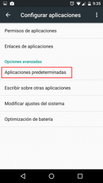](images/Acceder-al-menú-Aplicaciones-predeterminadas.png)

Finalmente, tal y como se puede ver en la captura de pantalla, tan solo **configurar que la aplicación de navegador predeterminada sea Firefox**.

[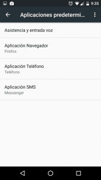](images/Configurar-Firefox-como-navegador-Predeterminado.png)

###### Nota: El procedimiento descrito en este apartado es válido para Android Marshmallow. En el caso de tener otra versión de Android el proceso puede ser ligeramente diferente.
