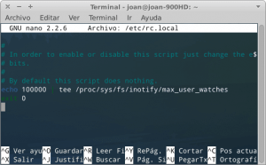
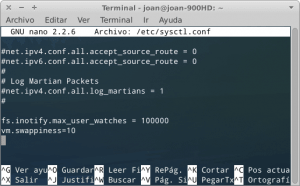

No acostumbro a publicar contenido acerca de resolución de problemas que podemos tener con nuestros equipos pero está vez lo veo apropiado ya que he tenido un problema con Dropbox y ninguna de las soluciones que he encontrado en varios de los blogs que he consultado me ha funcionado. Por lo tanto en este post detallaré lo que hice para solucionar el problema “No es posible supervisar el sistema de archivos” que tuve con Dropbox.<!--more-->

## SÍNTOMAS DEL PROBLEMA

Justo al arrancar vuestro equipo os aparecerá el mensaje que se muestra en la imagen del inicio de este post y que contiene el siguiente contenido:

> _“No es posible supervisar el sistema de archivos. Ejecuta”echo fs.notify.max\_user\_watches=100000 | sudo tee-a /etc/sysctl.conf; sudo sysctl -p”_ y reinicia dropbox para resolver el problema.

La principal consecuencia que tendrá este error es la siguiente:

**Perderéis totalmente las sincronización entre los distintos equipos que tienen instalado Dropbox.** Así por lo tanto si en el ordenador que tengo el problema pongo un archivo en la carpeta de Dropbox este no se va a subir a la nube ni se sincronizará con el resto de equipos. Por lo tanto viendo las causas del problema es importante que corrijamos este problema.

## CAUSA DEL PROBLEMA

La causa de este problema es que **la versión de Dropbox para Linux está programada para monitorizar únicamente 10,000 carpetas**. Por lo tanto si en Dropbox tenemos una estructura de archivos almacenada con más de 10,000 carpetas se generará este error en el momento que se vaya a supervisar la carpeta 10,001, y por lo tanto solo podremos tener sincronizadas 10,000 carpetas.

De esta forma cuando se vaya a subir un archivo en una de las carpetas que no se ha supervisado o cuando se crea una nueva carpeta, este no subirá a la nube ni se sincronizará con el resto de equipos.

## SOLUCIÓN DEL PROBLEMA NO ES POSIBLE SUPERVISAR EL SISTEMA DE ARCHIVOS

La solución a este problema es simple. Lo que haremos es incrementar el valor de la restricción de 10,000 carpetas a 100,000 carpetas y de esta forma evitaremos el error.

Para incrementar la restricción de supervisión de 10,000 carpetas a 100,000 carpetas tan solo tenemos que realizar 2 pasos muy sencillos que son los siguientes:

##### Paso 1: Modificación del archivo /etc/rc.local

[](images/Edicion-rc-local.png)

Abrimos una terminal y dentro de la terminal **tecleamos el siguiente comando:**

> ```
> sudo nano /etc/rc.local
> ```

Se abrirá el editor de textos nano con el contenido del fichero rc.local. Una vez abierto tal y como podemos ver en la captura de pantalla **introducimos la siguiente linea en el archivo:**

> ```
> echo 100000 | tee /proc/sys/fs/inotify/max_user_watches
> ```

Una vez introducida la linea **guardamos el archivo.**

##### Paso 2: Modificación del archivo /etc/sysctl.conf

[](images/edición-sysctl-conf.png)

Abrimos una terminal y dentro de la terminal **tecleamos el siguiente comando:**

> ```
> sudo nano /etc/sysctl.conf
> ```

Se abrirá el editor de textos nano con el contenido del fichero sysctl.conf. Una vez abierto, tal y como podemos ver en la captura de pantalla, **introducimos la siguiente linea en el archivo:**

> ```
> fs.notify.max_user_watches = 100000
> ```

Una vez introducida la linea **guardamos el archivo y tan solo tenemos que reiniciar nuestro ordenador para comprobar que el problema está resuelto.**

###### Nota: Esta solución la he aplicado en Xubuntu 12,04 y Debian Testing. En los 2 casos ha funcionado perfectamente.

###### Nota: En muchos post solo aplican el paso 2 y los usuarios parecen resolver el problema. En mi caso no es así y tengo que aplicar los 2 pasos que menciono tanto un xubuntu 12.04 como en Debain Testing.

## CRITICA A DROPBOX

Es natural que Dropbox tenga sus propias limitaciones. Por ejemplo si buscáis un poco en la web de Dropbox y en su [foro](https://forums.dropbox.com/ "Foro de Dropbox") podréis ver que en Dropbox que existen limitaciones del siguiente tipo:

1. Si un usuario de Dropbox dispone de más de 300000 ficheros almacenados en Dropbox es posible que su servicio no funcione adecuadamente.
2. Desde el navegador web se pueden subir archivos de hasta 10 Gb. Desde la aplicación de escritorio o móvil no existe esta limitación alguna en este aspecto.
3. A través de la página web solo se pueden previsualizar 15 minutos de cada uno de los vídeos que tenemos almacenados en Dropbox.
4. Los usuarios Free solo pueden compartir 20 Gb por día de su carpeta pública.
5. En Windows los nombres de los archivos tienen que estar limitados a 260 caracteres. El nombre del archivo incluye la ruta de almacenamiento del archivo. Por lo tanto es recomendable que los usuarios de Windows pongan su carpeta pública en la raíz de su sistema.

A pesar de las limitaciones de Dropbox, y que además también tienen la totalidad de servicios similares, Dropbox siempre me ha funcionado bien y lo utilizo en la totalidad de ordenadores, teléfonos y tablets que uso.

Pero hay que decir que **no tiene ni pies ni cabeza que los usuarios de Linux tengan una limitación de supervisión o sincronización de 10,000 carpetas mientras que los usuarios de otros sistemas operativos como Windows o Mac OS X no la tengan**. Además se puede afirmar claramente que nadie de Dropbox está preocupado por solucionar este asunto ya que **esta limitación ya existía en el año 2011 y hoy en el 2014 aún sigue existiendo**. Por lo tanto pienso que s**e puede decir claramente que Dropbox tiene bastante olvidados a los usuarios de Linux**. También tengo mis dudas que el cliente de escritorio de Linux esté tan evolucionado como el de otros sistemas operativos ya que en mi caso a pesar de que todo me funciona correctamente el consumo de RAM que tengo es bastante elevado.

Por lo tanto visto el panorama quien tenga problemas con Dropbox, o simplemente quiera probar un servicio alternativo, **hoy en día existen múltiples alternativas de calidad como por ejemplo** [Copy](https://www.copy.com/home/ "WEb de descarga de Copy"). Únicamente destacaré Copy ya que es la única alternativa que he probado y estoy satisfecho con su rendimiento. Además copy dispone de clientes en la totalidad de sistemas operativos existentes.
