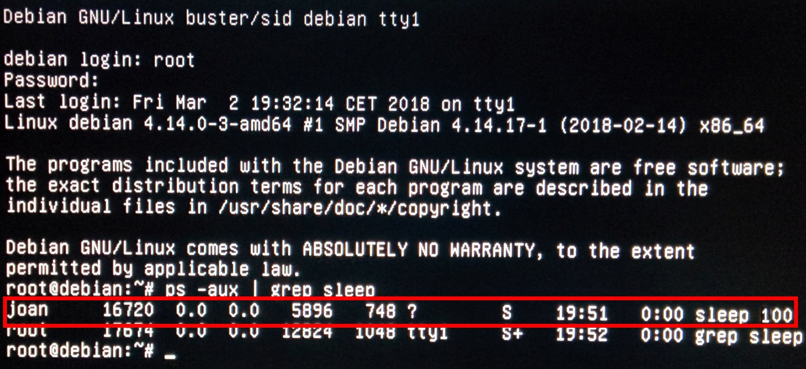

Existen ocasiones en que nos conectamos vía SSH y/o lanzamos tareas que pueden durar mucho tiempo. Durante todo el tiempo que dura la operación a realizar, la sesión SSH, la terminal o la sesión de usuario tienen que mantenerse activas. Si la conexión SSH se cae o cerramos la sesión de nuestro usuario, se interrumpirá la operación que estamos realizando. Para evitar este problema tenemos varias soluciones, pero sin duda una solución extremadamente fácil es utilizar el comando nohup (No hung up). Se que existen otras opciones como tmux o screen, pero en mi caso siempre acostumbro a usar nohup.<!--more-->

## USAR NOHUP PARA EVITAR QUE SE TERMINE UN PROCESO AL CERRAR UNA SESIÓN SSH O UNA SESIÓN DE USUARIO

Para que un proceso no se terminal al cerrar la sesión de usuario o ssh deberemos ejecutar el comando nohup seguido del comando a ejecutar.

Así por lo tanto, Si disponemos de un disco duro inmenso en que queremos buscar la totalidad de archivos con un tamaño superior a 100M ejecutaremos el siguiente comando en la terminal:

> ```
> nohup find /home -type f -size +100M > ~/resultados &
> ```

La función de cada uno de los parámetros es la siguiente:

- **nohup**: Parte del comando que hace que no se cierre la acción que estemos ejecutando.
- **find /home -type f -size +100M**: Parte del comando que busca todos los archivos de nuestra partición home con tamaño superior a 100 MB.
- **\> ~/resultados**: Corresponde a la ruta y nombre del archivo que almacenará los resultados de nuestras búsqueda. En el caso que quisiéramos que ningún archivo almacene los resultados deberíamos reemplazar \> ~/resultados por \> ~/dev/null 2>&1.
- **&**: Parámetro utilizado para que podamos seguir introduciendo comandos en la terminal donde ejecutamos el comando.

Una vez iniciado el comando podemos cerrar la sesión de usuario y/o la conexión SSH y el comando seguirá ejecutándose sin problema alguno.

Si en un futuro queremos consultar los resultados obtenidos tan solo tenemos que abrir una nueva sesión de usuario o establecer una conexión SSH. Acto seguido tenemos que consultar el archivo que hemos definido que guarde los resultados. Por lo tanto en nuestro caso ejecutaremos el siguiente comando en la terminal:

> ```
> cat ~/resultados
> ```

Después de ejecutar el comando podremos ver la totalidad de archivos de nuestra partición home que ocupan más de 100 MB:

|   /home/joan/Dropbox/Wordpress/Copias de seguridad/geekland 23-12-2017.zip /home/joan/Dropbox/Wordpress/Copias de seguridad/geekland 30-12-2017.zip /home/joan/Dropbox/Libros/Kali Linux Pentesting.pdf   |
| --- |

## EJEMPLOS DE USO DEL COMANDO NOHUP

Una vez comprendido el funcionamiento de nohup pasaremos a ver más ejemplos de su uso.

### Completar un proceso después de cerrar la sesión de usuario o la terminal

Imaginemos que abrimos una terminal y ejecutamos el siguiente comando:

|   joan@debian:~$ sleep 100& \[1\] 4859   |
| --- |

###### Nota: La función del comando sleep es retardar durante un periodo determinado de tiempo la ejecución de otro comando.

Una vez ejecutado el comando miramos los procesos activos y vemos que sleep está ejecutándose:

|   joan@debian:~$ ps -aux \| grep sleep joan 4859 0.0 0.0 5804 660 pts/1 S 11:51 0:00 sleep 100 joan 4861 0.0 0.0 12724 984 pts/1 S+ 11:51 0:00 grep sleep   |
| --- |

Si ahora cerramos la terminal y volvemos consultar los procesos activos veremos que sleep ya no está ejecutándose:

|   joan@debian:~$ ps -aux \| grep sleep joan 5048 0.0 0.0 12724 980 pts/1 S+ 11:51 0:00 grep sleep   |
| --- |

Para evitar este problema tan solo tenemos que añadir nohup al inicio del comando que queremos ejecutar. Por lo en este ejemplo deberíamos ejecutar el siguiente comando:

|   joan@debian:~$ nohup sleep 100& \[1\] 16720 joan@debian:~$ nohup: se descarta la entrada y se añade la salida a 'nohup.out'   |
| --- |

Si ahora miramos los procesos activos vemos que sleep está ejecutándose:

|   joan@debian:~$ ps -aux \| grep sleep joan 16720 0.0 0.0 5804 664 pts/1 S 11:52 0:00 sleep 100 joan 5312 0.0 0.0 12724 1016 pts/1 S+ 11:52 0:00 grep sleep   |
| --- |

Si ahora cerramos la terminal que ejecuta sleep y volvemos a mirar los procesos que siguen activos, veremos que aun que cerremos la terminal el proceso sleep sigue ejecutándose:

|   joan@debian:~$ ps -aux \| grep sleep joan 16720 0.0 0.0 5804 664 ? S 11:52 0:00 sleep 100 joan 5501 0.0 0.0 12724 996 pts/1 S+ 11:52 0:00 grep sleep   |
| --- |

Si ahora cerramos la sesión de usuario, abrimos una consoloa tty y accedemos con otro usuario veremos que el proceso 16720 correspondiente al comando sleep aun sigue ejecutándose aunque hayamos cerrado la sesión de usuario.

[](images/proceso-ejecutandose-despues-cerrar-sesion.jpg)

### Completar un proceso u operación después de cerrar una conexión SSH

Imaginemos que me conecto vía ssh a una Raspberry Pi con el fin de descargar una larga lista de vídeos de Youtube. Para conectarme a mi Raspberry pi vía SSH ejecuto el siguiente comando:

> ```
> ssh pi@192.168.1.220
> ```

Una vez conectados tan solo tenemos escribir nohup seguido del comando que usaríamos para descargar los vídeos con youtube-dl:

|   pi@raspberrypi:~ $ nohup youtube-dl https://www.youtube.com/playlist?list=PLtGnc4I6s8dssa8hF4yMTAa4BrSJCSwux \>/dev/null 2>&1 & \[1\] 5450   |
| --- |

Una vez iniciada la descarga ya podemos cerrar la conexión SSH del siguiente modo:

|   pi@raspberrypi:~ $ exit Logout   |
| --- |

Después de cerrar la conexión SSH los vídeos continuarán su descarga sin ningún tipo de problema. Cuando haya finalizado la descarga podremos acceder a nuestra Raspberry Pi para consultar y visualizar los vídeos sin ningún tipo de problema.

###### Nota: De la misma forma que descargamos una serie de vídeos podríamos ejecutar un script de forma muy fácil y muy sencilla.

###### Nota: Hay comandos/programas que por si mismos permiten descargar vídeos aunque se cierre la sesión de SSH. Uno de ellos es wget.
