Muchos de vosotros sabrán que hace tiempo que utilizo Xfce. Concretamente estoy usando Xfce a diario desde que se termino el soporte para Ubuntu 11.04 y la verdad es que no hecho de menos a gnome ni a nadie.

Ya que estoy usando Xfce quería compartir con vosotros un plugin interesante que estoy usando. El plugin se llama mailwatch.<!--more-->

## FUNCIÓN DEL PLUGIN DE NOTIFICACION MAILWATCH

Como muy bien indica su nombre este plugin o applet sirve para consultar de forma rápida los nuevos correos que nos han llegado. Por lo tanto **es un notificador de nuevos emails que tendremos en el panel de nuestro escritorios XFCE.**

**Mailwatch**, con la periodicidad que nosotros definimos, **se conectará a la totalidad de nuestros correos electrónicos para comprobar si tenemos un mail**. En el caso de tener nos dará una advertencia sonora o una advertencia gráfica.

## INSTALACIÓN EL PLUGIN DE NOTIFICACION MAILWATCH

**Lo más probable es que** este plugin ya **esté instalado de serie** en vuestro sistema con Xfce. **En el caso** que no lo tengan instalado lo pueden instalar de la siguiente forma. **En la terminal teclean el siguiente comando:**

> ```
> sudo apt-get install xfce4-mailwatch-plugin
> ```

En el caso que en el momento de instalar Xfce no hubierais instalado los plugin de escritorio y ahora queráis instalarlos todos de un plumazo tan solo tenéis que ejecutar el siguiente comando en la terminal:

> ```
> sudo apt-get install xfce4-goodies
> ```

###### Nota: Este último comando, aparte de los plugin del panel, también instala plugins para Thunar, Aplicaciones adicionales para xfce, artwork como fondos de pantalla, etc. En el caso que quieran conocer exactamente lo que van a instalar tan solo tienen que consultar los siguientes enlaces:

[Enlace de plugins para thunar](http://goodies.xfce.org/projects/thunar-plugins/start "Plugins para thunar que se instalarán") [Enlace para las aplicaciones adicionales](http://goodies.xfce.org/projects/applications/start "Aplicaciones adicionales que se instalarán") [Enlace para el Artwork](http://goodies.xfce.org/projects/artwork/start "Artwork adicional que se instalará") [Enlace para las Adaptaciones de bibliotecas para los programadores](http://goodies.xfce.org/projects/bindings/start "Adaptaciones de bibliotecas que se instalarán")

## CONFIGURACIÓN DEL PLUGIN DE NOTIFICACION MAILWATCH

Una vez instalado el plugin **lo primero que tenemos que hacer es ponerlo en nuestro panel**. Para poner el applet en nuestro panel tenemos que **ubicar el puntero del mouse encima del panel y presionar el botón derecho**. Una vez presionado el botón derecho aparecerá un menú tal y como se muestra en la siguiente captura:

[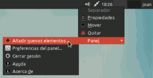](images/1-Añadir-icono-en-el-panel.png)

En el menú que se desplegará tienen que **elegir la opción** **Panel** **y seguidamente** **Añadir nuevos elementos**. Una vez elegida la opción nuevos elementos se abrirá la siguiente ventana:

[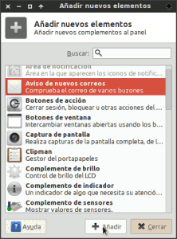](images/2-Icono-añadido.png)

Como pueden ver en la captura de pantalla una vez abierta la ventana **tienen que seleccionar la opción** **Aviso de nuevos correos** **y presionar el botón** **Añadir**. **Una vez realizados todos estos pasos les aparecerá un icono en forma de sobre en el panel de xfce**. Ahora ya podemos configurar nuestras cuentas de correo en el plugin.

### Configurar una cuenta de Gmail

El primer paso para configurar cualquier cuenta es posicionar el puntero del mouse encima del icono, que acabamos de introducir en el panel, **y presionar el botón derecho del mouse**. Una vez presionado el botón aparecerá un grupo de opciones a elegir. Tal y como se puede ver en la captura de pantalla tenemos que **elegir** **Propiedades**:

[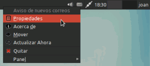](images/3-Acceso-a-la-configuración.png)

Una vez elegida esta opción se abrirá la siguiente ventana:

[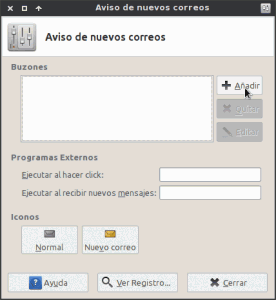](images/4-Añadir-cuenta.png)

En esta ventana tendremos que **seleccionar la opción** **Añadir**. Una vez seleccionada la opción añadir aparecerá otra ventana para elegir el tipo de Buzón:

[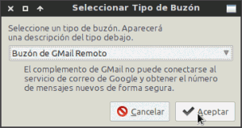](images/5-Configurar-gmail.png)

Tal y como podemos ver en la captura de pantalla **el tipo de buzón a elegir es** **Buzón de Gmail Remoto**. Una Vez elegida la opción presionan el botón **Aceptar**.

Una vez presionado el botón Aceptar aparecerá la siguiente ventana:

[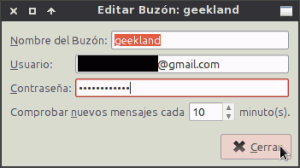](images/8-Configurando-gmail-finalizada.png)

Tal y como se puede ver en la captura de pantalla aquí tan solo tenemos que **poner los datos de nuestra cuenta de correo**. Concretamente los datos a rellenar son:

1. **Nombre de Buzón:** Podemos poner el que queramos. El texto que pongamos servirá como identificador de la cuenta. En mi caso pondré **geekland**.
2. **Usuario:** Tenemos que poner la dirección completa de nuestro correo gmail.
3. **Contraseña:** Tenemos que escribir la contraseña de nuestra cuenta de correo gmail.
4. **Comprobar nuevos mensajes:** En este apartado tenemos que indicar la periodicidad en que el plugin se conectará a nuestro correo para comprobar si tenemos correos nuevos. En mi caso la periodicidad por defecto, que son 10 minutos, me va bien y por lo tanto no modificaré nada.

Una vez hemos realizado todos los pasos mencionados tan solo tienen que presionar al botón **Cerrar**. Una vez hecho esto ya hemos terminado de introducir nuestra cuenta de gmail.

### Configurar de una cuenta de Hotmail u Outlook

En el caso de querer introducir una cuenta de hotmail o outlook, los pasos a realizar son también muy sencillos. Como en el caso antererior tienen que **posicionar el puntero del mouse encima del icono del plugin, presionar el botón derecho del mouse y elegir la opción** **Propiedades**.

Una vez elegida esta opción aparecerá la siguiente pantalla en la que deberán **presionar sobre el botón de** **Añadir**:

[](images/4-Añadir-cuenta.png)

Seguidamente aparecerá otra ventana en la que, tal y como se puede ver en la captura de pantalla, deberemos **elegir la opción** **Buzón de IMAP Remoto**.

[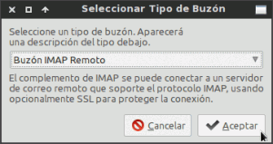](images/7-buzon-de-imap-remoto.png)

Una vez elegida está opción **presionamos el botón** **Aceptar**.

Seguidamente aparecerá otra ventana. En el caso que queráis introducir un correo hotmail u outlook deberéis **rellenar los campos con los datos que se muestran en la siguiente captura de pantalla**:

[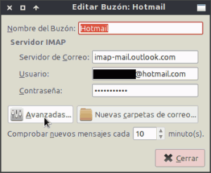](images/8-Configurando-Hotmail.png)

1. **Nombre del buzón:** Podemos poner el que queramos. El texto que pongamos servirá como identificador de la cuenta. En mi caso pondré **hotmail**
2. **Servidor de correo:** Tenéis que **poner el nombre del servidor Imap de hotmail o outlook**. En ambos casos tenéis que poner **imap-mail.outlook.com**
3. **Usuario:** Tenemos que poner la dirección completa de nuestro correo hotmail o outlook.
4. **Contraseña:** Tenemos que escribir la contraseña de nuestra cuenta de correo hotmail o outlook.
5. **Comprobar nuevos mensajes:** En este apartado tenemos que indicar la periodicidad en que el plugin se conectará a nuestro correo para comprobar si tenemos correos nuevos. En mi caso la periodicidad por defecto, que son 10 minutos, va bien y por lo tanto no modificaré nada.

Ahora tenemos **presionar el botón** **Avanzadas...** Una vez presionado el botón avanzadas se abrirá una ventana en la que tenemos que **introducir el número de puerto del servidor imap, y el tipo cifrado con el que trabaja nuestro servidor de correo**. Tanto En hotmail como en outlook se usa **SSL/TLS**, y el puerto que usan es el estándar por defecto. **Por lo tanto tal y como se puede ver en la captura de pantalla eligen las siguientes opciones**:

[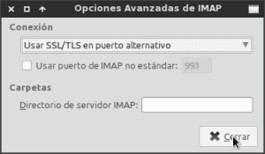](images/9-Configurando-hotmail-2.png)

Una vez hecho esto ya hemos terminado de introducir nuestra cuenta de hotmail/outlook. Una vez hemos realizado todos los pasos mencionados tan solo tienen que presionar al botón **Cerrar** **y seguidamente vuelven a presionar otra vez el botón de** **Cerrar**.

###### Nota: He configurado la cuenta usando Imap porqué considero que es un protocolo mucho mejor que el pop3. Incluso hotmail, después de su renovación, ofrece la opción Imap a la totalidad de sus usuarios. Para los lectores que quieran ver las ventajas de un servidor Imap frente un servidor Pop3 pueden consultar el siguiente [enlace](https://es.wikipedia.org/wiki/Internet_Message_Access_Protocol "Explicación de las ventajas del correo Imap").

###### Nota: Para servidores imap los puertos estándar acostumbran a ser el 993 o el 143. Si el tipo de cifrado que usan es SSL se acostumbra a usar el 993. Si el cifrado es tipo TLS, o simplemente no hay cifrado, el puerto que se acostumbra a usar es el 143.

### Configurar una cuentas de Yahoo

En el caso que queráis introducir un correo yahoo **deberéis seguir exactamente el mismo procedimiento que con la cuenta de hotmail y outlook**. **La única diferencia entre un caso y otro será a la hora de introducir el servidor Imap**, ya que deberemos introducir el de yahoo en vez del de Hotmail. Estos cambios se pueden ver reflejados en la siguiente captura de pantalla:

[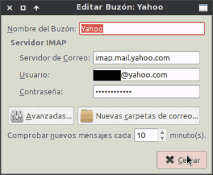](images/10-Configurar-yahoo.png)

Como se puede ver en la captura de imagen, **el servidor de correo Imap de Yahoo es** **imap.mail.yahoo.com**. Por lo tanto el proceso de configuración de una cuenta de Yahoo es prácticamente equivalente al de una cuenta de Hotmail.

### Configurar una cuenta de correo diferente a las anteriores

Si quieren configurar un cliente de correo con IMAP distinto a los anteriores, **lo primero que tienen que hacer es averiguar la siguiente información:**

1. **Servidor Imap del servidor de correo:** En el caso hipotético que estemos configurando una cuenta de openmailbox es: **imap.openmailbox.org**
2. **Tipo de cifrado que usa el servidor de Correo:** En el caso hipotético que estemos configurando una cuenta de openmailbox es **SSL/TLS mediante STARTTLS**
3. **Número de puerto del servidor imap:** En el caso de openmailbox el puerto es el **143**.

###### Nota: Para buscar vuestros datos consultar en vuestro servicio de correo o en el buscador de google. En el caso de openmailbox he encontrado esta información en la siguiente página:

https://www.openmailbox.org/faq

**Una vez tengamos la información que acabo de citar** disponible, ya podemos **rellenar los datos del mismo modo que hemos realizado con la cuenta de hotmail**. **En el caso de openmailbox deberían rellenar los datos tal y como se muestra en las siguientes capturas de pantalla:**

[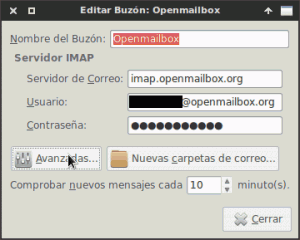](images/15-Configurar-openmailbox.png)

Una vez configurados los datos de la cuenta de correo y del servidor imap tan solo tenemos que **introducir el tipo de cifrado y el puerto de la siguiente forma**:

[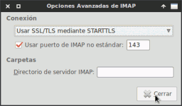](images/16-Configurar-openmailbox-2.png)

Una vez hemos realizados estos pasos el procedimiento ha terminado.

## CONFIGURAR ACCIONES CUANDO SE PRESIONA EL ICONO DEL PANEL

**Cada vez que presionamos el applet de mailwatcher que aparece en el panel se pueden ejecutar acciones**. **En mi caso la acción que tengo configurada es que se abra el cliente de correo [Thunderbird](https://www.mozilla.org/es-ES/thunderbird/ "Web de descarga de Thunderbird") para así poder leer y responder mis mails.**

Para configurar la acción tienen que **posicionar el puntero del mouse encima del icono del plugin, presionar el botón derecho del mouse y elegir la opción** **Propiedades**. Una vez realizado este paso aparecerá la siguiente ventana:

[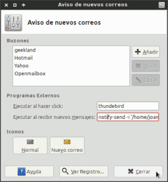](images/11-Plugin-totalmente-configurado.png)

**En el campo** **Ejecutar al hacer click** tan solo tenemos que **escribir** el comando que usaríamos para lanzar un programa desde la terminal. Por lo tanto para arrancar thunderbird simplemente tenemos que escribir **thunderbird**. **Una vez realizado esto ya podemos pasar a comprobar su funcionamiento**:

En la captura de pantalla vemos que de momento no tenemos ningún mensaje nuevo en nuestras cuentas de correo:

[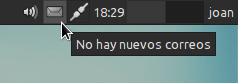](images/12-Plugin-introducido-en-el-panel.png)

Ahora imaginamos que nos llegan mensajes en todas nuestras cuentas de correo:

[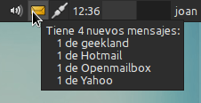](images/13-Panel-con-mensajes.png)

Tal y como se puede ver en la captura de pantalla nos ponemos encima del applet  y vemos que ya nos ha llegado correo a nuestras cuentas de emial. Ahora tan solo tenemos que **presionar el botón izquierdo del mouse encima del icono. Justo al presionar el botón del mouse se abrirá Thunderbird** para empezar a responder a todos los correos.

**En el caso que acostumbréis a responder vuestro correo vía web**, en vez de la opción Thunderbird, **podéis usar otras opciones personalizadas como por ejemplo** la siguientes:

**Ejecutar la hacer click:** **xdg-open** **https://gmail.com**

###### Nota: Lo que hace esta acción personalizada es cuando hagáis click encima del icono se abra el navegador que tenéis configurado por defecto. Una vez se abra, ingresará automáticamente en la página de gmail para poder responder rápidamente vuestros correos. Si en vez de usar gmail usáis yahoo tan solo tienen que cambiar la dirección de gmail por la de yahoo. 

## CONFIGURAR ALERTAS SONORAS Y VISUALES CUANDO LLEGA UN CORREO

Cada vez que nos llega un mail podemos hacer que nos llegue una alerta sonora o visual. **En el caso que queráis recibir una alerta sonora** lo primero que tienen que hacer es a**segurarse que tienen instalado mplayer**. En el caso que no lo tengan instalado tan solo tienen que abrir una terminal y teclear el siguiente comando:

> ```
> sudo apt-get install mplayer
> ```

Una vez instalado **se dirigen encima del applet del panel, presionan el botón derecho y eligen** **propiedades**. Aparecerá una ventana en la que tienen que **localizar el campo** **Ejecutar al recibir nuevos mensajes**. En este campo tienen que **escribir el siguiente comando:**

> ```
> mplayer /home/joan/sonidos/mail.wav
> ```

###### Nota: El comando que tienen que poner es mplayer seguido de la ruta del fichero de sonido que quieren reproducir. Pueden elegir cualquier formato de audio ya que se reproducirá sin problemas. En mi caso cuando llegue un email se reproducirá el archivo mail.wav que tengo ubicado en /home/joan/sonidos.

**En el caso que alguien quiera recibir una notificacion visual** tienen que seguir exactamente los mismos pasos que en la notificacion sonora. La única diferencia es que en **Ejecutar al recibir nuevos mensajes** tienen que poner el siguiente comando:

> ```
> notify-send -i '/home/joan/Imágenes/iconoemail.png' 'Correo Electrónico' 'Tienes un nuevo Email'
> ```

###### Nota: El comando que se acaba de citar lo tenéis que adaptar a vuestro cas particular. Como se puede ver en el comando tienen que indicar la ruta donde tienen almacenada la imagen que quieren mostrar. El texto 'Correo Electrónico' y 'Tienes un nuevo Email' lo podéis reemplazar por lo que vosotros queráis.

###### Nota: Si queréis usar más opciones podéis entrar en la terminal y usar el comando notify-send –help . De este modo podréis ver la totalidad de opciones que ofrece notify-send.

Si aplicamos esta configuración, al recibir un correo obtendremos un resultado parecido al de la siguiente captura de pantalla:

[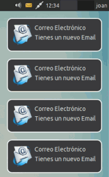](images/14-Notificación-de-llegada.png)

###### Nota: Aparecen 4 notificaciones porqué han llegado correos a las 4 cuentas de correo que tengo configuradas.

## VALORACIÓN DEL PLUGIN MAILWATCHER

**He estado usando esté plugin durante un tiempo considerable y pienso seguir usándolo ya que me ha convencido**. Lo encuentro práctico y útil. De forma muy rápida puedo ver si me ha llegado algún correo en cualquiera de las cuentas que tengo, y con tan solo un click de ratón puedo empezar a responder a los mails que me han llegado. Los únicos puntos de mejora que se me ocurren pueden ser los siguientes:

1. **El consumo de RAM para algunos usuarios quizás sea elevado**. El consumo que tiene en mi sistema de 64 bits es de 20 megas. No obstante en un sistema de 32 bits el consumo de RAM será únicamente de 5 Megas.
2. **Hay gente que consulta y responde el correo con el navegador. En este caso las acciones personalizadas al hacer click no son útiles**, a no ser que solo tengas una cuenta de correo, o todo tu correo esté redireccionado a la misma cuenta de correo.
3. **Otro punto de mejora podría ser que mailwatcher nos permitiera configurar notificaciones personalizadas en función de la cuenta de correo** en la que nos llega el mail. Actualmente la notificacion es la misma para todas las cuentas de correo.
4. En el caso que os conectéis a través de VPN recibiremos notificaciones de errores ya que nuestro servicio de correo detectará que nos estamos intentando conectar a través de una IP desconocida. No obstante esto no es problema del plugin. Esto es cuestión de nuestro servicio de correo electrónico que por temas de seguridad actúa de esta forma.

Ya para terminar os deseo a todos un Feliz 2014 y para quien quiera consultar información adicional acerca de esté plugin puede visitar el siguiente enlace:

[http://goodies.xfce.org/projects/panel-plugins/xfce4-mailwatch-plugin](http://goodies.xfce.org/projects/panel-plugins/xfce4-mailwatch-plugin "Información adicional del plugin Mailwatcher")
