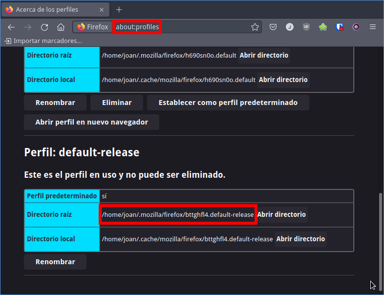
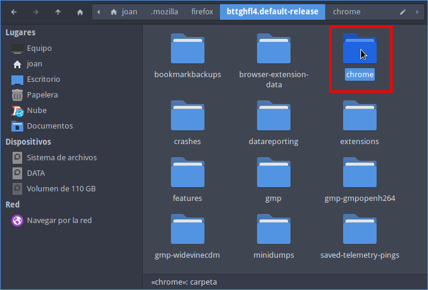
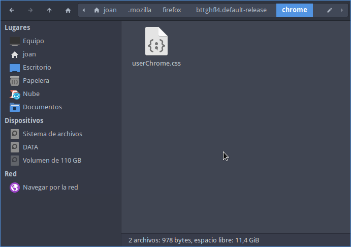
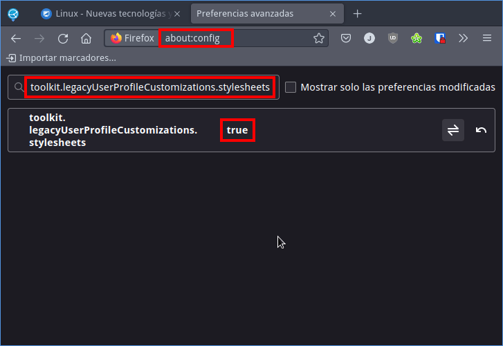
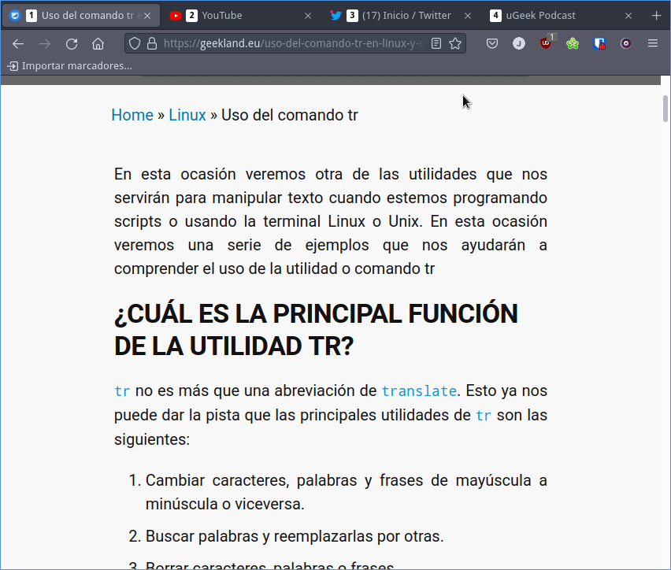
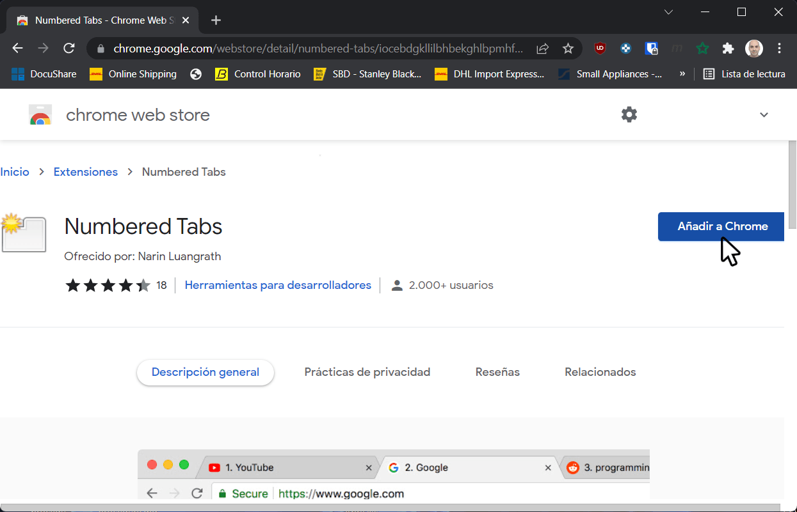
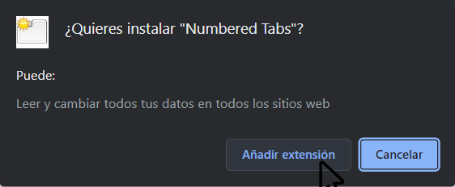

Muchos de vosotros se preguntarán porque cierta persona puede tener la necesidad de numerar las pestañas del navegador Web. La respuesta es sencilla. El hecho de numerar las pestañas del navegador Web nos facilitará la tarea de navegar y cambiar de pestaña mediante atajos de teclado. De esta forma seremos más rápidos y más productivos.<!--more-->

Como muchos sabrán, una vez tenemos abierto el navegador podemos cambiar de pestaña mediante la combinación de teclas `Ctrl + número_de_pestaña`. Por lo tanto si estamos en la pestaña 1 y queremos ir a la 3 no hace falta usar el ratón. Tan solo tenemos que presionar la combinación de teclas `Ctrl + 3`. No obstante en el caso que tengamos 8 pestañas abiertas no resultará tan fácil saber el número de la pestaña que queremos visitar. Para solventar el problema que acabo de citar podemos usar una simple extensión que nos facilitará saber el número de pestaña de forma inmediata.

**Nota:** En Firefox para Linux tenemos que usar la combinación de teclas `Alt + número_de_pestaña` para ir a la pestaña que queremos. Si no os gusta esta combinación de teclas podéis usar la extensión [Ctrl+Number to switch tabs](https://github.com/AbigailBuccaneer/firefox-ctrlnumber#readme).

## NUMERAR LAS PESTAÑAS DEL NAVEGADOR EN MOZILLA FIREFOX

Para numerar las pestañas lo podemos hacer a través de una extensión en el navegador como por ejemplo [Tab Numbering](https://addons.mozilla.org/es/firefox/addon/tab-numbering/?utm_source=addons.mozilla.org&utm_medium=referral&utm_content=search) o [Tab Numbers](https://addons.mozilla.org/es/firefox/addon/tab_numbers/?utm_source=addons.mozilla.org&utm_medium=referral&utm_content=search). Pero esta opción no me acaba de convencer porque estamos dando permisos a que la extensión recopile información sobre nuestra navegación. Por lo tanto en mi caso os recomiendo que lo hagáis mediante css del siguiente modo.

Lo primero que tenemos que realizar es averiguar donde se ubica la carpeta de configuración de nuestro perfil de Firefox. Para ello abriréis el navegador y en la barra de navegación introducirán `about:profiles`. Acto seguido podréis visualizar el directorio que almacena vuestro perfil.

[](images/directorio-perfil-firefox.png)

En mi caso el directorio es el `/home/joan/.mozilla/firefox/bttghfl4.default-release`. Una vez lo sabemos accedemos dentro del directorio y creamos un nuevo directorio llamado `chrome`.

[](images/crear-el-directorio-chrome.png)

Ahora accedemos dentro de la carpeta `chrome` y creamos un nuevo fichero con el nombre y extensión `userChrome.css`.

[](images/creacion-fichero-userchrome.png)

Una vez creado el archivo lo abrimos con un editor de textos y pegamos el siguiente código:

```css
tabs {
    counter-reset: tab-counter;
}

tab:nth-child(1) .tab-label::before,
tab:nth-child(2) .tab-label::before,
tab:nth-child(3) .tab-label::before,
tab:nth-child(4) .tab-label::before,
tab:nth-child(5) .tab-label::before,
tab:nth-child(6) .tab-label::before,
tab:nth-child(7) .tab-label::before,
tab:nth-child(8) .tab-label::before {
    background-color: white;
    border-radius: 0.25em;
    border: 1px solid white;
    box-sizing: border-box;
    color: black;
    content: counter(tab-counter) "";
    counter-increment: tab-counter;
    display: block;
    float: left;
    font-size: 0.8em;
    font-weight: bold;
    height: 1.5em;
    line-height: 1;
    margin: 0 0.5em 0 0;
    padding: 0.1em 0.25em 0.25em 0.25em;
    position: relative;
    text-align: center;
    top: 0.35em;
    vertical-align: middle;
    width: 1.4em;
}
```

Una vez pegado el código guardamos los cambios y cerramos el fichero. Ahora accederemos a las opciones de configuración de Firefox ingresando dirección `about:config` en la barra de navegación. Acto seguido presionaremos el botón de `Aceptar el riesgo y continuar` y finalmente cambiaremos el valor de la propiedad `toolkit.legacyUserProfileCustomizations.stylesheets` a true.

[](images/toolkit_legacyUserProfileCustomizations_stylesheets.png)

Ahora reiniciaremos Firefox y podremos ver que las pestañas del navegador aparecen perfectamente numeradas.

[](images/pestanas-del-navegador-firefox-numeradas.png)

Por lo tanto si ahora estoy en la pestaña 1 y quiero ir a la pestsaña 4 tan solo tendré que presionar la combinación de teclas `Ctrl + 4`.

Si no les gustan los colores del estilo de numeración tan solo tendrán que entrar en el fichero `userChrome.css` y editar su contenido. Otro ejemplo de código que podrían usar dentro del fichero `userChrome.css` es el siguiente:

```css
tabs {
  counter-reset: tab-counter;
}

.tab-label::before {
  counter-increment: tab-counter;
  content: counter(tab-counter) " - ";
}
```

## NUMERAR LAS PESTAÑAS EN GOOGLE CHROME

Al contrario que Firefox, en Google Chrome únicamente tenemos la opción de usar una extensión. En mi caso uso la extensión [Numbered tabs](https://chrome.google.com/webstore/detail/numbered-tabs/iocebdgkllilbhbekghlbpmhfeejgcgi). Para instalar la extensión tan solo tiene que acceder a la siguiente [URL](https://chrome.google.com/webstore/detail/numbered-tabs/iocebdgkllilbhbekghlbpmhfeejgcgi). Una vez hayan accedido a ella tendrán que clicar encima del botón de `Añadir a Chrome`.

[](images/anadir-numbered-tabs-a-chrome.png)

Acto seguido nos aparecerá otra ventana en la que tendremos que clicar encima del botón `Añadir extensión`.

[](images/anadir-extension-a-chrome.png)

A partir de estos momentos podremos ver que las pestañas de Google Chrome se numeran. De esta forma de sencilla podremos saltar de una pestaña a la otra mediante atajos de teclado.

### Fuentes

[https://gist.github.com/arthurattwell/19d868330a3c9f668a3f3a69230ac28c](https://gist.github.com/arthurattwell/19d868330a3c9f668a3f3a69230ac28c)

[https://github.com/tuomassalo/tab-numbering](https://github.com/tuomassalo/tab-numbering)

[https://www.userchrome.org/how-create-userchrome-css.html](https://www.userchrome.org/how-create-userchrome-css.html)
