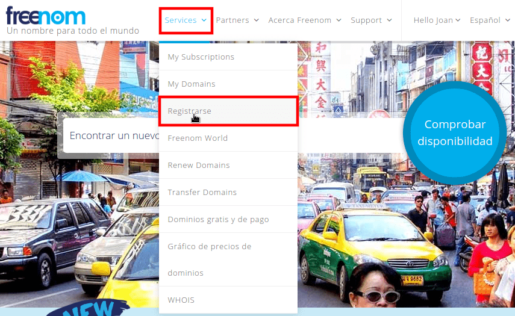
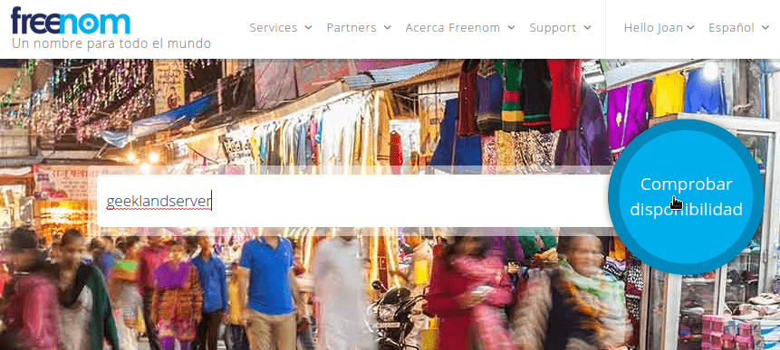
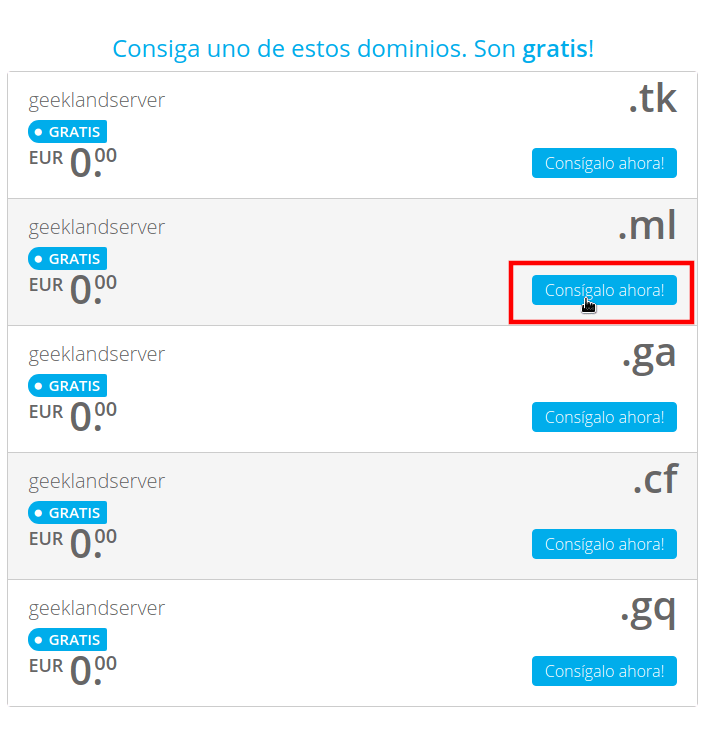
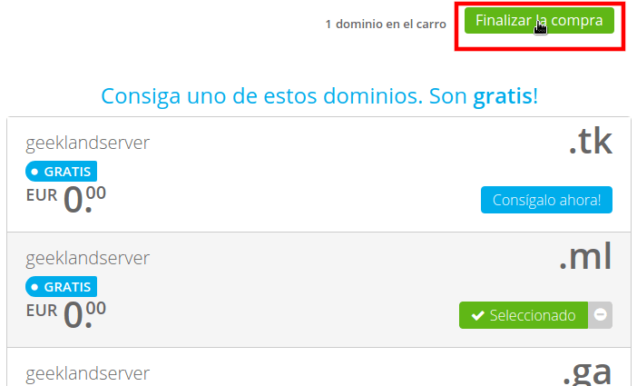
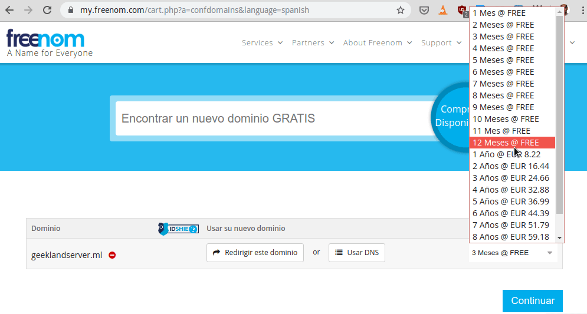
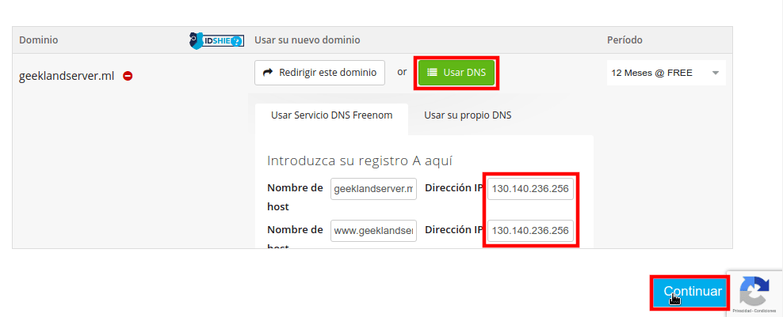
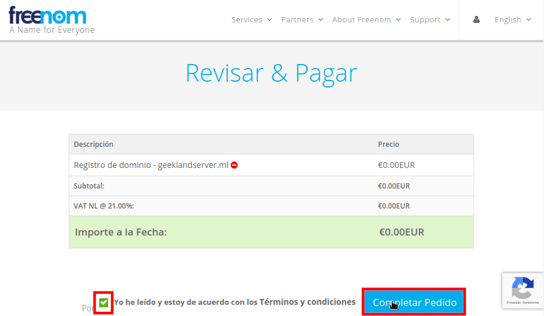
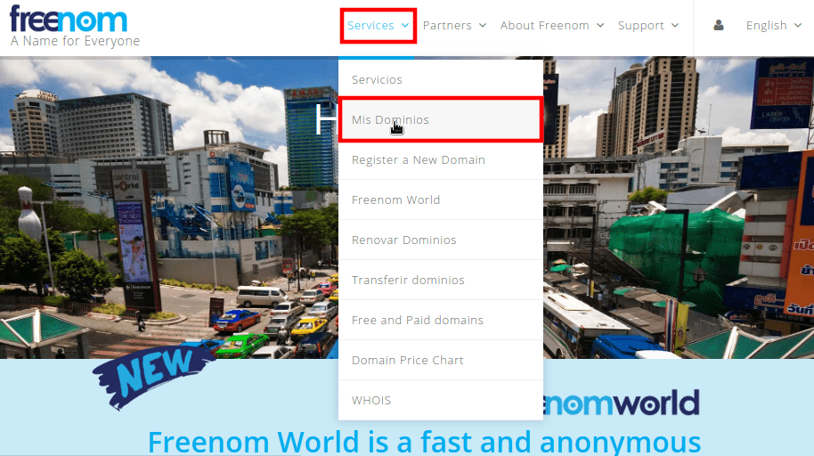

En el siguiente artículo veremos como obtener un dominio gratis de forma extremadamente sencilla. Pero antes de obtener el dominio tienen que ser conscientes de lo siguiente.<!--more-->

## PRECAUCIONES QUE DEBEMOS TENER CON LOS DOMINIOS GRATIS

Los puntos a tener antes de usar un dominio gratuito son los siguientes:

1. Con el método que veréis a continuación únicamente tendréis los siguientes dominios disponibles (**.tk**, **.ml**, **.ga**, **.cf**, **.gq**)
2. Simplemente seremos representantes del dominio que usaremos. **El titular del dominio será Freenom**. Por lo tanto usar un dominio gratuito no es recomendable para proyectos personales o empresariales que tengan importancia. También tengan en cuenta que en el momento que Freenom lo plazca nos puede retirar el servicio.
3. **El tiempo máximo que podremos usar el dominio son 12 meses**. Transcurridos los 12 meses podemos renovar de nuevo el domino.
4. **No uséis un dominio gratis si necesitáis estar bien posicionados en el buscador de Google**. Existen ciberdelicuescentes que usan dominios gratuitos para perpetrar estafás. Como reacción Google acostumbra a sancionar/penalizar los dominio gratuitos.
5. **La reputación de un dominio gratuito nunca será la misma que un dominio de pago**. Esto afecta tanto en el posicionamiento SEO como en la credibilidad de un posible cliente que visita nuestra web o servicio.
6. Usar este tipo de dominio **no es adecuado para un servidor de correo electrónico**. Prácticamente la totalidad de emails que enviéis con un dominio gratuito serán calificados con Spam.

Por lo tanto simplemente usen este tipo de dominios para acceder a servicios que tengamos alojados en la nube y que no tengan una importancia elevada. A modo de ejemplo podemos usar un dominio gratuito para los siguientes menesteres:

- Acceder a servicios que nosotros mismos podemos montar en la nube como por ejemplo Tiny Tiny RSS, Wallabag, un Nextcloud para uso personal, etc.

Nunca usen un dominio gratuito para un blog personal o para cualquier web que su fin sea ganar dinero o tener un buen posicionamiento SEO.

## OBTENER NUESTRO DOMINIO GRATIS CON FREENOM

Una vez somos conscientes de las precauciones que debemos tomar nos crearemos una cuenta de [Freenom](https://www.freenom.com/es/index.html?lang=es). Una vez creada la cuenta nos loguearemos y empezará el proceso para obtener nuestro dominio gratis.

Inicialmente clicamos en el Menú Services. Cuando se despliegue el menú clicamos en la opción Registrarse.

Acto seguido tecleamos el nombre del dominio que queremos registrar y presionamos el botón de Comprobar disponibilidad.

Seguidamente seleccionamos el dominio que queremos contratar cliando en el botón Consigalo ahora!. En mi caso seleccionaré el geeklandserver.ml

A continuación clicaremos en el botón de Finalizar compra.

El siguiente paso consistirá en definir el tiempo que queremos usar el dominio. Lo mejor que podemos hacer es seleccionar 12 meses. Una vez transcurridos los 12 meses deberemos renovar el dominio.

Una vez seleccionado el tiempo tenemos que clicar sobre el botón Usar DNS. Acto seguido en los campos Dirección IP ingresaremos la IP fija de nuestro servidor. Finalmente presionaremos en el botón Continuar.

###### Nota: La opción **Redirigir este dominio** la podemos usar para redirigir el dominio geeklandserver.ml a otro dominio que queramos como por ejemplo geekland.eu

Como último paso tan solo tenemos que Aceptar las condiciones de servicio y clicar sobre el botón Completar Pedido.

A partir de estos momentos tendremos que esperar unos minutos o horas para que se realice la propagación DNS. Como estamos usando los DNS de Freenom la propagación se debería realizar en cuestión de minutos. Por lo tanto en cuestión de minutos nuestro dominio estará apuntando a nuestro servidor.

## GESTIONAR NUESTRO DOMINIO

Mediante la interfaz web de Freenom podremos gestionar nuestro dominio sin problema alguno.

