Para obtener espacio adicional en Dropbox lo podemos hacer de forma fácil y relativamente rápida. Además con el método que presento a continuación no tendremos que spamear ni molestar a nuestros amigos enviando invitaciones por las redes sociales como [twitter](https://twitter.com/ "Twitter") o [facebook](https://www.facebook.com "Facebook").

Con el método citado a continuación podremos añadir hasta 16GB la capacidad actual de nuestra cuenta de Dropbox.<!--more-->

## HERRAMIENTAS NECESARIAS PARA OBTENER ESPACIO ADICIONAL EN DROPBOX

Lo único que necesitamos para obtener espacio adicional en Dropbox es tener instalada una máquina Virtual en nuestro sistema operativo. En mi caso tengo instalado [Virtualbox](https://www.virtualbox.org/ "Virtualbox"). En los siguientes apartados veremos el uso que le damos daremos a nuestra máquina virtual.

## PASOS A SEGUIR PARA OBTENER ESPACIO ADICIONAL EN DROPBOX

### Paso 1- Análisis de la capacidad de almacenamiento actual

Como se puede ver en la siguiente captura de pantalla mi cuenta de dropbox actualmente dispone de una capacidad de 3.4 GB.

[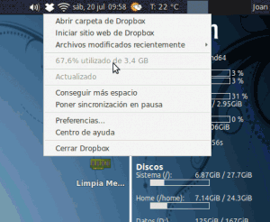](images/1-Capacidad-inicial-de-Dropbox.png)

 

 

 

 

 

 

 

 

Una vez hayamos seguido los 6 pasos del tutorial nuestra capacidad se incrementará en 500 MB. Podemos repetir los 6 pasos tantas veces como consideremos necesario hasta obtener un espacio adicional al actual de hasta 16 GB.

### Paso 2- Crear una Cuenta de correo Electrónico

El segundo paso es muy simple. Tan solo tenemos que crear una cuenta de correo electrónico. Podemos elegir cualquiera de los servicios de correo electrónico que existen en la actualidad. Algunas de las opciones que tenemos son:

1. [yahoo](https://login.yahoo.com/config/login_verify2?.intl=es&.src=ym "Yahoo")
2. [hotmail](https://login.live.com/login.srf?wa=wsignin1.0&rpsnv=11&ct=1374334293&rver=6.1.6206.0&wp=MBI&wreply=http:%2F%2Fmail.live.com%2Fdefault.aspx&lc=2058&id=64855&mkt=es-US&cbcxt=mai&snsc=1 "Hotmail")
3. [gmail](https://mail.google.com "gmail")

En mi caso he creado he creado la siguiente cuenta de correo en gmail:

geekland.hol.es(arroba)gmail.com

**Otra opción alternativa a la citada** para realizar este paso más rápidamente es usar el servicio de  10minute.com. Para acceder a este servicio tenéis que abrir vuestro navegador e ingresar la siguiente dirección:

[http://10minutemail.com/](http://10minutemail.com/ "10minute.com")

Una vez hayáis ingresado en la web veréis la siguiente pantalla:

[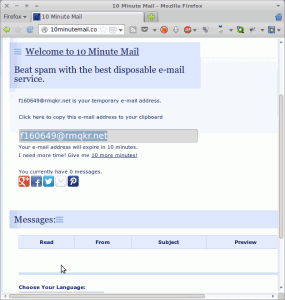](images/Servicio-10-minutes.png)

Como se puede ver en la captura de pantalla este servicio nos esta proporcionando un correo electrónico que únicamente durará 10 minutos. En mi caso el correo electrónico que me proporciona es:

f160649(arroba)rmqrk.net

Por lo tanto si elegimos este método tenemos que realizar los pasos restantes de forma rápida ya que tan solo tendremos 10 minutos para completar todo el proceso. Tenéis que mantener la ventana del navegador abierta ya que en el apartado **Messages** es donde recibiremos la invitación para darnos de alta a Dropbox.

### Paso 3- Enviar una invitación a la cuenta que acabamos de crear

El tercer paso consiste en enviar un correo de invitación de unión a Dropbox, desde nuestra cuenta de Dropbox a la cuenta de email que acabamos de crear.

Para ello ingresamos en nuestro navegador y entramos dentro de nuestra cuenta de dropbox. Justo al acceder a nuestra cuenta veremos la siguiente pantalla:

[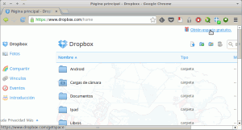](images/2-Acceso-a-Dropbox-para-conseguir-espacio-adicional.png)

Si observamos la captura de pantalla, en el extremo superior derecho vemos una frase que dice **conseguir espacio adicional**. Clicamos encima de esta frase. Una vez hayamos clicado aparecerá la siguiente pantalla:

[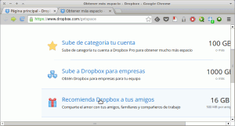](images/3-Recomendar-Dropbox-a-tus-amigos.png)

Ahora tendremos que clicar encima de **Recomienda Dropbox a tus amigos**. Una vez seleccionada esta opción vuestro navegador mostrará el siguiente contenido:

[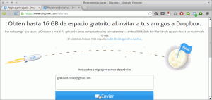](images/4-Invitar-a-un-amigo.png)

Como se puede ver en la captura de pantalla ahora tan solo tenemos que introducir la dirección de correo electrónico que creamos en el Paso 2, en el cuadro de dialogo **Invita a tus amigos por correo electrónico**. Una vez introducido el correo electrónico tan solo tenemos que apretar el Botón **Enviar**.

En estos momentos ya hemos enviado la invitación a una tercera persona para que se suscriba a Dropbox. Una vez está persona es haya suscrito obtendremos 500 MB adicionales.

### Paso 4- Cambiar la dirección MAC de nuestra máquina virtual

En este paso entra en juego nuestra máquina virtual que en mi caso es [Virtualbox](https://www.virtualbox.org/ "Virtualbox"). Lo primero que tenemos que realizar es arrancar [Virtualbox](https://www.virtualbox.org/ "Virtualbox").

[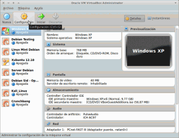](images/5-Configurar-Máquina-Virtual.png)

Tal y como podemos ver en la captura de pantalla una vez arrancado Virtualbox tenemos que seleccionar el sistema operativo que queremos usar y apretar el botón de Configuración. Podrán observar que en mi caso he elegido Windows XP.

Justo al apretar el Botón de **configuración** nos aparecerá las siguiente ventana para seleccionar la configuración de nuestra máquina virtual con windows XP:

[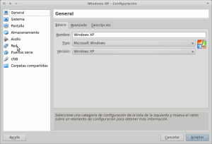](images/6-Acceso-a-Configuración-de-Red.png)

 

 

 

 

 

 

 

Una vez dentro de las opciones de configuración tal y como podemos ver en la captura de pantalla tenemos que seleccionar la opción Red. Una vez seleccionada la opción de Red os aparecerán las siguientes opciones de configuración:

[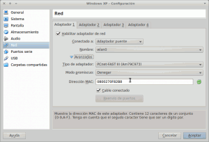](images/7-Dirección-MAC-inicial.png)

Ahora ya podemos proceder a cambiar nuestra MAC Address. Dentro de las opciones de configuración avanzadas vemos que hay un campo que se llama **Dirección\_MAC**. Tal y como se puede ver en la captura de pantalla nuestra dirección dirección MAC actual es:

**0800270F82B8**

Para cambiar la dirección MAC tan solo tenemos que modificar la serie de dígitos que acabo de detallar.

[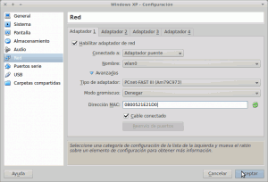](images/8-Dirección-MAC-cambiada.png)

Después de la modificación de los dígitos, tal y como se puede ver en la captura de pantalla, mi nueva MAC es:

**0800521E24D0**

Una vez introducida la nueva dirección MAC tan solo tenemos que presionar el botón **Aceptar** y habremos terminado con el paso 4.

###### Nota: Este es el paso más importante y crucial para que Dropbox nos proporcione los 500 MB adicionales. En el caso que no se cambie la dirección MAC dropbox detectará que estamos intentando engañarle y no nos proporcionará la capacidad adicional.

###### Nota: La dirección MAC (Media Access Control) es un identificador de nuestra tarjeta de Red. La dirección MAC es única para cada dispositivo y sirve para identificar físicamente a un elemento de hardware. Los primeros 24 bits de la dirección MAC sirven para identificar el fabricante de la tarjeta de red mientras que los otros 24 bits sirven para diferenciar cada una de las tarjetas de red producidas por el fabricante. Por lo tanto en determinados casos, para los hackers y otras personas es importante ocultar o falsear la dirección MAC ya que con ella estamos dando pistas de nuestra identidad.

### Paso 5- Arrancar la máquina Virtual

En el paso 5 tan solo tenemos que **arrancar Windows XP** en nuestra máquina virtual. Como se puede ver en la captura de pantalla tan solo tenemos que seleccionar windows XP y apretar el botón **Iniciar**.

[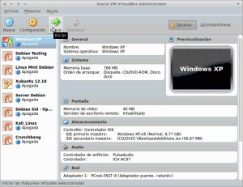](images/9-Iniciar-Windows-XP.png)

### Paso 6- Suscribirse a Dropbox a partir de la invitación que hemos enviado

Una vez haya arrancado nuestra máquina virtual tan solo tenemos que abrir nuestro navegador y **acceder a la cuenta de correo electrónico creada en el punto 2**.

[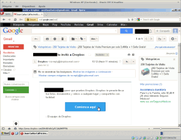](images/10-Invitación-recibida.png)

Como se puede ver en la captura de pantalla hemos accedido dentro de la cuenta de correo geekland.hol.es(arroba)gmail.com . En nuestra bandeja de entrada también veremos que hemos recibido el correo de invitación. **Abrimos el correo de invitación y** tal y como se puede ver en la captura de pantalla **apretamos el botón de Comienza aquí**.

Después de apretar el botón comienza aquí os aparecerá la siguiente pantalla:

[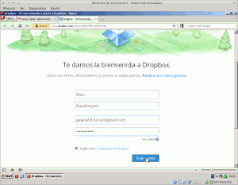](images/11-Creación-de-la-cuenta-de-Dropbox.png)

Tal y como se puede ver en la captura de pantalla **rellenamos los datos de nuestra futura cuenta de Dropbox**. Es importante que la dirección de correo que uséis sea la misma a la cual habéis recibido la invitación.

Una vez introducidos la totalidad de datos tan solo tenemos que **apretar el botón azul de crear cuenta**. Seguidamente nos pedirá descargar Dropbox.

[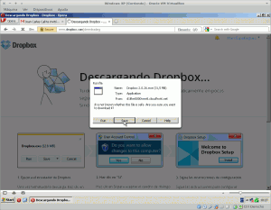](images/12-Petición-de-descarga-de-Dropbox.png)

Tal y como se pueda ver en la captura **elegiremos la opción de descargar el binario de Dropbox**. En mi caso lo descargaré en el escritorio de Windows.

Una vez descargado el binario lo ejecutamos y empezará el proceso de instalación de Dropbox. Ya en el paso final del proceso de instalación aparecerá la siguiente pantalla:

[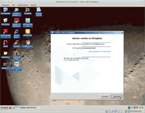](images/13-Iniciando-Sesión.png)

Como se puede ver en la captura de imagen tan solo tenéis que **introducir los datos de vuestra cuenta y elegir un nombre de ordenador**. Una vez realizado este paso apretamos el botón de siguiente y terminados de completar nuestra instalación.

Una vez completada la instalación dispondremos de 500 MB adicionales. Para comprobar que lo que digo es cierto tan solo tenemos que observar la siguiente captura de pantalla:

[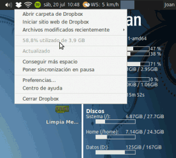](images/14-Espacio-ampliado.png)

En el Paso 1 del post habíamos visto que nuestro espació era de 3.4 GB. Ahora observamos que el espacio es de 3.9 GB. Por lo tanto hemos obtenido el incremento de 500 MB.

Para volver obtener 500 MB adicionales tan solo tenemos que repetir de nuevo los pasos del 1 al 6. Con este método podremos llegar a añadir 16 GB a la capacidad actual que tenga nuestra cuenta de Dropbox.
