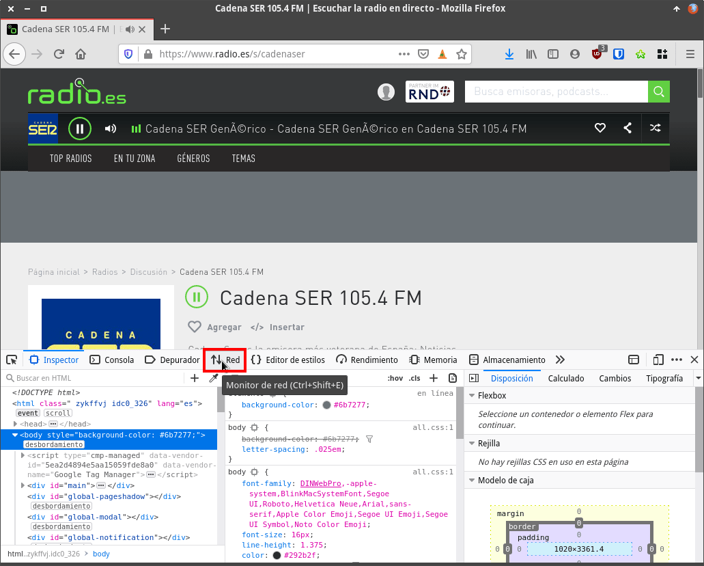
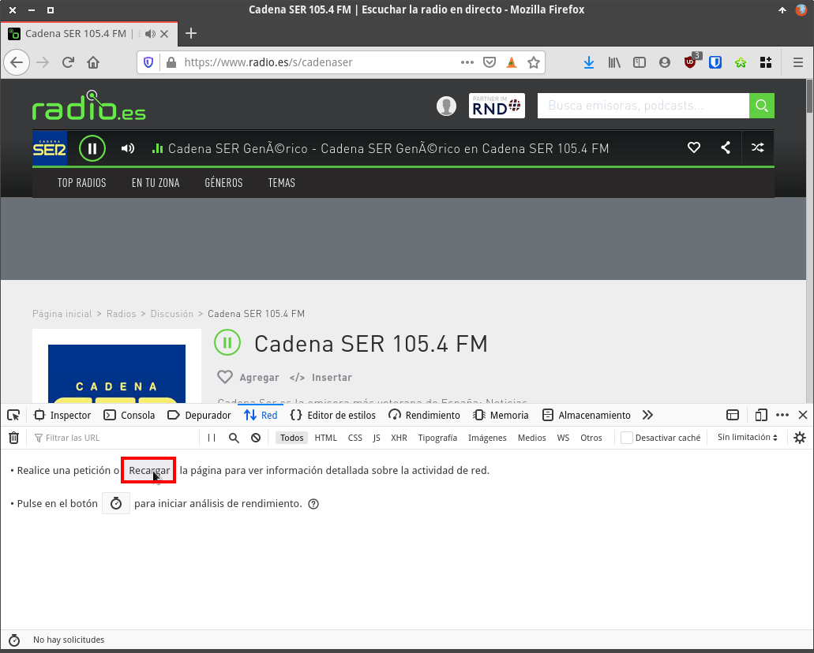
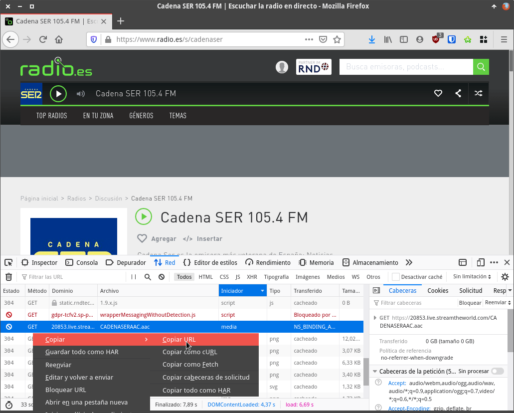
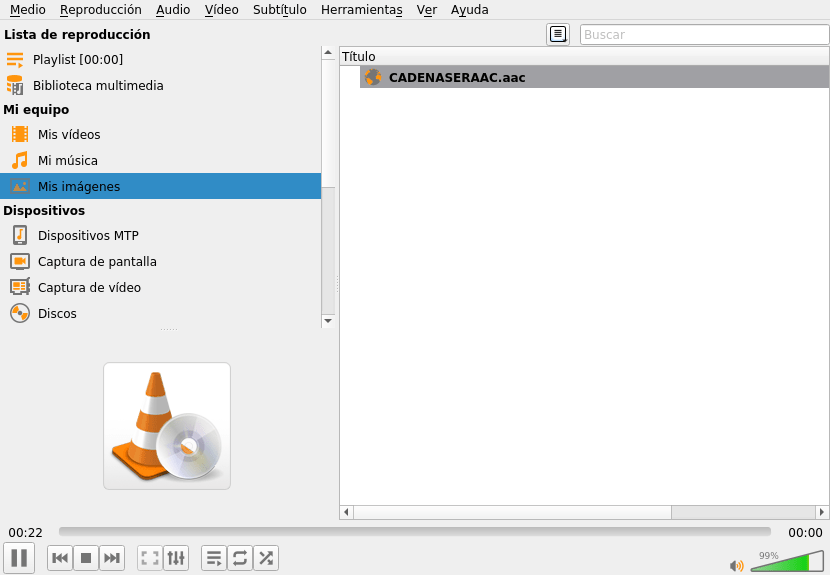

Obtener las URL para poder escuchar radio en Streaming en VLC o en cualquier otro reproductor es sumamente sencillo. Tan solo precisamos de un navegador web y seguir los pasos que detallaré a continuación.<!--more-->

## ESCUCHAR LA EMISORA DE LA CUAL QUEREMOS OBTENER SU URL EN EL NAVEGADOR WEB

Abrimos el navegador Firefox y nos dirigimos a cualquier página web que reproduzca radio en streaming. A modo de ejemplo podemos dirigirnos a cualquiera de las siguientes web:

[https://emisora.org.es/](https://emisora.org.es/)

[https://www.radio.es/](https://www.radio.es/)

**Nota**: He dejado 2 URL de muestra. Podéis usar cualquier página web que ofrezca radio en streaming.

Una vez dentro de la web seguimos los pasos necesarios para empezar a reproducir la emisora.

## ABRIR EL INSPECTOR DE ELEMENTOS DE FIREFOX PARA OBTENER LA URL DEL STREAMING

Una vez se esté reproduciendo la emisora presionad la tecla `F12` para abrir el inspector de elementos de Firefox. Una vez abierto hay que presionar sobre el botón `Red`.

[](images/abrir-inspector-de-elementos-firefox.png)

A continuación presionamos sobre el botón `Recargar`.

[](images/recargar-elementos-que-aparecen-en-la-pagina.png)

Acto seguido aparecerán todos los elementos que se cargan en la página web. Ahora tan solo tenemos que buscar la/s fila/s cuyo tipo de Iniciador sea `media`. Una vez encontrada la seleccionamos, presionamos el botón derecho del ratón y cuando aparezca el menú contextual clicamos sobre las opciones `Copiar` y `Copiar URL`.

[](images/copiar-url-para-escuchar-radio-en-streaming.png)

De este modo tan sencillo hemos copiado la URL para poder escuchar la radio cadena SER en streaming. Ahora tan solo tenemos que pegar el contenido en un archivo de texto cualquiera y veremos que la URL que estábamos buscando es:

> ```shell
> https://20853.live.streamtheworld.com/CADENASERAAC.aac
> ```

El procedimiento que acabamos de ver lo podemos repetir todas las veces que queramos para cada una de las emisoras que queramos obtener su URL. Una vez tengamos la URL la podremos reproducir el audio en programas como por ejemplo VLC, mpv, audacious, etc.

[](images/escuchando-radio-en-streaming-con-VLC.png)

Otra solución es reproducirlo desde la terminal tal y como se muestras en el siguiente enlace.

https://geeklandlinux.github.io/posts/escuchar-la-radio-desde-la-terminal-en-linux-con-un-script-de-bash/
