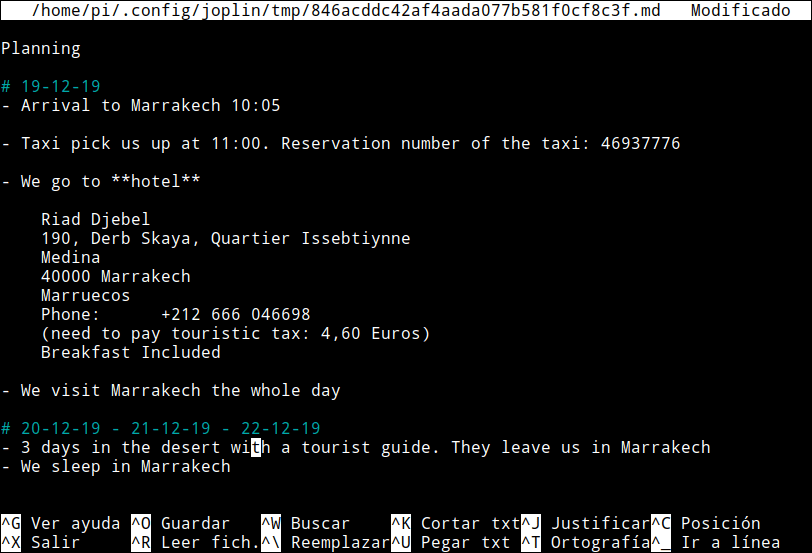
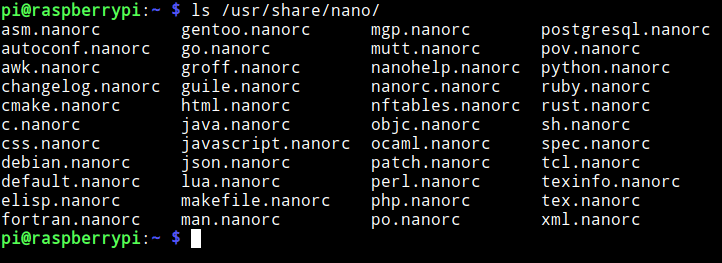
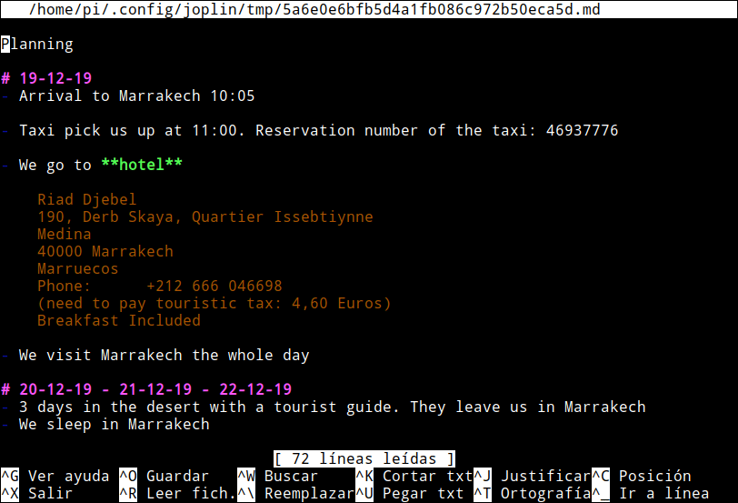
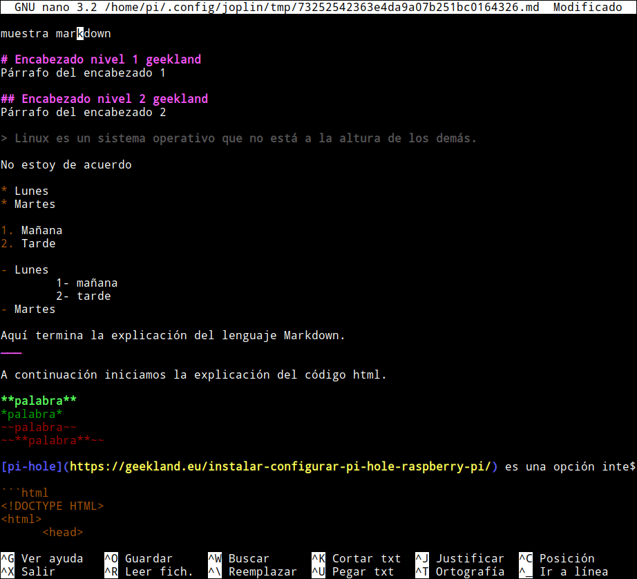

Es posible que alguien pretenda usar nano para editar o crear un fichero en Markdown. Si lo hacen verán que nano no tiene ningún tipo de resaltado Markdown.<!--more-->

[](images/texto-sin-resaltado-markdown-en-nano.png)

Si os encontráis con este problema tiene fácil solución. Tan solo tenéis que crear un fichero para especificar el resaltado que queréis realizar.

## COMPROBAR SI NANO TIENE CONFIGURADO UN RESALTADO MARKDOWN

Los ficheros de configuración que aplican el resaltado de los diferentes diferentes tipos de lenguajes de programación se hallan en /usr/share/nano. Para listar los fichero existentes ejecutaremos el siguiente comando en la terminal:

> ```
> ls /usr/share/nano/
> ```

En mi caso el resultado obtenido ha sido el siguiente:

[](images/configuraciones-de-resaltado-disponibles.png)

Observamos que no hay ningún fichero que contenga el nombre markdown. Por lo tanto no se está aplicando ningún tipo de resaltado. Para definir el resaltado que tendrán los archivos que terminan con las extensiones .md, .mkd, .mkdn, .markdown realizaremos lo siguiente.

## CREAR EL FICHERO DE CONFIGURACIÓN PARA RESALTAR EL TEXTO MARKDOWN EN NANO

Visto lo visto, la forma para solucionar nuestro problema es crear un fichero de configuración para configurar el resaltado que tenemos que aplicar a los ficheros markdown. Para ello tan solo tenemos que ejecutar el siguiente comando en la terminal:

> ```
> sudo nano /usr/share/nano/markdown.nanorc
> ```

Una vez se habrá el editor de textos nano pegaremosw el siguiente código que servirá para definir el marcado:

> ```
> syntax "Markdown" "\.(md|mkd|mkdn|markdown)$"
> 
> # Tables
> color cyan ".*[ :]\|[ :].*"
> 
> # quotes
> color brightblack start="^>" end="^$"
> color brightblack "^>.*"
> 
> # Emphasis
> color green "(^|[[:space:]])(_[^ ][^_]*_|\*[^ ][^*]*\*)"
> 
> # Strong emphasis
> color brightgreen "(^|[[:space:]])(__[^ ][^_]*__|\*\*[^ ][^*]*\*\*)"
> 
> # strike-through
> color red "(^|[[:space:]])~~[^ ][^~]*~~"
> 
> # horizontal rules
> color brightmagenta "^(---+|===+|___+|\*\*\*+)\s*$"
> 
> # headlines
> color brightmagenta "^#{1,6}.*"
> 
> # lists
> color yellow "^[[:space:]]*[\*+-] |^[[:space:]]*[0-9]+\. "
> 
> # leading whitespace
> color black "^[[:space:]]+"
> 
> # misc
> color magenta "\(([CcRr]|[Tt][Mm])\)" "\.{3}" "(^|[[:space:]])\-\-($|[[:space:]])"
> 
> # links
> color brightblue "\[[^]]+\]"
> color brightblue "\[([^][]|\[[^]]*\])*\]\([^)]+\)"
> 
> # images
> color magenta "!\[[^][]*\](\([^)]+\)|\[[^]]+\])"
> 
> # urls
> color brightyellow "https?://[^ )>]+"
> 
> # code
> color yellow "`[^`]*`|^ {4}[^-+*].*"
> 
> # code blocks
> color yellow start="^```[^$]" end="^```$"
> color yellow "^```$"
> 
> # Trailing spaces
> color green "[[:space:]]+$"
> ```

Una vez pegado el código guardan los cambios y cierran el fichero. A partir de ahora siempre que editemos un fichero con las siguientes extensiones:

1. .md
2. .mkd
3. .mkdn
4. .markdown

Se utilizará el resaltado Markdown que acabamos de definir. Si ahora volvemos a abrir el fichero que abrimos inicialmente veremos que ahora si se está aplicando un resaltado para el lenguaje Markdown.

[](images/resultado-final-con-resaltado-markdown.png)

### MUESTRA EN DETALLE DEL NUEVO RESALTADO MARKDOWN

Les recomiendo que creen un fichero cualquiera y vayan escribiendo texto siguiendo en lenguaje de marcado markdown. Si lo hacen verán que en cada uno de los elementos se aplicará el resaltado que hemos configurado.

[](images/resultados-finales-de-la-configuracion.png)

Si no les gusta algunos de los colores pueden entrar dentro del fichero de configuración y cambiarlos.

## SITIOS PARA ENCONTRAR CONFIGURACIONES DE MARCADO ALTERNATIVAS

Usando su buscador web serán capaces de encontrar configuraciones predefinidas para el resaltado de texto Markdown en nano. Algunas URL en las que podréis encontrar configuraciones para Markdown y para otros tipos de lenguaje son las siguientes:

[https://github.com/serialhex/nano-highlight/](https://github.com/serialhex/nano-highlight/) [https://github.com/scopatz/nanorc/](https://github.com/scopatz/nanorc/) [https://github.com/yuriibezpalko/nanorc](https://github.com/yuriibezpalko/nanorc) [https://gitlab.pasteur.fr/nmaillet/Small\_tips/-/tree/f185268471ff3f87a25979ddb4099cdab0666d54/nano/.nano/syntax](https://gitlab.pasteur.fr/nmaillet/Small_tips/-/tree/f185268471ff3f87a25979ddb4099cdab0666d54/nano/.nano/syntax)

Si buscan estoy seguro que encontrarán más opciones de las que he detallado.
