Meses atrás vimos los [mecanismos que usa Microsoft para recolectar datos]() de sus usuarios con el fin de poder monetizarlos de alguna forma. Si queremos evitar, o intentar minimizar, la información que Microsoft puede obtener de nuestros equipos les recomiendo que sigan los consejos para configurar las opciones de privacidad en Windows 10.<!--more-->

La configuración de privacidad que verán a continuación es la que yo uso. En cada uno de los apartados se comentan las razones por las cuales elijo cada una de las opciones.

En mi caso verán que tengo la mayoría de opciones de privacidad desactivadas. Los motivos son los siguientes:

1. Prácticamente no uso aplicaciones modernas de Windows en mi ordenador.
2. Desactivando las opciones de privacidad mejoramos nuestra privacidad y seguridad.
3. La gran mayoría de opciones de privacidad que vienen activadas no aportan ninguna funcionalidad a un ordenador. Por lo tanto lo mejor que podemos hacer es desactivarlas.

## CONFIGURAR LAS OPCIONES DE PRIVACIDAD DE WINDOWS

Mediante la configuración de la privacidad de Windows 10 podemos deshabilitar algunos de los mecanismos que Microsoft usa para obtener nuestra información.

Para acceder a las opciones de privacidad de Windows 10 presionamos la combinación de teclas Win + I. Al abrirse la ventana Configuración clicaremos encima de la opción Privacidad.

[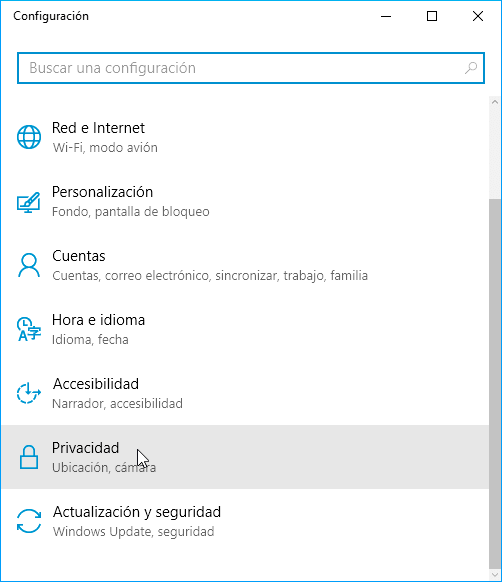](images/acceder-opciones-de-privacidad.png)

A continuación aparecerá la ventana en la que podremos configurar gran parte de las opciones de privacidad de Windows 10.

Las opciones de privacidad que podemos seleccionar en cada una de las pestañas son las siguientes:

### Opciones de privacidad en la pestaña General

En mi caso tengo la totalidad de opciones desactivadas.

[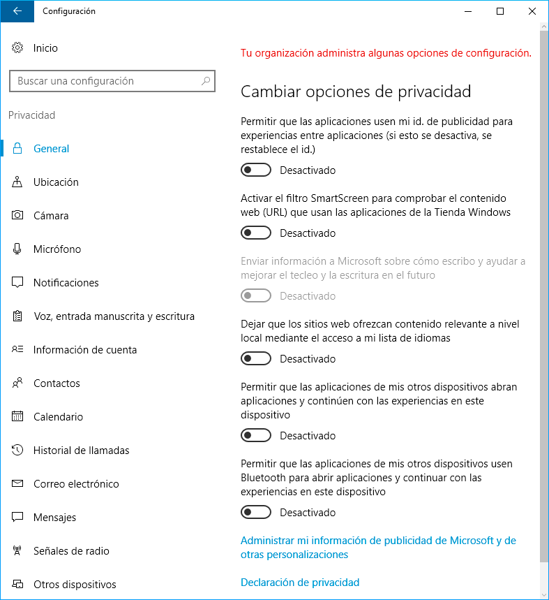](images/opciones-privacidad-pestaña-general.png)

El motivo de la desactivación de cada una de las opciones es el siguiente:

1. No quiero que las aplicaciones usen un identificador de publicidad con el fin de ofrecerme publicidad adaptada a mis gustos. Además si una aplicación usa publicidad la desinstalo.
2. Aunque el filtro SmartScreen es una herramienta de seguridad para evitar la ejecución de Software malicioso, la desactivo porque Microsoft también la puede usar para saber la totalidad de URL’s que visito y los programas que tengo y uso en mi ordenador.
3. Obviamente desactivo la característica en la que Microsoft solicita información para saber cómo escribo. Este mecanismo es un Keylogger cuya función es registrar todo lo que escribimos en nuestro ordenador.
4. No estoy interesado que los sitios web me ofrezcan publicidad adaptada a mis gustos y ubicación. Como he dicho anteriormente si una aplicación tiene publicidad la desinstalo. Además cuando estoy navegando uso un bloqueador de publicidad.
5. Únicamente uso Windows en un equipo. Por lo tanto la opción número 5 no es de mi interés. En caso necesario podéis activar esta opción, pero tenéis que ser conscientes que la información necesaria para sincronizar la totalidad de vuestros equipos se guardará en los servidores de Microsoft.
6. Por las mismas razones que en el punto anterior tengo deshabilitada la opción 6.

### Opciones de privacidad en la pestaña Ubicación

En este apartado desactivo la totalidad de opciones porque no quiero que Microsoft tenga acceso a mi ubicación real.

[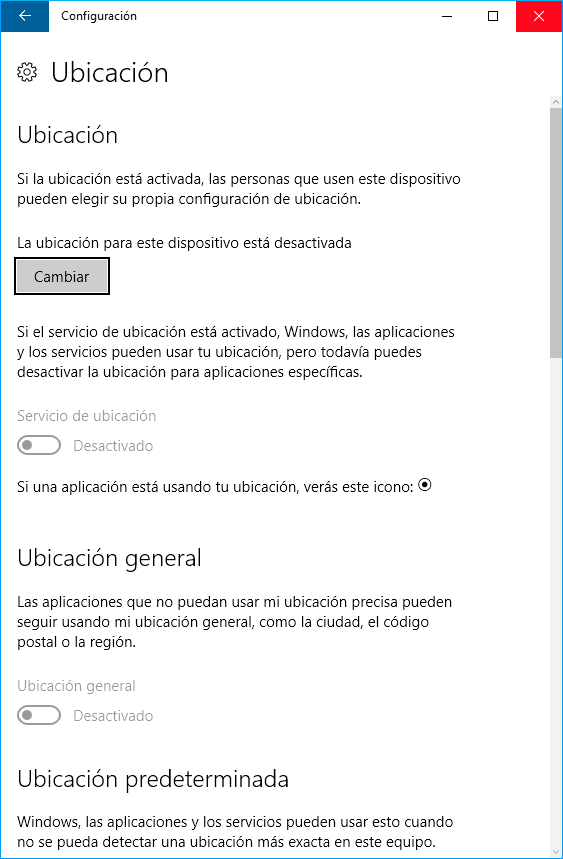](images/opciones-privacidad-ubicacion.png)

Seguidamente buscamos el apartado **Historial de ubicaciones** y presionamos el botón Borrar. De este modo eliminamos el historial de ubicaciones que tenemos almacenado en nuestro equipo.

[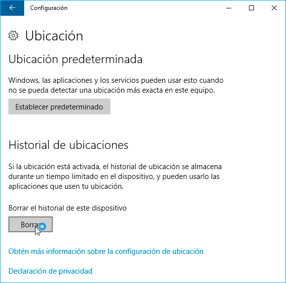](images/borrar-historial-ubicaciones.png)

Si activamos la ubicación, Microsoft tendrá la capacidad de monitorizar y registrar todas nuestras localizaciones geográficas y las usará para ofrecernos publicidad y servicios según nuestra ubicación geográfica.

En el caso que un programa en concreto necesite vuestra ubicación la podéis activar, pero asegurad que únicamente la activáis para el programa en cuestión. Cuando hayas terminado de usar el programa recomiendo revocarle el permiso para que no pueda acceder a nuestra ubicación.

###### Nota: En un dispositivo móvil con Windows 10 puede resultar interesante activar esta opción, pero no en un ordenador.

### Opciones de privacidad en la pestaña Cámara

En mi caso no utilizo aplicaciones modernas de Windows. Por lo tanto en el apartado de cámara desactivo todas las opciones de privacidad porque no quiero que ninguna Modern App ni Microsoft puedan utilizar mi webcam sin saberlo.

[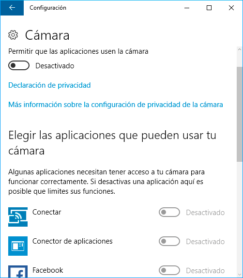](images/opciones-configuracion-camara.png)

En el caso que un día use mi webcam, para tirar una foto o grabar un vídeo, simplemente accedo a la configuración de la cámara y doy los permisos pertinentes.

Una vez haya terminado de usar la webcam accedo de nuevo a las opciones de privacidad de la cámara y vuelvo a desactivar la totalidad de las opciones. De este modo conseguiremos mejorar nuestra privacidad y nuestra seguridad.

### Opciones de privacidad en la pestaña Micrófono

Si tenemos activado el micrófono existe la posibilidad que Microsoft y las aplicaciones que tenemos instaladas puedan escuchar y registrar lo que estamos diciendo.

Por lo tanto en mi caso deshabilito completamente esta opción para que ninguna aplicación moderna tenga acceso a nuestro micrófono.

[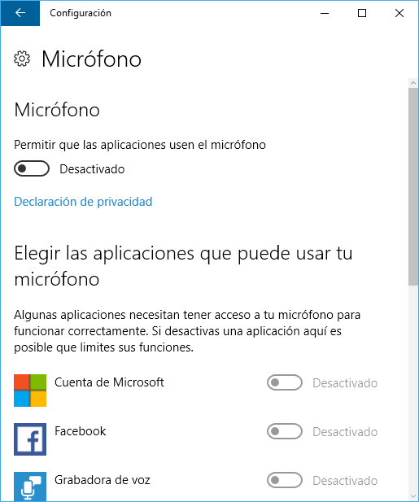](images/opciones-privacidad-microfono.png)

En el caso que un día necesite usar el micrófono con alguna de las aplicaciones modernas, como por ejemplo Skype o Xbox, accederé a las opciones de privacidad del micrófono y daré el permiso oportuno únicamente a la aplicación que tiene que usar el micrófono.

Una vez usada la aplicación recomiendo volver a deshabilitar la totalidad de permisos.

### Opciones de privacidad en la pestaña Notificaciones

No quiero que ninguna de mis aplicaciones modernas tenga acceso a mis notificaciones. Por lo tanto también desactivo totalmente este apartado.

[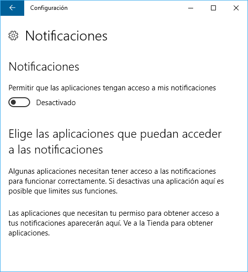](images/opciones-privacidad-notificaciones.png)

Si desactivar esta opción supone algún inconveniente, entonces pueden dar permisos a aplicaciones específicas para que puedan tener acceso a nuestras notificaciones.

### Opciones de privacidad en la pestaña Voz, entrada manuscrita y escritura

No uso Cortana y no quiero que Windows recopile información de lo que digo y escribo en mi ordenador.

Por lo tanto presiono el botón Dejar de conocerme. Seguidamente cuando aparezca la advertencia que vamos a desactivar esta característica presionamos el botón Desactivar.

[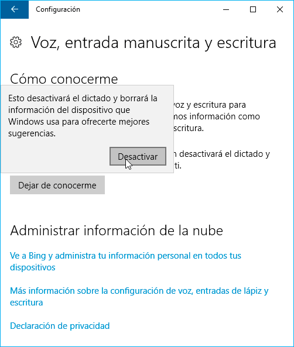](images/dejar-de-conocerme.png)

###### Nota: Es necesario tener activada esta opción para utilizar Cortana. Así que en el caso que tengáis o queráis usar Cortana deberéis activar esta opción.

### Opciones de privacidad en la pestaña Información de cuenta

No deseo que ninguna aplicación moderna pueda tener acceso a información almacenada en mi cuenta de Microsoft.

Recordad que nuestra cuenta de Microsoft puede almacenar información sensible como datos personales, búsquedas realizadas en Internet mediante el buscador Bing, comandos de voz usados con Cortana, programas que usamos, etc.

Por lo tanto desactivo la opción que las aplicaciones puedan acceder a la información almacenada en mi cuenta de Microsoft.

[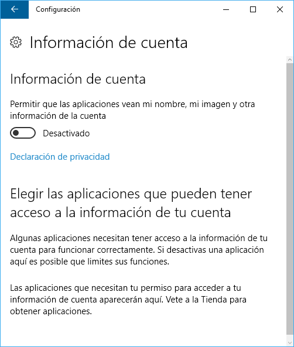](images/permiso-de-acceso-a-mi-cuenta.png)

Si desactivar esta opción les supone algún inconveniente, pueden dar permisos a aplicaciones específicas para que puedan acceder a la información almacenada en nuestra cuenta.

### Opciones de privacidad en la pestaña Contactos

No hay necesidad que ninguna de las aplicaciones modernas pueda acceder a los contactos almacenados en mi cuenta de Microsoft.

Por lo tanto desactivo completamente esta opción y de paso conseguimos que Windows sea más respetuoso con nuestra privacidad.

[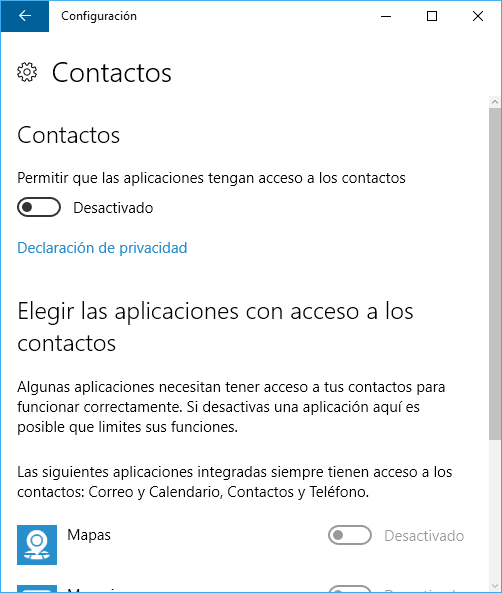](images/opciones-privacidad-contactos.png)

Si lo consideráis oportuno podéis hacer que únicamente ciertas aplicaciones tengan acceso a vuestros contactos.

###### Nota: En el caso de usar aplicaciones modernas como por ejemplo Skype o Twitter es necesario darles permiso para que puedan acceder a nuestros contactos. En caso contrario es posible que funcionen de forma anómala.

### Opciones de privacidad en la pestaña Calendario

No necesito que ninguna de las aplicaciones modernas ni Windows pueda consultar el contenido de mi aplicación de calendario. Por lo tanto desactivo totalmente esta opción.

[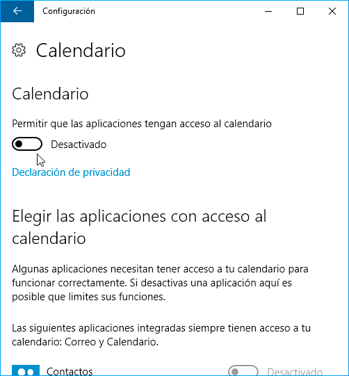](images/opciones-privacidad-calendario.png)

### Opciones de privacidad en la pestaña Historial de llamadas y Mensajes

La mayoría de usuarios no usan Windows 10 en un teléfono móvil. Por lo tanto no tiene sentido alguno que activemos estas opciones.

### Opciones de privacidad de la pestaña Correo electrónico

Existen aplicaciones que pretenden acceder a la aplicación moderna de correo electrónico de Windows para los siguientes fines:

1. Consultar el contenido de nuestros correos para ofrecernos algún tipo de funcionalidad adicional.
2. Hacer uso de nuestro correo enviando emails para por ejemplo compartir algún tipo de información con nuestros contactos.

En mi caso no necesito y no quiero que ninguna de las aplicaciones modernas de Windows tenga acceso al contenido y al uso de mi correo electrónico. Por lo tanto en este apartado desactivo la totalidad de opciones porque no las necesito y quiero preservar mi privacidad.

[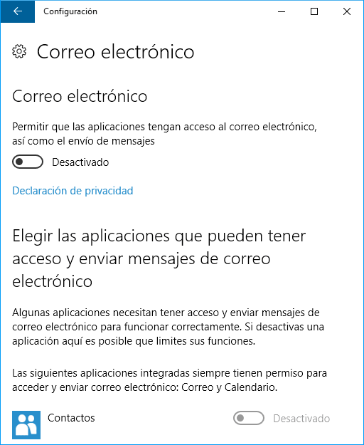](images/opciones-privacidad-correo-electronico.png)

###### Nota: Si lo precisan pueden configurar que solo ciertas aplicaciones tengan acceso a nuestro correo electrónico.

###  Opciones de privacidad referentes a las señales de radio

En señales de radio permitimos o rechazamos que ciertas aplicaciones de nuestro ordenador puedan usar el dispositivo Bluetooth para intercambiar datos con otros dispositivos como por ejemplo pulseras inteligentes.

Como en mi caso no uso ninguna aplicación que tenga que enviar y recibir datos vía Bluetooth desactivo completamente la opción de señales de radio.

[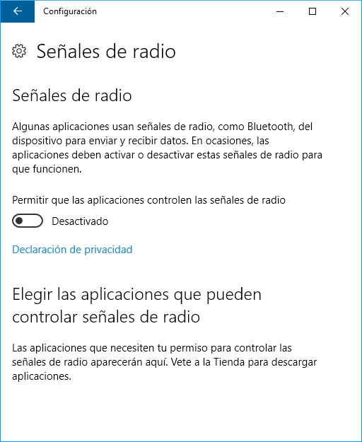](images/opciones-privacidad-bluetooth.png)

### Opciones de privacidad de la pestaña Otros dispositivos

A continuación, tenemos que definir si queremos que algunas de las aplicaciones modernas puedan comunicarse e intercambiar información con dispositivos que tenemos conectados a nuestro ordenador vía USB o vía inalámbrica.

A modo de ejemplo si usamos la aplicación Complemento de teléfono de Windows deberemos activar esta opción. En caso contrario si conectamos nuestro teléfono o Tablet al ordenador no será reconocido/a por la aplicación Complemento de teléfono de Windows.

Como en mi caso no uso ninguna aplicación moderna desactivo esta opción en las opciones de privacidad.

[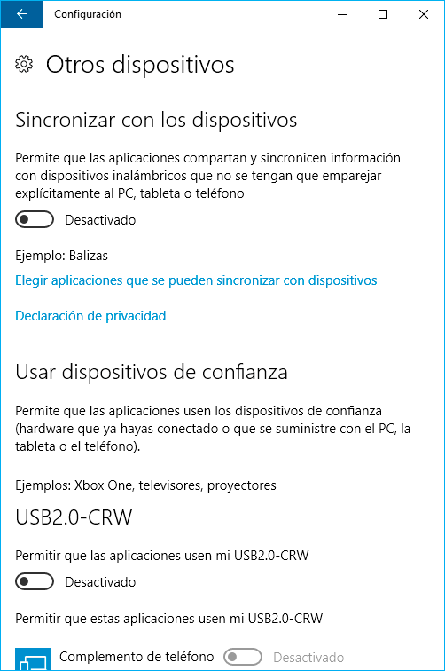](images/configuración-sincronizacion-otros-dispositivos.png)

Este apartado no hay que tomárselo a la ligera. Si una aplicación tiene permiso para acceder a un dispositivo de almacenamiento USB, dispone de la capacidad para ver u hacer lo que quiera con el contenido almacenado en el dispositivo USB.

### Opciones de privacidad de la pestaña Comentarios y diagnósticos

En frecuencia de comentarios tenemos que seleccionar la opción Nunca. De esta forma evitaremos que aparezcan ventanas en las que Microsoft pide información acerca de determinados temas del funcionamiento de Windows.

En Datos de diagnóstico y uso seleccionamos la opción Básico. De esta forma minimizamos los datos que proporcionamos a Microsoft sobre el funcionamiento de nuestro equipo.

[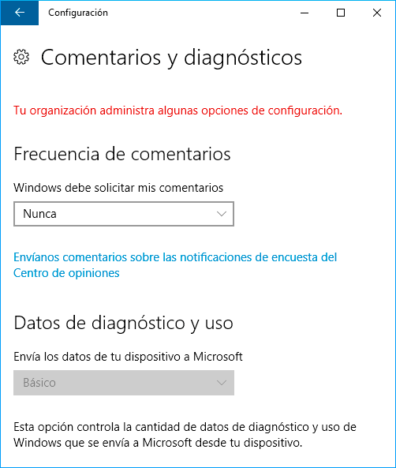](images/comentarios-y-diagnósticos.png)

Desafortunadamente los datos de diagnóstico y uso no se pueden desactivar de forma total de forma estándar, por lo tanto imagino que Microsoft usa está vía para ver y registrar los procesos y los programas que usamos en nuestro ordenador.

###### Nota: En futuros post veremos cómo podemos deshabilitar de forma completa los datos de uso y diagnóstico.

### Opciones de privacidad de la pestaña aplicaciones en Segundo plano

En la opción de segundo plano tenemos que definir las Apps modernas que permitiremos que se ejecuten en segundo plano.

[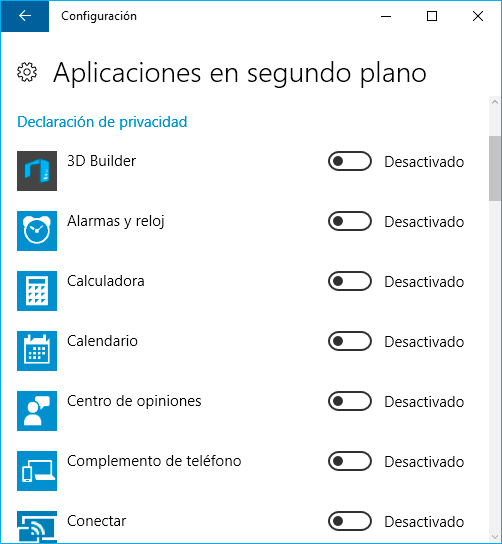](images/aplicaciones-en-segundo-plano.png)

Si hay una App de la lista que acostumbran a usar habitualmente la pueden activar sin problema. El resto de aplicaciones que no usen es altamente recomendable desactivarlas.

Desactivando aplicaciones no solo mejoraremos nuestra privacidad. También mejoraremos el rendimiento de nuestro equipo ya que el consumo de memoria RAM y CPU serán menores.

## REFLEXIÓN SOBRE LA CONFIGURACIÓN DE PRIVACIDAD DE MICROSOFT

Si no prestamos mucha atención, en el proceso de instalación de Windows 10 acabaremos configurando nuestra cuenta de usuario de forma automática. La configuración automática activará absolutamente todos los mecanismos que permiten recopilar información a Microsoft.

Esto no es sorprendente porque todos sabemos que Microsoft ha cambiado su modelo de negocio focalizándose en los servicios en la nube y en la publicidad, pero lo que me parece realmente mal es que la recopilación de la información se haga sin que la mayoría de usuarios sean conscientes de ello.

Si seguimos las indicaciones del post únicamente conseguiremos desactivar una parte de los mecanismos que Microsoft usa para recopilar información. No es posible desactivar la totalidad de mecanismos porque Microsoft no nos proporciona los medios necesarios para ello.

En las próximas semanas publicaré un post en el que podrán ver como cortar absolutamente todas las fuentes que usa Microsoft para recolectar información de sus usuarios.
