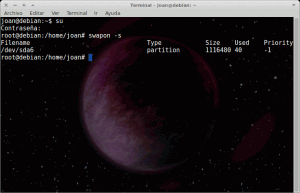
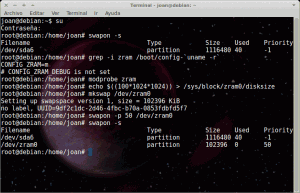

En el siguiente post comentamos como optimizar el rendimiento del sistema con Zram. Cabe destacar que esta publicación forma parte de una serie posts para optimizar el rendimiento de nuestra memoria RAM y de nuestro sistema.

El conjunto de post que hablan sobre nuestra memoria RAM son los siguientes:<!--more-->

1. [Liberar memoria cache de nuestra RAM.]()
2. [Limitar el uso de nuestra memoria Swap y limpiarla en el caso que se active.]()
3. **Usar la RAM más eficientemente con ZRAM.**
4. [Acelerar el inicio de nuestras aplicaciones con Preload.]()
5. [Acelerar el inicio de nuestras aplicaciones con Prelink.]()
6. [Aligerar el rendimiento de nuestro sistema operativo con Zswap]().

## ¿Qué es Zram?

Zram o compcache es un módulo experimental del Kernel de linux que nos evita utilizar la paginación en disco para de esta forma poder optimizar el rendimiento de nuestro sistema. Esta característica es principalmente importante en equipos de gama baja. En equipos de gama alta la influencia es nula ya que prácticamente no se  necesita la paginación en disco.

Se han escuchado rumores que Ubuntu 13.04 podría incorporar de serie esta característica. La verdad es que me preocupa poco si lo hace. Ubuntu es una distro que cada día que pasa me interesa menos. Por otra parte también se dice que en la versión del Kernel 3.8 Zram sera excluido. En fin... Veremos que acaba pasando tanto con Ubuntu como con Zram.

## Funcionamiento de Zram

Para ver el funcionamiento de Zram supongamos que disponemos de nuestra memoria RAM. La podemos representar del siguiente modo:

[](images/1.png)

Lo que hace Zram es crear uno o más bloques dentro de nuestra memoria RAM. Por lo tanto lo que hará ZRAM dentro de nuestra memoria RAM lo podemos representar del siguiente modo:

[](images/2.png)

El bloque que acabamos de representar gráficamente será una porción física de nuestra RAM y funcionará como si fuera una memoria de intercambio Swap, pero en vez de estar ubicada en nuestro disco duro estará ubicada dentro de nuestra memoria RAM.

Ahora imaginemos que empezamos a trabajar y a ejecutar aplicaciones con nuestro ordenador. A medida que se va llenando nuestra memoria RAM, se dará la situación que representamos en la siguiente representación:

[](images/3.png)

Como podemos ver la imagen la memoria RAM está casi llena. Una vez pase esto se activará la memoria swap pero en vez de paginar el contenido de nuestra RAM en el disco duro lo hará en el bloque que hemos creado dentro de nuestra ram. Por lo tanto la situación que se dará una vez se active ZRam se puede representar de la siguiente forma:

[](images/4.png)

Si observamos el gráfico vemos que se ha liberado gran cantidad de contenido en nuestra memoria RAM, mientras que en nuestra partición Zram ha aparecido una pequeña porción de color Negro. Esta pequeña porción de color negro posee la totalidad de información que había dentro del gran bloque de color verde que representaba las imágenes de procesos almacenados en nuestra RAM. ¿Como esta pequeña parte puede almacenar la totalidad de contenido que había en la parte verde?

Simplemente porqué antes de almacenarse la información en el bloque que hemos creado, esta se comprime. Una vez comprimida se almacena en el bloque de memoria creado por Zram. En el momento que se necesite recuperar la información que tenemos paginada, esta  se descomprimirá y se trasladará de nuevo a nuestra memoria RAM.

Por lo tanto, como podéis ver, estamos paginando la información que paginaríamos en el disco duro en nuestra memoria RAM. Como la velocidad de respuesta de la memoria RAM es mucho más elevada que la de un disco duro aumentaremos el rendimiento de nuestro sistema. Además en el caso de disponer de un disco SSD estaremos alargando la vida útil de este dispositivo.

Por lo tanto con ZRAM tendremos un bloque adicional de memoria en nuestra RAM que será usada para paginar. En el caso de que se agote nuestro bloque de memoria entonces actuará la paginación en el disco tradicional.

## Instalar Zram en cualquier distribución basada en Debian

Como podremos ver mas adelante es muy fácil instalar Zram en Ubuntu pero muchos usuarios desconocen como realizarlo en otras distribuciones. El método descrito funciona en la totalidad de distribuciones basadas en Debian e imagino que también funcionará en otro tipo de distribuciones.

Como hemos explicado en el inicio Zram es un módulo del kernel que seguramente la totalidad de usuarios tienen disponible en estos momentos. Por lo tanto para habilitar Zram no tenemos que instalar ningún paquete. Solamente tenemos que activar este módulo. Para hacerlo procedemos de la siguiente forma:

Abrimos una terminal y nos loguearemos como root:

> ```
> su
> ```

###### Nota: Si el comando su no funciona en vuestra distro probad sudo su. La totalidad de pasos para habilitar Zram se tienen que realizar siendo root.

Seguidamente ejecutaremos el comando:

> ```
> swapon -s
> ```

Esta comando servirá para comprobar el estado actual de nuestra memoria swap.

[](images/antes-de-zram1.png)

Como se puede ver en la captura de pantalla en estos momentos dispongo de una partición de intercambio de aproximadamente 1 Gb.

Seguidamente comprobaremos que el kernel que tenemos instalado en nuestro ordenador contiene el módulo Zram. Para ellos tecleamos el siguiente código en la terminal:

> ```
>  grep -i zram /boot/config-`uname -r`
> ```

Si la respuesta que devuelve la terminal es parecida a la siguiente:

> ```
>  CONFIG_ZRAM=m # CONFIG_ZRAM_DEBUG is not set
> ```

Quiere decir que disponemos del módulo pero no está activado.

Para activar el módulo de Zram tenemos que teclear el siguiente comando en la terminal:

> ```
> modprobe zram
> ```

###### Nota: En el caso de querer crear más de un bloque en nuestra memoria RAM tenemos que sustituir el comando anterior por modprobe zram num\_devices=4. Este comando a modo de ejemplo creará cuadro bloques. Los bloques se denominaran /dev/zram0, /dev/zram1, /dev/zram2 y  /dev/zram3.

Seguidamente tenemos que crear el dispositivo de Zram. Lo crearemos de 100Mb. Para ello en la terminal tecleamos el siguiente comando:

> ```
> echo $((100*1024*1024)) > /sys/block/zram0/disksize
> ```

###### Nota: 100x1024x1024 indica el tamaño de nuestro dispositivo. 100 \* 1024 \* 1024 = 104857600 bytes que es igual a 100MB. Si quisiéramos crear un bloque de 200 Mb solo tendríamos que cambiar el 100 por un 200.

###### Nota: En el caso de crear 4 bloques deberíamos aplicar el comando que acabamos de ver 3 veces mas. Con zram1, zram2 y zram3

Una vez creado el dipositivo ahora lo vamos a montar. Por lo tanto para montarlo tecleamos:

> ```
>  mkswap /dev/zram0
> ```

###### Nota: En el caso de crear 4 bloques deberíamos aplicar el comando que acabamos de ver 3 veces mas. Con zram1, zram2 y zram3

Al dispositivo que acabamos de montar le tenemos que dar una prioridad de actuación. Se la tenemos que dar ya que si no se la damos en el momento que nuestra memoria RAM este llena puede que la paginación se haga en nuestro disco duro en vez de en el bloque Zram que acabamos de crear. Para darle la prioridad tecleamos el siguiente comando en la terminal:

> ```
>  swapon -p 50 /dev/zram0
> ```

###### Nota: Como podéis ver en el comando estamos dando una prioridad de 50 a nuestro bloque de memoria. En principio esta prioridad es más que suficiente. Si os fijáis en la captura de pantalla anterior veréis que la prioridad de paginación en disco es -1. Por lo tanto la prioridad 50 siempre se impondrá  sobre una prioridad -1.

###### Nota: En el caso de crear 4 bloques deberíamos aplicar el comando que acabamos de ver 3 veces mas. Con zram1, zram2 y zram3

En estos momentos Zram esta plenamente activo. Para comprobar que funciona adecuadamente simplemente tenéis que teclear el siguiente comando:

> ```
> swapon -s
> ```

Al teclear el comando obtendréis un resultado parecido al siguiente:

[](images/despues-ZRAM1.png)

En la captura podemos ver que seguimos teniendo la partición Swap de 1Gb. Pero además adicionalmente aparece el dispositivo de 100 Mb que acabamos con una prioridad 50. Por lo tanto tarea concluida.

Ahora solo nos falta testear si nuestro sistema funciona adecuadamente y mejor que antes de crear el módulo. Una vez realizadas los comprobaciones y estar satisfechos con el rendimiento podemos hacer que la partición Zram se monte automáticamente cada vez que arrancamos nuestro sistema. En el caso de querer hacerlo abrimos la terminal y tecleamos:

> ```
> sudo gedit /etc/rc.local
> ```

Una vez se habrá el editor de texto copiamos el siguiente contenido:

> ```
> modprobe zram &&
> ```
> 
> ```
> echo $((100*1024*1024)) > /sys/block/zram0/disksize &&
> ```
> 
> ```
> mkswap /dev/zram0 &&
> ```
> 
> ```
> swapon -p 50 /dev/zram0 &&
> ```
> 
> ```
> exit 0
> ```

###### Nota: En el caso de observar problemas los pasos realizados son fácilmente reversibles.

## Instalar Zram en versiones de Ubuntu iguales o superiores a la 12.04

Si queremos instalar Zram en Ubuntu 12.04 o una versión posterior todo es un poco más fácil, pero también tendremos menos flexibilidad ya que no podremos controlar el número de bloques de Swap, ni el tamaño ni la prioridad de actuación.

Para instalar Zram primero tenemos que abrir una terminal y teclear el siguiente comando:

> ```
> sudo apt-get install zram-config
> ```

Una vez instalado comprobaremos que zram se ha instalado correctamente y está en funcionamiento. Para ello en la misma terminal teclearemos el siguiente comando:

> ```
>  cat /proc/swaps
> ```

En el caso de que Zram esté funcionando de forma adecuada el comando os mostrará un resultado parecido al siguiente:

> ```
>  Filename     Type         Size       Used     Priority
> /dev/sda5     partition    1298428    0        -1
> /dev/zram0    partition    804520     0        5
> 
> ```

En principio Zram ya esta funcionando. En mi caso la paritción /dev/sda5  es la partición Swap de mi ordenador. La partición /dev/zram0 será la partición que habrá creado Zram.

## Instalar Zram en Ubuntu para versiones inferiores a la 12.04

Si queremos instalar Zram en este caso el proceso también se pude decir que es fácil.

Para instalar Zram primero tenemos que abrir una terminal y teclear el siguiente contenido para agregar el repositorio que necesitamos:

> ```
> sudo add-apt-repository ppa:shnatsel/zram && sudo apt-get update
> ```

Después actualizamos los repositorios tecleando el siguiente comando:

> ```
>  sudo apt-get update
> ```

Finalmente ya podemos instalar Zram mediante el siguiente comando:

> ```
>  sudo apt-get install zramswap-enabler
> ```

En principio Zram ya esta funcionando. Si nos queremos asegurar podemos reiniciar el ordenador o teclear el siguiente comando:

> ```
>  sudo start zramswap
> ```

Si queremos ver el estado de nuestras particiones swap podemos teclear el siguiente comando:

> ```
>  sudo swapon -s
> ```

En el caso que no estemos satisfechos con el rendimiento de Zram podemos desinstalarlo con el siguiente comando:

> ```
> sudo apt-get remove --purge zramswap-enabler
> ```

Y esto es todo. Espero haber contribuido a que algunos de vosotros puedan obtener un mejor rendimiento en vuestro PC.

## Fuentes:

[http://forums.debian.net/viewtopic.php?t=77627](http://forums.debian.net/viewtopic.php?t=77627)

###### Nota: Este post va dedicado a Alberto Aru por liar un pollo monumental al instalar el paquete deb de Zram de Ubuntu en Debian. Estuvimos cerca de una hora para poder desinstalar Zram. Un saludo Alberto :)
