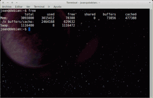
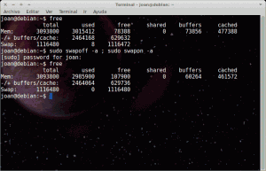

Optimizar el uso de la memoria swap forma parte de una serie de post para optimizar el uso de memoria RAM en nuestro sistema operativo y de esta forma poder obtener el máximo rendimiento a nuestro equipo informático. El conjunto de post que se acaban de mencionar son los siguientes:<!--more-->

1. [Liberar memoria cache de nuestra RAM.]()
2. **Limitar el uso de nuestra memoria Swap y limpiarla en el caso que se active**.
3. [Usar la RAM más eficientemente con ZRAM.]()
4. [Acelerar el inicio de nuestras aplicaciones con Preload.]()
5. [Acelerar el inicio de nuestras aplicaciones con Prelink.]()
6. [Aligerar el rendimiento de nuestro sistema operativo con Zswap]().

## ¿Qué es la memoria Swap?

La Swap o espacio de intercambio es un espacio en nuestro disco duro que se usa para almacenar los datos e imágenes de procesos que no pueden ser almacenados en nuestra memoria RAM por falta de capacidad. Por lo tanto la swap es una forma para liberar carga de nuestra memoria RAM.

En otras palabras la Swap es el equivalente de lo que se conoce como archivo de paginación en Windows. La gran mayoría de usuarios de Windows probablemente no conocen la existencia de los archivos de paginación o swap. Los usuarios de Linux si conocen su existencia porqué en el momento de la instalación se tiene que realizar una partición de swap en nuestro disco duro mientras que en windows esto no es necesario. El mismo windows te genera de forma poco transparente un archivo de paginación que se incremente o disminuye de tamaño en función de la carga que estemos dando a nuestro equipo.

###### Nota: En el caso que en Linux nos olvidemos de crear una partición de intercambio cuando estamos instalando nuestro sistema operativo no implica tener que volver a instalar el sistema. Siempre podemos modificar nuestra tabla de particiones de nuevo y crear la particion Swap. O también existe la opción de generar un archivo de intercambio Swap al estilo windows. En un futuro post se explicará como crear un archivo que funcione como memoria de intercambio swap.

## ¿Por qué Linux necesita utilizar la swap?

Linux necesita la memoria Swap porqué es un forma de ampliar la memoria RAM de nuestro sistema operativo en el caso que esté llena.

A medida que vamos ejecutando aplicaciones en nuestro sistema operativo estas se cargan en la memoria RAM. A medida que vayamos cargando aplicaciones nuestra memoria RAM se va llenando y puede llegar al punto que este prácticamente llena. En el momento que la memoria RAM se llene completamente e intentemos ejecutar otras aplicaciones nuestro sistema operativo simplemente se saturará, se volverá inestable o nos generará algún tipo de error ya que no tiene recursos para iniciar más aplicaciones de forma simultanea.

Es en esta situación es donde actúa la swap. A partir de un cierto nivel de carga en la RAM, que nosotros podemos controlar mediante el parámetro swappines, el Kernel de nuestro linux buscará las imágenes de procesos que menos usamos y tengamos cargados en nuestra memoria RAM y los moverá a nuestro disco duro en la zona que denominamos como área de intercambio o swap. De está forma estamos liberando memoria RAM para poder cargar más procesos.

Además Linux necesita un mínimo de memoria Swap para trabajar de forma eficiente cuando nos quedamos sin memoria. La explicación de esta afirmación es la siguiente:

En la memoria RAM se guarda diverso tipo de información:

**Tipo 1 -** Información que siempre tiene que estar almacenada en la memoria RAM y en ningún caso podrá ser swapeada.

**Tipo 2 -** Información que se puede swapear y que además de estar en la RAM también está respaldada en nuestro disco duro. Esta información, en el caso de no existir swap, se puede eliminar de la RAM y que siempre podemos recuperarla porqué hay una copia en el disco duro.

**Tipo 3-** Información que se puede swapear pero que no dispone de una copia de respaldo en el disco duro.

Ahora imaginemos que nuestro ordenador se está quedando sin memoria RAM:

En el caso de tener una partición de intercambio el kernel podrá eliminar o intercambiar información clasificada dentro del tipo 2 y 3.

En el caso que no tengamos una partición de intercambio, nuestro kernel solo se podrá plantear eliminar información clasificada como tipo 2. ¿Por qué?

Hay que tener en cuenta que la información de tipo 2 no se puede swapear, porqué no existe la partición de intercambio, pero se puede eliminar ya que existe una copia de respaldo y por lo tanto en caso de hacer falta siempre la podemos volver a recuperar. La información de tipo 3 nunca la podemos eliminar ya que no tiene respaldo alguno y no la podemos swapear por no existir en la área de intercambio. Esto implica que se tiene que quedar a la fuerza en la memoria RAM.

Por lo tanto si no tenemos espacio de intercambio el rendimiento no será el óptimo en caso de quedarnos sin memoria. Puede darse perfectamente el caso que la solución ideal para no notar una pérdida de rendimiento sea eliminar información del tipo 3. Pero al no existir memoria de intercambio tendrá que eliminar información del tipo 2 pudiendo perjudicar notablemente el rendimiento de nuestro sistema ya que no es la solución ideal.

##  ¿Por qué debemos minimizar el uso de la swap en nuestros ordenadores?

En ordenadores con prestaciones normales, o incluso de prestaciones reducidas como mi Eee PC, seguro que notaréis que en el momento que se activa la memoria Swap todo empieza a ir más lento. ¿Por qué en el momento de activarse la swap el ordenador se ralentiza?

Simplemente porqué las librearías y procesos necesarios para poder ejecutar algunas de las aplicaciones se hallan en una parte del disco duro denominado swap en vez de a la memoria RAM. Cómo todos saben la velocidad de ejecución de la información almacenada en la memoria RAM es infinitamente superior a la que tenemos en nuestro disco duro. Por lo tanto es normal que todo vaya mucho más lento.

Otro motivo de la lentitud que experimentamos es la posible aparición de hiperpaginación. La hiperpaginación causará que haya una serie de librerías que estén intercambiándose continuamente de la memoria RAM a la Swap y de la Swap a la RAM causando lentitud y sobrecarga en el sistema. Los motivos de la hiperpaginación pueden ser que nuestro ordenador tenga muy poca RAM o que los algoritmos de intercambio de procesos de un sitio a otro estén mal implementados.

Pero tenemos que tener en cuenta que no en todos los equipos es interesante minimizar el uso de la Swap. Hay casos particulares que incluso pueden ser necesario no minimizar el uso de la memoria Swap. Estos casos particulares pueden ser los siguientes:

1. Servidores en los que exista una alta carga de trabajo. Hay que tener en cuenta que los servidores acostumbran a lidiar con bases de datos y archivos de gran tamaño.
2. En el caso que dispongamos de un ordenador que tenga muy poca memoria RAM disponible. Este caso si estamos hablando de ordenadores relativamente actuales nunca se dará.
3. Ordenadores que aunque dispongan de mucha memoria RAM tengan que ejecutar aplicaciones que hagan un gran consumo de RAM. Por lo tanto tenemos que ir con cuidado en el caso que tengamos que usar aplicaciones que consuman gran cantidad de RAM.
4. Usuarios que tengan que compilar aplicaciones que sean muy grandes.

###### Nota: En prácticamente el 99% de los ordenadores actuales podemos minimizar el uso de la memoria swap. Los 4 casos que acabamos de citar prácticamente no se dan en la mayoría de usuarios. Además hoy en día los ordenadores tienen mucha RAM en comparación con los ordenadores de años atrás.

## Cantidad de memoria Swap que es aconsejable asignar

En internet encontrareis multitud de opiniones sobre la memoria swap que se debe asignar para que nuestro sistema operativo funcione adecuadamente. Una teoría muy extendida es la que se presenta a continuación:

1. En el caso que tengamos 1 GB de RAM o menos deberemos tener un tamaño igual a nuestra RAM. Por lo tanto si tenemos 512 Mb de RAM deberemos tener 512 Mb de Swap
2. En el caso que tengamos entre 2 y 4 GB de RAM la swap deberá ser la mitad de nuestra memoria RAM. Así por lo tanto si tenemos 2Gb de RAM deberíamos tener 1Gb de Swap
3. En el caso de equipos más modernos con más de 4Gb de RAM como máximo deberíamos tener 2 Gb de memoria de intercambio.

No obstante según mi punto de vista el criterio que deberíamos seguir es el siguiente:

1. Primero tenemos que saber la memoria RAM que tiene nuestro ordenador. Por ejemplo pongamos que tenga 1 Gb de RAM.
2. A continuación tenemos que tener una idea del consumo máximo de RAM que tendremos con nuestros equipo en la peor de las situaciones. Por ejemplo considero que el uso máximo de memoria RAM se dará cuando use simultáneamente el navegador, Libreoffice, el gestor de correo y el reproductor de música. Estimo que con todas estas aplicaciones abiertas mi consumo total Será de 2 GB.
3. Considerando que tenemos un 1Gb de RAM y en el peor de los casos vamos a llenar 2 Gb implica que tenemos que asignar 1 Gb de Swap más un margen de seguridad de 512Mb. Por lo tanto en el caso presentado 1.5 Gb de Swap es suficiente.
4. Para finalizar hay que tener claro si tendremos la necesidad de poner nuestro equipo en hibernación. En el momento que hibernamos nuestro equipo lo que estamos haciendo es volcar la totalidad de imágenes de procesos de nuestra memoria RAM a nuestra memoria Swap. Por lo tanto en el caso de querer hibernar el equipo como mínimo necesitaremos nan memoria Swap igual a nuestra RAM. En el caso que hemos planteado, en el caso que quiera hibernar mi equipo, incrementaría la partición de memoria Swap de 1.5 Gb a 2.5Gb.

## Minimizar el uso de la memoria Swap

Como hemos visto en los puntos anteriores, en la gran mayoría de casos lo ideal es evitar o retardar el uso de la swap en nuestro sistema operativo y usar la memoria RAM siempre que sea posible. De está forma el funcionamiento de nuestro ordenador será mucho más rápido y fluido. Además los usuarios que dispongan de un disco duro SSD puede que no deseen que se escriba información en su disco duro ya que la vida de un disco duro SSD viene determinado por un número límite de escrituras.

Quien decide el momento en que se empiezan a trasvasar imágenes de procesos de la RAM a la Swap es el Kernel. Como Linux es un sistema operativo abierto podemos hacer que el Kernel de Linux esperé hasta cuando la memoria RAM este casi llena para que empezar el trasvase. Tan solo tenemos que modificar el valor de swappiness de nuestro sistema operativo para indicarle al kernel de linux que de más prioridad al uso de RAM que al uso de Swap.

El valor de swappiness puede comprender un valor entre 0 y 100. Si el valor es 0 se evitará el intercambio de información entre la RAM y la Swap, mientras que si elegimos un valor 100 el intercambio se estará realizando constantemente  La mayoría de distribuciones Linux vienen preconfiguradas con un valor de swappiness de 60. Este valor es probablemente correcto para el uso de servidores y superordenadores pero es claramente excesivo para usuarios domésticos como nosotros.

Por lo tanto en nuestro caso podemos recudir muy drásticamente el valor de la swappiness por defecto hasta valores de 10 o 5. Para ello lo primero que tenemos que hacer es abrir una terminal y teclear el siguiente comando:

> ```
> cat /proc/sys/vm/swappiness
> ```

La salida será el valor actual de swappiness que tenemos asignado. Si no habéis tocado nunca este parámetro es probable que el valor que os salga en pantalla sea 60, ya que es el valor por defecto que usan la mayoría de distros de Linux. Si es este vuestro caso y tenéis un valor de 60 podemos reducir drásticamente el uso de swap.

Si queremos reducir el valor de Swappiness de 60 a 10 tan solo tenemos que abrir una terminal y escribir el siguiente comando:

> ```
>  sudo sysctl -w vm.swappiness=10
> ```

En estos momentos ya tenemos fijado el valor de swappiness en 10 y nuestro sistema operativo tenderá a usar mucho menos swap que cuando teníamos fijado el valor en 60.

Una vez tenemos el nuevo valor, lo más aconsejable es usar el ordenador durante un periodo de tiempo razonable para asegurar que el rendimiento que obtenemos con el nuevo parámetro es aceptable y también para comprobar que el sistema sea estable.

Una vez que estamos seguro que nuestro sistema rinde mejor y no genera inestabibilidad en el sistema lo que haremos es hacer este cambio permanente. Así evitaremos que cada vez que arranquemos el ordenador tengamos que cambiar el valor de swappiness de 60 a 10.

Para hacerlo persistente el valor de swappiness 10 abrimos una terminal y tecleamos:

> ```
> sudo gedit /etc/sysctl.conf
> ```

Justo al final del fichero introducimos el siguiente comando:

> ```
>  vm.swappiness=10
> ```

Guardamos el fichero y la próxima vez que arranquemos nuestro ordenador ya tendremos ajustado el valor de swappiness a 10. Si queremos realizar la comprobación tan solo tenemos que abrir una terminal y teclear el siguiente comando:

> ```
> cat /proc/sys/vm/swappiness
> ```

## Liberar la memoria Swap una vez está en uso

Una vez se activa nuestra memoria Swap nuestro sistema se acostumbra a saturar y ralentizar. Una solución para solucionar este problema es reiniciar el equipo pero existen soluciones para liberar la memoria Swap y no tener que apagar el ordenador. Para evitar apagar el equipo podemos proceder de la siguiente forma:

Lo que realizaremos es traspasar el contenido que tenemos almacenado en nuestra memoria Swap hacia la memoria RAM. Por lo tanto lo primero que realizaremos es asegurarnos que la memoria RAM tiene capacidad libre para poder albergar el contenido que está guardado en la Swap. Para hacer esto abrimos una terminal y tecleamos el comando:

> ```
>  free
> ```

El comando free nos dará la salida que podeís observar en la siguiente captura de imagen:

[](images/proceso-liberar-swap2.png)

Como podemos ver en la captura en nuestra memoria Swap tenemos almacenado 8Kb. Nuestra memoria RAM tiene 78388 Kb libres. Por lo tanto podemos traspasar el contenido de la memoria Swap a la RAM sin tener ningún tipo de problema.

Para realizar el traspaso abrimos la terminal y escribimos el siguiente comando para transferir el contenido de un lado a otro:

> ```
> sudo swapoff -a ; sudo swapon -a
> ```

Ahora volveremos a teclear el comando:

> ```
> free
> ```

Y efectivamente en la siguiente captura de pantalla podemos confirmar que la operación ha tenido éxito, ya que la memoria Swap ahora está completamente libre:

[](images/proceso-liberar-swap11.png)

El proceso que acabamos ver lo podemos automatizar mediante un script y ejecutarlo periódicamente a las 12 de la noche por ejemplo. Para ello tan solo tenemos que añadir la siguiente frase:

> ```
> swapoff -a && swapon -a
> ```

En el script que aprendimos a generar en el siguiente post:

[https://geekland.eu/liberar-memoria-cache/]()

Por lo tanto el contenido del script para limpiar la memoria cache de la RAM y traspasar el contenido de la memoria Swap a la RAM es el siguiente:

> ```
>  #!/bin/bash
> ```
> 
> ```
> echo “Limpiando la caché~ “;
> ```
> 
> ```
> sync ; echo 3 > /proc/sys/vm/drop_caches
> ```
> 
> ```
> echo “Limpiando Swap~ “;
> ```
> 
> ```
> swapoff -a && swapon -a
> ```

## Fuentes

[http://es.wikipedia.org/wiki/Espacio\_de\_intercambio](http://es.wikipedia.org/wiki/Espacio_de_intercambio "Espacio de intercambio wikipedia")
