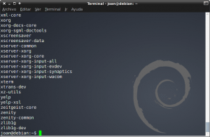
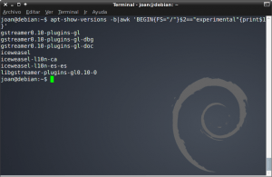

Seguidamente les presentare como conocer los paquetes de Debian clasificados por rama.

Como todos saben en Debian existen varias ramas. Existe la rama estable, la rama testing, la rama inestable y para finalizar la experimental.<!--more-->

Algunos usuarios mediante el [apt-pinning]() acostumbran a mezclar paquetes de las distintas ramas de Debian. Por lo tanto puede darse el caso que un usuario tenga como rama principal la Testing, pero también pueda disponer de paquetes y software proveniente de otras ramas de Debian.

El motivo de querer mezclar las ramas es muy simple, La versionitis. Debian Stable y Debian Testing son versiones muy estables pero no disponen de la últimas versiones del software que utilizamos habitualmente. Por lo tanto una solución es mezclar los paquetes pero siempre con sumo cuidado y de forma adecuada ya que podemos generar problemas importantes de dependencias sino lo hacemos adecuadamente.

Con el tiempo y cuantos más paquetes y programas instalamos y desinstalamos puede darse el caso que tengamos una mezcla importante de paquetes y problemas de dependencias. Al darse este caso puede ser útil tener un listado de los paquetes que tenemos instalados de cada una de las ramas

## OBTENCIÓN DE LOS PAQUETES DE DEBIAN CLASIFICADOS POR RAMA

El primer paso es asegurar que tenemos instalado el paquete apt-show-versions. En el caso de no tenerlo instalado abrimos una terminal e introducimos:

> ```
> sudo apt-get install apt-show-versions
> ```

Una vez instalado el paquete ya podemos abrir otra terminal y analizar los paquetes que tenemos instalados de cada una de las ramas. Para analizar los paquetes que tenemos en la rama estable solo hay que poner el siguiente comando en la terminal:

> ```
> apt-show-versions -b|awk 'BEGIN{FS="/"}$2=="stable"{print $1}'
> ```

[](images/estable.png)

Como pueden ver en la imagen no tengo ningún paquete instalado de la rama estable ya que no tengo los repositorios introducidos.

Para obtener los paquetes que tenemos instalados de la rama testing tenemos que introducir el siguiente comando en la terminal:

> ```
> apt-show-versions -b|awk 'BEGIN{FS="/"}$2=="testing"{print $1}'
> ```

[](images/testing.png)

Como pueden ver en la imagen hay una gran cantidad de paquetes. Debian testing es mi rama principal y por lo tanto es normal el resultado obtenido.

Para obtener los paquetes que tenemos instalados de la rama Unstable o Sid tenemos que usar el siguiente comando:

> ```
> apt-show-versions -b|awk 'BEGIN{FS="/"}$2=="unstable"{print $1}'
> ```

[](images/unstable.png)

Como pueden ver en la imagen en mi ordenador solo tengo instalado el paquete Gpodder.

Para obtener los paquetes que tenemos instalados de la rama experimental tenemos que usar el siguiente comando:

> ```
> apt-show-versions -b|awk 'BEGIN{FS="/"}$2=="experimental"{print $1}'
> ```

[](images/experimental.png)

Como podeis ver en la imagen tengo instalado diversos paquetes de la rama experimental.

Por lo tanto como podéis ver de forma muy simple podemos tener un listado de paquetes de Debian clasificados por rama.

Para configurar el apt-pinning de forma adecuada pueden consultar el siguiente enlace:

[https://geekland.eu/apt-pinning-en-debian/]()

Fuente:  [http://www.esdebian.org/wiki/sistemas-mixtos](http://www.esdebian.org/wiki/sistemas-mixtos)
