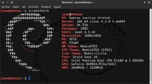

El otro día estaba viendo un vídeo de [Matthew Moore](https://www.youtube.com/user/MrGizmo757 "Link al canal de Matthew Moore") en Youtube sobre como personalizar la terminal de Linux para que muestre el logo de nuestra distribución y otras características de nuestro sistema operativo. Me pareció interesante y por este motivo me he decidido a escribir este post en el que detallaré como instalar y usar Screenfetch.<!--more-->

## ¿QUÉ ES SCREENFETCH?

Es un **software diseñado para ejecutarse en la terminal que muestra información de nuestro equipo y del sistema operativo** que estamos usando.

###### Nota: Screenfetch no soporta el 100% de la distribuciones Linux. Si quieren saber la totalidad de distribuciones que soporta, una vez lo tengan instalado abren una terminal y ejecutan el comando man screenfetch. Despues de ejecutar el comando aparecerá la página man en la que deberemos consultar el apartado Supported GNU/Linux Distributions.

## INSTALAR SCREENFETCH EN CUALQUIER DISTRO

Prácticamente el 100% de distribuciones Linux tienen presente este software en sus repositorios, por lo tanto para instalar screenfetch lo único que tenemos que realizar es **abrir una terminal y ejecutar el siguiente comando**:

**En el caso de ser usuario de Debian** o de distribuciones derivadas de Debian:

> ```
> sudo apt-get install screenfetch
> ```

**En el caso de ser usuario de Archlinux** o de distribuciones derivadas de Archlinux:

> ```
> sudo pacman -S screenfetch
> ```

**En el caso de ser usuarios de Fedora** o distribuciones derivadas de Fedora:

> ```
> sudo dnf install screenfetch
> ```

Una vez finalizada la instalación ya podemos usar screenfetch sin ningún tipo de problema.

## USAR SCREENFETCH

Como pueden ver en la captura de pantalla, para usar este software tan solo hay que **abrir una terminal y ejecutar el siguiente comando**:

> ```
> screenfetch
> ```

Después de ejecutar el comando el resultado será parecido al siguiente:

[](images/Usando-Screenfetch.png)

Por lo tanto después de ejecutar el software **disponemos de la siguiente información:**

1. El logo de nuestra distribución.
2. Nuestro nombre de usuario y el nombre del equipo.
3. La versión del Kernel que estamos usando.
4. El tiempo que lleva abierto nuestro ordenador.
5. El número de paquetes que tenemos instalado en nuestro sistema operativo.
6. La versión de Bash que estamos usando.
7. La resolución de nuestra pantalla.
8. El entorno de escritorio que estamos utilizando.
9. El tema que estamos usando en nuestro sistema operativo.
10. El tema de iconos que estamos usando.
11. El tipo de fuente que tenemos configurada.
12. El procesador que tiene nuestro ordenador.
13. La tarjeta gráfica que tiene nuestro ordenador.
14. La memoria RAM usada y disponible de nuestro ordenador.

Toda la información que se muestra es autodetectada por el mismo programa y nosotros no tenemos que realizar absolutamente nada.

## REALIZAR UNA CAPTURA DE PANTALLA DE LOS DATOS MOSTRADOS

Una vez mostrados los datos mucha gente a la que le gusta personalizar su escritorio acostumbra  a realizar capturas de pantalla para mostrarlas en las redes sociales. De este modo los lectores que miran las capturas de pantalla pueden ver con exactitud el tema de iconos y las opciones de personalización usadas para personalizar el escritorio.

Si vosotros también queréis realizar capturas de pantalla lo podéis realizar con vuestro software habitual para realizar capturas de pantalla. En el caso de no disponer de ningún software, **podréis realizar una captura de pantalla ejecutando el siguiente comando en la terminal**:

> ```
> screenfetch -s
> ```

## HACER QUE SE EJECUTE CADA VEZ QUE ABRIMOS LA TERMINAL

Si queremos que siempre que abramos la terminal se ejecute el programa lo podemos realizar de una forma muy simple. **Abrimos una terminal y ejecutamos el siguiente comando**:

> ```
> sudo nano /etc/bash.bashrc
> ```

Una vez se abra el editor de textos nano, tal y como se puede ver en la captura de pantalla, tenemos que **ir a la última linea del fichero bash.bash.rc y añadir la siguiente palabra:**

> ```
> screenfetch
> ```

[](images/Screenfetch-aparezca-al-abrir-la-terminal.png)

Seguidamente tan solo tenemos que **guardar los cambios y cerrar el editor de textos**. En estos momentos cada vez que abramos la terminal aparecerá el logo de nuestro distro juntamente con la información citada en el apartado anterior.

## CONFIGURAR LA INFORMACIÓN QUE SE MUESTRA

**Screenfetch permite configurar el modo en el que queremos que se muestre la información**. De este modo podemos modificar el contenido que aparece en pantalla siguiendo las siguientes instrucciones.

**Si queremos que se muestre la totalidad de la información** que hemos visto con anterioridad a excepción del logo, deberemos **usar** el siguiente comando:

> ```
> screenfetch -n
> ```

**Si queremos se muestre la totalidad de información pero únicamente usando el color de texto que tenemos definido en la terminal**, tenemos que **ejecutar** el siguiente comando:

> ```
> screenfetch -N
> ```

**Si alguno de los parámetros que tiene que proporcionar el programa da error** porqué el programa no es capaz de autodetectar los valores, **podemos hacer que no salga en pantalla usando** el siguiente comando:

> ```
> screenfetch -E
> ```

**Si queremos que únicamente se imprima el logo de nuestra distro** tenemos que **usar** el siguiente comando:

> ```
> screenfetch -L
> ```

**Si queremos que únicamente se imprima el logo de nuestra distro, y que además el logo sea en color rojo**, tenemos que usar el siguiente comando:

> ```
> screenfetch -c 9 -L
> ```

###### Nota: Si reemplazamos el número 9 por cualquier otro número contenido entre el 0 y el 9, conseguiremos variar el color del logo de nuestra distro.

**Si queremos visualizar el resultado de la salida en el hipotético caso que tuviéramos instalada la distro Deppin**, podemos **ejecutar** el siguiente comando en la terminal:

> ```
> screenfetch -D 'Deepin'
> ```

###### Nota: Podemos sustituir la palabra Deepin por el nombre de la distribución que nosotros queramos. Los nombres de las distribuciones disponibles las podéis encontrar en la sección Supported GNU/Linux Distributions de las manpages de screenfetch.

**Para más información sobre las opciones de configuración de este programa**, pueden consultar las manpages ejecutando el siguiente comando en la terminal:

> ```
> man screenfetch
> ```
