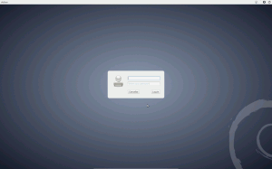
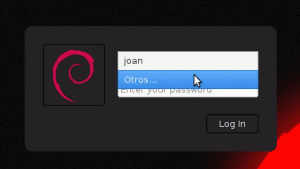
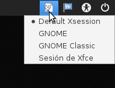
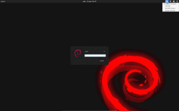

Seguidamente veremos como personalizar y configurar el gestor de sesiones **Lightdm** pero antes de empezar con la personalización y configuración es interesante una breve introducción para que sepan que es exactamente Lightdm.<!--more-->

## ¿QUÉ ES LIGHTDM?

Muchos se preguntaran que es Lightdm. Lightdm es un gestor de sesiones. La parte visible del gestor de sesiones es la pantalla de bienvenida o de autenticación donde introducimos nuestro login y podremos configurar ciertos parámetros de nuestra sesión como por ejemplo el entorno de escritorio que queremos usar, el gestor de ventanas, la distribución de teclado a usar, etc.

Las funciones que normalmente realiza un gestor de sesiones son las siguientes:

1. **Iniciar nuestra sesión de usuario** sobre el servidor de las X desde nuestro mismo ordenador o desde un ordenador remoto.
2. **Autentificar los usuarios**. Una vez autentificados los usuarios es cuando se inicia la sesión.
3. Permite que múltiples usuarios puedan **correr simultáneamente distintas sesiones en un mismo ordenador**. En inglés a esta característica se la conoce como user switching o multiseat.
4. **Iniciar el servidor VNC** antes de iniciar la sesión de usuario y de esta forma poder establecer conexiones remotas aunque el servidor no haya iniciado ninguna sesión de usuario.
5. **Ejecutar scripts antes del inicio de la sesión** para prearrancar servicios en nuestro ordenador.
6. **Iniciar el servidor XDMCP** antes de iniciar la sesión para poder efectuar logins remotos.

Para terminar con la introducción solo decir que en la actualidad existen multitud de gestores de sesiones. Algunos de los más conocidos son los siguientes:

1. [Gdm](https://live.gnome.org/GDM "GDM Gnome")
2. [Mdm](https://github.com/linuxmint/mdm "Mdm (Gestor de sesiones de Linuxmint)")
3. [Kdm](http://developer.kde.org/~ossi/sw/kdm.html "Kdm KDE")
4. [Slim](http://slim.berlios.de/ "Slim Gestor de sesiones")
5. etc.

## ¿POR QUÉ USAR LIGHTDM?

Particularmente me gusta y uso lightdm por varios motivos. Los motivos y razones por los que considero a lightdm un gestor de sesiones muy aconsejable son los siguientes:

1. Es en gestor de sesiones que tiene la totalidad de funciones que ofrecen otros gestores pero un su construcción fue diseñado para ser **ligero, rápido y configurable**. Para poner un ejemplo de lo ligero que es lightdm tan solo tenemos que analizar su código. Su código según datos extraídos de launchpad consta de menos 10,000 lineas mientras otros gestores como gdm disponen de más de 50,000 lineas y una multitud de parches. Por lo tanto podemos afirmar que lightdm tiene que ser **más ligero, rápido y fácil de mantener y trabajar con el**.
2. Lightdm **se puede usar en prácticamente la totalidad de distros existentes y en cualquier entorno de escritorio que instalemos**. Por lo tanto podemos usar Lightdm tanto en Gnome, Kde, Unity, Lxde, Xfce, Enlightenment, etc. No se puede decir lo mismo por ejemplo de otros gestores como Gdm.
3. **Desarrollar temas para Lightdm es sencillo**. Los temas se puedan programar fácilmente usando lenguaje html. También se pueden usar las bibliotecas gtk o qt.

## PERSONALIZAR Y CONFIGURAR LIGHTDM

Antes de empezar a personalizar y configurar Lightdm os pongo la siguiente captura de pantalla para que podáis ver el diseño estandard de Lightdm en Debian:

[](images/Lightdm-Standard.png)

Como podéis ver el diseño estandard es un poco espartano. Seguidamente veremos como modificar mínimamente el aspecto de la pantalla de bienvenida para hacerlo más agradable a nuestros ojos.

###### Nota: El objetivo de este tutorial no es crear un greeter o pantalla de bienvenida. El objetivo es customizar de forma sencilla el que viene por defecto.

### Instalar Lightdm

En el caso que no uséis lightdm y queráis probarlo, tan solo tenéis que seguir los siguiente pasos para su instalación:

Tenéis que acceder a vuestra terminal y teclear el siguiente comando:

> ```
> sudo apt-get install lightdm
> ```

En el caso de tener varios gestores de sesiones es probable que tengáis que configurar Lightdm para que sea vuestro gestor de sesiones predeterminado. Para ello tecleamos el siguiente comando en la terminal:

> ```
> sudo dpkg-reconfigure lightdm
> ```

Una vez ejecutado el comando aparecerá un cuadro de dialogo. Cuando aparezca tan solo tenemos que seleccionar el gestor de sesiones que queremos por defecto.

### Copia de seguridad de los archivos de configuración

Una vez instalado Lightdm lo primero que tenemos que realizar antes de empezar a modificar cualquier parámetro es guardar una copia de seguridad de los archivos de configuración. Para ello abrimos una terminal y tecleamos los siguientes comandos:

> ```
> sudo cp /etc/lightdm/lightdm.conf /etc/lightdm/lightdm.conf.old
> ```
> 
> ```
> sudo cp /etc/lightdm/lightdm-gtk-greeter.conf /etc/lightdm/lightdm-gtk-greeter.conf.old
> ```

### Mostrar el selector de idiomas en Lightdm

Para mostrar el selector de idiomas en el panel de lightdm tan solo tenemos que acceder al fichero de configuración. Para ello en la terminal tecleamos el siguiente comando:

> ```
> sudo gedit /etc/lightdm/lightdm-gtk-greeter.conf
> ```

Una vez se ha abierto el editor de textos tenemos que ir a buscar la siguiente linea:

> ```
> #show-language-selector=
> ```

Descomentamos la linea y establecemos el valor de la variable **show-language-selector** en true. Una vez realizado esto la linea quedará de la siguiente forma:

> ```
> show-language-selector=true
> ```

Ahora tan solo tenemos que grabar las modificaciones. Cuando arranquemos de nuevo nuestro sistema aparecerá el selector de idiomas en el panel de Lightdm.

### Cambiar el tema de Lightdm

Para cambiar el tema que usa Lightdm tan solo tenemos que acceder y modificar sus archivos de configuración. Para ello tan solo tenemos que introducir el siguiente comando en la terminal:

> ```
> sudo gedit /etc/lightdm/lightdm-gtk-greeter.conf
> ```

Una vez abierto el editor de textos tenemos que localizar la siguiente linea:

> ```
> theme-name=Adwaita
> ```

Una vez localizada la linea tan solo tendremos que sustituir el nombre del tema predeterminado, que es **Adwaita**, por el nombre del tema que queremos usar. En mi caso voy usar el tema **greybird**. Por lo tanto el resultado final de la linea que tenemos que modificar será el siguiente:

> ```
> theme-name=greybird
> ```

Ahora tan solo tenemos que guardar las modificaciones y el nuevo tema aparecerá cuando arranquemos una nueva sesión.

### Cambiar el icono principal de Lightdm

Como se puede en la captura de pantalla del inicio de este apartado, en la pantalla de bienvenida aparece la silueta de un hombre de color gris. En el caso de que queráis cambiar esta silueta para poner una foto vuestra o del logo de vuestra distro es sumamente fácil.

Tan solo tenéis que elegir la foto que queréis poner. Una vez la tengáis la guardáis en vuestra home. Una vez la tengáis en vuestra home hay que cambiar el nombre del archivo. El nombre del archivo tiene que ser **.face**

Una vez realizado cuando arranquéis el ordenador, en el recuadro donde aparecia el hombre gris aparecerá la imagen que hayáis elegido. En mi caso como podéis ver en el final del post he elegido un logo de mi distro que es Debian.

### Cambiar el fondo de pantalla

En el caso de querer cambiar el fondo de vuestra pantalla de bienvenida también es fácil.

Lo primero que tenemos que hacer es elegir el fondo de pantalla que queremos. Una vez elegido lo guardamos en la ubicación que queramos. En mi caso voy a guardarlo en la ubicación **/home/joan/Imágenes/**

Seguidamente accedemos en los archivos de configuración introduciendo el siguiente comando en la terminal:

> ```
> sudo gedit /etc/lightdm/lightdm-gtk-greeter.conf
> ```

Una vez abierto el editor de textos localizamos una linea que se parezca a la siguiente:

> ```
> background=/usr/share/images/desktop-base/login-background.svg
> ```

Para finalizar sustituimos la ruta del viejo fondo de pantalla por la ruta del nuevo fondo de pantalla.

En mi caso el fondo de pantalla tiene el el nombre **Fondolight.jpg** y lo he guardado dentro de la ubicación **/home/joan/Imágenes/**. Por lo tanto la linea del fichero de configuración quedará de la siguiente forma:

> ```
> background=/home/joan/Imágenes/Fondolight.jpg
> ```

Guardamos el fichero y la próxima vez que arranquemos la sesión veremos que aparecerá el fondo de pantalla que hemos elegido.

### Mostrar los usuarios en un menú contextual

Cada vez que entramos en el menú de Lightdm es un poco engorroso tener que introducir el nombre de nuestro usuario y seguidamente el password. Podemos simplificar este paso haciendo que la totalidad de usuarios aparezcan en un menú contextual del siguiente estilo:

[](images/menu-contextual.png)

Para disponer del menú contextual tan solo tenemos acceder a los archivos de configuración. Por lo tanto en la terminal tecleamos:

> ```
> sudo gedit /etc/lightdm/lightdm.conf
> ```

Localizamos la siguiente linea:

> ```
> greeter-hide-users=true
> ```

Una vez localizada la linea cambiamos el valor de true por false. Por lo tanto la linea a modificar quedará de la siguiente forma:

> ```
> greeter-hide-users=false
> ```

Una vez realizado este paso guardamos el fichero. La próxima vez que arranquemos Lightdm ya nos aparecerá el menú contextual con la totalidad de usuario que tiene nuestro sistema operativo.

### Arrancar con Autologin

En el caso que querías arrancar vuestra sesión sin necesidad ni de teclear vuestro usuario ni vuestro password también lo podemos hacer con lightdm. Tant solo tenemos que acceder a los archivos de configuración tecleando el siguiente comando en la terminal:

> ```
>  sudo gedit /etc/lightdm/lightdm.conf
> ```

Una vez abierto el editor de texto tenemos que localizar la siguiente linea:

> ```
>  #autologin-user=
> ```

Descomentamos la linea y después del igual introducimos el nombre de la sesión de usuario que queremos que arranque automáticamente. Como mi nombre de usuario es **joan** está linea quedará de la siguiente forma:

> ```
> autologin-user=joan
> ```

Una vez hayamos realizado estos pasos la sesión de usuario **joan** arrancará directamente sin necesidad de introducir nuestro usuario ni password.

### Arrancar directamente como Root

En el caso de querer arrancar directamente como root tan solo tenemos que seguir la instrucciones del apartado anterior (**Arrancar con autologin**). La única diferencia es que el valor de **autologin-user** en este caso tiene que ser **root**.

> ```
> autologin-user=root
> ```

Después de realizar los pasos descritos cuando reiniciemos nuestro ordenadores accederemos directamente a la sesión de usuario root sin tener que introducir ningún usuario ni password.

### Introducir un reloj en  el panel superior

En el caso que queramos introducir un reloj en la parte superior del panel de lightdm tan solo tenemos que entrar en los ficheros de configuración. Para entrar en el fichero introducimos el siguiente comando en la terminal:

> ```
> sudo gedit /etc/lightdm/lightdm-gtk-greeter.conf
> ```

Dentro dentro del archivo de configuración pegamos los siguientes comandos:

> ```
> show-clock= true
> ```
> 
> ```
> clock-format=%a, %d %b %H:%M
> ```

Guardamos los cambios y la próxima vez que arranquemos Lightdm aparecerá un reloj en la parte central del panel superior.

[](images/reloj.png)

### Cambiar la tipografia de la letra

Para cambiar el tipo de letra que utiliza Lightdm tan solo tenemos que teclear el siguiente comando en la terminal:

> ```
> sudo gedit /etc/lightdm/lightdm-gtk-greeter.conf
> ```

Una vez se habrá el editor de texto tan solo tenemos que localizar la siguiente linea:

> ```
> #font-name=
> ```

Una vez localizada la descomentamos e introducimos el nombre de la tipografía que queremos usar. En mi caso quiero usar la tipografia **Ubuntu**. Por lo tanto la linea quedará de la siguiente forma:

> ```
> font-name=ubuntu
> ```

### Seleccionar el entorno de escritorio por defecto (Default sesion)

En lightdm, como se puede ver en la pantalla, se puede seleccionar con el entorno de escritorio con el que queremos arrancar por defecto.

[](images/sesion-escritorio.png)

Para configurar el entorno de escritorio que queremos por defecto lo podemos hacer hacer de la siguiente forma.

Abrimos una terminal y tecleamos:

> ```
> sudo gedit /usr/share/xsessions/lightdm-xsession.desktop
> ```

Una vez abierto el editor intentamos localizar la siguiente linea:

> ```
> Exec=default
> ```

El valor default lo tenemos que sustituir en función del entorno de escritorio que queramos que sea el predeterminado. Por lo tanto si queremos que nuestro entorno de escritorio predeterminado sea **xfce** la linea anterior quedará de la siguiente forma:

> ```
> Exec=startxfce4
> ```

Si queremos que sea **KDE**:

> ```
> Exec=startkde
> ```

Si queremos que sea **Gnome**:

> ```
>  Exec=gnome-session
> ```

Si queremos que sea **Enlightenment**:

> ```
>  Exec=enlightenment_start
> ```

Si queremos que sea **Mate**:

> ```
>  Exec=mate-session
> ```

Si queremos que sea **LXDE**:

> ```
>  Exec=startlxde
> ```

## RESULTADO FINAL

Para finalizar tan solo falta mostrar el resultado obtenido después de todas las acciones que hemos realizado. En la siguiente captura de pantalla podéis ver el resultado final:

[](images/lightdm-Personalizado.png)

Como podéis observar no se trata de ninguna obra de arte pero a mi forma de ver el aspecto visual a mejorado ostensiblemente en comparación con la estética inicial.
