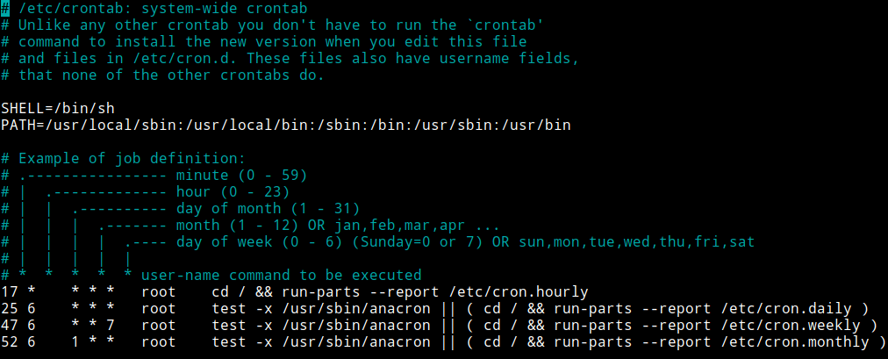
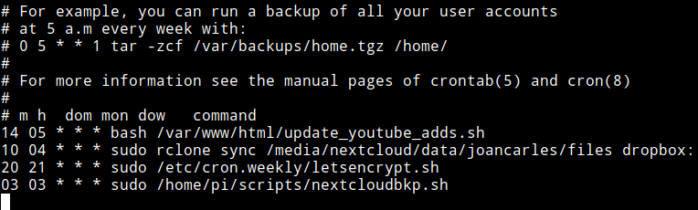
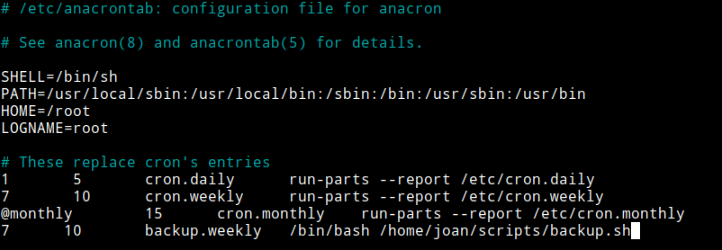

A continuación detallaremos que son y como funcionan Cron y Anacron. Además también veremos la totalidad de formas disponibles para planificar tareas con Cron y Anacron.<!--more-->

## ¿QUÉ ES Y COMO FUNCIONA CRON?

**Cron es un demonio** o servicio de Linux y Unix **que permite ejecutar tareas, procesos, comandos y scripts en segundo plano** de forma automática y periódica **en la fecha y hora que nosotros queramos**.

Cada minuto Cron consulta las listas de tareas o tareas almacenadas en las siguientes ubicaciones:

- /etc/crontab
- /var/spool/cron/crontabs/\*.\*
- /etc/cron.d
- /etc/cron.daily
- /etc/cron.hourly
- /etc/cron.monthly

###### Nota: Incluyo los directorios cron.daily, cron.hourly y cron.monthly porque la configuración predeterminada de Cron contiene entradas para ejecutar de forma periódica los scripts almacenados dentro de estos directorios.

Si se detecta que hay una tarea pendiente de realizar se iniciará de forma automática. **En el caso que en el momento de iniciar la tarea el equipo esté parado no se ejecutará**. Por lo tanto Cron es ideal para planificar la ejecución de tareas de forma automática y periódica en equipos que están permanentemente encendidos. Para los equipos que se encienden y apagan con frecuencia tenemos que usar Anacron.

###### Nota: Algunas de las ubicaciones dadas en este apartado pueden variar ligeramente en función de la distribución que usen.

## ¿QUÉ ES Y COMO FUNCIONA ANACRON?

Anacron no es un demonio que esté corriendo constantemente en segundo plano. **Anacron es un programa que complementa a Cron** y se ejecuta de forma periódica a través de:

1. Tareas programadas de Cron. En mi Debian testing Anacron es ejecutado por Cron. Si consulto el fichero /etc/cron.d/anacron veo que Cron ejecuta Anacron una vez cada hora empezando a las 7:30 y finalizando a las 23:30.
2. Scripts que se ejecutan en el momento de arrancar nuestro equipo.

En el momento que Anacron es llamado, consulta la lista de tareas definidas en las ubicaciones:

- /etc/anacrontab
- /etc/cron.daily
- /etc/cron.hourly
- /etc/cron.monthly

###### Nota: Incluyo los directorios cron.daily, cron.hourly y cron.monthly porque la lista predeterminada de tareas de /etc/anacrontab tiene entradas para ejecutar de forma periódica los scripts almacenados dentro de estos directorios.

En el fichero /etc/anacrontab definimos que una tarea se tiene que realizar cada X días. En el caso que haya alguna tarea que haga más de X días que no se haya realizado se ejecutará de forma completamente automática. Una vez realizada la tarea se guardará un registro con la fecha de ejecución en la ubicación /var/spool/anacron. Para consultar la fecha en que se ejecutaron la totalidad de scripts guardados en cron.daily podemos ejecutar el siguiente comando:

> ```
> root@debian:~# cat /var/spool/anacron/cron.daily
> 20200122
> ```

A diferencia de Cron, Anacron **es capaz de ejecutar tareas que han quedado pendientes de realizar**. Por lo tanto Anacron complementa a Cron y es sumamente útil en equipos que no están conectados las 24 horas.

## PRINCIPALES DIFERENCIAS ENTRE CRON Y ANACRON

Una vez descrito que es Cron y que es Anacron detallaremos las principales diferencias entre ellos:

 
|   **Cron**   |   **Anacron**   |
| --- | --- |
|   Permite ejecutar tareas en una fecha y minuto determinado. Cron te da un control total de la hora y fecha en que se ejecutará la tarea.   |   Permite planificar tareas en periodos diarios, semanales o mensuales. Ejecuta tareas que hace más de un determinado número de días que no se ha realizado.   |
|   El equipo tiene que estar encendido en el momento que toca realizar la tarea. En caso contrario la tarea nunca será realizada.   |   Si en el momento de realizar la tarea el equipo está parado, la tarea se realizará cuando el equipo se encienda y Cron llame a Anacron.   |
|   Es un demonio que está constantemente activo en segundo plano.   |   Es un programa que solo se activa a través de llamadas de Cron o por un script en el arranque del sistema operativo.   |
|   Todo usuario puede planificar tareas con Cron.   |   Únicamente los usuarios con privilegios de administrador pueden planificar tareas con Anacron.   |
|   Prácticamente la totalidad de distribuciones Linux traen Cron instalado de serie.   |   Es posible que Anacron no se instale de forma predeterminada. En caso que no esté instalado y lo quieran usar tan solo tienen que instalar el paquete anacron mediante el comando sudo apt install anacron.   |

## ¿CUÁNDO USAMOS CRON Y CUANDO USAMOS ANACRON?

Planificar tareas con Cron es especialmente útil para equipos que se usan 24 horas los 365 días del año. Como contrapartida, planificar tareas con Cron combinado con Anacron es especialmente útil en equipos que se apagan con frecuencia.

Por lo tanto en mi caso recomendaría:

1. Usar **Cron para programar tareas en servidores**.
2. Usar **Anacron en combinación con Cron para programar tareas en nuestro ordenador personal**.

## UTILIDADES DE PLANIFICAR TAREAS CON CRON Y ANACRON

La utilidades de planificar tareas con Cron y Anacron son extensas. Algunas de ellas son las siguientes:

1. Automatizar cualquier tarea que tengamos que realizar de forma periódica. Una ejemplo típico de lo que acabo de decir es **realizar copias de seguridad** mediante rsync.
2. **Ejecutar tareas y trabajos de forma automática por las noches y los fines de semana**. Existen tareas que tienen que ser realizadas cuando los usuarios no están usando los recursos informáticos.
3. Para **programar la ejecución de tareas pesadas** que se acostumbran a realizar fuera de horarios laborales.
4. **Actualizar** de forma automática **el certificado Let’s Encrypt** de nuestro portal web.
5. Sincronizar de forma periódica un contenido almacenado en nuestro ordenador o servidor a una nube mediante rclone.
6. Etc.

En fin, las utilidades que le podemos dar son hasta donde llegue nuestra imaginación

## INSTRUCCIONES PARA PLANIFICAR TAREAS CON CRON

Como ya hemos visto, dentro del directorio /etc existen los siguientes directorios y ficheros relacionados con la programación de tareas y cron:

- /etc/crontab
- /etc/cron.d
- /etc/cron.daily
- /etc/cron.hourly
- /etc/cron.monthly
- /etc/cron.weekly

### Utilidad del fichero /etc/crontab

No es recomendable editar el fichero /etc/crontab. Este fichero es para guardarlo como referencia. Este fichero también es para llamar a Anacron y para configurar la ejecución de los scripts almacenados en cron.daily, cron.hourly, cron.monthly y cron.weekly en el caso que Anacron no esté instalado. El fichero /etc/crontab solo es accesible para usuarios con permisos de administrador y tiene el siguiente aspecto:

[](images/aspecto-crontab.png)

### Ejecución de tareas almacenadas en cron.daily, cron.hourly, cron.monthly, cron.weekly

Los scripts almacenados en cron.daily, cron.hourly, cron.monthly y cron.weekly se ejecutarán de forma periódica del siguiente modo:

**En el caso que Anacron no esté instalado**, los scripts se ejecutarán en la fecha y hora especificada dentro del fichero /etc/crontab.

**En el caso que Anacron esté instalado**, los scripts ubicados en cron.daily, cron.weekly y cron.monthly serán ejecutados por Anacron según los periodos que definamos en /etc/anacrontab.

###### Nota: Los scripts contenidos en cron.hourly siempre serán ejecutados por Cron. Si queremos podemos modificar la configuración estándar.

En resumen:

 
|   **Directorio**   |   **Función del directorio**   |
| --- | --- |
|   /etc/cron.daily   |   **Si usamos únicamente** **C****ron**, Cron ejecuta todos los scripts ubicados en cron.daily una vez al día en la hora especificada en /etc/crontab. **En el caso de usar Cron y Anacron**, Anacron ejecuta todos los scripts ubicados en cron.daily que hace más de un día que no se ejecutan. La configuración de Anacron se realiza en /etc/anacrontab.   |
|   /etc/cron.hourly   |   La totalidad de scripts contenidos en el directorio /etc/cron.hourly se ejecutaran cada hora. Por lo tanto un script en está ubicación se ejecutará 24 veces al día si el equipo está permanentemente encendido. La hora de ejecución se especifica en el fichero en el fichero /etc/crontab.   |
|   /etc/cron.weekly   |   **Si usamos únicamente** **C****ron**, Cron ejecuta todos los scripts ubicados en cron.weekly una vez a la semana en el día y hora especificados en /etc/crontab. **En el caso de usar Cron y Anacron**, Anacron ejecuta todos los scripts ubicados en cron.weekly que hace más de una semana que no se ejecutan. La configuración de Anacron se realiza en /etc/anacrontab.   |
|   /etc/cron.monthly   |   **U****sando** **únicamente** **C****ron**, Cron ejecuta todos los scripts ubicados en cron.monthly mensualmente en el día y hora especificados en /etc/crontab. **En el caso de usar Cron y Anacron**, Anacron ejecuta todos los scripts ubicados en cron.montly que hace más de un mes que no se ejecutan. La configuración de Anacron se realiza en /etc/anacrontab.   |

#### Ejemplo de de planificación de una tarea mediante cron.weekly

A modo de ejemplo, para planificar una tarea semanal para renovar un certificado Let’s Encrypt lo haremos del siguiente modo. Abriremos una terminal y ejecutaremos el siguiente comando:

> ```
> sudo nano /etc/cron.weekly/letsencrypt.sh
> ```

Cuando se abra el editor de textos nano generamos el código del script que queráis. En mi caso es el siguiente:

> ```
> #!/bin/sh
> # Actualizar certificados de Let's Encrypt en lighttpd
> # Edit webroot-path with your www folder location
> sudo certbot renew --webroot -w /var/www/html/
> # Rebuild the cert
> # Edit folder location to your domainname
> cd /etc/letsencrypt/live/geekland.eu/
> sudo bash -c "cat privkey.pem cert.pem > web.pem"
> # Reload lighttpd
> sudo service lighttpd reload
> ```

A continuación guardamos los cambios y cerramos el fichero. Finalmente otorgamos permisos de ejecución al script mediante el siguiente comando:

> ```
> sudo chmod +x /etc/cron.weekly/letsencrypt.sh
> ```

A partir de este momento, semanalmente se intentará renovar el certificado SSL de Let’s Encrypt de mi web.

Si únicamente usamos Cron, la tarea se realizará el Domingo a las 6:47. Si usamos Cron con Anacron la tarea se realizará en el momento que hayan pasado más de 7 días y el ordenador esté conectado.

### Ejecución de scripts y tareas con múltiples usuarios y crontab

Acabamos de ver una forma simple de ejecutar scripts y programar tareas de forma periódica. Pero existe otra forma muy habitual de realizar lo mismo.

**Cada usuario del sistema operativo podrá programar su propia lista de tareas**. En la ubicación /var/spool/cron/crontabs se genera un archivo para cada usuario que contiene la totalidad de tareas que ha programado. Para ver las listas existentes ejecuten el siguiente comando:

> ```
> root@raspberrypi:/home/pi# ls /var/spool/cron/crontabs
> pi root
> ```

Para consultar las tareas programadas por el usuario pi tan solo tienen que ejecutar el siguiente comando:

> ```
> cat pi
> ```

Los ficheros de los usuarios únicamente son para consultarlos y no se deben editar de forma directa.

Para editar los trabajos Cron del usuario en que estamos logueados tan solo tenemos que ejecutar el siguiente comando en la terminal:

> ```
> crontab -e
> ```

###### Nota: Si quisiéramos editar los trabajos cron de otro usuario como por ejemplo el root deberíamos ejecutar el siguiente comando sudo crontab \-u root -e

Al ejecutar el comando se abrirá el editor de textos por defecto para que podamos programar nuestras tareas. Para programar una tarea introduciremos un comando del siguiente tipo:

> ```
> Minuto Hora Dia_Mes Mes Dia_Semana Comando
> ```

Cada uno de los parámetros que acabo de citar se deberá sustituir por los siguientes valores:

 
|   **Parámetro**   |   **Explicación del parámetro**   |
| --- | --- |
|   Minuto (m)   |   Especificamos el minuto en que queremos ejecutar la tarea. Posibles valores que puede tomar este parámetro son entre el 0 y el 59. También podemos usar \* que tendría el significado que se ejecute todos los minutos.   |
|   Hora (h)   |   Detallamos la hora en que queremos ejecutar la tarea. La hora se especifica en un formato de 24 horas, por lo tanto los valores de este parámetro son de 0 a 23. Al igual que en el caso anterior también podemos usar el carácter \* para indicar que la tarea se ejecute todas las horas.   |
|   Dia\_Mes (dom)   |   Indicamos los días del mes en que queremos ejecutar la tarea, comando o script. Los valores de esta variable serán un número del 1 al 31. También podemos usar \* para indicar todos los días del mes. Si queremos que la tarea se ejecute del día 25 al día 30 tenemos la posibilidad de usar la sintaxis 25-30. Si queremos que se ejecute únicamente el día 10 y el día 20 podemos usar la sintaxis 10,20   |
|   Mes (mon)   |   Especificamos el mes con un valor entre el 1 y el 12. Si queremos que la tarea se ejecute todos los meses deberemos usar el símbolo \*. Del mismo modo que con el resto de parámetros podemos usar opciones como 5-10 o 1,2   |
|   Dia\_Semama (dow)   |   Seleccionamos el día de la semana en que se ejecutará la tarea. En este parámetro introduciremos valores entre el 0 y el 7 en que tanto el valor 0 como el valor 7 se refieren al domingo. También nos podemos referir a los días de la semana mediante las 3 primeras letras de su nombre en inglés mon tue wed thu fri sat sun. Para hacer que una tarea se ejecute todos los días de las semana usaremos \*. Para que únicamente se ejecute los Lunes y los Viernes usaremos 1,5. Y para que se aplique de Lunes a Viernes 1-5. |
|   Comando (command)   |   Escribimos el comando que queremos ejecutar o la ruta del script que queremos ejecutar. Todos los comandos a ejecutar deberán usar rutas absolutas.   |

Algunos ejemplos de programación de tareas que podríamos introducir después de ejecutar el comando crontab -e serían los siguientes:

 
|   **Ejemplo**   |   **Significado**   |
| --- | --- |
|   14 22 \* \* \* /home/pi/scripts/nextcloudbkp.sh   |   Todos los días del año a las 22 horas y 14 minutos se ejecutará el script nextcloudbkp.sh   |
|   0 0,3,6,9,12,16,18,21 \* \* \* /home/pi/scripts/nextcloudbkp.sh   |   El usuario que ha programado la tarea Cron ejecutará el script nextcloudbkp.sh cada 3 horas, todos los días, años y meses.   |
|   0 /6 \* \* \* /home/pi/scripts/nextcloudbkp.sh   |   El usuario que ha programado la tarea Cron ejecutará el script nextcloudbkp.sh cada 6 horas, todos los días, años y meses.   |
|   30 13 \* \* 1-5 /home/pi/scripts/nextcloudbkp.sh   |   De Lunes a Viernes y durante todos los meses y semanas se ejecutará el script nextcloudbkp.sh a las 13h y 30min.   |
|   0 09 1,15,30 \* \* /home/pi/scripts/nextcloudbkp.sh   |   Todos los días 1, 15 y 30 se ejecutará el script nextcloudbkp.sh a las 9 de la mañana.   |
|   0 21 20 11 \* apt-get update & apt-get -y upgrade   |   El día 20 de noviembre a las 21:00 se actualizará nuestro sistema operativo. Con esta tarea, el sistema operativo únicamente se actualizará una vez por año.   |
|   22 \* \* 2 5 apt-get update & apt-get -y upgrade   |   Todos los viernes del mes de Febrero se actualizará el sistema operativo al minuto 22 de cada una de las horas.   |
|   3/3 2/4 2 2 2 apt-get update   |   Cada 3 minutos empezando por el minuto 3 y cada 4 horas empezando por de las 2 de la madrugada, del día 2 de febrero y que sea martes se actualizarán los repositorios de nuestra distribución.   |
|   @reboot /home/pi/scripts/nextcloudbkp.sh   |   Cada vez que reiniciemos el sistema se ejecutará el script nextcloudbkp.sh   |
|   @monthly /home/pi/scripts/nextcloudbkp.sh   |   El primer día del mes a las 00:00 se realizará la copia de seguridad de nextcloud. @montly se puede reemplazar por @weekly (0 0 \* \* 0), @yearly (0 0 1 1 \*), @daily (0 0 \* \* \*) o @hourly (0 \* \* \* \*).   |

Con todo lo citado hasta el momento, el fichero crontab de un usuario podría contener una lista de tareas similar a la siguiente:

[](images/ejemplo-crontab.png)

Para consultar las tareas Cron del usuario con que estamos logueados ejecutaremos el siguiente comando:

> ```
> crontab -l
> ```

Si estamos logueados con el usuario pi y queremos listar los trabajos Cron del usuario root ejecutaremos el siguiente comando:

> ```
> sudo crontab -u root -l
> ```

Para borrar los trabajos Cron del usuario con que estamos logueados, podemos comentar las lineas que definen las tareas o ejecutar el siguiente comando.

> ```
> sudo crontab -r
> ```

### Ejecución de scripts mediante el directorio cron.d

Del mismo modo que minuto a minuto se comprueban las tareas definidas en crontab, también se comprueban todos y cada uno de los ficheros ubicados en el directorio /etc/cron.d

Cada uno de los ficheros presentes dentro del directorio /etc/cron.d representa una tarea programada. Imaginemos que tenemos un script para actualizar Firefox en Debian ubicado en /home/joan/scripts/firefox\_update.sh. Para ejecutar este script todos los días a las 10 de la noche procederemos el siguiente modo:

Inicialmente crearemos el fichero donde definiremos la ejecución de la tarea ejecutando el siguiente comando en la terminal:

> ```
> sudo nano /etc/cron.d/firefox
> ```

Una vez se abra el editor de textos nano programaremos la tarea de la misma forma que lo haríamos en el fichero crontab de un usuario. **La única diferencia será que entre el comando y la hora de ejecución tendremos que especificar el usuario que ejecutará la tarea**. La tarea que he definido en mi caso es la siguiente:

> ```
> 0 22 * * * root bash /home/joan/scripts/firefox_update.sh
> ```

Una vez definida la tarea guardamos los cambios y cerramos el fichero. De este modo tan simple, todos los días a las 22 horas se comprobará si hay una nueva versión de Firefox. En el caso de que haya una nueva versión se instalará de forma automática. El usuario que realizará la actualización de Firefox será el **root**.

###### Nota: Cron.d no es la forma habitual de programar una tarea. Lo habitual es usar crontab -e. Solo los usuarios con privilegios de administrador podrán ejecutar tareas mediante cron.d

### Facilitar la programación de tareas con Cron

Si os cuesta definir el momento en que se ejecuta la tarea podéis usar servicios web que os facilitarán el trabajo. Algunos de los que podemos usar son los siguientes:

1. [https://crontab-generator.org/](https://crontab-generator.org/)
2. [https://crontab.guru/](https://crontab.guru/)
3. [https://www.freeformatter.com/cron-expression-generator-quartz.html](https://www.freeformatter.com/cron-expression-generator-quartz.html)

También existen interfaces gráficas que permitirán planificar y administrar tareas programadas con Cron. Algunas de ellas son las siguientes:

1. krcon disponible para el entorno de scritorio plasma.
2. Gnome-schedule.

###### Nota: Aseguraos bien que el trabajo Cron funcione de forma adecuada. Un error en la programación de una tarea puede ser catastrófica.

### Definición de permisos para que los usuarios puedan planificar tareas con Cron

De forma predeterminada Cron puede ser usado por todos los usuarios. En el caso que lo necesitemos podemos restringir su uso. Para ello debemos utilizar los siguientes ficheros:

1. /etc/cron.allow
2. /etc/cron.deny

#### Evitar que ciertos usuarios puedan planificar tareas con Cron

Si nuestro objetivo es evitar que los usuarios joan y pepe puedan usar Cron crearemos el fichero /etc/cron.deny ejecutando el siguiente comando en la terminal:

> ```
> sudo nano /etc/cron.deny
> ```

Una vez se abra el editor de textos escribiremos el nombre de los usuarios que no queremos que usen cron. En mi caso son:

> ```
> pepe
> joan
> ```

###### Nota: Si quisiéramos denegar el uso a todos los usuarios deberíamos escribir ALL dentro del fichero /etc/cron.deny. De este modo solo el administrador del sistema podría planificar tareas.

Acto seguido guardamos los cambios y cerramos el fichero. Para asegurar que los cambios surjan efecto podemos reiniciar Cron mediante el siguiente comando:

> ```
> sudo service cron restart
> ```

En estos momento todos los usuarios podrán planificar tareas con Cron excepto joan y pepe.

#### Especificar los usuarios que pueden planificar tareas con Cron

En el momento que creemos el fichero /etc/cron.allow sin que haya un fichero /etc/cron.deny, únicamente los usuarios especificados dentro del fichero /etc/cron.allow podrán planificar trabajos con Cron.

Por lo tanto, si solo queremos que los usuarios joan y root puedan planificar tareas con Cron ejecutaremos el siguiente comando en la terminal:

> ```
> sudo nano /etc/cron.allow
> ```

Cuando se abra el editor de textos escribiremos el usuario o usuarios que pueden usar Cron. En mi caso:

> ```
> joan
> root
> ```

Al guardar los cambios y al reiniciar el servicio Cron, únicamente los usuarios joan y root estarán autorizados a planificar tareas.

## COMO PLANIFICAR TAREAS CON ANACRON

Las tareas ejecutadas por Anacron se definen en el fichero /etc/anacrontab. Para editar este fichero y añadir una tarea ejecutaremos el siguiente comando en la terminal:

> ```
> sudo nano /etc/anacrontab
> ```

Una vez se abra el editor de texto tendremos que programar las tareas introduciendo un comando del siguiente tipo:

> ```
> periodo_tarea retardo_ejecución identificador comando
> ```

Cada uno de los parámetros que acabo de citar se deberá sustituir por los siguientes valores:

 
|   Parámetro   |   Explicación del parámetro   |
| --- | --- |
|   periodo\_tarea   |   Indicamos la frecuencia en días con que queremos que se ejecute la tarea. Si la ejecución de la tarea tiene que ser diaria escribiremos 1 o @daily. Si es semanal escribiremos 7 o @weekly, si es mensual escribiremos 30 o @monthly. Si queremos que se ejecute cada dos días escribiremos 2. |
|   retardo\_ejecución   |   Es un número entero que indica los minutos que transcurren desde que Anacron detecta que hay que ejecutar el comando o script hasta que se ejecuta. El retraso entre la detección de ejecución y la ejecución puede ser útil para evitar sobrecargas de CPU y memoria si se tienen que realizar muchas tareas de forma simultánea.   |
|   identificador   |   Un nombre cualquiera que describe e identifica la tarea que se ejecutará. Este nombre nos servirá para por ejemplo buscar información en los logs.   |
|   comando   |   Detallamos el comando o script que queremos ejecutar.   |

Por lo tanto, para realizar una copia de seguridad semanal mediante un script tendremos que usar el siguiente código:

> ```
> 7 10 backup.weekly /bin/bash /home/joan/scripts/backup.sh
> ```

Una vez introducido el texto guardamos los cambios y cerramos el fichero. A partir de estos momentos:

A los 7 días, o en momento que abra el ordenador y se detecte que llevo más de 7 días sin realizar la copia, Cron llamará a Anacron y se iniciará el proceso para realizar la copia de seguridad. Una vez toque iniciar la copia se realizará una pausa de 10 minutos y acto seguido se realizará la copia.

El aspecto que tiene mi /etc/anacrontab es el siguiente:

[](images/aspecto-anacrontab.png)

Podemos añadir parámetros adicionales en el fichero de configuración:

- Si debajo de LOGNAME= root añadimos START\_HOURS\_RANGE=3-22, entonces los trabajos únicamente se ejecutarán entre las 3 de la madrugada y las 10 de la noche. Si queremos conseguir lo mismo sin añadir ningún parámetro también podríamos modificar la configuración de Cron.
- Otra opción es añadir el parámetro RANDOM\_DELAY=10. Lo que hará este parámetro es añadir un retardo aleatorio adicional de 0 a 10 minutos a cada una de las tareas que se van a ejecutar. De este forma se repartirá mejor la carga del sistema.

### Forzar la ejecución de las tareas programadas en Anacron

Puede darse el caso que necesitemos ejecutar todas las tareas de Anacron para depurarlas y/o para ver que funcionan. Para forzar su ejecución podemos ejecutar el siguiente comando:

> ```
> sudo anacron -f
> ```

Acto seguido se iniciará el proceso para ejecutar todas las tareas de Anacron.

## SOLUCIONES ALTERNATIVAS A CRON Y ANACRON

En mi caso siempre uso Cron y Anacron. No obstante existen alternativas como por ejemplo los timer de systemd (Systemd/Timers). Para ver el funcionamiento de los Systemd Timers pueden visitar el siguiente enlace:

https://geekland.eu/programar-la-ejecucion-de-tareas-con-systemd-timers-y-reemplazar-cron/
