La gran mayoría de emails que acostumbramos a enviar transmiten una imagen muy simple, ya que el contenido es un simple fondo blanco con texto de color negro. Si este aspecto nos molesta lo podemos solucionar usando plantillas html en thunderbird o en cualquier otro gestor de correo electrónico.<!--more-->

Escribir un mail con una imagen simple no es ningún problema, pero es posible que en determinados casos queramos transmitir una imagen corporativa, diferente o más elegante a las personas a las que enviamos emails.

Si este es nuestro objetivo podemos usar plantillas html en nuestro gestor de correo electrónico para obtener la imagen y el objetivo que estamos buscando. Mediante las plantillas html podremos añadir los siguientes elementos en totalidad de mails enviados:

1. Un logo corporativo.
2. Un imagen de fondo.
3. Una cabecera.
4. Una firma.
5. Un pie de página, etc.

Los pasos para poder usar las plantillas html en Thunderbird de forma adecuada son los siguientes:

## CREAR O SELECCIONAR PLANTILLAS HTML RESPONSIVE

El primer paso obviamente es disponer de una plantilla. Para poder disponer de una plantilla existen varias opciones.

**La primera opción es realizar una plantilla nosotros mismos**. Para realizar una plantilla, y que además sea responsive, necesitamos disponer de conocimientos de programación en html y CSS. Por lo tanto a la gran mayoría les recomiendo la segunda opción.

**La segunda opción es buscar una plantilla realizada por alguien más y adaptarla a nuestro gusto y necesidad**. **En mi caso busqué la plantilla antwork que podéis descargar accediendo a la siguiente** [página web](https://github.com/InterNations/antwort). He seleccionado esta plantilla como base porqué me parece ideal y elegante para enviar mis emails personales. En caso que queráis usar otras platillas, mediante vuestro buscador de internet habitual, encontraréis numerosas alternativas al tema antwork.

Una vez dentro de la página web, tal y come se puede ver en la captura de pantalla, **presionamos encima del botón** **Download Zip**.

[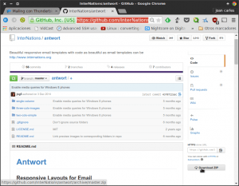](images/Descargar-plantilla-Antwork.png)

Después de presionar el botón se descargará el archivo **antwort-master.zip** que contiene 3 plantillas html. El aspecto de cada una de las plantillas html es el siguiente:

[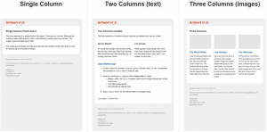](images/Diseño-de-las-plantillas-antwork.png)

###### Nota: En mi caso, la plantilla que se adapta más a mi uso del email es la plantilla single column. Es una plantilla simple y elegante.

**Después de descargar el archivo** **antwort-master.zip** **lo descomprimimos**. Una vez descomprimido, tal y como se puede ver en la captura de pantalla, **accedemos a la ruta** **/antwort-master/single-column/**

[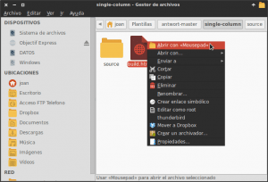](images/Editar-la-plantilla-html.png)

###### Nota: Si en vuestro caso queréis usar la plantilla two columns o three columns la ruta /antwort-master/two-cols-simple/ o /antwort-master/three-cols-simple

Una vez dentro de la ruta indicada, **abrimos el archivo** **build.html** con un editor de texto cualquiera. Una vez abierto el editor de texto **modificamos el código del tema antwork / single column según nuestras necesidades**.

En mi caso he introducido las siguientes modificaciones ha la plantilla que tomamos como base:

1. He cambiado los colores de fondo de la plantilla.
2. He eliminado la cabecera del mail. En mi caso no pretendo transmitir una imagen corporativa. Tan solo quiero que mis mails tengan un estilo simple y elegante.
3. He eliminado información que contenía la plantilla como por ejemplo el solicitar darse de baja de una base de datos de mails, etc. En mi caso solo pretendo usar la plantilla para enviar emails personales. No pretendo realizar ningún mailing.
4. He establecido que la totalidad de texto que escribiremos en los emails tendrá una alineación justificada.
5. He cambiado la codificación de texto de UTF-8 a Windows-1252. La codificación UTF-8 me daba problemas en la codificación de caracteres en el iPad.

Para conseguir todas estas modificaciones **el código final del archivo build.html es el siguiente:**

> ```
> <!DOCTYPE html PUBLIC "-//W3C//DTD HTML 4.01 Transitional//EN" "http://www.w3.org/TR/html4/loose.dtd">
> <html lang="en">
> <head>
>  <meta http-equiv="Content-Type" content="text/html; charset=Windows-1252">
>  <meta name="viewport" content="width=device-width, initial-scale=1"> <!-- So that mobile will display zoomed in -->
>  <meta http-equiv="X-UA-Compatible" content="IE=edge"> <!-- enable media queries for windows phone 8 -->
>  <meta name="format-detection" content="telephone=no"> <!-- disable auto telephone linking in iOS -->
>  <title>Single Column</title>
> ```
> 
> ```
> <style type="text/css">
> body {
>  margin: 0;
>  padding: 0;
>  -ms-text-size-adjust: 100%;
>  -webkit-text-size-adjust: 100%;
> }
> ```
> 
> ```
> table {
>  border-spacing: 0;
> }
> ```
> 
> ```
> table td {
>  border-collapse: collapse;
> }
> ```
> 
> ```
> .ExternalClass {
>  width: 100%;
> }
> ```
> 
> ```
> .ExternalClass,
> .ExternalClass p,
> .ExternalClass span,
> .ExternalClass font,
> .ExternalClass td,
> .ExternalClass div {
>  line-height: 100%;
> }
> ```
> 
> ```
> .ReadMsgBody {
>  width: 100%;
>  background-color: #ebebeb;
> }
> ```
> 
> ```
> table {
>  mso-table-lspace: 0pt;
>  mso-table-rspace: 0pt;
> }
> ```
> 
> ```
> img {
>  -ms-interpolation-mode: bicubic;
> }
> ```
> 
> ```
> .yshortcuts a {
>  border-bottom: none !important;
> }
> ```
> 
> ```
> @media screen and (max-width: 599px) {
>  table[class="force-row"],
>  table[class="container"] {
>  width: 100% !important;
>  max-width: 100% !important;
>  }
> }
> @media screen and (max-width: 400px) {
>  td[class*="container-padding"] {
>  padding-left: 12px !important;
>  padding-right: 12px !important;
>  }
> }
> .ios-footer a {
>  color: #aaaaaa !important;
>  text-decoration: underline;
> }
> </style>
> ```
> 
> ```
> </head>
> <body style="margin:0; padding:0;" bgcolor="#F0F0F0" leftmargin="0" topmargin="0" marginwidth="0" marginheight="0">
> ```
> 
> ```
> <!-- 100% background wrapper (grey background) -->
> <table border="0" width="100%" height="100%" cellpadding="0" cellspacing="0" bgcolor="#F0F0F0">
>  <tr>
>  <td align="center" valign="top" bgcolor="#F0F0F0" style="background-color: #CDCDCD;">
> ```
> 
> ```
> <br>
> ```
> 
> ```
> <!-- 600px container (white background) -->
>  <table border="0" width="600" cellpadding="0" cellspacing="0" class="container" style="width:600px;max-width:600px">
> ```
> 
> ```
> <tr>
>  <td class="container-padding content" align="left" style="padding-left:24px;padding-right:24px;padding-top:12px;padding-bottom:12px;background-color:#EBEBEB"">
>  <br>
> ```
> 
> ```
> <div class="title" style="font-family:Helvetica, Arial, sans-serif;font-size:14px;font-weight:600;color:#374550">Hola ,</div>
> <br>
> ```
> 
> ```
> <div class="body-text" style="font-family:Helvetica, Arial, sans-serif;font-size:14px;line-height:20px;text-align:justify;color:#333333">
>  Texto
>  <br><br>
> ```
> 
> ```
> Saludos
>  <br><br>
> </div>
> ```
> 
> ```
> </td>
>  </tr>
>  <tr>
>  <td class="container-padding footer-text" align="left" style="font-family:Helvetica, Arial, sans-serif;font-size:13px;line-height:16px;color:#646464;padding-left:24px;padding-right:24px">
>  <br><br>
> ```
> 
> ```
> <strong>pon tu nombre</strong><br>
>  <span class="ios-footer">
>  <br>
>  </span>
>  <a href="mailto:escribe tu dirección de email" style="color:#838383">escribe tu dirección de email</a><br>
> ```
> 
> ```
> <br><br>
> ```
> 
> ```
> </td>
>  </tr>
>  </table>
> <!--/600px container -->
> ```
> 
> ```
>  </td>
>  </tr>
> </table>
> <!--/100% background wrapper-->
> ```
> 
> ```
> </body>
> </html>
> ```

Una vez modificado el código del archivo **build.html** guardamos los cambios. Una vez guardados los cambios ya podemos crear la plantilla en thunderbird.

###### Nota: En color verde se indican las partes a personalizar para la gente que quiera usar esta plantilla. Para que la plantilla sea usable, como mínimo deberán sustituir "pon tu nombre" por vuestro nombre real y "escribe tu dirección de email" por vuestra dirección de email real.

## CREAR PLANTILLAS HTML EN THUNDERBIRD

En estos momentos ya hemos realizado los pasos más difíciles para poder usar una plantilla en Thunderbird. El paso para crear la plantilla en Thunderbird es sumamente fácil. Tan solo tenemos que **presionar el botón** **Redactar**.

Una vez presionado el botón **Redactar** se abrirá una ventana para que podamos redactar el mail que queremos enviar. Tal y como se puede ver en la captura de pantalla, tendremos que **acceder al menú** **Insertar** y a posteriori cuando se abra el menú tendremos que **seleccionar la opción** **HTML..**.

[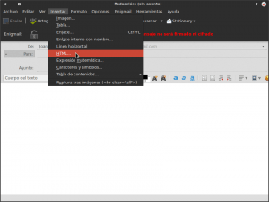](images/Insertar-plantilla-html.png)

Una vez seleccionada la opción **HTML...** aparecerá una ventana para insertar el código html de nuestra plantilla.

[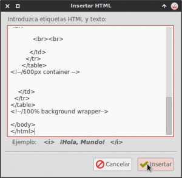](images/Introducir-código-de-la-plantilla.png)

Tal y como se puede ver en la captura de pantalla, en esta ventana hay que **pegar la totalidad de contenido del fichero** **build.html** que editamos en el paso anterior. Una vez pegado el contenido, tal y como se puede ver en la captura de pantalla, **presionamos el botón** **Insertar**.

[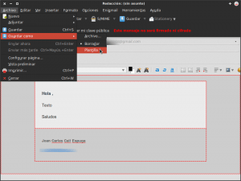](images/Guardar-como-plantilla-html.png)

Una vez insertada la plantilla, tal y como se puede ver en la captura de pantalla, **vamos al menú** **Archivo**. Cuando se abra el menú **seleccionamos la opción Guardar como** y a posteriori **seleccionamos la opción Plantilla**. Después de estos pasos nuestra la plantilla estará creada y guardada en nuestro gestor de correo electrónico Thunderbird.

## ENVIAR UN MAIL USANDO PLANTILLAS HTML

Para redactar un email usando la plantilla que acabamos de crear tenemos que seguir los siguientes pasos:

[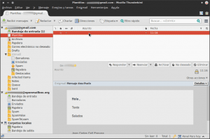](images/Abrir-plantilla.png)

Tal y como se puede ver en la captura de pantalla, **accedemos a la carpeta plantillas**. En la carpeta plantillas encontraremos la plantilla que acabamos de crear. **Hacemos doble click en la plantilla creada y se abrirá la ventana en la que tenemos que redactar el mail** que queremos enviar.

Tal y como se puede ver en la captura de pantalla redactamos el contenido que queremos que tenga nuestro mail.

[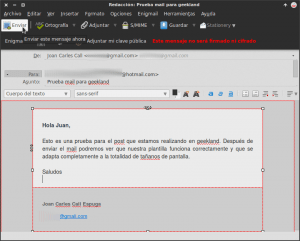](images/Enviando-mail-con-plantilla.png)

**Una vez redactado el mail tan solo tendremos que presionar encima del botón** **Enviar** y el correo se enviará.

## RESULTADOS OBTENIDOS EN EL ENVÍO DEL MAIL

En las siguientes capturas de pantalla mostraremos lo que verán los receptores de nuestro mail en distintos dispositivos y en distintos tamaños de pantalla:

### Resultado obtenido en el caso de abrir el mail en un ordenador

[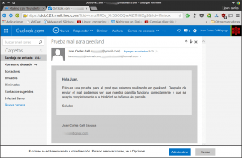](images/Resultado-Ordenador.png)

### Resultado obtenido en el caso de abrir el mail en un teléfono Android

[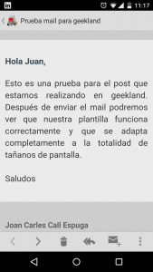](images/Visualización-teléfono-Android.png)

### Resultado obtenido en el caso de abrir el mail en un iPad

[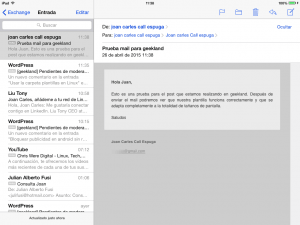](images/Visualiazición-iPad.png)

###### Nota: Como se puede ver en las capturas de pantalla de este apartado, la plantilla que estamos usando es responsive, ya que el mail se adapta a la perfección a distintos dispositivos y a distintos tamaños de pantalla.

## AUTOMATIZAR EL PROCESO DE ENVIAR MAILS CON UNA PLANTILLA

Obviamente **es un poco engorroso que cada vez que tengamos que enviar un mail sea necesario tener que acceder a la carpeta plantillas**. **Si queremos solucionar este problema lo podemos hacer de forma muy fácil** usando la extensión de Thundebird Stationery.

### Instalar Stationery

Para instalar la extensión Stationery tenemos que **acceder al menú** **Herramientas** del gestor de correo Thunderbird. Una vez se abra el menú tenemos que **seleccionar la opción** **Complementos**.

Seguidamente se abrirá una pestaña para administrar los complementos. Para instalar Stationery, tal y como se puede ver en la captura de pantalla, **accedemos al cuadro de búsqueda, escribimos el nombre del complemento**, que en nuestro caso es Stationery y seguidamente **presionamos la tecla** **Enter**.

Después de presionar Enter se realizará la búsqueda de la extensión. Una vez encontrada, tal y como se muestra en la captura de pantalla, **presionamos el botón** **Instalar** y la extensión se instalará.

[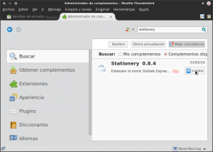](images/Instalar-stationery.png)

Una vez instalada la extensión tenemos que **reiniciar Thunderbird.**

### Incluir nuestra plantilla en Stationery

Una vez instalada la extensión Stationery tenemos que **acceder al menú** **Herramientas**, y cuando se despliegue el menú tenemos que **seleccionar la opción Stationery Options**. Después de realizar estos pasos se abrirá la pestaña que pueden observar en la siguiente captura de pantalla:

[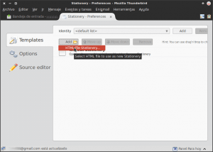](images/Importar-plantilla.png)

Tal y como se puede ver en la captura de pantalla, el siguiente paso es **presionar sobre el botón Add**. Al presionar sobre el botón **aparecerá el submenu HTML file Stationery**. **Presionamos encima de él** y, tal y como se puede ver en la captura de pantalla, aparecerá una ventana en la que tenemos que **seleccionar el archivo** **build.html** que editamos en el apartado Crear o seleccionar una plantilla responsive. Una vez encontrado y seleccionado el archivo build.html, tal y como se puede ver en la captura de pantalla, **presionamos el botón** **Abrir**.

[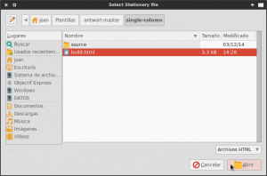](images/Añadir-plantilla-en-Stationery.png)

En el momento de presionar sobre el botón Abrir el proceso de configuración ha terminado.

### Escribir un email usando la plantilla

Para escribir un mail usando la plantilla que hemos creado tan solo tenemos que **presionar sobre el botón** **Redactar** de Thunderbird como si **escribiéramos una mail de forma normal y corriente.**

En el momento de apretar el botón redactar se abrirá la ventana para que podamos redactar el mail, con la particularidad que tendrá el diseño de la plantilla que hemos creado.

**Si trabajamos con varias plantillas html, o en un momento dado queremos enviar un mail sin usar ningúna plantilla o usando otra plantilla diferente a la predeterminada**, tal y como se puede ver en la captura de pantalla, tan solo tenemos que **clicar encima del botón** **Stationery**.

[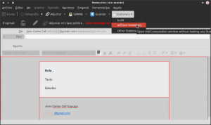](images/Seleccionar-la-plantilla-que-queremos-usar.png)

En el momento de clicar encima del botón aparecerán la totalidad de plantillas html que tenemos disponibles y una opción que es **without Stationery**. En estos momentos podremos **seleccionar la plantilla que necesitemos o simplemente seleccionar la opción without Stationery para enviar un mail con fondo blanco y texto negro.**
