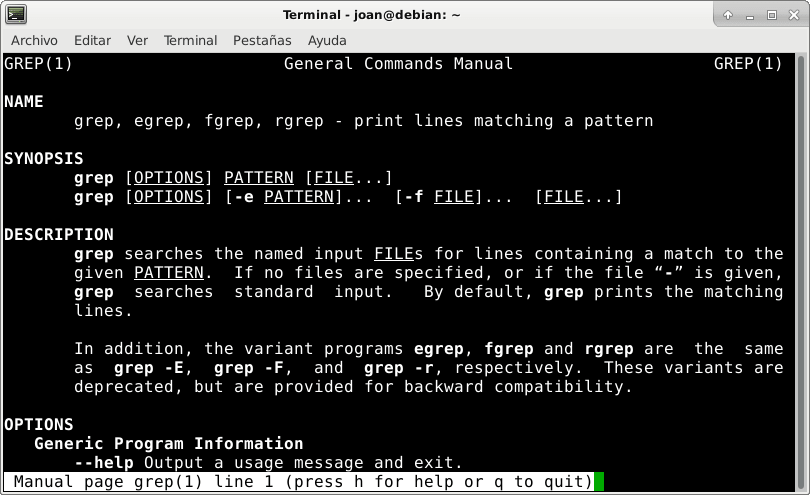
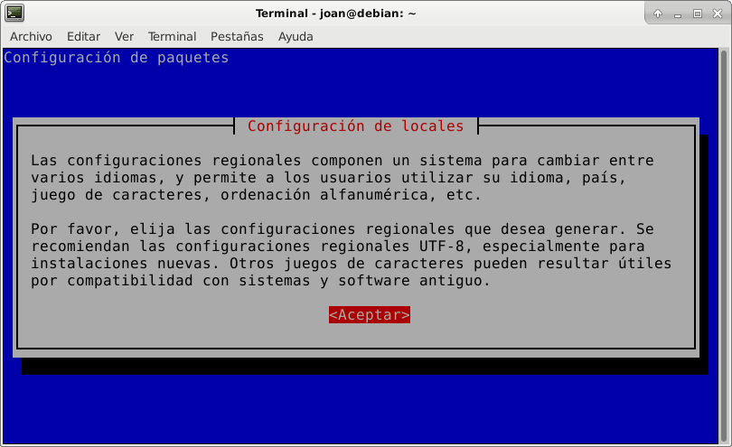
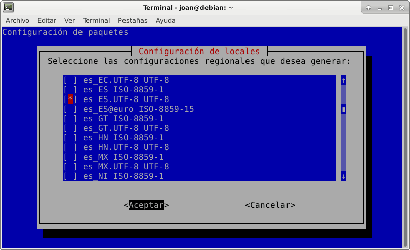
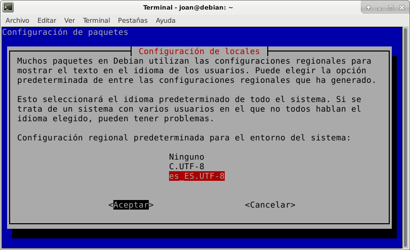
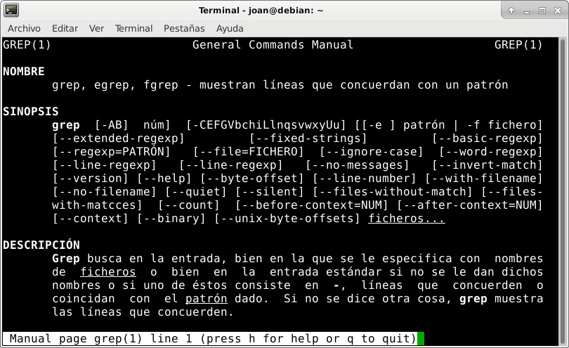

En anteriores artículos vimos varias formas para [buscar ayuda en Linux](). Una de estas formas era mediante las páginas man. Las páginas man acostumbran a estar en Inglés y esto puede ser un problema para algunos usuarios. Por este motivo en el siguiente artículo veremos como disponer de las páginas man en Español.<!--more-->

Inicialmente usaremos el comando man para ver que los resultados que nos muestra están en Inglés. Para ello ejecutaremos el siguiente comando en la terminal:

> ```
> man grep
> ```

Si observan la salida del comando verán que las instrucciones de uso del comando grep están en Inglés.

[](images/paginas-man-en-ingles.png)

## PONER LAS PÁGINAS MAN EN ESPAÑOL

Si queremos obtener las instrucciones en Español hay que instalar los paquetes manpages-es y manpages-es-extra. Para ello tenemos que ejecutar el siguiente comando en la terminal:

> ```
> sudo apt-get install manpages-es manpages-es-extra
> ```

Una vez instalados los paquetes tenemos que actualizar la configuración regional del sistema para poder ver las páginas man en Español. Para ello ejecutamos el siguiente comando en la terminal:

> ```
> sudo dpkg-reconfigure locales
> ```

En el momento de ejecutar el comando les aparecerá la siguiente ventana informativa. Cuando aparezca únicamente hay que presionar encima de la opción Aceptar.

[](images/consejos-para-configurar-los-locales.png)

A continuación tendremos que seleccionar la configuración regional que deseamos generar. En mi caso soy Español y vivo en España, por lo tanto aseguro que esté seleccionada la opción es\_es.UTF-8 UTF-8.

[](images/seleccionar-configuracion-regional.png)

Una vez generada la configuración regional la tenemos que aplicar. Para ello en la siguiente ventana seleccionaremos la configuración regional que queremos aplicar a nuestro sistema. En mi caso selecciono la configuración regional que acabo de crear y que es la es\_ES\_UTF-8.

[](images/aplicar-la-configuracion-regional.png)

Después de seguir estos simples pasos ya dispondremos de las páginas man Español. Por lo tanto si volvemos a ejecutar el siguiente comando:

> ```
> man grep
> ```

Veremos que ya tenemos el contenido de las páginas man en Español.

[](images/paginas-man-en-español.png)

## COMO AYUDAR EN LA TRADUCCIÓN DE LAS PÁGINAS MAN

Desafortunadamente observaran que existen muchas páginas man en las que no existe traducción al español. En otras verán que existen traducciones, pero están obsoletas o contienen errores. A todos estos puntos hay que añadir que la última actualización importante de las páginas man en Español fue en 2005. Por lo tanto si dominan el inglés es mejor que no utilicen las páginas en Español.

Si quieren ayudar a solucionar este problema pueden intentar contactar con el proyecto [Pameli](http://ditec.um.es/~piernas/manpages-es/ "Proyecto de traducción Pameli") o el proyecto Lucas. Estos 2 proyectos se dedicaban a realizar las traducciones de las páginas man en Español.

En el caso que quieran contribuir en las traducciones de herramientas especificas de un sistema operativo, como por apt o dpkg de Debian, deberán ponerse en contacto con los desarrolladores del programa en concreto.
