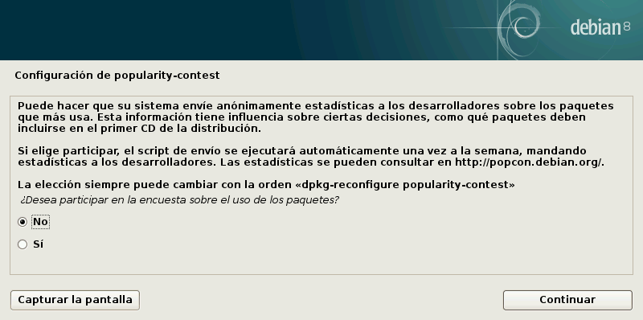
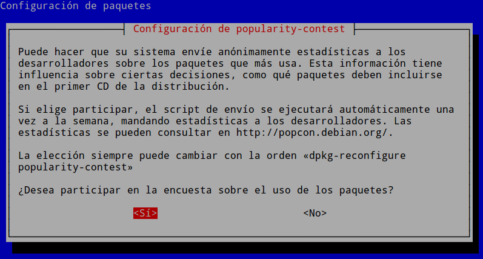
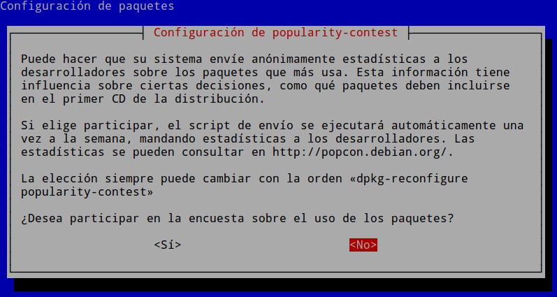
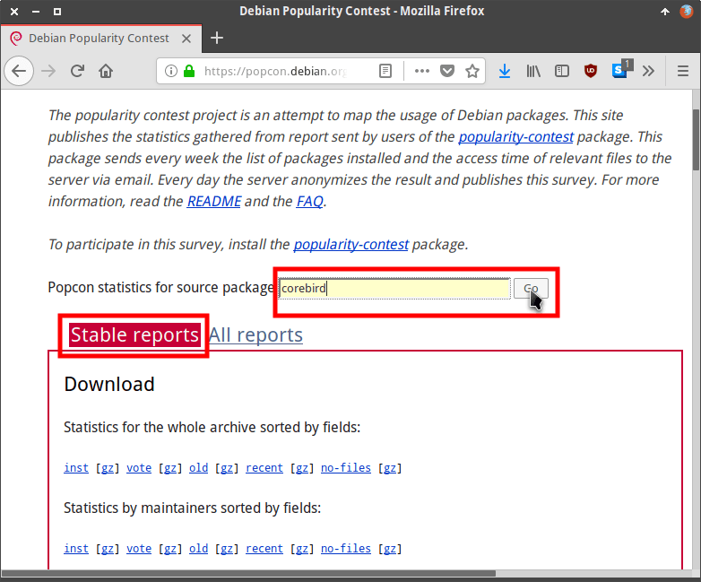
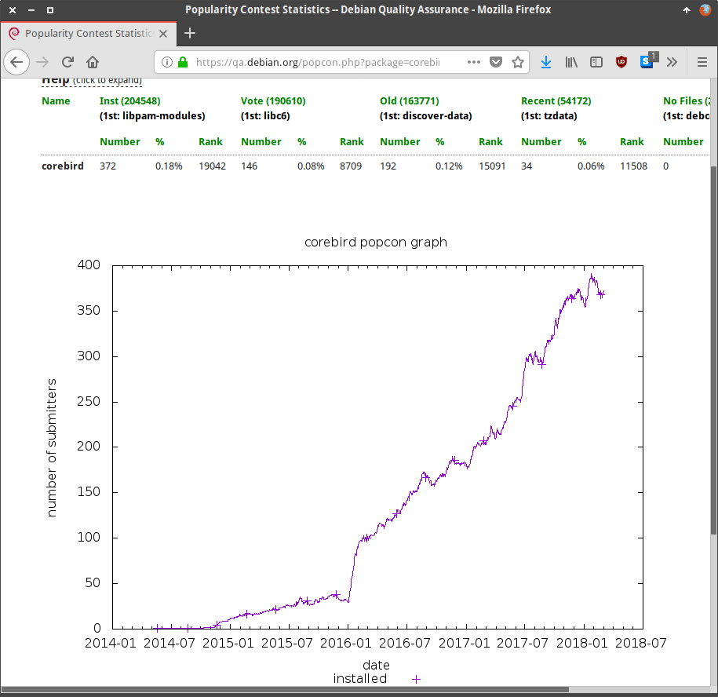
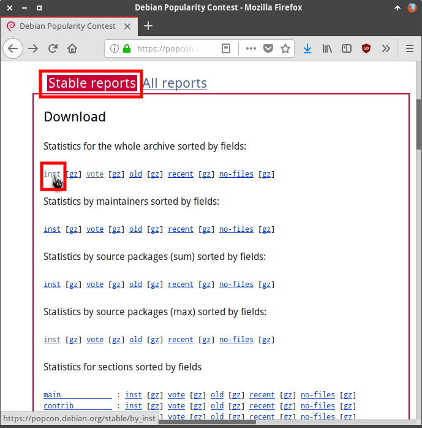
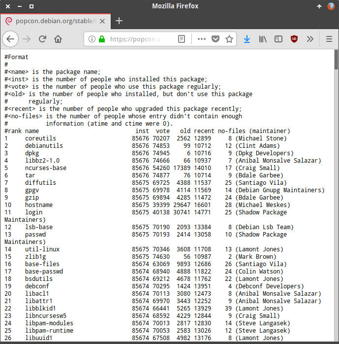

En el siguiente artículo veremos como podemos proporcionar datos del uso de nuestros paquetes .deb al equipo de Debian a través de popularity-contest. Obviamente el hecho de proporcionar los datos de los paquetes que más usamos será opcional y totalmente anónimo.<!--more-->

## ¿PARA QUÉ PUEDE SER ÚTIL QUE DEBIAN SEPA LOS PAQUETES QUE MÁS USAMOS?

Algunas de las utilidades que Debian sepa los paquetes que más se usan son:

1. Usar los datos recopilados para determinar los paquetes que se instalarán de forma predeterminada en las instalaciones de Debian.
2. Para obtener información de las arquitecturas que más utilizan sus usuarios.
3. Para temer una idea aproximada de la totalidad de paquetes privativos que usan los usuarios.
4. La totalidad de datos recopilados son públicos. Por lo tanto cualquiera los puede consultar para saber lo popular que es un programa determinado. A modo de ejemplo podemos comprobar que Firefox ha sido instalado por 93.580 usuarios que han participado en el programa, mientras que Chromium “solo” ha sido instalado por 31.123 usuarios.
5. Obtener un % aproximado de usuarios que utilizan Debian Sid, Debian Stable, etc.
6. Etc.

En conclusión, con la totalidad de datos recopilados Debian hará todo lo posible para mejorar su distribución.

## ¿QUÉ DATOS RECOPILA EL PROGRAMA DEBIAN POPULARITY-CONTEST?

Para cada uno de los paquetes instalados en nuestro equipo Debian recopila la siguiente información:

1. Número de usuarios que han instalado el paquete.
2. Personas que usan un paquete determinado de forma regular.
3. Personas que instalan un paquete determinado pero no lo usan.
4. Cantidad de personas que han actualizado un paquete determinado recientemente.
5. Usuarios que han instalado un paquete pero no han proporcionado suficiente información como para que sus datos sean tomados en cuenta.
6. Arquitectura de los paquetes que instalamos en nuestro equipo.
7. La rama de Debian o la distribuciones derivadas de Debian que usan los usuarios.
8. Etc.

## ¿CÓMO PARTICIPAR EN EL PROGRAMA DEBIAN POPULARITY-CONTEST E INFORMAR A DEBIAN DEL USO QUE HACEMOS DE LOS PAQUETES DE LA DISTRIBUCIÓN?

En el momento de instalar un sistema operativo Debian se nos pregunta si queremos participar en el programa Debian popularity-contest para ceder datos del uso que hacemos de nuestros paquetes. Una vez nos encontremos con tal petición tan solo tendremos que responder si queremos participar en el programa:

[](images/activar-popularity-contest-instalacion.png)

###### Nota: Si observan la captura de pantalla verán que la respuesta predeterminada es No. Veremos si la gente de canonical es tan razonable como Debian en este apartado.

En el caso que haga tiempo que hayamos instalado el sistema y no nos acordemos de nuestra elección deberemos actuar del siguiente modo:

Inicialmente comprobaremos si tenemos el paquete **popularity-contest** instalado en nuestro equipo. Para ello ejecutaremos el siguiente comando en la terminal:

|   joan@debian:~$ dpkg -l popularity-contest dpkg-query: no se ha encontrado ningún paquete que corresponda con popularity-contest.   |
| --- |

Como no se puede localizar el paquete quiere decir que no está instalado. Como no está instalado significa que no estoy cediendo los datos de uso de mis paquetes a Debian. En el caso que quiera proporcionar información al equipo de Debian tendré que instalar el paquete popularity-contest ejecutando el siguiente comando en la terminal:

> ```
> sudo apt-get install popularity-contest
> ```

Durante la instalación se nos preguntará si queremos participar en el programa popularity-contest. Como queremos participar seleccionamos la respuesta Sí y presionamos **Enter**.

[](images/instalacion-popularity-contest.png)

Una vez finalizada la instalación ya estaremos proporcionando información de como usamos los paquetes de nuestra distribución de forma automática y anónima al equipo de Debian.

Si algún día decidimos abandonar la participación tan solo deberíamos desinstalar el paquete **popularity-contest** ejecutando el siguiente comando en la terminal:

> ```
> sudo apt-get remove --purge popularity-contest
> ```

Otra opción para dejar de proporcionar información sin desinstalar popularity-contest seria ejecutar el siguiente comando en la terminal:

> ```
> sudo dpkg-reconfigure popularity-contest
> ```

Una vez ejecutado se nos preguntará de nuevo si queremos participar en la encuesta sobre el uso de paquetes. Si queremos dejar de participar seleccionamos la opción **No** y presionamos **Enter**.

[](images/dejar-de-participar-popularity-contest.png)

## ¿COMO SE ENVÍAN LOS DATOS A DEBIAN Y CON QUE FRECUENCIA?

El proceso de recopilación de datos se hace del siguiente modo:

En el momento que se instala el paquete **popularity-contest** se configura un cronjob que de forma automática, anónima y semanal envía el uso que hacemos de nuestros paquetes a Debian.

Así de este modo tan sencillo participaremos en el programa popularity-contest sin tener que realizar absolutamente nada.

## ¿CÓMO CONSULTAR LOS DATOS RECOPILADOS POR DEBIAN?

Si queremos visualizar las estadísticas recopiladas por Debian tan solo tenemos que visitar la siguiente URL:

[https://popcon.debian.org](https://popcon.debian.org "URL en la que se pueden a consultar las estadísticas recopiladas de popularity-contest")/

Dentro de está página web encontrarán información detallada del uso que hacen los usuarios de la paquetería de Debian. Si quieren obtener información del uso de un determinado paquete tan solo tiene que realizar lo siguiente:

1. Seleccionar la rama en que quieren consultar la información. En el caso de ejemplo que estamos realizando seleccionamos la rama estable clicando encima de la opción **Stable reports**.
2. A continuación escribo el nombre del paquete que quiero consultar en el cuadro de búsqueda y presiono el botón **Go**.

[](images/obtener-informacion-paquete.png)

Una vez finalizado el proceso obtengo la siguiente información sobre el paquete corebird:

[](images/estadisticas-recopiladas-paquete-corebird.png)

Si lo creen conveniente pueden consultar muchos más datos. Si por ejemplo quieren consultar la totalidad de paquetes ordenados de más a menos instalaciones de la rama estable deberán clicar en las siguientes opciones:

[](images/ver-paquetes-ordenador-de-mas-a-menos-instalaciones.png)

y el resultado obtenido será el siguiente:

[](images/paquetes-ordenados-numero-instalaciones.png)

###### Nota: Si lo creemos conveniente también podemos descárganos los datos en un archivo de texto para procesarlos a posteriori con una hoja de cálculo.

Si continuamos navegando por la URL podréis obtener información adicional como por ejemplo:

1. Ver estadísticas del uso de los paquetes en una rama determinada como puede ser por ejemplo la main, la contrib o la non-free.
2. Ver las arquitecturas que han usado los participantes del programa popularity-constest.
3. etc.

## CONCLUSIONES SOBRE LA RECOPILACIÓN DE INFORMACIÓN QUE REALIZA EL EQUIPO DE DEBIAN

Obviamente el hecho de suministrar nuestros datos a un tercero es una cuestión de confianza. Si confías en esta tercera persona o entidad no tendría porque existir ningún tipo de problema. Como en mi caso [confío en Debian]() mi opinión es que no hay problema alguno en ceder de forma voluntaria y anónima nuestros datos. Y si además los datos recopilados sirven para mejorar mi distribución preferida entonces mejor.

No obstante, en mi caso ya no confío tanto en empresas como por ejemplo Canonical. Parece ser que a partir de la versión 18.04 Canonical implementará mecanismos para que los usuarios que lo deseen puedan proporcionar ciertos datos del uso y del hardware de su equipo.

A diferencia de Debian parece ser que [la recopilación de datos por parte de Canonical](https://lists.ubuntu.com/archives/ubuntu-devel/2018-February/040139.html "Detalle de los datos recopilados por Ubuntu") será más agresiva. Algunos de los datos que recopilarán serán los siguientes:

1. Información del hardware que tiene nuestro equipo como por ejemplo la resolución de nuestra pantalla, la memoria RAM disponible, etc.
2. La localización seleccionada en la instalación de Ubuntu, etc.
3. El tiempo que tardamos en instalar Ubuntu.
4. Si descargamos las actualizaciones en la misma instalación de Ubuntu.
5. Sabor y versión de Ubuntu que usamos.
6. Etc.

Ahora tan solo falta esperar y ver de la forma en que Canonical implementa la recopilación de datos. Ojala les sirva para optimizar una distribución que justo instalarla tiene un consumo desmesurado de memoria RAM.
