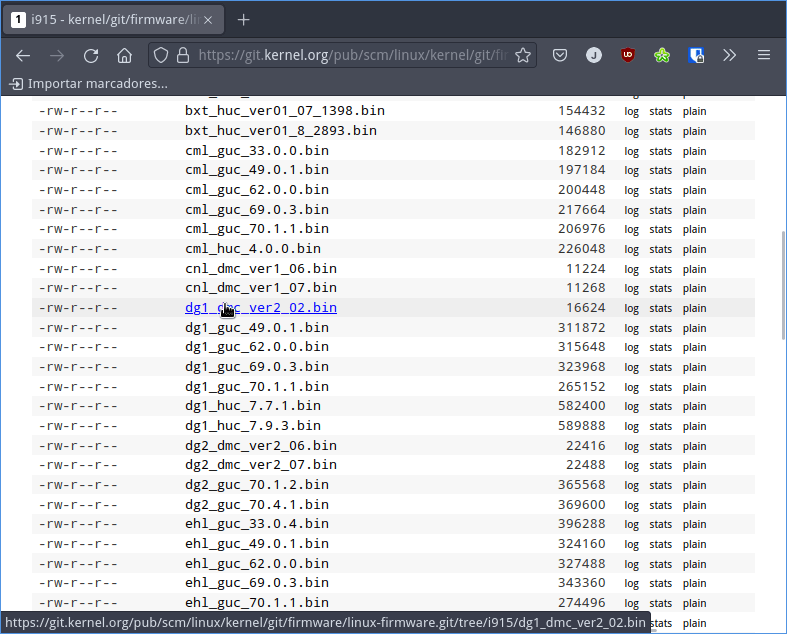

En mi caso justo al actualizar el Kernel de mi sistema operativo me sale el warning Possible missing firmware /lib/firmware/i915/\* . Concretamente la salida mostrada en la terminal ha sido la siguiente:<!--more-->

```shell
update-initramfs: Generating /boot/initrd.img-5.19.0-1-amd64
W: Possible missing firmware /lib/firmware/i915/skl_guc_70.1.1.bin for module i915
W: Possible missing firmware /lib/firmware/i915/bxt_guc_70.1.1.bin for module i915
W: Possible missing firmware /lib/firmware/i915/kbl_guc_70.1.1.bin for module i915
W: Possible missing firmware /lib/firmware/i915/glk_guc_70.1.1.bin for module i915
W: Possible missing firmware /lib/firmware/i915/kbl_guc_70.1.1.bin for module i915
W: Possible missing firmware /lib/firmware/i915/kbl_guc_70.1.1.bin for module i915
W: Possible missing firmware /lib/firmware/i915/cml_guc_70.1.1.bin for module i915
W: Possible missing firmware /lib/firmware/i915/icl_guc_70.1.1.bin for module i915
W: Possible missing firmware /lib/firmware/i915/ehl_guc_70.1.1.bin for module i915
W: Possible missing firmware /lib/firmware/i915/ehl_guc_70.1.1.bin for module i915
W: Possible missing firmware /lib/firmware/i915/tgl_guc_70.1.1.bin for module i915
W: Possible missing firmware /lib/firmware/i915/tgl_guc_70.1.1.bin for module i915
W: Possible missing firmware /lib/firmware/i915/dg1_guc_70.1.1.bin for module i915
W: Possible missing firmware /lib/firmware/i915/tgl_guc_70.1.1.bin for module i915
W: Possible missing firmware /lib/firmware/i915/adlp_guc_70.1.1.bin for module i915
W: Possible missing firmware /lib/firmware/i915/dg2_guc_70.1.2.bin for module i915
W: Possible missing firmware /lib/firmware/i915/adlp_dmc_ver2_16.bin for module i915
I: The initramfs will attempt to resume from /dev/sda7
I: (UUID=c6ff62ab-0f9e-43f7-84e8-ec5d0ca45157)
I: Set the RESUME variable to override this.
```

Por lo tanto queda claro que nuestro sistema operativo no está informando que hay una serie de firmware que aparentemente no está instalado. Pero antes de ver la solución del problema analizaremos si las advertencias nos pueden afectar.

## ES PROBLEMÁTICO EL ERROR Possible missing firmware /lib/firmware/i915/\*

La totalidad de los Warning que aparecen son relacionados con la falta de firmware para las siguientes microarquitecturas de Intel:

1. Sky Lake
2. Broxton
3. Kaby Lake
4. Commet Lake
5. Ice Lake
6. Elkhart Lake
7. Tiger Lake
8. Gemini Lake
9. Alder Lake
10. Arc Alchemist

En mi caso dispongo de un procesador Intel de 9ª generación basado en la arquitectura Gemini Lake Refresh. Por lo tanto diría que unicamente debería instalar el driver `glk_guc_70.1.1.bin`. No obstante los instalaré todos para evitar los warning en futuras actualizaciones del kernel.

Los pasos a realizar para hacer que desaparezcan las advertencias son los siguientes.

## ASEGURAR QUE TENEMOS INSTALADO LOS PAQUETES QUE PROPORCIONAN LOS DRIVERS FALTANTES

Lo primero a realizar es asegurar que tenemos instalados los paquetes `firmware-linux`, `firmware-linux-nonfree`  y `firmware-misc-nonfree`. Para ello en mi caso como uso el gestor de paquetes apt ejecuto el siguiente comando en la terminal:

```
❯ sudo apt install firmware-linux firmware-linux-nonfree firmware-misc-nonfree 
```

En mi caso este paso no soluciona el problema. Es más en mi caso ya tenia estos paquetes instalados. Por lo tanto lo siguiente a realizar es descargar el firmware que nos falta de forma manual.

## DESCARGAR EL FIRMWARE REQUERIDO

Para descargar el firmware requerido tenemos que ingresar en el asiguiente url:

[https://git.kernel.org/pub/scm/linux/kernel/git/firmware/linux-firmware.git/tree/](https://git.kernel.org/pub/scm/linux/kernel/git/firmware/linux-firmware.git/tree/)

Si leemos los Warning vemos que nos faltan los firmware para el módulo i915. Por lo tanto clicamos encima de la carpeta `i915` que es la que contiene los firmware que necesitamos:


Una vez dentro del directorio descargamos todos y cada uno de los firmware que necesitamos y que vemos en los warning:



## COPIAR EL FIRMWARE DESCARGADO EN SU CORRESPONDIENTE UBICACIÓN

Una vez descargado el firmware lo tenemos que guardar en el directorio pertinente. Los firmware se acostumbran a almacenar en la ubicación `/lib/firmware`. Como en mi caso los firmware son para el módulo `i915` se almacenarán en la ubicación `/lib/firmware/i915/`.

**Nota:** En vuestro caso deberéis analizar el directorio dentro de la ubicación `/lib/firmware/` en el que debéis guardar el firmware.

Para copiar la totalidad de firmware que hemos descargado, iremos a la carpeta donde tenemos los ficheros descargados. Una vez estemos dentro ejecutaremos el siguiente comando en la terminal:

```shell
❯ sudo cp *.bin /lib/firmware/i915/
```

## REGENERAR INITRAMFS PARA SOLUCIONAR EL ERROR POSSIBLE MISSING FIRMWARE

Una vez están presentes los firmware regeneraremos el sistema de ficheros temporal [Initramfs](https://wiki.gentoo.org/wiki/Initramfs/Guide/es). Para ello tendremos que ejecutar el siguiente comando en la terminal:

```shell
❯ sudo update-initramfs -u
update-initramfs: Generating /boot/initrd.img-5.19.0-1-amd64
I: The initramfs will attempt to resume from /dev/sda7
I: (UUID=c6ff62ab-0f9e-43f7-84e8-ec5d0ca45157)
I: Set the RESUME variable to override this.
```

Una vez ejecutado ya podremos reiniciar el ordenador sin ningún tipo de temor. En principio nos volverán a aparecer los warning o advertencias.

#### Fuentes

[https://01.org/linuxgraphics/downloads/firmware](https://01.org/linuxgraphics/downloads/firmware)

[https://git.kernel.org/pub/scm/linux/kernel/git/firmware/linux-firmware.git/tree/i915](https://git.kernel.org/pub/scm/linux/kernel/git/firmware/linux-firmware.git/tree/i915)
