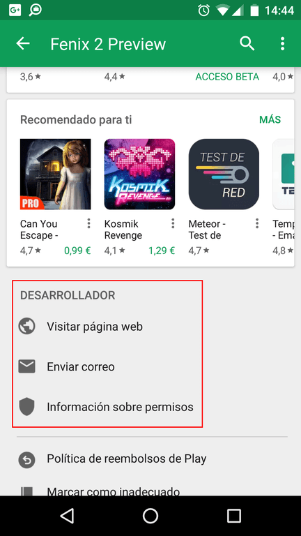
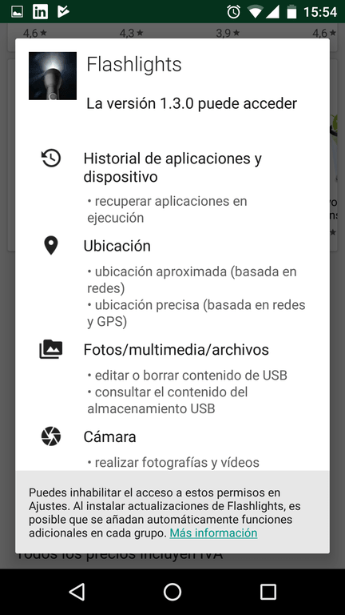

A medida que pasan los años se incrementa el tráfico a Internet a través de los dispositivos móviles. Esto hace que que cada día sean más los ciberdelincuentes que crean aplicaciones maliciosas para intentar sacar algún beneficio.

Por esto motivo en el siguiente post detallaré algunos aspectos en que siempre debemos fijarnos antes de instalar una aplicación en nuestros dispositivos móviles Android.<!--more-->

## BUSCAR INFORMACIÓN SOBRE EL DESARROLLADOR DE LA APLICACIÓN

Desafortunadamente Google decidió cerrar el programa de desarrolladores destacados. El emblema de desarrollador destacado de la tienda de Google daba un plus de confianza que la App que estábamos instalando era segura.

No obstante, siempre podemos buscar información sobre el desarrollador de la aplicación. En la Google Play Store o en Internet encontraremos información del desarrollador. Todo buen desarrollador tendrá un email de contacto y su web de presentación con la totalidad de aplicaciones que ha desarrollado.

También aseguren que las aplicaciones que estamos instalando corresponden a su desarrollador. A modo de ejemplo, si ven una aplicación de Clash of Clans que no ha sido desarrollada por Supercell no la instalen.

## ANALIZAR LAS VALORACIONES DE LOS USUARIOS PARA EVITAR LA INSTALACIÓN DE APLICACIONES MALICIOSAS

Antes de instalar una aplicación hay que analizar las valoraciones de los usuarios. Los puntos que hay que tener en cuenta sobre las valoraciones son los siguientes

1. Si una aplicación dispone de muchas valoraciones negativas simplemente no la descarguéis.
2. Si la aplicación dispone de pocas valoraciones y todas son positivas también hay que desconfiar. El motivo es que muchas de estas valoraciones pueden haber sido generadas por el ciberdelincuente que creo la aplicación maliciosa.

## ANALIZAR LOS COMENTARIOS DE LOS USUARIOS

Al igual que las valoraciones, los comentarios de los usuarios nos pueden ayudar a detectar aplicaciones maliciosas. Los puntos a valorar en los comentarios son los siguientes:

1. Cuantos más comentarios tenga una aplicación mejor.
2. En el caso que una aplicación tenga muchos comentarios negativos tenéis que empezar a pensar que se trata de una aplicación maliciosa o de mala calidad. En muchos casos los usuarios denuncian aplicaciones maliciosas a través de los comentarios de las tiendas.

Si la aplicación contiene pocos comentarios por parte de los usuarios podemos buscar App reviews en Internet o en Youtube.

## REVISAR LOS PERMISOS QUE NOS PIDE LA APLICACIÓN

Antes de instalar o actualizar una aplicación hay que revisar los permisos que le estamos otorgando.

Si consideramos que la aplicación solicita más permisos de los que realmente necesita para funcionar no tenemos que instalar la aplicación.

Un claro ejemplo de lo que digo es la siguiente aplicación:

Como pueden ver, una simple aplicación de linterna nos está pidiendo permisos que no son necesarios para que funcione la aplicación. Algunos de ellos son:

1. Acceder a una ubicación geográfica.
2. Tener acceso a nuestros archivos multimedia.
3. Ver nuestras conexión de red.
4. Tener acceso a nuestra cámara de hacer fotos.
5. Etc.

Si se encuentran con aplicaciones similares no las instalen porque pueden ser aplicaciones maliciosas y/o que violan nuestra privacidad.

## ANALIZAR LA CANTIDAD DE DESCARGAS QUE TIENE UNA APLICACIÓN

Otro de los puntos a tener en cuenta para identificar aplicaciones maliciosas es el número de descargas.

1. Si la aplicación que queremos instalar no dispone de muchas descargas hay que extremar la precaución. Al haber pocas descargas no habrá suficiente información para que nos podamos realizar una idea de la fiabilidad de la aplicación.
2. Si existen muchas descargas y encontramos valoraciones y comentarios positivos será una garantía que la aplicación parece fiable.

## APLICAR EL SENTIDO COMÚN

En ningún caso hay que instalar aplicaciones que nos parezcan sospechosas y/o prometan cosas que no tienen sentido o simplemente sean imposibles.

En el caso que encontremos aplicaciones que nos ofrecen funcionalidades de servicios Premium y sean gratuitas hay que desconfiar.

## INSTALAR APLICACIONES DE MARKETS FIABLES

Nunca hay que instalar aplicaciones piratas y/o obtenidas de sitios de dudosa reputación. En mi caso únicamente recomiendo instalar aplicaciones que provengan de las siguientes tiendas:

1. [Google Play Store](https://play.google.com/store/apps?hl=es "Tienda Google Play")
2. [Amazon Store](https://www.amazon.es/mobile-apps/b?ie=UTF8&node=1661649031 "Tienda de aplicaciones de Amazon")
3. [F-droid](https://f-droid.org/ "Tienda de aplicaciones F-droid")

Tengo confianza en estas tiendas por los siguientes motivos:

1. Las aplicaciones deben pasar un control de calidad antes de ser publicadas en la tienda.
2. La tienda de F-droid dispone de aplicaciones de código abierto.

A pesar de que estas tiendas son de calidad no debemos confiarnos. Ninguna de las tiendas que he citado es infalible y absolutamente todas ellas han distribuido aplicaciones maliciosas en algún momento.

## USAR APLICACIONES QUE NO CONTENGAN PUBLICIDAD

En el momento de instalar una aplicación también es interesante analizar si tiene publicidad. La publicidad que aparece en las Apps o en las web son un riesgo de seguridad y en algunos casos incluso pueden llegar a instalarnos Malware.

Por lo tanto, en mi caso recomiendo instalar aplicaciones que no contengan publicidad. La publicidad no es únicamente intrusiva. También es peligrosa.

## REVISAR EL NOMBRE DE LA APLICACIÓN QUE VAMOS A INSTALAR

En el caso de instalar una aplicación conocida asegúrense que el nombre de la aplicación es el que realmente tiene que ser.

Existen muchos ciberdelicuentes que crean aplicaciones maliciosas con nombres e iconos muy similares a Apps de moda. De este modo consiguen engañar a los usuarios para que se instalen una aplicaciones maliciosas.

## VER LA ÚLTIMA FECHA DE ACTUALIZACIÓN DE LA APLICACIÓN

También es interesante analizar la última actualización de la aplicación. Una aplicación que nunca se actualiza es más susceptible de sufrir problemas de seguridad que no una aplicación que su desarrollador está constantemente intentado mejorarla.

## INSTALAR UN SOFTWARE ANTIVIRUS

Como último punto, quien lo crea oportuno puede instalar un software Antivirus en su dispositivo. En mi caso no lo considero necesario si se siguen al pie de la letra las recomendaciones que se citan a lo largo de este apartado. En mi caso nunca he tenido ningún virus en mis dispositivos móviles y los software Antivirus no me ofrecen ningún tipo de confianza. Incluso me da la impresión que lo único que hacen es violar la privacidad de sus usuarios y consumir recursos de nuestros teléfono.

Para finalizar solo decir que en el caso que vean un app sospechosa de ser maliciosa dejen un comentario negativo en la tienda y la denuncien a la Google Play Store o en el market correspondiente.
