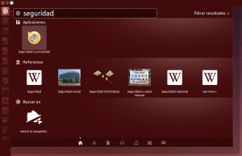

Durante estos últimos días, y con una periodicidad de 6 meses, la web se inunda de artículos en los que se citan las bondades, maravillas y novedades de la nueva versión de Ubuntu.

La verdad es que no acabo de entender porqué hay tanta fiebre por Ubuntu y más cuando personalmente a mi y a muchas otras personas hay puntos de esta distribución que no nos gustan. [Mark Shuttleworth](http://www.markshuttleworth.com/ "Blog de Mark Suttleworth") seguro que se sentirá realmente alagado y agradecido por la gran campaña de publicidad que realizan muchos de los usuario de Ubuntu. Aunque bien mirado si está pasando esto es que ciertamente Ubuntu ha hecho muchas cosas bien.<!--more-->

Yo no voy a entrar en valorar la última versión Ubuntu 14.04 (Trusty Tahr) ya que estoy seguro que en Youtube y en otros blogs llevan tiempo preparando reviews y además están muchos más capacitados que yo para realizarlas. Más bien lo que pretendo es advertir y recordar a la totalidad de usuarios que hay problemas de privacidad en Ubuntu. **Desde la Versión 13.10 Ubuntu sistemáticamente está recolectando datos de sus usuarios, espiándoles y por lo tanto vulnerando su privacidad.**

## ¿CÚALES SON LOS DATOS QUE RECOLECTA UBUNTU?

Que existan problemas de privacidad en Ubuntu no es ningún secreto y seguro que muchos de vosotros ya sabéis que Ubuntu recolecta sistemáticamente datos de sus usuarios. En su día Richard Stallman lo denuncio, y además tan solo tenéis que ir al apartado de configuración del sistema, clicar en el icono de detalles, y finalmente clicar en **Aviso Legal**. Después de hacer esto podréis ver el siguiente aviso legal en la pantalla:

Lo primero que me sorprende de este aviso legal es que está única y exclusivamente en Inglés. A mi modo de ver un aviso legal tendría que estar en el mismo idioma de la distro que instalamos que en mi caso es el Español. Imagino que si lo ponen por defecto en inglés será porqué muchos de los usuarios no puedan ni entender lo que están haciendo ni comunicando. Táctica inteligente por parte de [Canonical](http://www.canonical.com/ "Web de la empresa encargada de desarrollar Ubuntu") para poder espiar a sus usuarios.

Si traducimos el texto que figura en inglés podemos constatar que los que no está diciendo Ubuntu es que **cada que usamos el Dash para realizar una búsqueda, estamos consintiendo y dando nuestra aprobación a que Canonical y sus partners almacenen nuestra IP y las búsquedas que que realizamos**. También nos informa que **Ubuntu y sus partners usarán la información almacenada para complementar nuestra búsqueda con información de fuentes externas como Amazon, Twitter, Facebook y BBC.**

Así por lo tanto **si en el Dash ponemos el nombre de un libro** que tenemos almacenado en nuestro disco duro **es muy probable** **que** de repente, en el mismo Dash, **nos aparezca información o publicidad de Amazon para que podamos comprar este libro**. Si ponemos la palabra música nos aparecerán propuestas de compra de álbumes, etc.

Por lo tanto queda claro que Ubuntu está vigilando y espiando a sus usuarios. Además podemos afirmar Ubuntu  pone dificultades a los usuarios para evitar que esto sea por los siguientes motivos:

1. **La opción para recolectar datos de los usuarios de Ubuntu viene activada de serie**. Lógicamente muchos usuarios ni lo saben, y los que lo saben a veces ni se preocupan de desactivar esta característica.
2. **En el apartado en que se informa de la recolección de datos ni se molestan en traducirlo al idioma del usuario**.

## POSIBLES FINES DE LA RECOLECCIÓN DE DATOS

Hay que decir que si miramos en la página de Ubuntu está claramente definido el uso que Canonical da a la totalidad de información que recopila de sus usuarios. Y creo que lo que escriben es suficientemente claro y lo pueden consultar ustedes mismos en el siguiente enlace:

[http://www.ubuntu.com/privacy-policy](https://ubuntu.com/legal/data-privacy "Política de recolección de datos de Ubuntu")

Pero lo que también es verdad es que nadie sabe el uso real que Ubuntu hace de los datos que recopila de sus usuarios. Porqué una cosa es lo que se dice y otra lo que se hace y en la historia hay numerosos ejemplos de lo que estoy diciendo.

No pienso que las intenciones de Ubuntu y Canonical sean malas. Más bien **pienso que el hecho de recolectar datos para realizar búsquedas en redes externas como por ejemplo Amazon es debido a que durante el 2014 es previsible que salgan las primeras tablets, teléfonos y televisiones con el sistema operativo Ubuntu.**

Creo que el verdadero motivo es este ya que las tablets, teléfonos, PC's y televisiones de Ubuntu compartirán un sistema operativo único y en casos como las televisiones, tablets o teléfonos está característica puede tener cierto sentido y puede resultar útil para algunos usuarios para por ejemplo comprar y consumir contenido como películas, libros, etc. Además **el hecho que Ubuntu pueda conocer las inquietudes y demandas de sus usuarios es importante ya que de este modo siempre podrá darles lo que quieren**.

No obstante haciendo esto, Ubuntu vulnera o rompe una de las ventajas o creencias que existían en software libre que era que “**El "software libre no te espía**”

## QUE HACER PARA QUE UBUNTU NO RECOLECTE NUESTROS DATOS

Si queremos podemos desactivar la función de recolección de datos fácilmente. La opción más fácil es la siguiente:

Tal y como se puede ver en la captura de imagen **entramos en el Dash y tecleamos la palabra Seguridad**:

En el apartado de aplicaciones aparecerá un icono que pone **Seguridad y privacidad** en Ubuntu. Tal y como podemos ver en la captura de pantalla **clicamos encima del icono de "Seguridad y privacidad"** y posteriormente se abrirá una ventana. En la ventana que ha aparecido clican la pestaña de búsqueda y les aparecerá el siguiente menú:

Ahora, tal y como se puede ver en la captura de pantalla, tan solo tiene que **desactivar la opción** "**Al realizar búsquedas en el tablero Incluir resultado de búsqueda en línea"**.

###### Nota: Esta opción desactivará gran parte de la funcionalidad del Dash de Unity. Quien quiera ser menos radical y eliminar solo parte de los Scope que se dedican a recopilar datos tendrá que esperar a que publique un post en que explique como desactivar los scope que no deseamos.

## PERSPECTIVAS DE FUTURO EN CUANTO A LA PRIVACIDAD EN UBUNTU

A pesar de la totalidad de comentarios negativos que hago en este post hay que reconocer que Ubuntu también aporta y ha aportado muchas cosas positivas a los usuarios y a la comunidad. Además estéticamente nadie puede negar Ubuntu no sea bonito. Las cosas siempre es bueno que entren por la vista.

Además hay rumores que a partir de Unity 8 el tema de la recopilación de datos puede cambiar y ser un poco más transparente. Se rumorea que el Dash de Unity 8 permitirá seleccionar los motores de búsqueda para realizar nuestras consultas. De este modo si queremos incluir el motor de búsqueda de Amazon lo incluiremos y enviaremos nuestras peticiones a Ubuntu y Amazon. Si no queremos no lo incluimos y fin de la historia.

## LINK INTERESANTE PARA REFLEXIONAR SOBRE LA PRIVACIDAD EN UBUNTU Y EL RESTO DE SISTEMAS OPERATIVOS

Solo para finalizar el post les quiero dejar el siguiente link que es el que me ha motivado ha escribir este post.

[https://www.gnu.org/philosophy/ubuntu-spyware.es.html](https://www.gnu.org/philosophy/ubuntu-spyware.es.html "Declaraciones de Richard Stallman")

En este link encontrarán lo que público Richard Stallman el día en que denunció que Ubuntu estaba recopilando datos de sus usuarios. Sin duda la lectura es recomendada.
