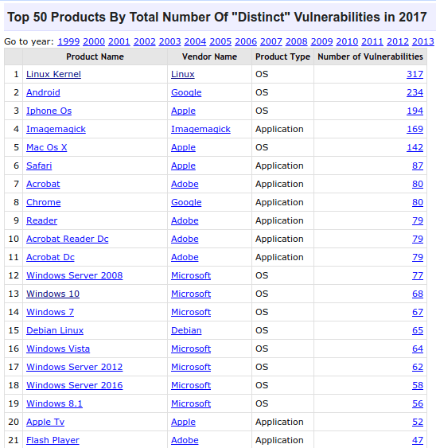
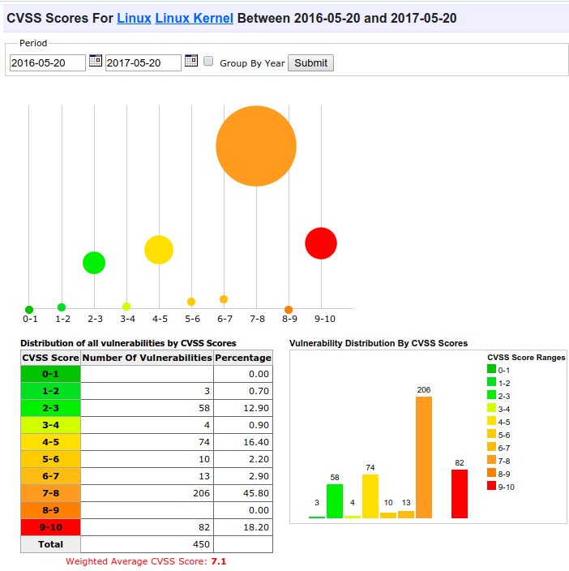
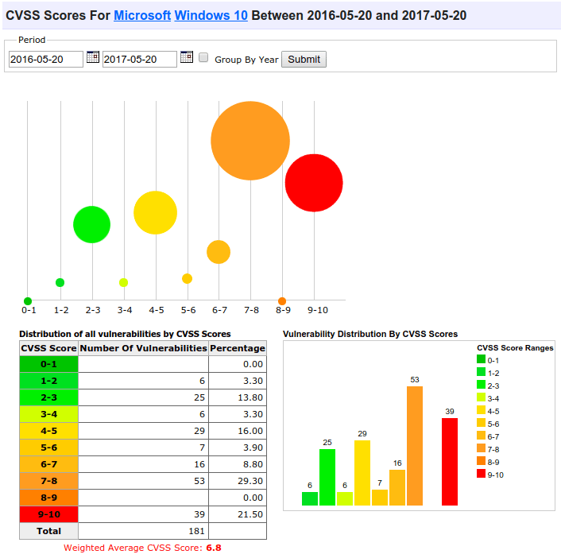
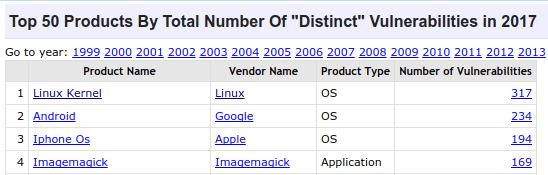

A raíz del bombo mediático que se ha creado artificialmente con el malware WannaCry, muchos usuarios predican que la seguridad del sistema operativo Linux es extrema soltando frases del tipo:

- “Si usaras Linux esto no pasaría”
- “Deberías cambiarte a Linux porque estos problemas no existen”
- “Linux es un sistema operativo mucho más seguro que Windows”
- “Depender de productos de Microsoft es un riesgo”
- “Los programas Open Source o libres son más seguros”

<!--more-->

## LA SEGURIDAD EN GNU LINUX NO ES TAN ALTA COMO LA GENTE DICE

En mi caso soy un usuario medio de GNU Linux y en cierto modo discrepo con la gente que realiza este tipo de afirmaciones. Los motivos de mi discrepancia son los siguientes:

### En Linux también es posible infectarte con Malware

Es cierto que usando GNU Linux las probabilidades de infección son muy bajas. Pero el principal motivo no es que GNU Linux sea un sistema operativo más seguro que Windows. La razón es que la industria del malware no está interesada en atacar GNU Linux.

En el mundo existen muchos servidores Linux que almacenan información importante y/o sensible. No obstante estos servidores no son un objetivo de ataque importante por los siguientes motivos:

1. Habitualmente los servidores o equipos personales con Linux están gestionados por personal experto.
2. Detrás de un servidor no hay un usuario final dispuesto a clicar y abrir todo lo que se le meta por delante.
3. Los servicios de hosting, o los administradores de los servidores, hacen copias de seguridad de los datos almacenados en los servidores. Al disponer de copias de seguridad es difícil que los atacantes consigan monetizar el malware. Lo único que conseguirán será robar datos y/o recursos del servidor atacado.
4. Monetizar un ataque informático no es fácil. Quien lo piense 2 veces, o hable con la policia, sabrá que la peor solución que se puede adoptar es caer en el chantaje de los atacantes y pagarles para solucionar el problema.

### ¿El kernel Linux presenta más vulnerabilidades que Windows?

Linux no es un sistema operativo que te pueda garantizar la seguridad absoluta. Según [CVE](https://www.cvedetails.com/top-50-products.php?year=2017 "Problemas de seguridad detectados en Software en 2017"), en los 5 primeros meses del año 2017 se han detectado mas vulnerabilidades de seguridad en el Kernel Linux que en Windows 10. A continuación pueden ver la imagen en la que se detallan el número total de vulnerabilidades detectadas.

###### Nota: La naturaleza abierta del código de Linux es posible que ayudé a que se detecten más vulnerabilidades de seguridad. Además el listado de CVE solo detalla las vulnerabilidades detectadas sin tener en cuenta la rapidez en que se solucionan. Por lo tanto quien no quiera considerar la lista CVE como válida me parece perfecto. No obstante, lo que demuestra esta lista es que Linux no está exento de problemas de seguridad.

Sorprendentemente, o no, en la primera posición está el Kernel de Linux con 317 vulnerabilidades. Para encontrar a Windows 10 tenemos que bajar hasta la posición 13 con 68 vulnerabilidades. Por lo tanto Linux no está exento de problemas de seguridad.

### La gravedad de las vulnerabilidades del Kernel Linux es superior a Windows

Algunos usuarios podrán pensar que la gravedad de las vulnerabilidades del Kernel de GNU Linux no son muy graves.

Para hacernos una idea de su gravedad, compararemos la gravedad de las vulnerabilidades del Kernel de Linux con las de Windows 10. Según CVE la gravedad de las vulnerabilidades del Kernel de Linux son las siguientes:

Mientras la gravedad de las vulnerabilidades de Windows 10 son:

 Si analizamos las capturas de pantallas vemos lo siguiente:

1. El índice de gravedad de las vulnerabilidades del Kernel Linux es 7.1, mientras que en Windows 10 es de 6.8. Por lo tanto la severidad de las vulnerabilidades es más elevada en el Kernel de Linux.
2. En Windows 10 existen 39 vulnerabilidades muy graves. En el Kernel de Linux existen 53. Por lo tanto según CVE, en el Kernel Linux existen más vulnerabilidades graves que en Windows 10.
3. Asimismo si analizamos las vulnerabilidades con un valor de 7-8 vemos que Windows tiene 82 y el Kernel Linux 256.

Por lo tanto en el Kernel de Linux también existen vulnerabilidades de seguridad graves que pueden ser explotadas por cibercriminales.

### En Linux los programas pueden presentar vulnerabilidades de seguridad

En mi caso pienso que los programas Open Source o de Software Libre son más seguros que el resto. No obstante esto no ofrece ninguna garantía. A modo de ejemplo podemos ver que Imagemagick presenta 169 vulnerabilidades de seguridad.

Aunque sus vulnerabilidades no son graves, no es nada alentador que un proyecto de código abierto como Imagemagick presente un número de vulnerabilidades tan elevado.

## CONCLUSIONES

En GNU Linux hay menos infecciones por malware, pero no es porque sea un sistema operativo más seguro. Las infecciones en GNU Linux son poco frecuentes por los siguientes motivos:

1. La industria del malware no está interesada en explotar las vulnerabilidades de Linux porque les resultaria difícil monetizar sus exploits. Hay que tener en cuenta que Linux tiene una tasa de implantación muy baja en usuarios de escritorio.
2. Los servidores Linux están gestionados por gente con conocimientos que realizan copias de seguridad de forma periódica. Al disponer de copias de seguridad les será fácil restaurar un servicio o información después de un problema. Por lo tanto a los atacantes les resultará difícil monetizar sus ataques.
3. El eslabón más débil en seguridad es el usuario final. En Linux los usuarios finales acostumbran a tener conocimientos más avanzados que los usuarios de Windows.
4. Los usuarios de Linux acostumbran a actualizar su sistema operativo. En cambio existen muchos usuarios de Windows que les da pereza o no saben actualizar su sistema operativo. Incluso existen empresas importantes que no actualizan sus ordenadores y por este motivo han tenido problemas con el Malware WannaCry.

Por lo tanto, la solución al problema de los Ransomware u otro tipo de Malware no es Linux. No hay ningún sistema operativo que sea 100% seguro y decir que GNU Linux es un sistema prácticamente invulnerable lo único que hace es crear una falsa sensación de seguridad.

En ningún caso pretendo decir que GNU Linux sea un mal sistema operativo o que Windows sea igual de seguro que GNU Linux. Simplemente digo que en Linux también existe ransomware, malware y agujeros de seguridad como por ejemplo [Mirai](https://es.wikipedia.org/wiki/Mirai_\(malware\) "Explicación del Malware Mirai"), Ghost, Dirty Cow, [Heartbleed](https://es.wikipedia.org/wiki/Heartbleed "Explicación del agujero de seguridad Heartbleed"), etc. En el momento que GNU Linux empiece a tener una masa crítica de usuarios de escritorio, también existirán problemas de malware y virus independientemente que sea un sistema operativo más seguro que Windows.

### Buenas prácticas

Por lo tanto en Linux, al igual que en el resto de sistemas operativos, hay que tener cuidado y aplicar buenas prácticas como por ejemplo:

1. No clicar en links o archivos sospechosos adjuntos en nuestro email.
2. No clicar en links sospechosos de Internet.
3. Actualizar nuestro sistema operativo y nuestros programas.
4. Realizar copias de seguridad.
5. Trabajar lo mínimo posible con el usuario root.
6. Usar contraseñas seguras.
7. etc.
